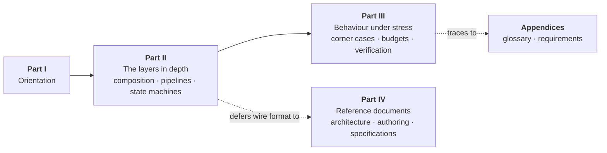

# About This Booklet

## 1. What this booklet is

can-lite is a client-server application protocol over CAN 2.0B, delivered as a
C++20 library for microcontrollers with no heap, no blocking and no dynamically
sized storage anywhere in the data path.

This booklet is the **design view** of that library. It walks the stack one
layer at a time and shows, in diagrams, how the pieces are composed, what state
each of them keeps, and what happens when things go wrong. It then reproduces
the project's normative documents, so the whole design — narrative and
specification — is one document.

## 2. What it deliberately does not contain

The project's documents each own a subject, and this booklet does not restate
any of them:

| Subject                                                                               | Owning document                                                         | Where in this booklet               |
|---------------------------------------------------------------------------------------|-------------------------------------------------------------------------|-------------------------------------|
| Wire format: identifier layout, priorities, message catalogue, encoding, enumerations | [Protocol Specification](../spec/can-protocol.md)                       | Part IV                             |
| Firmware upgrade messages, states, error codes and flows                              | [Firmware Upgrade Specification](../spec/firmware-upgrade.md)           | Part IV                             |
| Architecture decisions, patterns, component relationships                             | [Architecture and Design Decisions](../design/architecture.md)          | Part IV                             |
| How to author an application category                                                 | [Extending can-lite with Categories](../design/extending-categories.md) | Part IV                             |
| Formal requirements                                                                   | `documents/requirements/*.yaml`                                         | Appendix A, generated at build time |

Parts I to III add what those documents do not have: the composition and
ownership model, the per-layer state machines and pipelines, the catalogue of
corner cases, the resource and timing budgets, and the verification strategy.
Where a fact belongs to one of the documents above, this booklet links to it
rather than copying it.

There is also **no source code in this booklet**. It describes what each
component is responsible for, what it keeps, and how it behaves; the repository
is the authority on how that is written.

## 3. How the parts fit together

| Reader                              | Suggested path                                                                                 |
|-------------------------------------|------------------------------------------------------------------------------------------------|
| Integrating can-lite into a product | Part I, then the layer that carries your traffic, then Chapters 10 and 11                      |
| Writing an application category     | Chapter 5, then the authoring guide in Part IV                                                 |
| Changing the protocol core          | All of Parts II and III, then the specification in Part IV                                     |
| Reviewing a change                  | Chapter 10 for the behaviour it must not break, Appendix A for the requirement it must satisfy |

## 4. Conventions

| Convention       | Meaning                                                                                       |
|------------------|-----------------------------------------------------------------------------------------------|
| Component names  | Written as they appear in the library, in the `services` namespace, which is dropped in prose |
| Chapter *n*      | A cross-reference: a hyperlink on the web edition, a chapter number in the PDF                |
| REQ-CAN-*nnn*    | A requirement, listed in Appendix A                                                           |
| **Design limit** | A deliberate simplification, with its cost stated                                             |
| **Latent**       | Behaviour that is correct today but rests on an assumption worth knowing                      |

Every diagram is generated from a diagram source held in the chapter it appears
in, so the booklet moves when the design moves.
