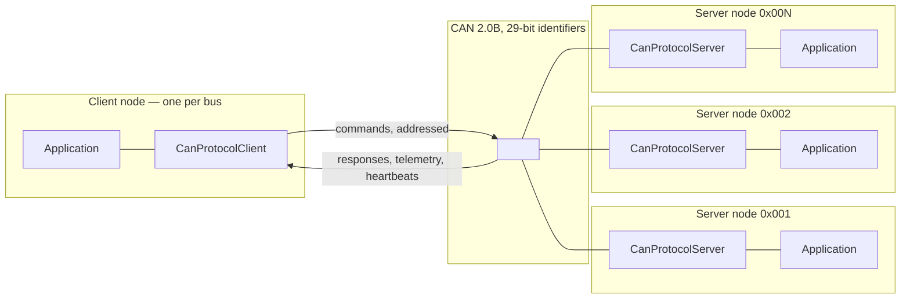

# Introduction and Scope

## 1. What can-lite is

can-lite is a **client-server application protocol over CAN 2.0B**, delivered as
a C++20 library for microcontrollers. It gives an embedded product three things
that raw CAN does not:

1. **Addressing and routing** — a 29-bit identifier layout that encodes
   priority, functional category, message type and target node, so a receiver
   can decide what a frame is before touching its payload.
2. **A conversation model** — commands from one client to many servers,
   acknowledged, replay-protected and timed out, with heartbeats in both
   directions so each side knows whether the other is still there.
3. **An extension mechanism** — *categories*: self-contained server/client pairs
   that add a functional group of messages without changing the protocol core.

Everything in the library is built to run on a bare-metal MCU with tens of
kilobytes of SRAM: no heap, no blocking, no exceptions, no RTTI, and no
dynamically sized container anywhere in the data path.



The supported topology is deliberately narrow: **one client, many servers**, and
each server serves exactly one client (REQ-CAN-006.1). That single assumption
buys a great deal of simplicity — most visibly a single sequence counter per
server (Chapter 7) instead of a per-peer table — and Chapter 13 records exactly
what happens when a bus violates it.

## 2. What can-lite is not

| Not | Because |
|-----|---------|
| A CANopen, J1939 or UDS stack | Those standards bring object dictionaries, PGN routing and diagnostic session state machines that most embedded products do not need. can-lite implements the parts that are always needed — addressing, acknowledgement, liveness, segmentation — and leaves the rest to the application's own categories. |
| A general peer-to-peer messaging bus | Servers never initiate commands (REQ-CAN-004). They answer, and they emit telemetry and heartbeats. |
| A security layer | Frames are neither authenticated nor encrypted. Sequence numbers protect against *accidental* replay and reordering, not against an attacker with bus access. See §16 of the protocol specification. |
| A CAN FD stack | The wire format assumes classic CAN 2.0B frames of at most 8 data bytes. Payloads longer than 8 bytes go through the ISO-TP transport layer (Chapter 9), not through larger frames. |
| A driver library | `hal::Can` is an interface, not an implementation. can-lite ships host-side adapters (SocketCAN, PCAN, Kvaser, CANable) for tooling and tests; MCU drivers come from the platform HAL. |

## 3. The constraints that shaped the design

Every structural decision in this booklet traces back to one of five constraints.
They are worth stating up front, because a reader who knows them can usually
predict the design before reading it.

| Constraint | Consequence in the code |
|------------|-------------------------|
| **No heap allocation** | Every container is an `infra::Bounded*` type with a compile-time capacity; sizes are injected through the `WithStorage` pattern (Chapter 3). There is no `new`, `malloc`, `std::vector` or `std::string` anywhere in the library. |
| **No blocking** | Transmission is a queue plus a completion callback (`CanFrameTransport`, Chapter 5); timeouts are `infra::TimerSingleShot`; nothing ever sleeps or spins. |
| **Bounded worst case** | Every list has a maximum: 8 registered categories, 8 queued outbound frames, 8 tracked servers, 4 ISO-TP channels by default. Overflow is a defined, testable outcome — never an allocation. |
| **Deterministic wire format** | All multi-byte fields are big-endian; floating-point values cross the bus as scaled integers (`CanFrameCodec`), so a target without an FPU produces byte-identical frames. |
| **Compile-time separation of roles** | A client category cannot be registered on a server: they derive from different base classes carrying different intrusive-list node types (Chapter 6). The mistake is a compile error, not a runtime surprise. |

## 4. The five ideas worth carrying through the booklet

**Categories are the unit of extension.** A category is a pair of classes — one
server-side, one client-side — that owns a 4-bit category ID and a set of
message types. Adding functionality means adding a category, never editing the
dispatcher. Chapters 6 and 12 develop this in full.

**The identifier is the routing table.** Priority, category, message type and
node ID all live in the 29 bits of the CAN identifier, so hardware acceptance
filters can drop irrelevant traffic and the software dispatcher can route on
integers rather than parsing payloads.

**Observers, not callbacks.** Categories publish events through
`infra::Subject`/`infra::SingleObserver`. The observer attaches in its
constructor and detaches in its destructor, so there is no registration
bookkeeping and no dangling `infra::Function` to invalidate.

**Storage is injected, never owned by a template.** Implementation classes are
non-template and take references to bounded containers; the nested
`WithStorage<N>` alias owns the memory. This keeps code size down (one
instantiation, not one per size) while keeping allocation static.

**Timers replace state machines wherever possible.** Heartbeat emission,
liveness detection, acknowledgement timeout, ISO-TP N_Bs/N_Cr and the firmware
upgrade session all reduce to "start a single-shot timer, cancel it when the
expected thing happens". The failure path is then simply the timer's callback.

## 5. Repository map

```text
can-lite/
├── core/          Identifier layout, frame transport, payload codecs, category base
├── categories/    Built-in categories: system (0x0), firmware_upgrade (0x1)
├── transport/     ISO 15765-2 segmentation (optional, attachable)
├── server/        CanProtocolServer
├── client/        CanProtocolClient
└── drivers/       Host bus adapters (SocketCAN, PCAN, Kvaser, CANable)

examples/          Reference application category (foc_motor), off by default
integration_tests/ Gherkin features, step definitions, virtual bus fixture
documents/         Specification, requirements, design records, this booklet
```

Library targets follow the `can_lite.<component>` naming convention.
**Category code links `can_lite.core` only** — never the server or client
libraries — which is what keeps categories reusable on both sides of the bus.

## 6. How to read this booklet

Part I establishes vocabulary. Part II walks the stack bottom-up: each chapter
introduces its classes, gives a class diagram, traces the messages that pass
through, and closes with the decisions and trade-offs specific to that layer.
Part III covers the two categories that ship with the library and how to write a
third. Part IV is where the interesting reading is: Chapter 13 catalogues the
corner cases — races, overflows, wrap-arounds, partial failures — that the
design has to survive, and states the observable outcome for each. Part V
reproduces the normative documents so the booklet is self-contained.

Chapters are numbered in reading order. A reference such as "Chapter 9" is a
hyperlink in the HTML edition and a chapter number in the PDF; a reference such
as REQ-CAN-014 points at the requirements catalogue in Appendix A.

Code excerpts are transcribed from the sources they document. They are
occasionally shortened — always visibly, with `...` — but never paraphrased: if
an excerpt and the repository disagree, the repository is right and the excerpt
is a bug worth reporting.
