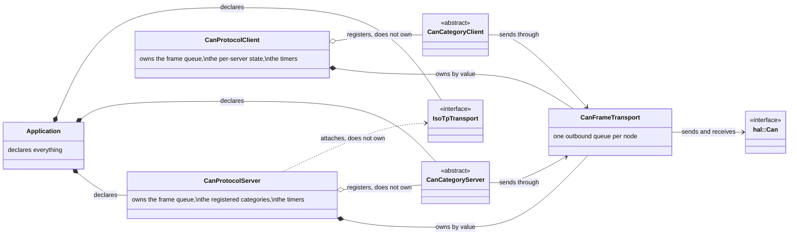
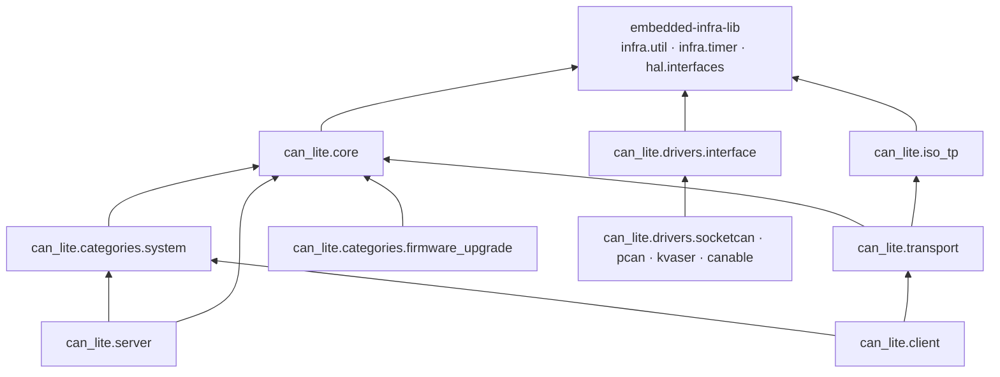
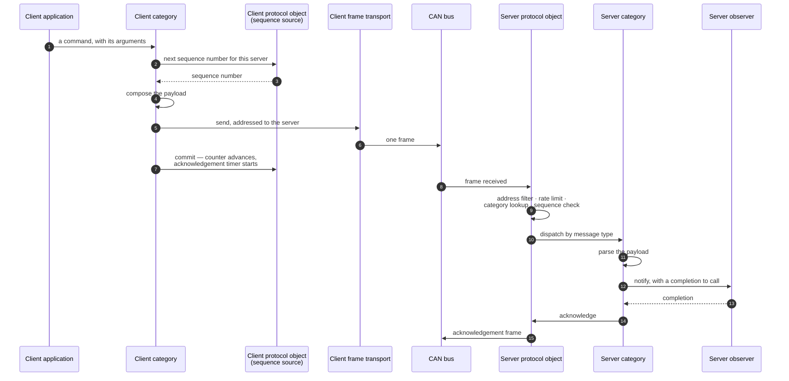

# The Layer Map

The layer stack itself, and the reasoning behind it, is in
[Architecture and Design Decisions](../design/architecture.md) §1–§3. This
chapter adds the two views that document does not carry: **who owns whom at run
time**, and **what links to what at build time**.

## 1. Composition and ownership

Nothing in can-lite is allocated, handed over or shared. Every object is a
member of something the application declares, and every collaboration is a
reference passed at construction.

Four consequences follow, and they are the whole of can-lite's lifetime model:

1. **Construction order is dependency order.** A category cannot be constructed
   before the frame transport it borrows, because it takes it by reference.
2. **Registration is separate from construction, and can fail.** Constructing a
   category always succeeds; registering it may not (Chapter 6).
3. **Observers bind for exactly their own lifetime** — they attach in their
   constructor and detach in their destructor.
4. **Destruction is the reverse of declaration.** A category must not outlive
   the protocol object whose transport it borrowed; declaring in dependency
   order gets this for free.

The single most consequential piece of that picture is that **one frame queue
exists per node**, owned by the protocol object and lent to every category. It
is what lets the protocol object observe every outgoing frame, whoever produced
it — the property the heartbeat rule depends on (Chapter 6).

## 2. Where the layering bends

Two edges surprise readers who expect a strict cake, and both are deliberate:

| Edge | Why it exists |
|------|---------------|
| Categories reach the core layer directly, not through the protocol layer | A category that borrowed the protocol object would be bound to one side of the bus; borrowing only the frame transport keeps it usable on both |
| The transport layer is attached at run time and sits beside, not under, the protocol layer | Segmentation is optional. A node that never sends payloads longer than a frame pays nothing for it, in code or in memory |

The rule that keeps the rest honest: **no layer reaches two levels down for
convenience.** A category that needs its node address asks the frame transport
it already holds.

## 3. The build graph

The dependency rules are not conventions — they are edges in the CMake target
graph.

Three rules govern it:

1. **A category links the core library and nothing else.** A category that links
   the server or the client library has quietly made itself unusable by the
   peer. This is the one build-level mistake worth watching for in review.
2. **The server and client libraries never depend on each other.** A node that
   is only a server does not carry the client's per-server state and timers.
3. **Dependencies are fetched only in a standalone build.** Consumed as a
   subdirectory, the infrastructure library must already be present.

One asymmetry is worth knowing: the server library does not link the transport
library, even though it can attach segmentation, because the transport's
interface is a header reached through the core library's include path. A server
that actually uses segmentation links the transport library itself — which is
also what keeps that code out of a build that never uses it.

## 4. A frame's journey across the layers

The value of the layering is clearest when one command is followed from the
client's application code to the server's observer. Nothing on this path
allocates, and nothing blocks.

Each step belongs to exactly one layer, and each layer's contribution is visible
in the frame: the category contributes the payload and its category identity,
the protocol layer the sequence number and the acknowledgement, the core layer
the identifier and the queueing, the HAL the bits on the wire.

## 5. Extension points

| To add | Do this | Chapter |
|--------|---------|---------|
| A functional group of messages | Author a category pair and register both halves | 5, and the authoring guide in Part IV |
| Support for another bus | Implement the HAL interface, or the host adapter interface for tooling | 3 |
| Payloads longer than one frame | Attach the segmentation transport and give the message type a segmented handler | 8 |
| A reaction to protocol-level events | Implement the server or client observer interface | 6, 7 |
| Different timing | The configuration structures on the server, the client and the firmware upgrade category | 11 |

Not in that table: the dispatcher, the identifier layout and the
acknowledgement rules. Those are the protocol, and changing them is a
specification change rather than an integration choice.
