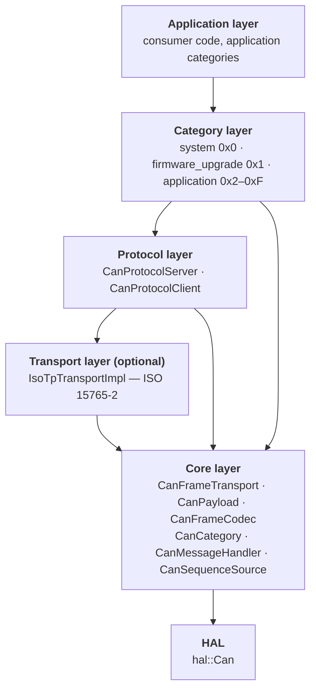
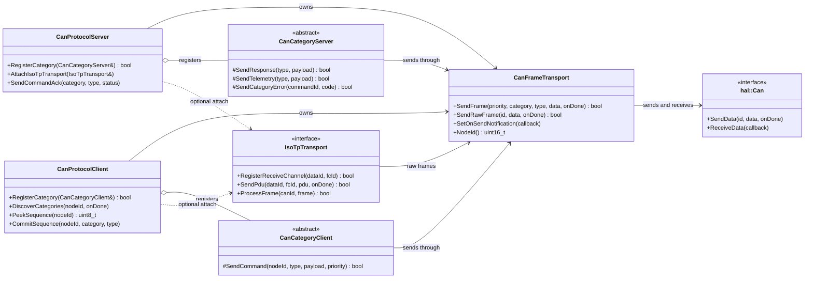
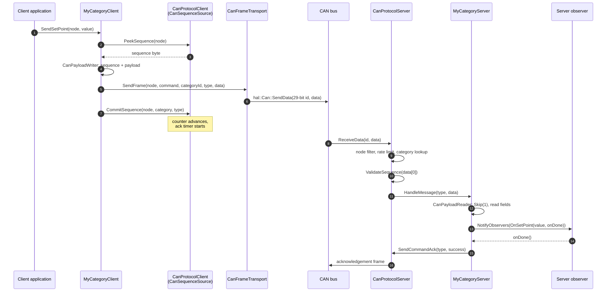
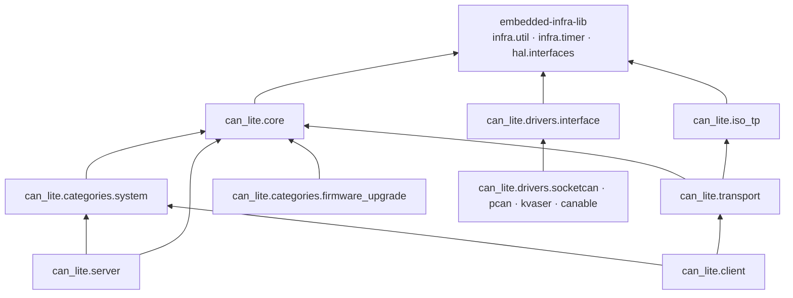

# The Layered Architecture

## 1. The stack

can-lite is six layers deep. Each layer depends only on the layer below it, and
the dependency edges are enforced by the CMake target graph rather than by
convention alone.



Two edges in that diagram deserve immediate comment, because they are the ones
that surprise readers who expect a strict layer cake:

- **The category layer talks to the core layer directly.** A category sends
  through `CanFrameTransport`, not through `CanProtocolServer`. This is what
  allows a category library to link `can_lite.core` alone and be reused on both
  sides of the bus.
- **The transport layer is optional and sits beside, not under, the protocol
  layer.** ISO-TP is attached at runtime with `AttachIsoTpTransport()`. When it
  is absent, the protocol layer speaks to the core layer directly and every
  payload is at most 8 bytes.

## 2. What each layer is responsible for

| Layer | Owns | Does not know about |
|-------|------|---------------------|
| HAL | Sending and receiving raw frames on hardware | Categories, message types, sequence numbers |
| Core | Identifier construction and extraction, the outbound frame queue, payload serialisation, message-type dispatch inside a category | Which categories exist, liveness, rate limits |
| Transport | Splitting a PDU larger than 7 bytes into ISO-TP frames and reassembling it | The meaning of the PDU it carries |
| Protocol | Node addressing, category registration and lookup, sequence validation, rate limiting, heartbeat, liveness, acknowledgement | The payload layout of any category message |
| Category | The wire layout of its own messages, and the semantics of each | Node addressing, timers, the send queue's internals |
| Application | Product behaviour | The CAN identifier layout |

The rule that keeps this honest: **a layer never reaches two levels down for
convenience.** A category that needs a node ID asks its transport
(`Transport().NodeId()`); it does not take a `CanProtocolServer&`.

## 3. Component model



`CanProtocolServer` and `CanProtocolClient` each **own** a `CanFrameTransport`
by value and hand a reference to it to every category. There is exactly one
frame queue per node, which is what makes the "quiet period" heartbeat rule of
Chapter 7 possible: the protocol object sees every outgoing frame, whoever sent
it.

## 4. Ownership and lifetime

can-lite has no factories and no ownership transfer. Everything is a member of
something the application constructs, in dependency order, and destroys in
reverse. A representative server node looks like this:

```cpp
hal::Can& can = platform.Can1();

services::CanProtocolServer server{ can,
    services::CanProtocolServer::Config{
        .nodeId = 0x001,
        .maxMessagesPerSecond = 500,
        .heartbeatInterval = std::chrono::seconds(1),
        .clientTimeout = std::chrono::seconds(3) } };

services::FirmwareUpgradeCategoryServer firmware{ server.Transport(),
    services::FirmwareUpgradeCategoryServer::Config{} };
MyFirmwareHandler firmwareHandler{ firmware };   // observer attaches here

services::IsoTpTransportImpl::WithStorage<1024, 4> isoTp{ server.Transport() };

server.RegisterCategory(firmware);
server.AttachIsoTpTransport(isoTp);
```

Four properties follow from this style, and all four matter:

1. **Construction order is dependency order.** A category cannot exist before the
   transport it sends through, because it takes it by reference.
2. **Registration is a separate, failable step.** `RegisterCategory()` returns
   `false` for a duplicate ID or when the eight-category limit is reached
   (Chapter 7); constructing the category never fails.
3. **Observers attach on construction and detach on destruction.** The handler
   in the example above is attached to `firmware` for exactly its own lifetime.
4. **Destruction order is the reverse.** Because categories hold references to
   the transport owned by the protocol object, they must not outlive it — the
   usual C++ member-declaration-order rule applies, and the example achieves it
   by declaring in dependency order.

## 5. The frame's journey through the layers

The value of the layering shows up when a single command frame is traced from
the client's application code down to the server's observer. Nothing in this
path allocates, and nothing blocks.



Each numbered step belongs to exactly one layer, and each layer's contribution
is visible in the frame: the category contributes the payload and the category
ID, the protocol layer contributes the sequence byte and the acknowledgement,
the core layer contributes the identifier and the queueing, and the HAL
contributes the bits on the wire.

## 6. Build-time structure



Three rules govern this graph:

1. **Categories depend on `can_lite.core` and nothing else.** A category that
   links `can_lite.server` has coupled itself to one side of the bus, and can no
   longer be reused by the peer.
2. **`can_lite.server` and `can_lite.client` never depend on each other.** A
   node that is only a server should not link the client's per-server state
   arrays and timers.
3. **Only the standalone build fetches dependencies.** When can-lite is added
   with `add_subdirectory()`, `embedded-infra-lib` must already be available in
   the consuming project; the `FetchContent` block runs only when can-lite is
   the top-level project.

One asymmetry is worth knowing about: `can_lite.server` does not link
`can_lite.transport`, even though `CanProtocolServer.hpp` includes
`IsoTpTransport.hpp`. It compiles because that header is a pure interface and
the include path is already public through `can_lite.core`. A server node that
actually attaches ISO-TP therefore links `can_lite.transport` itself — which is
also what keeps the transport's code out of a build that never uses it.

## 7. Where the extension points are

| Extension point | Mechanism | Chapter |
|-----------------|-----------|---------|
| New functional group of messages | Implement `CanCategoryServer` + `CanCategoryClient`, register both | 6, 12 |
| New hardware bus | Implement `hal::Can` (or `CanBusAdapter` for host tooling) | 4 |
| Payloads longer than 7 bytes | Attach `IsoTpTransportImpl` and give the message type a PDU handler | 9 |
| Reacting to protocol-level events | Implement `CanProtocolServerObserver` / `CanProtocolClientObserver` | 7, 8 |
| Changing timing | The `Config` structs on server, client and firmware upgrade category | 14 |

Note what is *not* in that table: there is no extension point in the dispatcher,
the identifier layout or the acknowledgement rules. Those are the protocol, and
changing them is a specification change (Part V) rather than an integration
choice.
