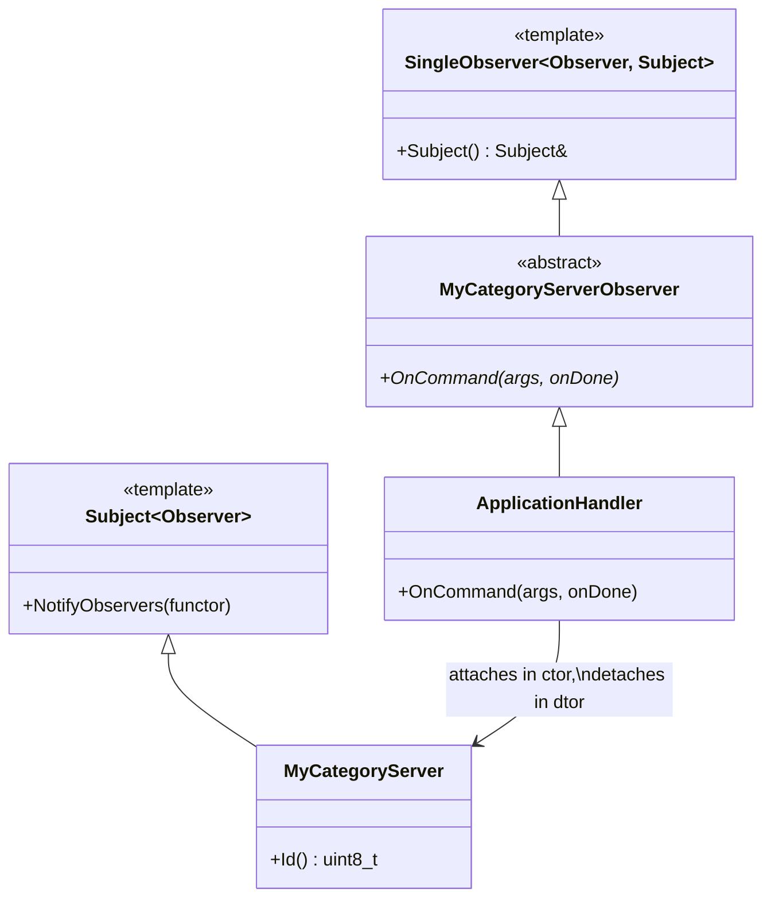

# Embedded Foundations

Everything in can-lite is built out of a small set of primitives borrowed from
[embedded-infra-lib](https://github.com/embedded-pro/embedded-infra-lib) (EMIL).
This chapter introduces those primitives and the idioms built on them, because
the rest of the booklet assumes them without further comment.

## 1. The execution model

can-lite is **single-threaded, event-driven and non-blocking**. There is no
task, no mutex and no sleep anywhere in the library. Three mechanisms carry all
asynchrony:

| Mechanism | Type | Used for |
|-----------|------|----------|
| Completion callback | `infra::Function<void(bool success)>` | "The frame has been handed to the controller" |
| Deferred work | `infra::EventDispatcher::Instance().Schedule(...)` | Breaking a call chain that would otherwise re-enter |
| Timeout | `infra::TimerSingleShot`, `infra::TimerRepeating` | Every deadline in the protocol |

The consequences are pervasive. A command handler cannot wait for flash to
erase; it takes an `infra::Function` and calls it when the erase completes
(Chapter 11). A sender cannot poll for a flow-control frame; it arms an N_Bs
timer and returns (Chapter 9). Liveness is not a periodic scan but a timer that
is restarted on every frame (Chapters 7 and 8).

The rule that falls out of this, and the one most often broken by newcomers:

> **Observer callbacks must not allocate and must not block.** They run inside
> the receive path, between the HAL handing over a frame and that frame's
> dispatch completing. Long work is deferred; results are reported through the
> completion function the callback was handed.

## 2. Bounded containers

No heap means no growth. Every container in can-lite has a compile-time maximum
and a defined behaviour at that maximum.

| Forbidden | Used instead | Where it appears in can-lite |
|-----------|--------------|------------------------------|
| `std::vector<T>` | `infra::BoundedVector<T>::WithMaxSize<N>` | ISO-TP PDU and assembly buffers |
| `std::deque<T>` | `infra::BoundedDeque<T>::WithMaxSize<N>` | `CanFrameTransport`'s eight-slot send queue |
| `std::string` | `infra::BoundedString::WithStorage<N>` | Driver interface names and error text |
| `std::list<T>` | `infra::IntrusiveList<T>` | Registered categories, registered message types |
| `std::function` | `infra::Function<Signature>` | Every callback |
| `new` / `make_unique` | Member objects and `WithStorage` | Everywhere |

`hal::Can::Message` is itself a bounded vector of at most eight bytes, which is
why payload writing can never overrun a frame: the writer checks
`message.max_size()` before every field (Chapter 5).

The important discipline is that **hitting a bound is a normal, testable
outcome**, not an error state. A full send queue returns `false` from
`SendFrame`. A ninth category fails to register. A PDU larger than the assembly
buffer is answered with an ISO-TP overflow flow-control frame. Each of those
appears in the corner-case catalogue in Chapter 13 with its observable result.

## 3. The `WithStorage` pattern

The tension is between two goals: sizes must be compile-time constants (no
heap), but the implementation must not be a template (code size, and a template
in the interface leaks the size into every signature). EMIL's
`infra::WithStorage` resolves it:

- The `Impl` class is **non-template**. It takes a **reference** to the bounded
  container as its first constructor argument.
- A nested `WithStorage<N>` alias derives from the `Impl`, privately owns the
  storage, and passes it as that first argument.

```cpp
class IsoTpSender
{
public:
    template<uint16_t MaxPduSize>
    using WithStorage = infra::WithStorage<IsoTpSender,
        typename infra::BoundedVector<uint8_t>::template WithMaxSize<MaxPduSize>>;

    explicit IsoTpSender(infra::BoundedVector<uint8_t>& pduBuffer);
    ...
};
```

`IsoTpSender::WithStorage<512>` **is-a** `IsoTpSender`, so every reference,
every virtual call and every algorithm sees the non-template type. The size
exists only at the point of instantiation.

The ISO-TP layer chains this three deep, which is the pattern at its most
expressive:

```mermaid
flowchart LR
    A["IsoTpTransportImpl::WithStorage&lt;MaxPduSize, MaxChannels&gt;"]
    B["BoundedVector&lt;IsoTpChannelImpl::WithStorage&lt;MaxPduSize&gt;&gt;<br/>::WithMaxSize&lt;MaxChannels&gt;"]
    C["IsoTpChannelImpl::Storage&lt;MaxPduSize&gt;<br/>{ sender, receiver }"]
    D["BoundedVector&lt;uint8_t&gt;::WithMaxSize&lt;MaxPduSize&gt;<br/>× 2"]

    A -- owns --> B
    B -- each element owns --> C
    C -- owns --> D
```



One declaration in the application —

```cpp
services::IsoTpTransportImpl::WithStorage<1024, 4> isoTp{ transport };
```

— statically reserves four channels, each with a 1 KiB transmit buffer and a
1 KiB reassembly buffer, and the entire ISO-TP implementation is compiled once,
not once per size.

## 4. Intrusive lists

Registering a category, or a message type inside a category, must not allocate a
node. `infra::IntrusiveList<T>` solves this by putting the links **inside** the
element: a type joins a list by deriving from
`infra::IntrusiveList<T>::NodeType`.

```cpp
class CanCategoryServer
    : public CanCategory
    , public infra::IntrusiveList<CanCategoryServer>::NodeType
{ ... };
```

This has a second, deliberate effect that the design leans on heavily:

> Because `CanCategoryServer` and `CanCategoryClient` derive from *different*
> node types, a client category is not merely wrong to register on a server —
> it does not compile. Role separation is a type-system property, not a runtime
> check.

The cost is that an element belongs to at most one list at a time, and that an
element must not be destroyed while listed. can-lite honours both: categories
are registered once, and `UnregisterCategory()` exists for the case where a
category is destroyed before the protocol object.

## 5. `infra::Function`

`infra::Function<void(bool)>` is a fixed-capacity replacement for
`std::function`: it stores a callable inline in a small, statically sized buffer
and never allocates. Two practical consequences show up throughout the code:

1. **Captures must stay small.** The idiomatic capture in can-lite is `[this]`
   plus one or two scalars. `CanProtocolClient::MarkServerAlive`, for example,
   captures `this` and a `uint16_t nodeId`.
2. **A `Function` slot can be overwritten.** `CanFrameTransport` guards its
   single notification slot explicitly, because two owners silently sharing it
   would break the heartbeat rule:

```cpp
void CanFrameTransport::SetOnSendNotification(infra::Function<void()> callback)
{
    really_assert(!onSendNotification);
    onSendNotification = callback;
}
```

`really_assert` is EMIL's always-on assertion: unlike `assert` it is not
compiled out in release builds. can-lite uses it for **programming errors that
cannot be recovered from at runtime** — a second notification owner, a server
constructed with the broadcast node ID, a `CommitSequence` for a node that was
never peeked. Protocol-level errors, by contrast, are never assertions: they
are acknowledgement statuses, `false` returns and `std::optional`.

## 6. Observers

Events flow out of the library through `infra::Subject<Observer>` and
`infra::SingleObserver<Observer, Subject>`.



Four properties matter:

- **Exactly one observer per subject.** `SingleObserver` matches the 1:1
  relationship between a category and the application component that implements
  it. Attaching a second observer to the same subject is a programming error.
- **Attachment is lifetime-bound.** The observer's constructor takes the subject
  and attaches; its destructor detaches. There is no `Attach()` to forget.
- **Notification is safe when unobserved.** `NotifyObservers` checks for a null
  observer first, so a category can be registered and exercised with no
  application attached — which is precisely what several unit tests do.
- **Notification is synchronous.** The observer runs inside the frame-dispatch
  call stack. That is what makes the "no allocation, no blocking" rule binding,
  and it is also why an observer that wants to send a response can do so
  immediately: the send queue is asynchronous underneath it.

Asynchronous observer callbacks take a completion function as their last
argument, so that the handler can complete later without the category having to
retain state:

```cpp
virtual void OnBeginUpgrade(uint32_t firmwareSize,
    const infra::Function<void(FwuError, uint16_t)>& onResult) = 0;
```

The category holds no session state of its own; it captures what it needs into
the completion lambda and sends the response when the application calls it.

## 7. Timers

`infra::TimerSingleShot` and `infra::TimerRepeating` come from `infra.timer` and
are driven by the platform's timer service. can-lite uses them in three
recognisable idioms:

| Idiom | Meaning | Example |
|-------|---------|---------|
| Restart on activity | "It has been quiet for too long" | Heartbeat emission (Chapters 7, 8) |
| Restart on activity, act on expiry | "The peer has gone away" | Client and server liveness |
| Start on send, cancel on receipt | "The answer never came" | Command-ack timeout, ISO-TP N_Bs and N_Cr |

`TimerRepeating` appears exactly once, for the rate-limit window reset in
`CanProtocolServer`, because that is the only genuinely periodic activity in the
library. Everything else is single-shot, which means an idle node arms no
recurring work.

In tests, `infra::ClockFixture` replaces the timer service with a controllable
clock and `ForwardTime()` advances it deterministically — no test in can-lite
ever sleeps (Chapter 15).

## 8. Error handling without exceptions

Exceptions and RTTI are off. Errors are reported in one of four ways, chosen by
how the caller can react:

| Mechanism | Meaning | Example |
|-----------|---------|---------|
| `bool` return | The request was rejected here and now | `SendFrame` on a full queue, `RegisterCategory` on a duplicate ID |
| Sticky validity flag | A sequence of operations went out of range | `CanPayloadWriter::Valid()`, `CanPayloadReader::Valid()` |
| Status enum on the wire | The peer must be told | `CanAckStatus`, `FwuError`, ISO-TP `AbortReason` |
| `really_assert` | The program is wrong | Broadcast node ID for a server, duplicate send-notification owner |

The sticky-flag idiom is worth highlighting because it shows up in every
category. `CanPayloadWriter` lets the caller chain writes and check once:

```cpp
CanPayloadWriter payload;
payload.WriteUInt8(static_cast<uint8_t>(state))
       .WriteUInt16(blocksReceived)
       .WriteUInt16(totalBlocks);

SendResponse(fwuProgressResponseId, payload);   // no-op if !payload.Valid()
```

Once a write overflows, every subsequent write is skipped and `Valid()` stays
`false`, so a partially formed frame is never transmitted. The reader mirrors it
exactly: a read past the end returns zero, sets `Valid()` to `false`, and the
handler answers `invalidPayload`.

## 9. Style rules that affect the design

These are conventions rather than mechanisms, but they change how the code
reads, so they belong here:

- Interfaces are named plainly (`IsoTpTransport`, not `IIsoTpTransport`);
  concrete implementations carry the `Impl` suffix.
- The namespace is `services` (with `services::iso_tp` for the ISO-TP
  internals), not `can_lite`.
- Classes and methods are `PascalCase`; members and enum values are `camelCase`.
- Brace initialisation everywhere: `uint8_t count{}`, `MyClass obj{ a, b }`.
- Functions stay under 30 lines, which is the practical reason state machines
  are split into `Handle*` helpers rather than switch statements with bodies.
- **No comments.** The source is expected to read from names and structure
  alone; rationale lives in commit messages, in the design records, and in this
  booklet. The few comments that do exist in the sources mark deliberate,
  non-obvious protocol decisions — and each of them is expanded in the relevant
  chapter here.
