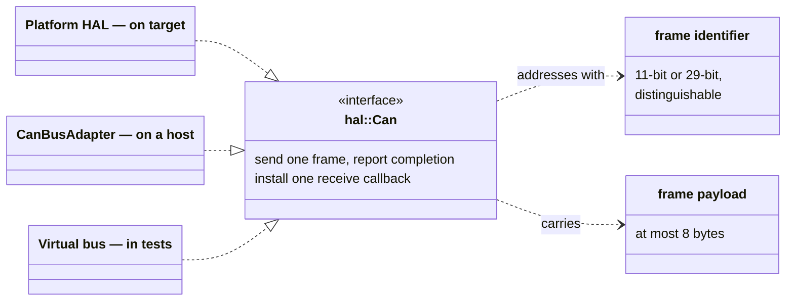
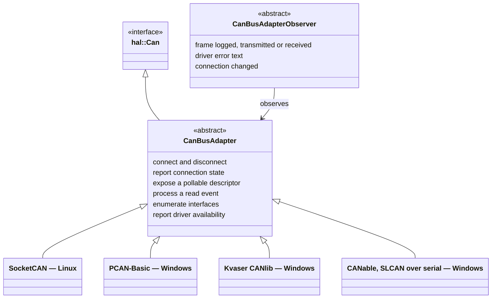

# HAL and Bus Drivers

The bottom of the stack is deliberately thin. can-lite asks the hardware for
exactly two things — send a frame, deliver a received frame — and everything
above is written against those two and nothing else.

## 1. What the library requires of a bus

Four properties of that contract shape every layer above it:

| Property | Consequence |
|----------|-------------|
| A payload is at most 8 bytes | Anything longer needs segmentation (Chapter 8), and payload composition is bounds-checked against the frame (Chapter 4) |
| Sending is asynchronous, completing through a callback | The core layer keeps its own queue and serialises sends (Chapter 4) |
| Exactly one receive callback exists per interface | The protocol object claims it at construction; a second consumer of the same bus is not supported |
| Identifier widths are distinguishable | can-lite uses extended identifiers exclusively and discards standard-identifier frames unseen, which is what lets it share a bus with other protocols (REQ-CAN-002) |

The library neither provides nor requires a particular implementation. On a
microcontroller the platform HAL supplies one; the library takes a reference to
it when the protocol object is constructed.

## 2. The host adapter

Host-side tooling needs more than the bus interface offers: opening an
interface, reporting connection state, enumerating what the machine has, and
integrating with a poll loop. The adapter interface adds exactly that — and
nothing the protocol layer would ever call.

| Adapter | Availability |
|---------|--------------|
| SocketCAN | Always, on Linux |
| PCAN-Basic | Windows, opt-in, requires the vendor SDK to be found |
| Kvaser CANlib | Windows, opt-in, requires the vendor SDK to be found |
| CANable over SLCAN | Windows, on by default |

Each adapter is guarded both in the build and in its header, so including the
wrong one for a platform yields an empty translation unit rather than a compile
error.

The observer interface exists for tooling — a bus monitor attaches to it and
receives every frame in both directions, driver error text, and connection
transitions. It is an observation channel, not a data path: the protocol still
receives frames through the bus interface.

**Poll-loop integration.** The adapter exposes a descriptor to select on and an
entry point to call when it becomes readable, so a host application can service
the bus from its own loop instead of dedicating a thread to it. Adapters also
defer their send completions through the event dispatcher rather than calling
them from inside the send. That detail matters more than it looks: it
guarantees the core layer's queue is never re-entered from inside its own send
(Chapter 10, §2).

## 3. The virtual bus used by the integration tests

The integration tests replace hardware with a pair of connected virtual buses:
one instance's send lands in the other's receive callback, which models the
two-node topology the tests use. A second entry point pushes a frame straight
into the receive callback, bypassing the peer — that is how a test produces
something no correct peer would ever send: a malformed acknowledgement, a wrong
sequence number, an unknown category, a standard-identifier frame. Disconnecting
models bus loss, which is how the liveness timeouts of Chapters 6 and 7 are
exercised.

What the virtual bus does **not** model is the boundary of what the integration
tests can prove:

| Not modelled | Consequence for testing |
|--------------|-------------------------|
| Arbitration and priority | Frame order is send order, so priority effects are reasoned about (Chapter 11), not observed |
| Bus errors, error frames, bus-off | Sending always succeeds; failure paths are exercised through mocks instead |
| Transmission delay and bit timing | Bus-load budgeting is arithmetic, not measurement |
| More than two endpoints | Multi-server behaviour is covered at the unit level |

## 4. What can-lite assumes of a driver

A driver that satisfies the interface but breaks any of these produces
protocol-level misbehaviour rather than an obvious failure, so they are worth
stating:

1. **Each send completes exactly once, and not from inside the send call
   itself.** The core layer dequeues the next frame from within that completion;
   a synchronous completion turns queue drain into recursion.
2. **Whole frames are delivered**, with the identifier already separated from
   the payload.
3. **The receive callback runs in the application's own context.** A driver that
   calls it from an interrupt must marshal through the event dispatcher first.
4. **Frames arrive in the order they were received.** Sequence validation
   rejects reordered commands, so a reordering driver produces spurious sequence
   errors.
5. **Acceptance filtering, if configured, must admit the broadcast address.**
   The client's heartbeat is broadcast; a filter that matches only the node's
   own address will make the server report its client offline on an idle bus.

Point 5 is the one that bites during MCU integration, and it is catalogued in
Chapter 10, §6.
