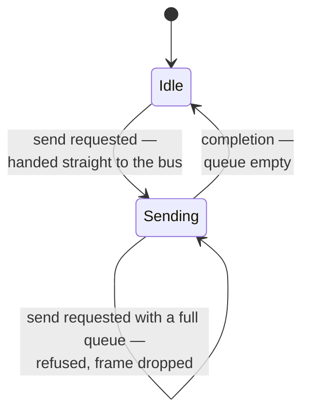
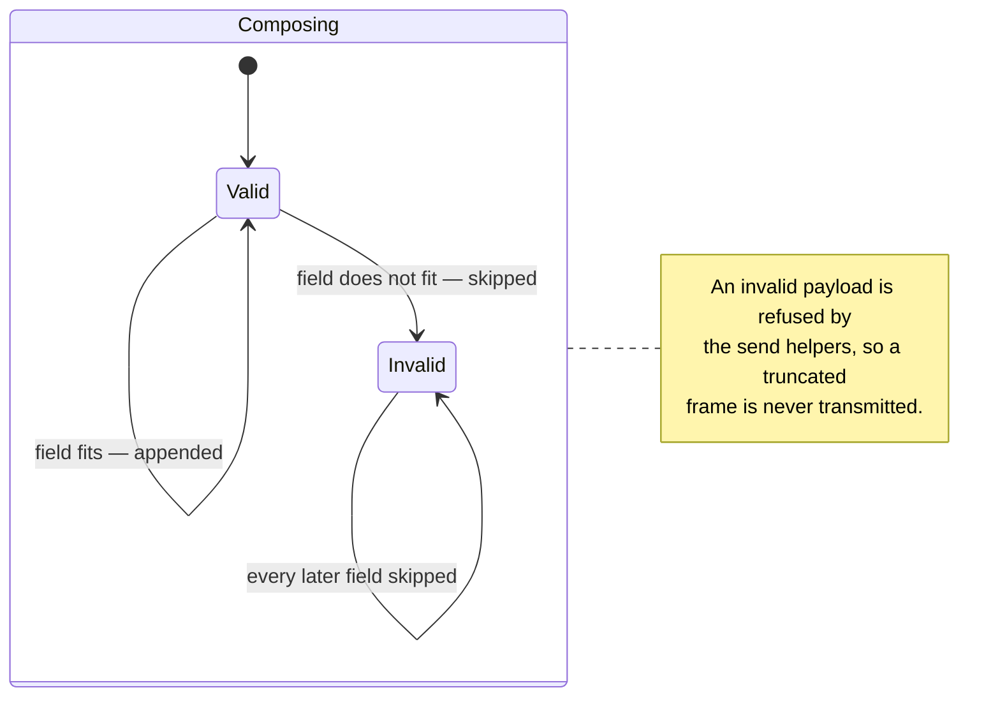
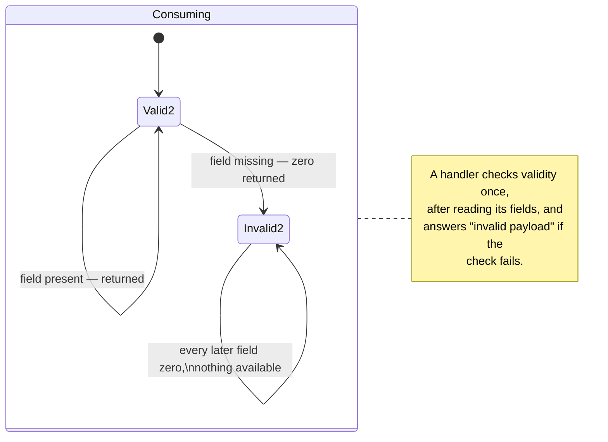

# The Core Layer: Frame Flow

The core layer owns four concerns: what an identifier means, how outbound frames
are queued, how payload bytes are composed and consumed, and how numbers are
represented on the wire. The identifier layout, the priority values and the
number encoding are specified in the
[Protocol Specification](../spec/can-protocol.md) §5, §6 and §9 and are not
repeated here. What follows is the part that is not in any specification: how
the layer behaves.

## 1. The identifier is the routing table

Everything a receiver needs in order to decide what a frame is — its urgency,
its functional group, its specific message, and who it is for — lives in the
identifier. **No routing decision requires reading a payload.**

Three properties follow, and they are why the layout is worth its complexity:

- **Hardware can filter.** An acceptance filter on the address field drops
  another node's traffic before the CPU sees it.
- **Software routes on integers.** The dispatch pipeline compares extracted
  fields; it never parses.
- **Priority is arbitration.** Because urgency occupies the most significant
  bits, the specification's priority ordering *is* the bus's ordering:
  emergency traffic beats commands, which beat responses, which beat telemetry,
  which beat heartbeats, regardless of which node sends them.

The layout is known in exactly one place. Composition and extraction helpers are
compile-time evaluable, so identifiers known at build time — an acceptance
filter table, for example — cost nothing at run time. Category code never
manipulates the bits itself; that is what makes the layout changeable in one
place.

The command/response split in the message-type field is the other structural
decision: it lets a server discard responses without a lookup, which is what
stops two servers on one bus from reacting to each other's answers.

## 2. One outbound queue per node

The bus interface accepts one frame at a time. Without a queue, a category
wanting to send two frames back to back would have to know whether the
controller was busy — so the core layer owns that knowledge, once, for the whole
node.

Four behaviours of that small machine are load-bearing:

| Behaviour                                                                              | Why it matters                                                                                                                                                                                |
|----------------------------------------------------------------------------------------|-----------------------------------------------------------------------------------------------------------------------------------------------------------------------------------------------|
| The queue advances **before** the finished frame's completion runs                     | A completion that itself sends finds the transport in a consistent state, so chained sends are safe                                                                                           |
| The queue holds a fixed eight frames; the ninth is **refused, not buffered elsewhere** | Refusal is visible to the caller, who decides. A category's send reports failure; a client command reports failure **without consuming a sequence number**; an acknowledgement is simply lost |
| Every accepted frame — queued or immediate — raises a send notification                | This is the hook the protocol layer uses to defer its heartbeat, and it is why a refused frame does not postpone one                                                                          |
| The notification has exactly one owner, enforced at run time                           | The protocol object claims it at construction; a second claimant is a programming error, and fails loudly                                                                                     |

The address stamped into an outbound frame differs by role, and the asymmetry is
worth fixing in mind: a **server** stamps its own address, because a response
must say who answered; a **client** stamps the target's address, because a
command must say who it is for. The same identifier field therefore reads as
*source* on a response and *destination* on a command. The direction is never
ambiguous, because the message type already says which it is.

A node whose address is configured late — from a switch, from stored settings,
from a bootloader parameter — can change it after construction. Frames already
queued keep the identifier they were built with.

## 3. Payload composition: bounded, big-endian, sticky

Two small components handle payloads, and between them they make it impossible
to write past the end of a frame or read past the end of one.

The **sticky** part is the design decision. Rather than making every field
access return a status the caller must check, the first out-of-range access
poisons the whole operation and later ones become no-ops. A caller therefore
writes the natural sequence of fields and checks once at the end, and the
failure mode is a payload that is never sent or a command that is never acted
on — not a half-formed frame or a plausible-looking wrong value.

Two guards complete the picture. The send helpers refuse an invalid composition,
so a category cannot transmit a truncated frame even by ignoring the check. And
a reader borrows the frame it reads rather than copying it, with binding to a
temporary made impossible at compile time, so a reader can never outlive its
data.

The consequence a category author must remember is the one thing this layer
cannot check: a handler that reads its fields and **forgets to check validity**
will act on zeros. That is catalogued in Chapter 10, §9.

## 4. Numbers on the wire

Multi-byte fields are big-endian, and floating-point values cross the bus as
scaled integers, so that a target without a floating-point unit and a host with
one produce byte-identical frames. The scale is chosen per message and is part
of that message's specification.

Two properties of the conversion are worth carrying into a design review,
because they decide what a peer sees when a value is out of range:

- **Out-of-range values saturate; they do not wrap.** A control loop that
  receives a saturated set-point is behaving as commanded-but-clipped, never as
  commanded-with-the-sign-flipped. The 32-bit conversion needs particular care
  at its upper bound, because the bound is not exactly representable in a
  32-bit float — the comparison is deliberately inclusive so that the conversion
  cannot overflow past it.
- **Not-a-number maps to zero** on the 32-bit path. A scaled integer has no
  encoding for it, and zero is the least surprising set-point.
