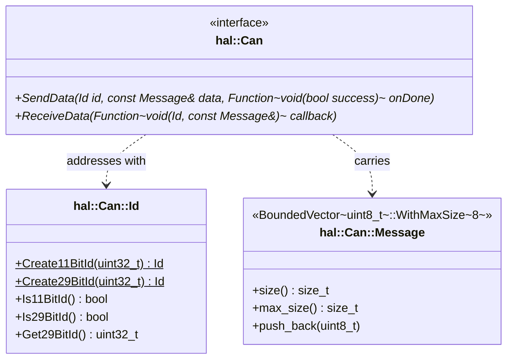
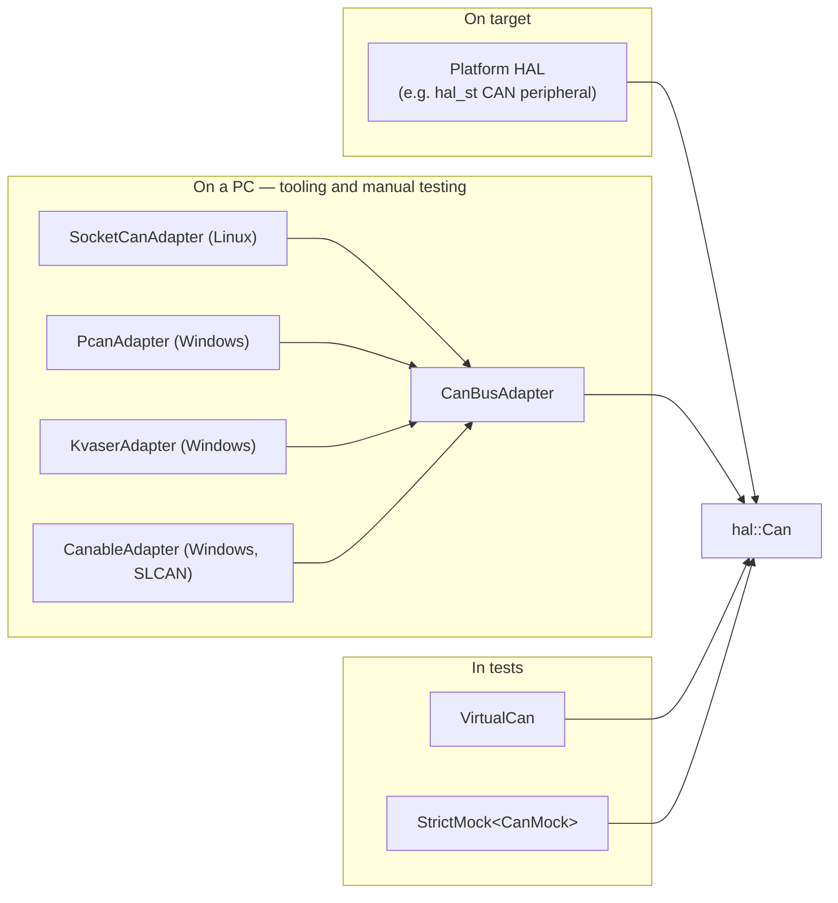
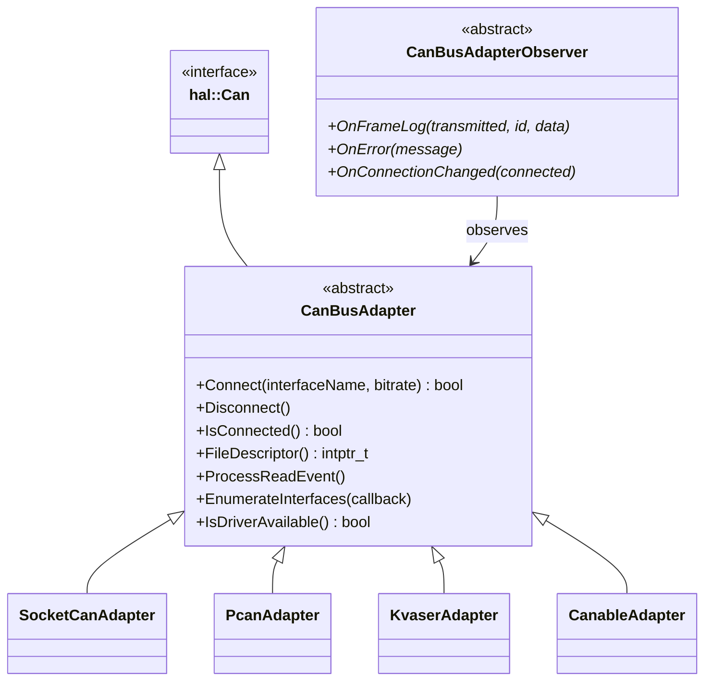

# HAL and Bus Drivers

The bottom of the stack is deliberately thin. can-lite needs exactly two
operations from the hardware — send a frame, deliver a received frame — and it
gets them from EMIL's `hal::Can` interface. Everything above that layer is
written against those two operations and nothing else.

## 1. The `hal::Can` contract



Four properties of that contract shape everything above it:

| Property | Consequence |
|----------|-------------|
| `Message` holds at most 8 bytes | Payloads longer than that need ISO-TP (Chapter 9); the payload writer is bounds-checked against `max_size()` |
| `SendData` is asynchronous, completing through a callback | `CanFrameTransport` maintains its own queue and serialises sends (Chapter 5) |
| `ReceiveData` installs **one** callback | The protocol object claims it in its constructor; a second consumer of the same `hal::Can` is not supported |
| `Id` distinguishes 11-bit from 29-bit | can-lite uses 29-bit identifiers exclusively and silently discards 11-bit frames (REQ-CAN-002) |

The 11-bit discard is worth stating precisely, because it is the first filter
every received frame passes through:

```cpp
void CanProtocolServer::ProcessReceivedMessage(hal::Can::Id id, const hal::Can::Message& data)
{
    if (!id.Is29BitId())
        return;
    ...
}
```

No acknowledgement, no observer notification, no counter: an 11-bit frame simply
does not exist as far as can-lite is concerned. On a mixed bus that carries
other protocols in the standard-identifier space, this is the property that lets
can-lite coexist with them.

## 2. Where the implementation comes from

On a microcontroller, `hal::Can` is implemented by the platform HAL — the
`hal_st`, `hal_nxp` or equivalent layer for the part in use. can-lite neither
provides nor requires a specific one; it takes a `hal::Can&` in the constructor
of `CanProtocolServer` and `CanProtocolClient` and uses it.



Three families implement the same interface, and the protocol code cannot tell
them apart. That symmetry is what makes the integration tests meaningful: they
run the production `CanProtocolServer` and `CanProtocolClient` against
`VirtualCan`, exercising the same code paths a target would.

## 3. `CanBusAdapter` — the host-side extension

Host tooling needs more than `hal::Can` offers: it must open an interface,
report connection state, enumerate what the machine has, and integrate with a
poll loop. `CanBusAdapter` adds exactly that, and nothing that the protocol
layer would ever call.



| Adapter | Platform | Transport | Built |
|---------|----------|-----------|-------|
| `SocketCanAdapter` | Linux | `AF_CAN` socket, `can0`-style interfaces | Always on Linux |
| `PcanAdapter` | Windows | PEAK PCAN-Basic SDK | `CAN_LITE_DRIVER_PCAN=ON`, SDK must be found |
| `KvaserAdapter` | Windows | Kvaser CANlib | `CAN_LITE_DRIVER_KVASER=ON`, SDK must be found |
| `CanableAdapter` | Windows | SLCAN over a serial port | `CAN_LITE_DRIVER_CANABLE=ON` (default) |

The build guards are both a CMake condition and a preprocessor guard in the
header (`#ifdef __linux__`, `#ifdef _WIN32`), so including a header for the
wrong platform yields an empty translation unit rather than a compile error.

`CanBusAdapterObserver` exists for tooling: a bus monitor attaches to it and
receives every transmitted and received frame (`OnFrameLog`), driver-level error
text, and connection transitions. Note that this is an observation channel, not
a data path — the protocol still receives frames through
`hal::Can::ReceiveData`.

### Integration with an event loop

`FileDescriptor()` and `ProcessReadEvent()` exist so that a host application can
put the adapter in its own `select`/`poll`/`epoll` loop instead of dedicating a
thread to the bus:

```cpp
services::SocketCanAdapter adapter;
adapter.Connect("can0", 500000);

pollfd fds{ .fd = static_cast<int>(adapter.FileDescriptor()), .events = POLLIN };
while (running)
{
    if (::poll(&fds, 1, timeoutMs) > 0 && (fds.revents & POLLIN) != 0)
        adapter.ProcessReadEvent();     // parses frames, invokes the receive callback

    infra::EventDispatcher::Instance().ExecuteAllActions();
}
```

The adapters also defer their send completions through the event dispatcher
(`ScheduleCompletion`), rather than calling the completion function from inside
`SendData`. That matters more than it looks: it guarantees that
`CanFrameTransport`'s queue is never re-entered from inside its own send call
(Chapter 5, §4).

## 4. `VirtualCan` — the bus that lives in a test

The integration tests replace hardware with a pair of connected `VirtualCan`
objects:

```cpp
class VirtualCan : public hal::Can
{
public:
    void SendData(Id id, const Message& data, const infra::Function<void(bool)>& onDone) override;
    void ReceiveData(const infra::Function<void(Id, const Message&)>& callback) override;
    void Receive(Id id, const Message& data);
    void ConnectTo(VirtualCan& other);
    void InjectFrame(Id id, const Message& data);
    void Disconnect();

    Id lastSentId = Id::Create29BitId(0);
    Message lastSentData;
    int sendCount = 0;
    ...
};
```

`ConnectTo` makes one instance's `SendData` deliver into the peer's receive
callback, which models a shared bus for the two-node topology the tests use.
`InjectFrame` bypasses the peer entirely and pushes a frame straight into the
receive callback — that is how tests produce frames no correct peer would send:
a malformed acknowledgement, a wrong sequence number, an unknown category, an
11-bit identifier.

`Disconnect()` models bus loss, which is how the liveness timeouts of Chapters 7
and 8 are exercised: disconnect, `ForwardTime(4s)`, expect `Offline()`.

Notice what `VirtualCan` does *not* model, since these are the limits of what
the integration tests can prove:

| Not modelled | Consequence for testing |
|--------------|-------------------------|
| Arbitration and priority | Frame ordering is send order, so priority effects must be reasoned about, not observed |
| Bus errors, error frames, bus-off | Send always succeeds; failure paths are exercised through mocks instead |
| Transmission delay and bit timing | Bus-load budgeting (Chapter 14) is arithmetic, not measurement |
| More than two endpoints | Multi-server behaviour is tested at the unit level with mocks |

## 5. Assumptions can-lite makes about the driver

A driver that satisfies `hal::Can` but violates any of these will produce
subtle, protocol-level misbehaviour rather than an obvious failure, so they are
worth stating explicitly:

1. **`SendData`'s completion is called exactly once per call**, and not
   re-entrantly from inside `SendData` itself. `CanFrameTransport` dequeues the
   next frame from inside that completion; a driver that completes synchronously
   turns queue drain into recursion.
2. **The receive callback delivers whole frames**, with the identifier already
   split from the payload.
3. **The receive callback runs in the same context as the rest of the
   application** — the event-driven, single-threaded context. A driver that
   calls it from an interrupt must marshal through the event dispatcher first.
4. **Frames are delivered in reception order.** Sequence validation (Chapter 7)
   rejects reordered commands; a driver that reorders will produce spurious
   `sequenceError` acknowledgements.
5. **Acceptance filtering, if configured, must not drop broadcast frames.** Node
   ID `0x000` is the broadcast address, and the client's heartbeat uses it
   (Chapter 8).

Point 5 has a practical corollary for MCU integration: a hardware acceptance
filter that matches the low 12 bits against the node ID must also admit
`0x000`, or the server will never see the client's heartbeat and will report the
client as offline once per `clientTimeout`.
