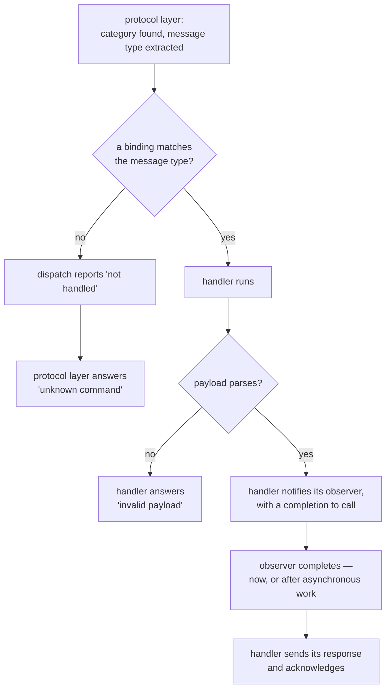
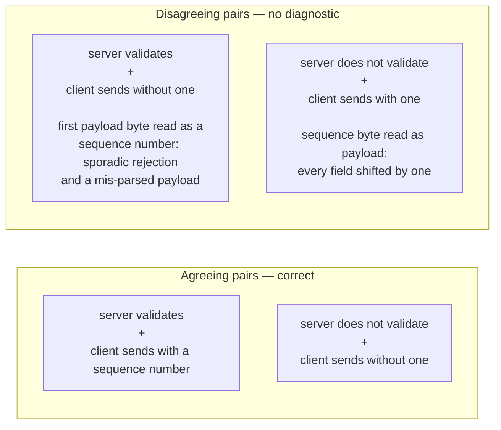

# Category Dispatch and Sequence Policy

A category is the unit of extension: a pair of classes, one per side of the bus,
owning a functional group of messages. The type hierarchy, the observer pattern
and the bidirectional pairing are described in
[Architecture and Design Decisions](../design/architecture.md) §3, §5 and §7,
and how to author a pair is the subject of
[Extending can-lite with Categories](../design/extending-categories.md). This
chapter covers the two things neither document treats in depth: **what dispatch
does with a frame**, and **how the two halves of a pair must agree on sequence
policy**.

## 1. Message types are members, not classes

Inside a category, a message type binds a message identifier to one of the
category's own member functions. Three values — the identifier, the owning
category and the member to call — are all a binding holds.

The alternative, one small class per message, was what the library used first.
Replacing it removed a type and about a dozen lines per message, kept handler
bodies as ordinary private members of the category, and — because the bindings
are members of the category object — needs no allocation and no back-pointer
bookkeeping. A handler that needs state keeps it in the category, which is the
only object with a lifetime long enough to hold it.

**Do not reintroduce a class per message.** It is the one deviation from the
authoring guide that still compiles and works, and it costs code size in a
library whose whole premise is bounded cost.

## 2. What dispatch does

Lookup inside a category is a linear scan over its registered message types —
a handful of comparisons, on a bus that delivers at most a few thousand frames a
second. What matters is not the scan but the **outcome**, because the outcome is
the contract between the category layer and the protocol layer.

The distinction that catches people out is between the two failure paths. **Not
handled** means the category has no binding for that message type, and the
protocol layer turns it into an acknowledgement on the category's behalf. A
handler that runs and fails reports *itself* — through an acknowledgement status
or, when the fixed statuses cannot express the failure, through the category
error message type that every category reserves for the purpose.

## 3. The segmented path

A message type may additionally opt in to handling a reassembled multi-frame
payload. One that does not opt in inherits a default that **declines**.

That default is a deliberate choice with a visible consequence: sending a
multi-frame payload to a message type that only understands single frames yields
an "unknown command" acknowledgement rather than a truncated read of the first
eight bytes. Silence would have been worse; a partial read would have been much
worse.

Everything else on the segmented path is identical — the same address filter,
rate limit, sequence check, category lookup and acknowledgement statuses — which
is what makes segmentation transparent to a category (Chapter 8).

## 4. Sending: what each side gets

Neither half of a category composes an identifier. The base classes fill in the
category identity and the priority, so a category never touches the frame layer.

| Side   | Can send                                                                                       | Cannot send          |
|--------|------------------------------------------------------------------------------------------------|----------------------|
| Server | responses, telemetry, category errors, and acknowledgements routed through the protocol object | commands             |
| Client | commands, addressed to a specific server                                                       | anything unsolicited |

Acknowledgements are the interesting one. An acknowledgement is a *system*
category message, and a category is not allowed to speak for another category —
so a server category asks the protocol object, which it is given at
registration, to acknowledge on its behalf. A category that tries to acknowledge
before it has been registered fails loudly; that is only reachable when a test
drives a category directly, and Chapter 12 notes how the tests arrange it.

## 5. The sequence-policy contract

Whether commands in a category carry a sequence number is a **per-category
decision**, declared by the server half. The reasoning for each built-in
category's choice is in Chapter 9; the mechanism is in
[Architecture and Design Decisions](../design/architecture.md) §9.

What matters here is that the two halves must agree, and nothing enforces it:

Both disagreements compile, link and run. Neither produces a diagnostic. They
are the most confusing configuration errors in the library, which is why they
head the category-level entries in Chapter 10.

Two further consequences of a validated category are easy to forget:

- The sequence number occupies the **first payload byte**, so a validated
  command carries at most **seven** bytes of category payload.
- The protocol layer inspects that byte but does **not** remove it. A validated
  server handler must skip it before reading its own fields — and a handler that
  forgets produces plausible, wrong values rather than an error.

## 6. Why the client half needs an interface, not the client

A client category is handed its sequence numbers through a small interface
implemented by the client protocol object, rather than being handed the protocol
object itself. That indirection is the reason a category library can link the
core library alone: taking the client would drag the client library — its
per-server state, its timers — into every category, and with it the coupling to
one side of the bus that the whole category design exists to avoid.
