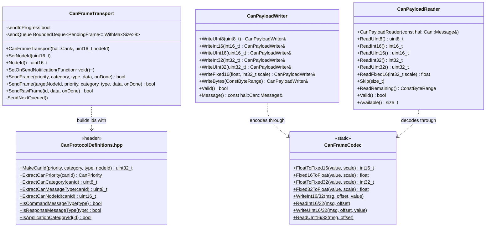
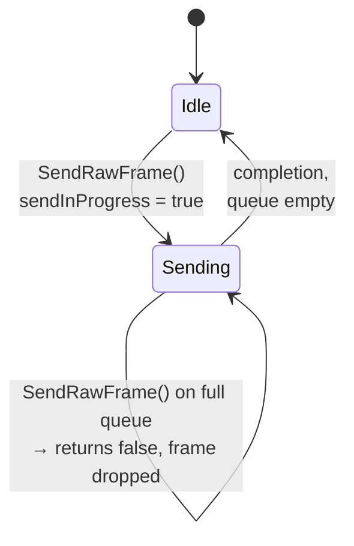
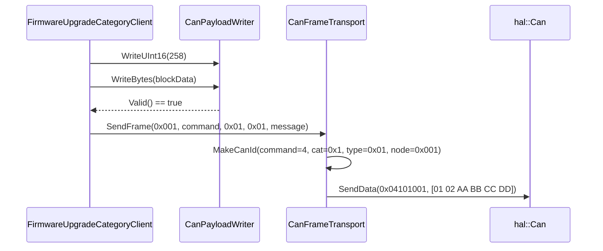

# The Core Layer

`can_lite.core` is the layer every other layer links. It owns four concerns:
what a CAN identifier means, how outgoing frames are queued, how payload bytes
are written and read, and how numbers are represented on the wire. It knows
nothing about categories, liveness or acknowledgement — those live one layer up.



## 1. The identifier is the routing table

All 29 bits of the extended identifier carry routing information. Nothing about
the meaning of a frame requires reading its payload.

```text
 28    24 23  20 19        12 11              0
┌────────┬──────┬────────────┬─────────────────┐
│Priority│ Cat. │ Message Ty.│     Node ID     │
│ 5 bits │4 bits│   8 bits   │     12 bits     │
└────────┴──────┴────────────┴─────────────────┘
```

| Field | Bits | Range | Meaning |
|-------|------|-------|---------|
| Priority | 28:24 | 0–31 | Lower value wins bus arbitration |
| Category | 23:20 | 0x0–0xF | Functional group; `0x0` system, `0x1` firmware upgrade, `0x2`–`0xF` application |
| Message type | 19:12 | 0x00–0xFF | `0x00`–`0x7F` commands, `0x80`–`0xFF` responses, `0xFE` reserved for category error |
| Node ID | 11:0 | 0x000–0xFFF | Target server; `0x000` is broadcast |

Priorities are an enum rather than raw numbers, spaced so that intermediate
values remain available to an application that needs them:

| `CanPriority` | Value | Used by |
|---------------|-------|---------|
| `emergency` | 0 | Reserved for safety-critical application messages |
| `command` | 4 | Client → server commands |
| `response` | 8 | Server → client responses and acknowledgements |
| `telemetry` | 12 | Periodic server → client data |
| `heartbeat` | 16 | Presence announcements, both directions |

Because the priority field occupies the most significant bits, this ordering is
also the bus-arbitration ordering: an emergency frame beats a command, which
beats a response, which beats telemetry, which beats a heartbeat, no matter
which node sends them.

### Construction and extraction

```cpp
static constexpr uint32_t MakeCanId(CanPriority priority, uint8_t category,
    uint8_t messageType, uint16_t nodeId)
{
    return (static_cast<uint32_t>(priority) << canIdPriorityShift) |
           ((static_cast<uint32_t>(category) & canIdCategoryMask) << canIdCategoryShift) |
           (static_cast<uint32_t>(messageType) << canIdMessageTypeShift) |
           (static_cast<uint32_t>(nodeId) & canIdNodeIdMask);
}
```

Everything here is `constexpr`, so an identifier known at compile time costs
nothing at run time — useful for hardware acceptance-filter tables. Category and
node ID are masked, so an out-of-range value truncates rather than corrupting a
neighbouring field; the message type is not masked, because it is already a
`uint8_t` and fills its field exactly.

> **Rule:** category code never shifts bits by hand. `MakeCanId` and the
> `ExtractCan*` helpers are the only places in the library that know the layout,
> which is what makes the layout changeable in one place.

Three predicates round out the header and are used by the dispatchers:

```cpp
static constexpr bool IsCommandMessageType(uint8_t messageType);      // <= 0x7F
static constexpr bool IsResponseMessageType(uint8_t messageType);     // >  0x7F
static constexpr bool IsApplicationCategoryId(uint8_t category);      // 0x02..0x0F
```

`IsCommandMessageType` is what stops a server from ever acting on a response:
the server's receive path drops any frame whose message type is `0x80` or above
before it looks for a category (Chapter 7).

### The reserved constants

| Constant | Value | Meaning |
|----------|-------|---------|
| `canProtocolVersion` | 1 | Sent in the heartbeat payload |
| `canSystemCategoryId` | 0x00 | The built-in system category |
| `canFirmwareUpgradeCategoryId` | 0x01 | The built-in firmware upgrade category |
| `canFirstApplicationCategoryId` … `canLastApplicationCategoryId` | 0x02 … 0x0F | The range available to applications |
| `canMaxRegisteredCategories` | 8 | Registration limit per protocol object |
| `canCategoryErrorResponseMessageTypeId` | 0xFE | Category-specific error response, in every category |
| `canLastCommandMessageTypeId` | 0x7F | The command/response boundary |
| `canBroadcastNodeId` | 0x000 | Broadcast address |
| `canCommandAckSize` | 4 | Bytes in an acknowledgement payload |

## 2. `CanFrameTransport` — one queue per node

`CanFrameTransport` is the only object that calls `hal::Can::SendData`. It
exists because `hal::Can` accepts one frame at a time: a category that wants to
send two frames back to back would otherwise have to know whether the controller
was busy.



The implementation is deliberately small:

```cpp
bool CanFrameTransport::SendRawFrame(hal::Can::Id id, const hal::Can::Message& data,
    const infra::Function<void(bool success)>& onDone)
{
    if (!sendInProgress)
    {
        sendInProgress = true;
        currentOnDone = onDone;
        can.SendData(id, data, [this](bool success)
            {
                auto done = currentOnDone;
                SendNextQueued();
                done(success);
            });
        if (onSendNotification)
            onSendNotification();
        return true;
    }

    if (sendQueue.full())
        return false;

    sendQueue.push_back(PendingFrame{ id, data, onDone });
    if (onSendNotification)
        onSendNotification();
    return true;
}
```

Four details in those twenty lines are load-bearing:

1. **The completion copies `currentOnDone` before advancing the queue.**
   `SendNextQueued()` overwrites `currentOnDone` with the next frame's callback,
   so the local copy is what keeps the *finished* frame's callback intact. Call
   order is deliberate too: the queue advances first, then the caller's callback
   runs — so a callback that itself sends a frame finds the transport in a
   consistent state.
2. **The queue holds eight frames.** A ninth simultaneous send returns `false`.
   The frame is *not* retried and not buffered elsewhere; the caller decides.
   For a category that means `SendResponse()` returning `false`; for a client
   category it means `SendCommand()` returning `false` **without** burning a
   sequence number (Chapter 8).
3. **`onSendNotification` fires for accepted frames on both paths** — immediate
   send and enqueue — and is the hook the protocol layer uses to defer its
   heartbeat. It does not fire when the queue is full, so a dropped frame does
   not postpone the heartbeat.
4. **The notification slot has exactly one owner**, enforced with
   `really_assert(!onSendNotification)`. `CanProtocolServer` and
   `CanProtocolClient` each claim it in their constructor.

### Two overloads of `SendFrame`, one meaning each

```cpp
bool SendFrame(CanPriority priority, uint8_t category, uint8_t messageType,
    const hal::Can::Message& data, const Function<void(bool)>& onDone);            // uses own nodeId

bool SendFrame(uint16_t targetNodeId, CanPriority priority, uint8_t category,
    uint8_t messageType, const hal::Can::Message& data, const Function<void(bool)>& onDone);
```

The first stamps the transport's **own** node ID into the identifier: this is
what a server uses, because a server's frames are labelled with *its* address so
the client knows who answered. The second names a **target** node: this is what
a client uses, because a client has no address of its own and must say who the
frame is for. The same field of the identifier therefore means "source" on a
response and "destination" on a command — asymmetric, but unambiguous, because
the direction is implied by the message type's command/response split.

`SetNodeId()` exists for nodes whose address is configured after construction
(from a DIP switch, EEPROM or a bootloader parameter). Changing it mid-session
changes the source address of subsequent frames only; frames already queued keep
the identifier they were built with.

## 3. `CanPayload` — bounds-checked, big-endian, sticky

Payload handling is deliberately unglamorous. Two small classes, both of which
make it impossible to write past eight bytes or read past the end of a frame.

### Writing

```cpp
CanPayloadWriter payload;
payload.WriteUInt8(static_cast<uint8_t>(status))
       .WriteUInt16(blockIndex);

SendResponse(fwuDataBlockAckId, payload);
```

| Property | Behaviour |
|----------|-----------|
| Chaining | Every `Write*` returns `*this` |
| Overflow | `Reserve()` sets `valid = false` and skips the write; the message keeps the bytes written so far |
| Stickiness | Once invalid, always invalid — later writes are no-ops |
| Guard | `SendResponse(type, payload)` and friends check `payload.Valid()` and refuse to send an invalid payload |
| Endianness | Multi-byte fields are big-endian, most significant byte first |

The guard is the point. A category cannot accidentally transmit a truncated
frame, because the send helpers refuse invalid payloads:

```cpp
bool CanCategoryServer::SendResponse(uint8_t messageType, const CanPayloadWriter& payload)
{
    return payload.Valid() && SendResponse(messageType, payload.Message());
}
```

### Reading

```cpp
CanPayloadReader reader{ data };
reader.Skip(1);                       // the sequence byte, on a validated category
auto blockIndex = reader.ReadUInt16();

if (!reader.Valid())
{
    SendCommandAck(fwuDataBlockId, CanAckStatus::invalidPayload);
    return;
}
```

| Property | Behaviour |
|----------|-----------|
| Under-run | `Take()` sets `valid = false` and the read returns `0` |
| Stickiness | Once invalid, `Available()` reports `0` and every read returns `0` |
| `Skip(n)` | Consumes `n` bytes, and invalidates if fewer than `n` remain |
| `ReadRemaining()` | Returns the rest as a `ConstByteRange` and consumes it; returns an empty range if already invalid |
| Lifetime | The reader holds a **reference** to the message; the rvalue constructor is deleted so a temporary cannot be bound |

The deleted rvalue constructor is a small but real safety property:

```cpp
CanPayloadReader(hal::Can::Message&&) = delete;
```

Without it, `CanPayloadReader reader{ BuildMessage() };` would compile and read
from a destroyed temporary.

The idiom in every command handler is the same three steps: read the fields,
check `Valid()` once, answer `invalidPayload` if the check fails. A handler that
skips the check will operate on zeros, which is why the check is part of the
category authoring checklist in Chapter 12.

## 4. `CanFrameCodec` — numbers on the wire

`CanFrameCodec` is a stateless collection of static helpers with two jobs.

### Big-endian field access

`WriteUInt16/32` and `WriteInt16/32` write at an explicit offset, growing the
message with zero bytes if the offset is past the current end:

```cpp
void CanFrameCodec::WriteInt16(hal::Can::Message& msg, std::size_t offset, int16_t value)
{
    while (msg.size() < offset + 2)
        msg.push_back(0);

    msg[offset] = static_cast<uint8_t>(value >> 8);
    msg[offset + 1] = static_cast<uint8_t>(value & 0xFF);
}
```

Note that these are the *unchecked* primitives: they assume the caller has
already reserved room, which `CanPayloadWriter` does. The `Read*` counterparts
likewise assume the offset is in range. **Category code should use
`CanPayloadReader`/`CanPayloadWriter`, not these directly** — the codec exists
for the payload classes and for the few places (such as the acknowledgement
frame) that build a fixed four-byte layout by hand.

### Fixed-point conversion

Floating-point values cross the bus as scaled integers, so that a target without
an FPU and a host with one produce identical bytes.

| Function | Domain | Saturation |
|----------|--------|------------|
| `FloatToFixed16(value, scale)` | `round(value × scale)` | Clamped to `INT16_MIN`…`INT16_MAX` |
| `Fixed16ToFloat(value, scale)` | `value ÷ scale` | — |
| `FloatToFixed32(value, scale)` | `round(value × scale)` | Clamped to `INT32_MIN`…`INT32_MAX`; NaN maps to 0 |
| `Fixed32ToFloat(value, scale)` | `value ÷ scale` | — |

Two subtleties are worth carrying away, and both are corner cases in Chapter 13:

- **Saturation, not wrap-around.** A commanded value beyond the representable
  range arrives at the peer as the extreme of the range. A control loop that
  receives a saturated set-point is behaving as commanded-but-clipped, not
  as commanded-with-a-sign-flip.
- **The 32-bit upper bound compares with `>=`.** `static_cast<float>(INT32_MAX)`
  rounds *up* to 2³¹, one past the representable range, so an exact `>`
  comparison would let the conversion overflow. The 16-bit path does not need
  this because ±32768 is exactly representable in `float`.
- **NaN maps to zero on the 32-bit path.** There is no NaN encoding in a scaled
  integer, and zero is the least surprising choice for a set-point.

The scale is chosen per message by the category, and is part of that category's
wire specification. A scale of 1000 on a `int16_t`, for example, gives a range
of ±32.767 with 0.001 resolution.

## 5. A frame, end to end

Putting the pieces together: a client sends a firmware `Data Block` command for
block 258 with four payload bytes to node `0x001`.



| Step | Value |
|------|-------|
| Priority | `command` = 4 → bits 28:24 |
| Category | firmware upgrade = 0x1 → bits 23:20 |
| Message type | data block = 0x01 → bits 19:12 |
| Node ID | 0x001 → bits 11:0 |
| Identifier | `0x04101001` |
| Payload | `01 02` (block 258, big-endian) followed by the block bytes |

The receiving server extracts `category = 0x1`, `messageType = 0x01`,
`nodeId = 0x001` from the identifier alone, decides the frame is for it, finds
the firmware upgrade category, and dispatches — all before the payload is
touched. That is the whole point of putting routing in the identifier.
