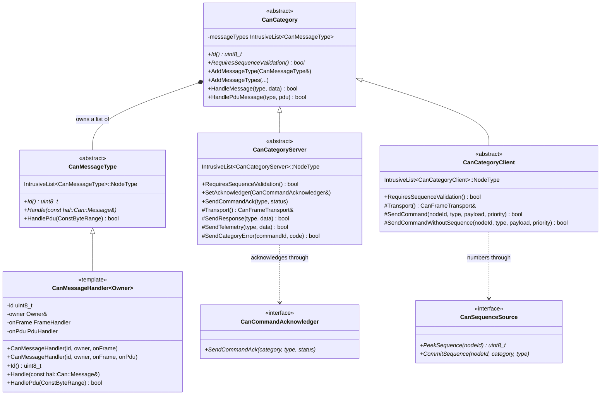
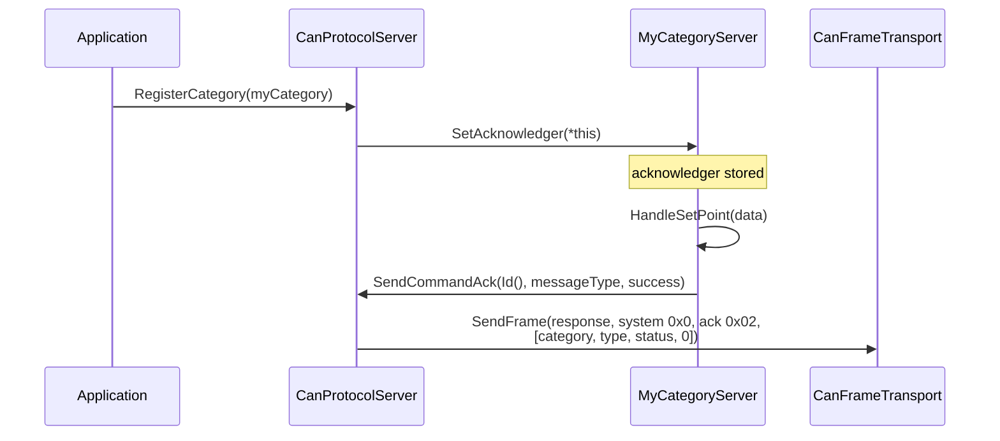
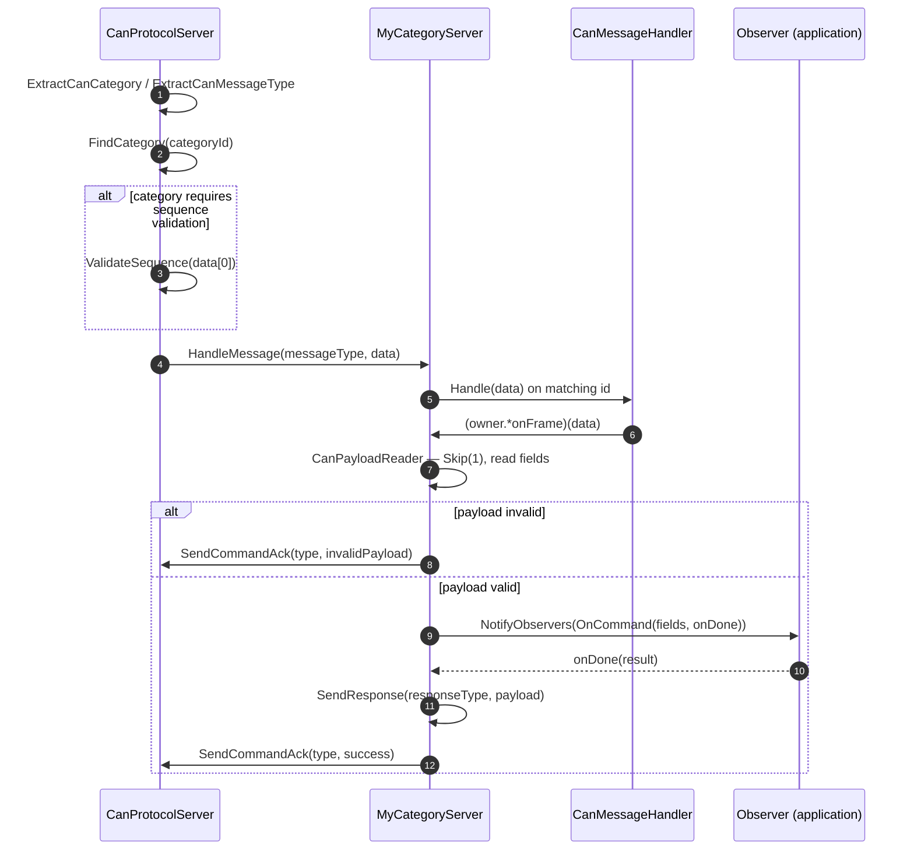

# The Category Layer

A **category** is a functional group of messages that share a 4-bit category ID:
firmware upgrade, motor control, sensor telemetry. It is the unit of extension
in can-lite — new functionality is a new category, never a change to the
dispatcher — and it always comes as a **pair** of classes, one for each side of
the bus.

## 1. The shape of a category



The two leaves of that hierarchy are what a category author actually derives
from:

| | Server side | Client side |
|-|-------------|-------------|
| Base class | `CanCategoryServer` | `CanCategoryClient` |
| Constructor takes | `CanFrameTransport&` | `CanFrameTransport&`, `CanSequenceSource&` |
| Handles message types | `0x00`–`0x7F` (commands) | `0x80`–`0xFF` (responses) |
| Sends | responses, telemetry, category errors, acknowledgements | commands |
| `RequiresSequenceValidation()` default | `true` | `false` |
| Registered on | `CanProtocolServer` | `CanProtocolClient` |

They derive from **different** `IntrusiveList` node types, so registering a
client category on a server is a compile error rather than a runtime surprise —
the type-safety argument of Chapter 3, §4.

## 2. Message types are members, not classes

A message type binds an 8-bit ID to a member function of the owning category.
`CanMessageHandler<Owner>` does that with three stored values — an ID, a
reference and a member pointer:

```cpp
class CanSystemCategoryServer
    : public CanCategoryServer
    , public infra::Subject<CanSystemCategoryServerObserver>
{
    ...
private:
    void HandleHeartbeat(const hal::Can::Message& data);
    void HandleStatusRequest(const hal::Can::Message& data);
    void HandleCategoryListRequest(const hal::Can::Message& data);

    CanMessageHandler<CanSystemCategoryServer> heartbeat{
        canHeartbeatMessageTypeId, *this, &CanSystemCategoryServer::HandleHeartbeat };
    CanMessageHandler<CanSystemCategoryServer> statusRequest{
        canStatusRequestMessageTypeId, *this, &CanSystemCategoryServer::HandleStatusRequest };
    CanMessageHandler<CanSystemCategoryServer> categoryListRequest{
        canCategoryListRequestMessageTypeId, *this, &CanSystemCategoryServer::HandleCategoryListRequest };
};
```

They are registered in the constructor, in one call:

```cpp
CanSystemCategoryServer::CanSystemCategoryServer(CanFrameTransport& transport)
    : CanCategoryServer(transport)
{
    AddMessageTypes(heartbeat, statusRequest, categoryListRequest);
}
```

`AddMessageTypes` is a fold over `AddMessageType`, so any number of handlers can
be registered in one statement:

```cpp
template<class... MessageTypes>
void AddMessageTypes(MessageTypes&... messageTypes)
{
    (AddMessageType(messageTypes), ...);
}
```

This design replaced an earlier one in which each message was a nested class
deriving from `CanMessageType`. The member-pointer form removes roughly a dozen
lines and one type per message, keeps the handler bodies as ordinary private
member functions of the category, and — because the handlers are members of the
category object — needs no allocation and no back-pointer plumbing.

> **Do not** write a nested `CanMessageType` subclass per message. If a handler
> needs state, that state belongs to the category.

## 3. Dispatch inside a category

`CanCategory::HandleMessage` is a linear scan over the registered handlers:

```cpp
bool CanCategory::HandleMessage(uint8_t messageType, const hal::Can::Message& data)
{
    for (auto& handler : messageTypes)
    {
        if (handler.Id() == messageType)
        {
            handler.Handle(data);
            return true;
        }
    }

    return false;
}
```

The `bool` return is the contract with the protocol layer: `false` means "no
handler for this message type in this category", and the server turns that into
an `unknownCommand` acknowledgement (Chapter 7). A handler that runs and fails
internally returns `true` here and reports its own failure through an
acknowledgement status or a category error.

A linear scan is the right structure at this scale: categories have a handful of
message types, the list has no allocation, and the alternative (a sorted array
or a switch) would cost either code generation or the ability to compose
handlers as members. The dispatch cost is a few pointer comparisons per frame,
on a bus that delivers at most a few thousand frames per second.

### The PDU path

`HandlePduMessage` is the ISO-TP counterpart: same lookup, but it forwards a
reassembled byte range rather than a single frame, and it returns the handler's
own result:

```cpp
bool CanCategory::HandlePduMessage(uint8_t messageType, infra::ConstByteRange pdu)
{
    for (auto& handler : messageTypes)
    {
        if (handler.Id() == messageType)
            return handler.HandlePdu(pdu);
    }

    return false;
}
```

A message type opts into multi-frame payloads by passing a fourth constructor
argument:

```cpp
CanMessageHandler<MyCategoryServer> bulkWrite{
    myBulkWriteId, *this, &MyCategoryServer::HandleBulkWriteFrame,
                          &MyCategoryServer::HandleBulkWritePdu };
```

A message type that does not opt in inherits the base implementation, which
declines:

```cpp
virtual bool HandlePdu(infra::ConstByteRange)
{
    return false;
}
```

That is a deliberate choice with a real consequence: sending a multi-frame PDU
to a message type that only implements the single-frame handler produces an
`unknownCommand` acknowledgement, not a truncated read of the first eight bytes.
Chapter 9 covers when a category needs both handlers and when one is enough.

## 4. Sending: the helpers each side gets

### Server side

| Helper | Priority | Identifier's node field | Typical use |
|--------|----------|-------------------------|-------------|
| `SendResponse(type, payload)` | `response` | own node ID | Answer to a command |
| `SendTelemetry(type, payload)` | `telemetry` | own node ID | Periodic or event-driven data |
| `SendCategoryError(commandId, code)` | `response` | own node ID | Category-specific failure, message type `0xFE` |
| `SendCommandAck(type, status)` | `response` | own node ID | Protocol-level acknowledgement, routed through the acknowledger |

Each takes either a raw `hal::Can::Message` or a `CanPayloadWriter`; the
`CanPayloadWriter` overloads refuse to send an invalid payload (Chapter 5, §3).

`SendCategoryError` is the escape hatch for failures that the fixed
`CanAckStatus` enum cannot express. It builds a two-byte payload — the
originating command's message type, then a category-defined error code — and
sends it as message type `0xFE`, which is reserved in *every* category for
exactly this purpose:

```cpp
bool CanCategoryServer::SendCategoryError(uint8_t originatingCommandId, uint8_t categoryErrorCode)
{
    CanPayloadWriter payload;
    payload.WriteUInt8(originatingCommandId).WriteUInt8(categoryErrorCode);

    return SendResponse(canCategoryErrorResponseMessageTypeId, payload);
}
```

### Client side

| Helper | Adds sequence byte | Use when |
|--------|--------------------|----------|
| `SendCommand(nodeId, type[, payload][, priority])` | yes, as `data[0]` | The paired server category validates sequences (the default) |
| `SendCommandWithoutSequence(nodeId, type[, payload][, priority])` | no | The paired server sets `RequiresSequenceValidation()` to `false` |

`SendCommand` is where the sequence byte is prepended, and where the counter is
advanced only if the frame was accepted:

```cpp
bool CanCategoryClient::SendCommand(uint16_t targetNodeId, uint8_t messageType,
    const hal::Can::Message& payload, CanPriority priority)
{
    CanPayloadWriter data;
    data.WriteUInt8(sequenceSource.PeekSequence(targetNodeId)).WriteBytes(infra::MakeRange(payload));

    if (!SendCommandWithoutSequence(targetNodeId, messageType, data, priority))
        return false;

    sequenceSource.CommitSequence(targetNodeId, Id(), messageType);
    return true;
}
```

The peek/commit split is the interesting part. Peeking yields the number that
will be sent; committing advances the counter and starts the acknowledgement
timer. Because the commit happens *after* the send is accepted, a frame rejected
by a full send queue does not burn a sequence number — the next attempt reuses
it and the server sees no gap. Chapter 8 describes the other half of this
contract.

Note also that the sequence byte costs one of the eight payload bytes: a
sequence-validated command carries at most **seven** bytes of category payload.

## 5. Sequence validation is a per-category policy

`RequiresSequenceValidation()` is a virtual on the category, not a global
setting, because the right answer differs by category:

| Category | Server-side value | Why |
|----------|-------------------|-----|
| System (`0x0`) | `false` | Heartbeats and status requests are idempotent, and the client's heartbeat is a broadcast that no single counter could order |
| Firmware upgrade (`0x1`) | `false` | Block index already orders the transfer; a sequence byte would cost one of the seven payload bytes per block |
| Application categories | `true` (default) | Commands with side effects want replay and reordering protection |

Two rules follow, and breaking either produces confusing behaviour rather than a
compile error:

1. **The server's policy and the client's send helper must agree.** A category
   whose server validates sequences must be commanded with `SendCommand`; a
   category whose server does not must use `SendCommandWithoutSequence`. A
   mismatch either strips a payload byte or produces a permanent
   `sequenceError`.
2. **A validated server handler must `Skip(1)` before reading its payload.** The
   protocol layer inspects `data[0]` but does not remove it — the frame is
   passed to the handler intact.

```cpp
void MyCategoryServer::HandleSetPoint(const hal::Can::Message& data)
{
    CanPayloadReader reader{ data };
    reader.Skip(1);                         // sequence byte
    auto setPoint = reader.ReadFixed16(1000);

    if (!reader.Valid())
    {
        SendCommandAck(mySetPointId, CanAckStatus::invalidPayload);
        return;
    }
    ...
}
```

## 6. Acknowledgement wiring

A category cannot build an acknowledgement frame itself: the acknowledgement is
a *system* category message (`0x0`, type `0x02`), and a category is not allowed
to speak for another category. The indirection is `CanCommandAcknowledger`,
implemented by `CanProtocolServer` and handed to each category at registration:



`CanCategoryServer::SendCommandAck` asserts that the acknowledger is present:

```cpp
void CanCategoryServer::SendCommandAck(uint8_t messageType, CanAckStatus status)
{
    really_assert(acknowledger != nullptr);
    acknowledger->SendCommandAck(Id(), messageType, status);
}
```

That assertion fires exactly when a category handles a message before being
registered — which can only happen if the application drives the category
directly in a test. It is a programming error, deliberately loud, and Chapter 15
notes how the unit tests arrange the acknowledger.

## 7. The full command path, category-side



Steps 8–11 are where a category author writes code; everything else is
machinery. The shape never changes: parse, validate, notify, answer.

## 8. Category design checklist

Distilled from the two built-in categories and the demo category used by the
integration tests. Chapter 12 works through each of these with a full example.

| # | Rule |
|---|------|
| 1 | One `*Definitions.hpp` per category, holding the category ID and every message type ID as `constexpr` |
| 2 | Commands in `0x00`–`0x7F`, responses in `0x80`–`0xFF`, `0xFE` left alone for category errors |
| 3 | Server and client are separate classes, in the same directory, sharing the definitions header |
| 4 | Message types are `CanMessageHandler<Owner>` members, registered with one `AddMessageTypes(...)` call in the constructor |
| 5 | Payloads use `CanPayloadReader`/`CanPayloadWriter`; `Valid()` is checked once before acting |
| 6 | Server handlers `Skip(1)` if and only if the category validates sequences |
| 7 | Events reach the application through an `infra::SingleObserver` interface, with a completion `infra::Function` for anything asynchronous |
| 8 | The category links `can_lite.core` only |
| 9 | Both halves are unit-tested with `StrictMock` observers, and the pair is exercised end to end in an integration scenario |
