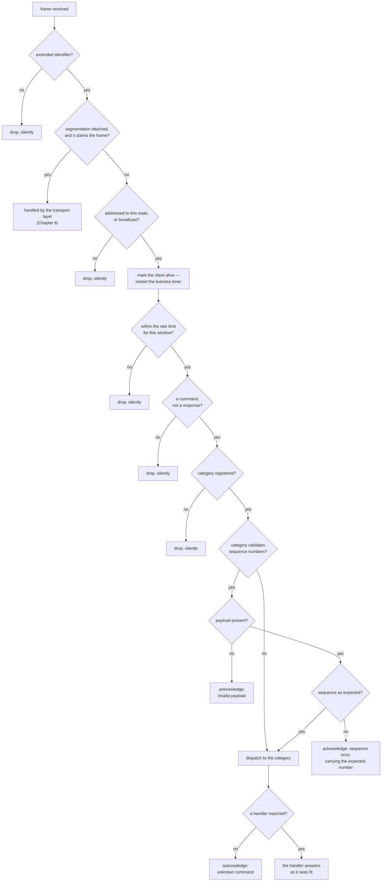
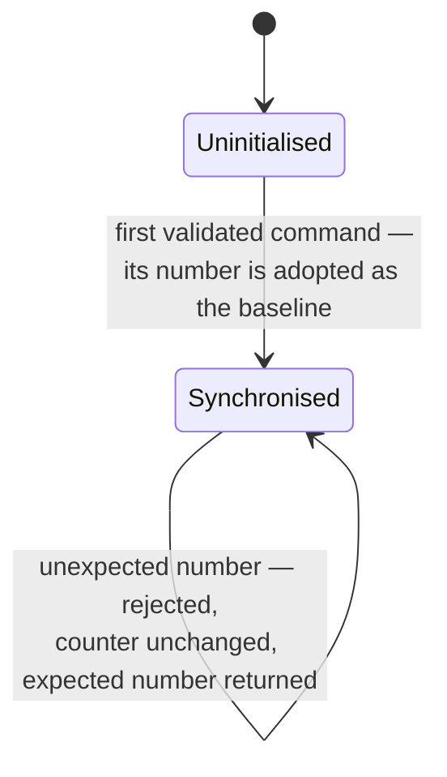
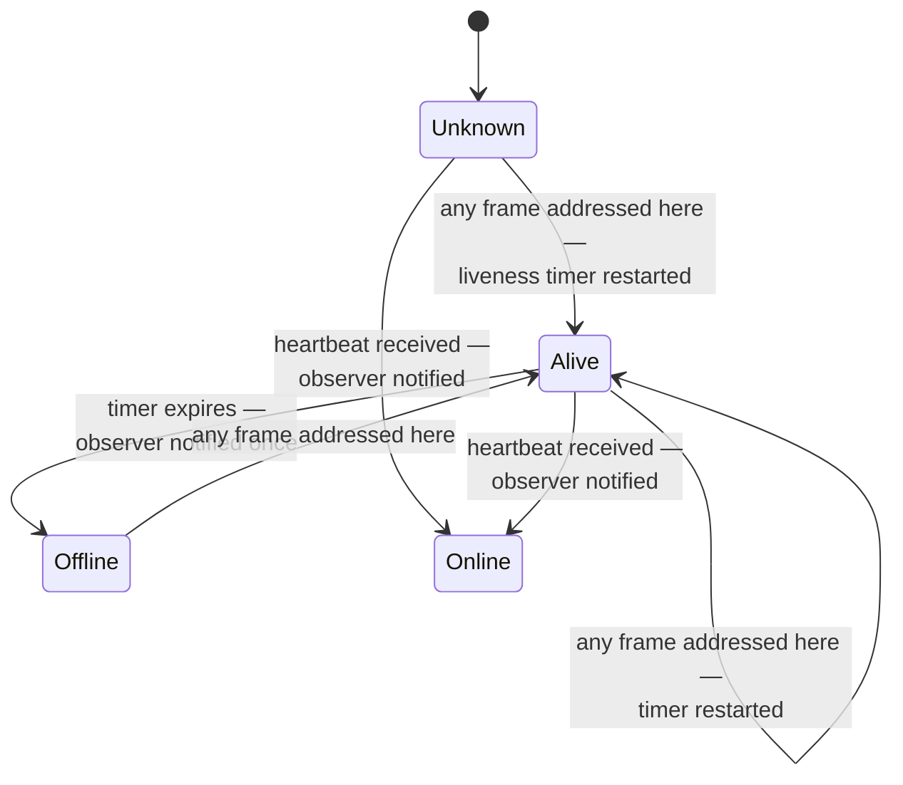
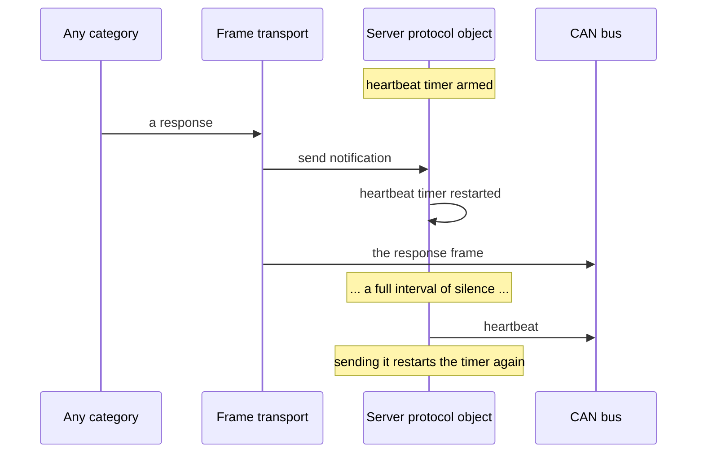

# The Server: Receive Pipeline

The server is the node that answers. Everything it does is a reaction — to a
received frame, or to a timer it allowed to expire. Its responsibilities, its
configuration defaults and the reasoning behind sequence validation, rate
limiting and liveness are in
[Architecture and Design Decisions](../design/architecture.md) §6 and §9, and
the message catalogue is in the
[Protocol Specification](../spec/can-protocol.md) §8. This chapter adds the
view neither has: **the pipeline every received frame runs, and why each gate
answers the way it does**.

## 1. The pipeline

## 2. Why some rejections are silent and others are answered

This is the design decision that a reader of the code most often questions, so
it is worth stating as a rule: **a frame is answered only when it was
unambiguously meant for this server and this category.** If it was, silence
would be a bug. If it was not, an answer would be noise.

| Gate                                     | Answer                             | Reasoning                                                                                |
|------------------------------------------|------------------------------------|------------------------------------------------------------------------------------------|
| Standard identifier                      | Silent                             | The frame belongs to another protocol sharing the bus                                    |
| Another node's address                   | Silent                             | Answering would produce noise proportional to the number of servers on the bus           |
| Over the rate limit                      | Silent                             | An acknowledgement is itself a frame; answering a flood would double it                  |
| A response, not a command                | Silent                             | Servers do not consume responses; answering would create a loop between servers          |
| Unregistered category                    | Silent                             | The frame may be legitimate traffic for another server that does implement that category |
| Empty payload, validated category        | Answered                           | Addressed here, category exists — the client deserves to know                            |
| Sequence mismatch                        | Answered, with the expected number | The client needs that number to resynchronise without a round trip (Chapter 7)           |
| Unknown message type in a known category | Answered                           | The client is talking to a category that does not implement that command                 |

Two ordering choices in the pipeline are equally deliberate:

- **Liveness is marked before the rate limit is applied.** A client that floods
  the bus is still, evidently, alive; marking liveness afterwards would make a
  flooding client appear to vanish.
- **The rate limit is applied before the category is looked up.** What is being
  limited is the cost of *processing* frames, and that cost is paid before the
  category is known.

One consequence of the rate limiter is worth designing around rather than
discovering: it counts within a fixed window that resets on a timer, so a burst
straddling a reset can deliver up to twice the configured number in quick
succession. Chapter 10, §7.2 walks through it, and Chapter 11 turns it into a
sizing rule.

## 3. Registration, and why it can fail

A category is admitted only if the server has a free slot and no other category
already claims its identity — and the answer is a value the application must
check, not an assertion.

That choice is deliberate: the set of categories a product registers can be
configuration-dependent, and a node that finds at start-up that it cannot
register everything may prefer to run degraded rather than not at all.

The cost of ignoring the answer is that an unregistered category is
**indistinguishable on the wire from a category that does not exist**: its
commands are dropped silently, by the gate above, and its client waits for
responses that never come. This is entry 3.11 in Chapter 10, and it is the most
common integration mistake.

The server's own system category occupies one slot from construction, which is
why an application has one fewer than the total available.

## 4. Sequence validation as a state machine

Four properties define the behaviour, and each is a deliberate simplification:

- **The first command sets the baseline.** A client that restarts from zero does
  not need the server to restart too — but only until the server has seen its
  first command.
- **Rejection is idempotent.** A rejected command does not advance the counter,
  so ten misordered commands produce ten identical answers rather than drift.
- **The counter wraps naturally** at the end of its range.
- **One counter is shared by every validated category.** Interleaving commands
  across two categories is therefore fine — they share one ordering — but two
  *clients* commanding one server interleave their counters and reject each
  other's traffic. That is the one-client-per-server rule (REQ-CAN-006.1)
  showing through, and it is catalogued in Chapter 10, §4.6.

## 5. Liveness, in both directions

Two distinct signals are in play, and conflating them is the usual confusion:

- **Any correctly addressed frame** proves the client is present and restarts
  the timer. This matters because the client's heartbeat is itself deferred by
  its own outgoing traffic: a client that commands continuously may not send a
  dedicated heartbeat for a long time, and must not be declared offline for
  being busy.
- **Only a heartbeat** raises the "online" notification, because that is the
  specific, meaningful announcement.

The offline notification is raised at most once per outage rather than once per
timer expiry.

## 6. The heartbeat is a silence guard

The heartbeat timer is restarted after **every** outgoing frame, whatever
produced it — which is possible only because the whole node shares one frame
queue (Chapter 2). A heartbeat is therefore emitted only after a full interval
of complete silence from this node.

On a busy bus this reduces heartbeat traffic to nothing, because responses and
telemetry already prove the node is alive. On an idle bus it produces exactly
one heartbeat per interval. The same mechanism runs on the client, with the
difference described in Chapter 7.

## 7. Attaching segmentation

Attaching the transport changes the pipeline in exactly one place — the second
gate — and nothing else about the server. A reassembled payload runs the same
gates in the same order, ending in the segmented dispatch path rather than the
single-frame one, which is what makes segmentation invisible to a category.

The server also arranges for a transfer that fails part-way to release its
channel, so a failed transfer frees its slot instead of holding it forever.
Chapter 8 covers when transfers fail and what the peer observes.
