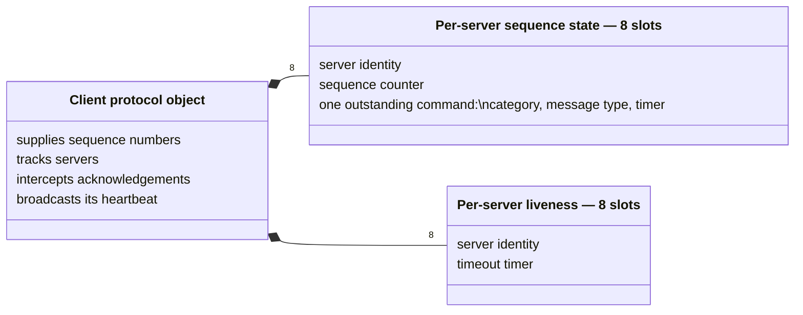
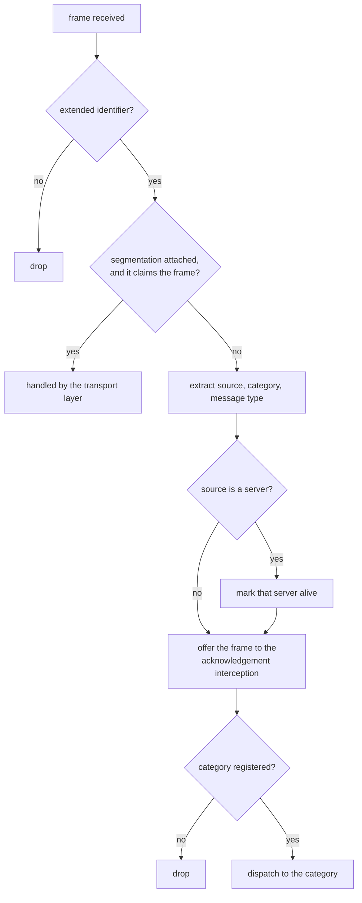
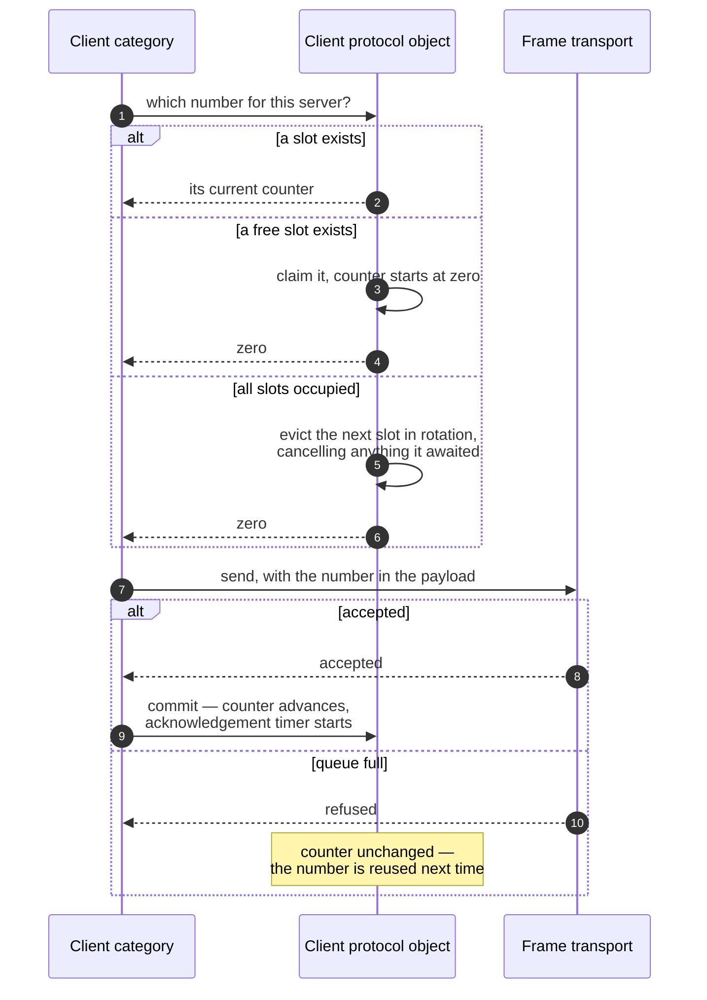
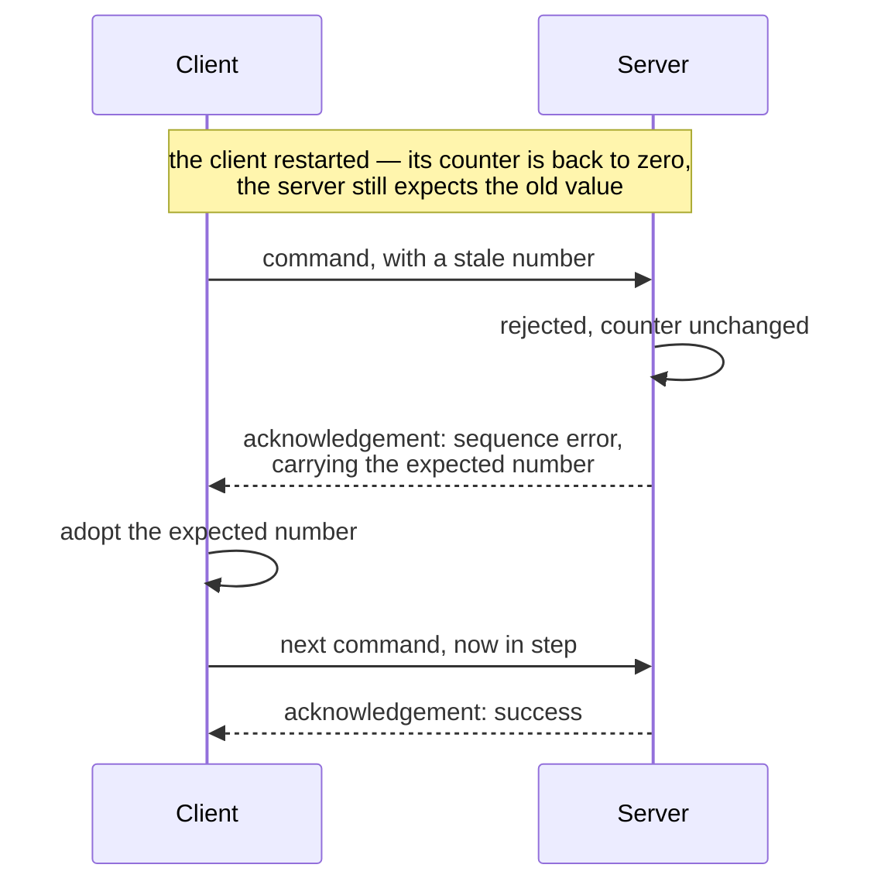
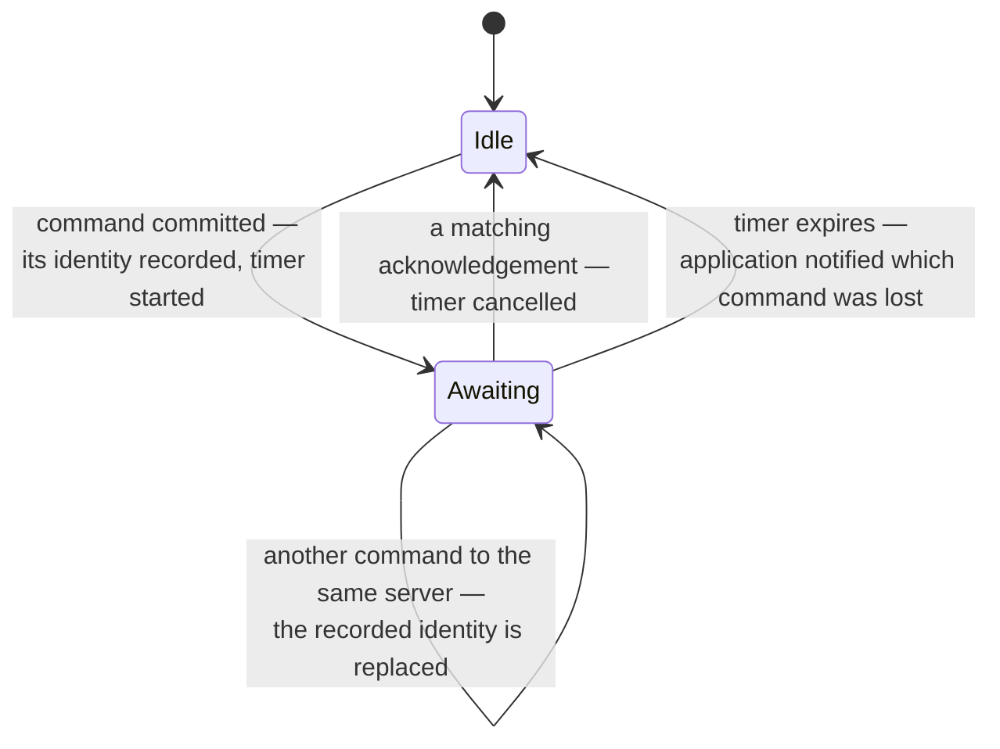
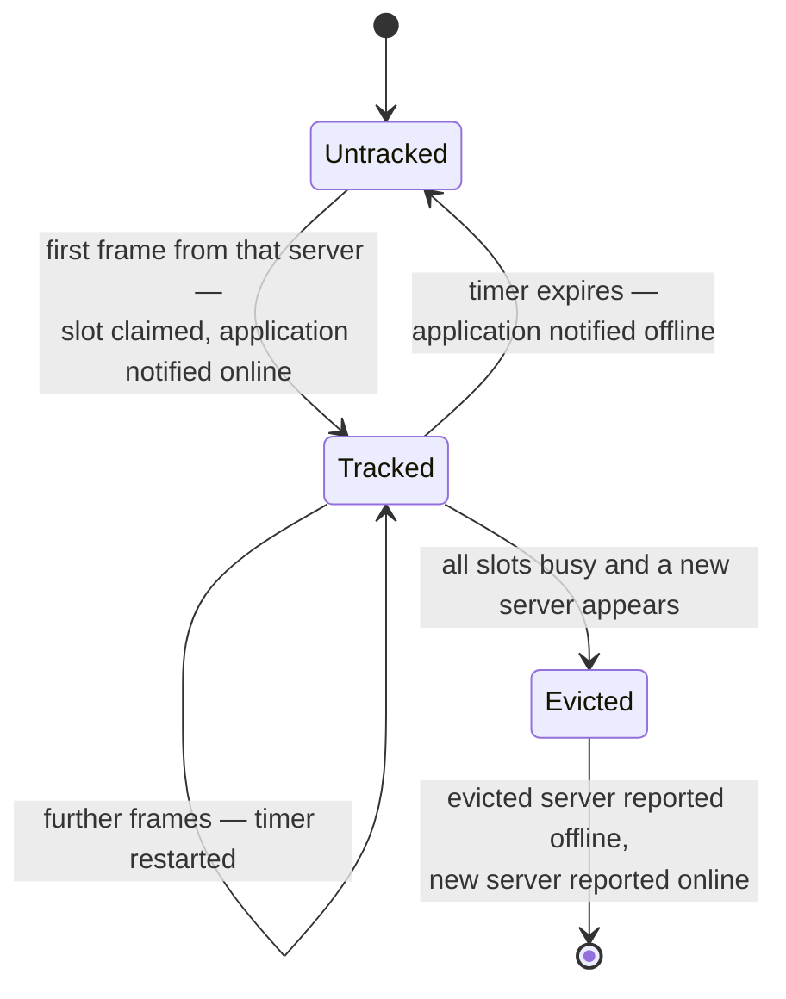

# The Client: Per-Server State

The client is the node that asks. It has no address of its own, it addresses
servers by node identity, and it keeps a small amount of state for each server
it deals with. What that state is *for* — sequence tracking, resynchronisation,
liveness, acknowledgement timeout — is described in
[Architecture and Design Decisions](../design/architecture.md) §9.1 to §9.4.
This chapter shows how it **behaves**: three state machines and the pipeline
that feeds them.

## 1. Two independent tables

The two tables are **separate and independently populated**, and that is a
design decision rather than an accident of implementation. Sequence state is
created by *sending*; liveness state is created by *receiving*. A server that is
commanded but never answers occupies a sequence slot and no liveness slot; a
server that only emits telemetry occupies a liveness slot and no sequence slot.
Merging them would mean allocating sequence state for a server that has only
been heard from, or tracking liveness for one that has never spoken.

The client's own address is never used as a source: every command is addressed
to its target, and the one broadcast the client sends — its heartbeat — is
broadcast because the client has no address a server could be expected to know.

## 2. The receive pipeline

Markedly shorter than the server's, and every difference is deliberate.

| Difference from the server | Reason |
|----------------------------|--------|
| No address filter | A client consumes frames from every server; the address on an incoming frame is the *source*, not a destination to match |
| No rate limiting | The client issues the traffic; limiting what it may receive would drop its own answers |
| No command/response check | A client legitimately observes broadcast heartbeats as well as responses |
| Acknowledgements are intercepted before dispatch | The interception needs the **source identity**, which category dispatch does not carry down |
| Nothing is ever acknowledged | Clients do not acknowledge |

The interception is the structurally interesting part. It runs on every frame,
recognises acknowledgements itself, and ignores any that is malformed or claims
an impossible source — cancelling no timer and changing no counter, so the
command's own timeout fires normally, which is the right outcome for a frame
that cannot be trusted.

The frame still continues to category dispatch afterwards, where the system
category recognises it and does nothing. That is layering rather than
redundancy: the category's registered message types stay an accurate description
of what it understands, while the protocol object does the part that needs the
source identity.

## 3. Sequence numbers: peek, then commit

Splitting the operation in two is what makes a refused send harmless. Were the
counter advanced when the number was taken, a command refused by a full queue
would leave a permanent gap, and every later command would be rejected until a
resynchronisation cleaned it up.

Committing for a server that was never asked for a number is a programming
error, and fails loudly — reachable only by bypassing the category's own send
path.

## 4. Resynchronisation

A rejected command comes back with the number the server expected, which turns
what would be a deadlock into a single lost command.

Three properties make this robust:

- **The server is never asked to reset.** It stays authoritative and the client
  adapts, which keeps the recovery one-sided and therefore race-free.
- **The rejected command is not retried automatically.** Replaying a command
  whose side effects the application may not want repeated is not a decision the
  protocol layer is entitled to make. The application learns of it from the
  missing response, or from the acknowledgement timeout.
- **Nothing is reported.** From the application's point of view nothing has gone
  wrong that it can act on.

## 5. One outstanding command per server

The last transition is the one to know about. A second command to the same
server **replaces** what is being waited for: the first command's
acknowledgement, arriving afterwards, no longer matches and does not cancel the
timer, which now belongs to the second command. In ordinary request/response use
this never arises, and the alternative — a queue of outstanding commands per
server — costs memory a one-at-a-time protocol does not need. Its sharper edge,
where two consecutive commands share an identity, is entry 5.4 in Chapter 10.

Nothing is ever retried automatically. The notification names the command that
was lost so the application can retry it, escalate, or mark the server suspect.

## 6. Tracking servers

Any frame from a server counts as proof of life — responses, telemetry and
heartbeats alike — matching the server's rule and for the same reason: a busy
peer defers its heartbeat.

Eviction is explicit rather than "ignore the newcomer", and it reports **both**
transitions, so the application's picture stays consistent: at most eight
servers online, every change reported. On a bus with more active servers than
slots, the observer sees churn — which is the honest signal that the client is
under-provisioned. The slot count is a compile-time property of the library, so
raising it is a library change rather than a configuration choice.

## 7. Discovery, and its two limits

Asking a server what it implements is the one client operation whose answer the
application must interpret, which is why it has a first-class entry point with a
completion, while the rest of the system conversation is bookkeeping the client
does on the application's behalf.

Two limits follow from there being a single pending completion, and both are
simplicity rather than oversight:

- **One discovery at a time.** A second request before the first answer
  overwrites the pending completion, and the first caller is never called.
- **The completion does not name the responding server.** An answer from a
  different server than the one asked will satisfy it.

Discovery also has **no timeout**: if the server never answers, the completion
stays pending. An application that needs a deadline arms its own timer. All
three are catalogued in Chapter 10, §5.
