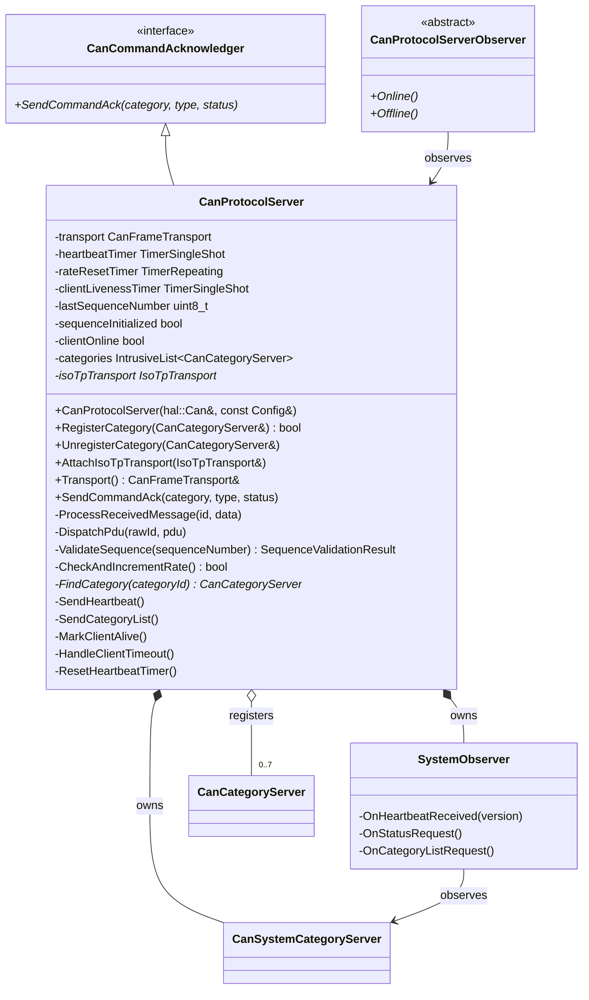
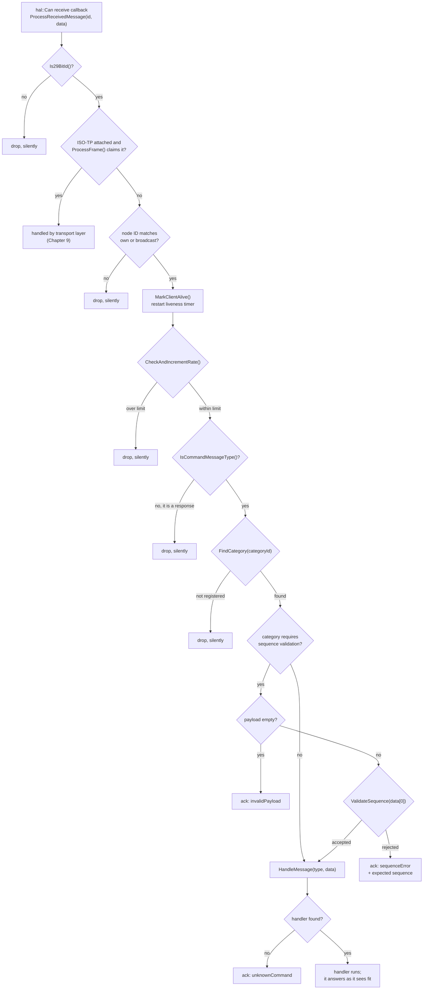
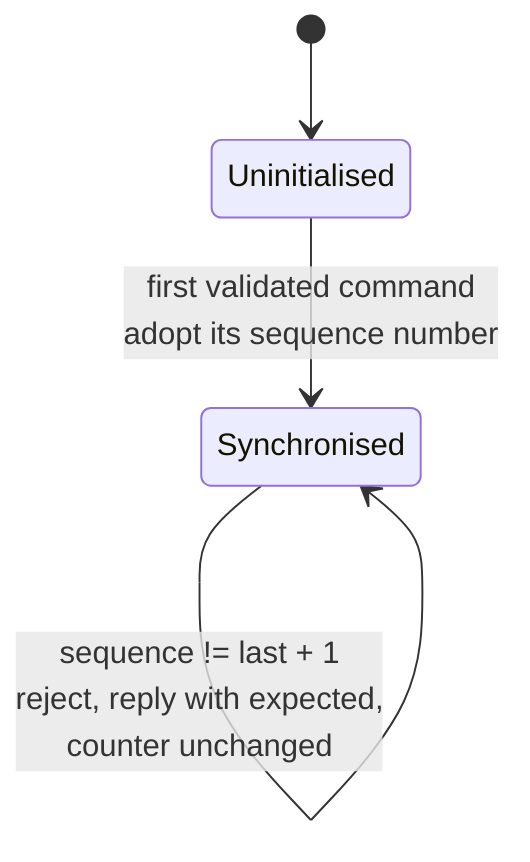
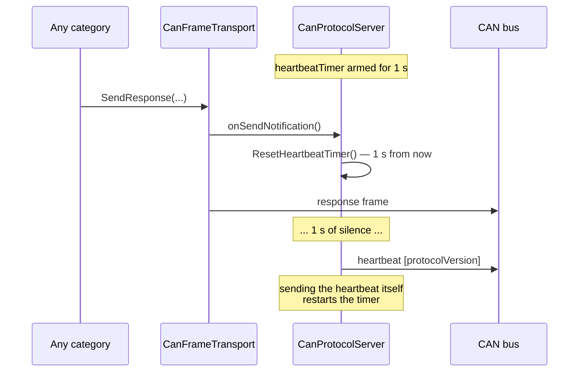
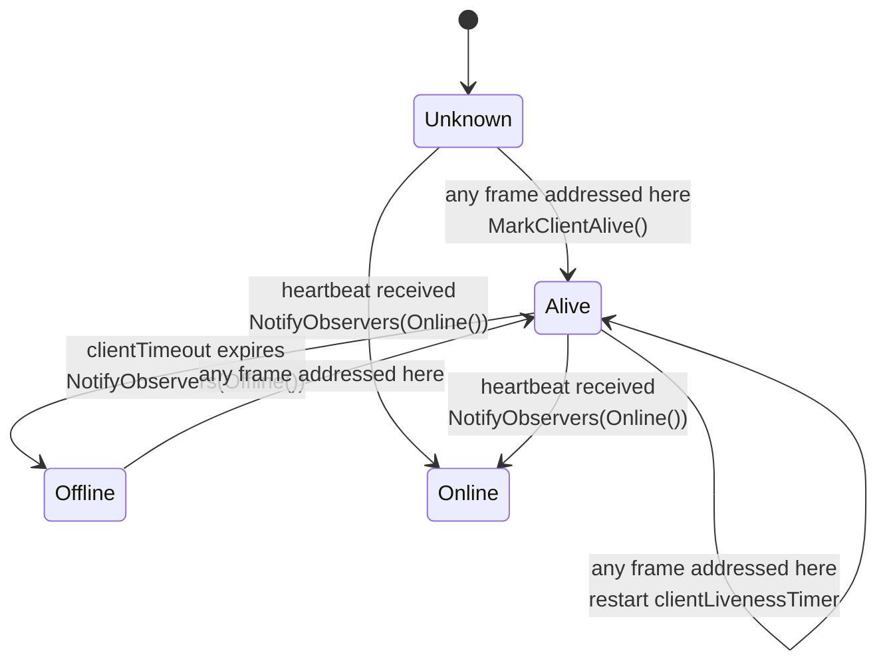

# The Protocol Layer: Server

`CanProtocolServer` is the node that answers. It owns the frame transport, the
registered categories, the rate limiter, the sequence counter, the heartbeat and
the client-liveness watchdog. Everything it does is a reaction: to a received
frame, or to a timer that has been allowed to expire.

## 1. Configuration and interface

```cpp
struct Config
{
    uint16_t nodeId{ 0 };
    uint16_t maxMessagesPerSecond{ 500 };
    infra::Duration heartbeatInterval = std::chrono::seconds(1);
    infra::Duration clientTimeout = std::chrono::seconds(3);
};

CanProtocolServer(hal::Can& can, const Config& config);
```

| Field | Default | Effect |
|-------|---------|--------|
| `nodeId` | 0 (invalid) | The server's 12-bit address; `0x000` is rejected with `really_assert` because it is the broadcast address |
| `maxMessagesPerSecond` | 500 | Frames accepted per one-second window; the excess is dropped silently |
| `heartbeatInterval` | 1 s | Quiet period after which a heartbeat is emitted |
| `clientTimeout` | 3 s | Silence after which the client is declared offline |



The application's entire view of the server is four things: the constructor,
`RegisterCategory`, `Transport()`, and the `Online()`/`Offline()` observer. All
system-category plumbing — heartbeat responses, category discovery, alive
notification — is internal, wired through a private `SystemObserver` that
observes the server's own `CanSystemCategoryServer` instance.

## 2. What the constructor wires up

```cpp
CanProtocolServer::CanProtocolServer(hal::Can& can, const Config& config)
    : config(config)
    , transport(can, config.nodeId)
    , rateResetTimer(std::chrono::seconds(1), [this]() { ResetRateCounter(); })
    , systemCategory(transport)
    , systemObserver(systemCategory, *this)
{
    really_assert(config.nodeId != canBroadcastNodeId);

    systemCategory.SetAcknowledger(*this);
    categories.push_back(systemCategory);

    can.ReceiveData([this](hal::Can::Id id, const hal::Can::Message& data)
        { ProcessReceivedMessage(id, data); });

    transport.SetOnSendNotification([this]() { ResetHeartbeatTimer(); });

    ResetHeartbeatTimer();
}
```

Five commitments are made here, and each has a consequence elsewhere:

1. **The node ID may not be the broadcast address.** A server that answered on
   `0x000` would answer for everyone.
2. **The system category is registered first**, so it occupies one of the eight
   category slots — an application can register seven more.
3. **The server claims `hal::Can::ReceiveData`.** There is one receive callback
   per bus interface, and the protocol object owns it.
4. **The server claims the transport's send notification**, which is what makes
   the heartbeat a silence guard rather than a metronome (§7). The
   `really_assert` inside `SetOnSendNotification` means an application cannot
   also claim it.
5. **The rate-limit window starts immediately** and runs for the object's whole
   lifetime — the only `TimerRepeating` in the library.

## 3. The receive pipeline

Every frame that arrives runs the same gauntlet. The order matters, and each
gate has a different failure behaviour — some silent, some acknowledged.



### Why some rejections are silent and others are acknowledged

| Gate | Behaviour | Reasoning |
|------|-----------|-----------|
| 11-bit identifier | Silent | The frame belongs to another protocol on the same bus |
| Wrong node ID | Silent | The frame is someone else's; answering would create bus noise proportional to the number of servers |
| Rate limit exceeded | Silent | Acknowledging a flood would double it — the acknowledgement is itself a frame |
| Response message type | Silent | Servers do not consume responses; a server that answered would create a loop |
| Unregistered category | Silent | The frame is legitimate traffic for another server that *does* implement that category |
| Empty payload on a validated category | `invalidPayload` | The frame was addressed here and the category exists — the client deserves to know |
| Sequence mismatch | `sequenceError` + expected value | The client needs the expected number to resynchronise (Chapter 8) |
| Unknown message type in a known category | `unknownCommand` | The client is talking to a category that does not implement that command |

The dividing line is whether the frame was **unambiguously addressed to this
server and this category**. If yes, silence would be a bug; if no, an answer
would be noise.

### Two ordering choices worth noticing

**Liveness is marked before the rate limit is checked.** A client that floods
the bus is still, evidently, alive. Marking liveness after the rate check would
make a flooding client appear to disappear.

**The rate limit is checked before category lookup.** Traffic for categories
this server does not implement still counts toward its budget, because the cost
being limited is the cost of *processing* frames, which is paid before the
category is known.

## 4. Registering categories

```cpp
bool CanProtocolServer::RegisterCategory(CanCategoryServer& category)
{
    if (categories.size() >= canMaxRegisteredCategories)
        return false;

    for (auto& existing : categories)
        if (existing.Id() == category.Id())
            return false;

    category.SetAcknowledger(*this);
    categories.push_back(category);
    return true;
}
```

| Condition | Result |
|-----------|--------|
| Eight categories already registered (system counts) | `false`, nothing changes |
| A category with the same ID is registered | `false`, nothing changes — including an attempt to re-register the *same* object |
| Otherwise | Acknowledger wired, category listed, `true` |

`UnregisterCategory()` removes the entry so that a category can be destroyed
before the server. It does not clear the acknowledger pointer the category
holds — which is harmless while the server outlives the category, and is the
documented usage.

Registration failure is a `bool` an application must actually check. A silently
unregistered category behaves exactly like a category that does not exist:
its commands are dropped with no acknowledgement, because to the receive
pipeline it is simply an unregistered category ID.

## 5. Sequence validation

The server keeps **one** counter, shared by every category that requires
validation:

```cpp
CanProtocolServer::SequenceValidationResult CanProtocolServer::ValidateSequence(uint8_t sequenceNumber)
{
    if (!sequenceInitialized)
    {
        sequenceInitialized = true;
        lastSequenceNumber = sequenceNumber;
        return { true, sequenceNumber };
    }

    auto expected = static_cast<uint8_t>(lastSequenceNumber + 1);
    if (sequenceNumber != expected)
        return { false, expected };

    lastSequenceNumber = sequenceNumber;
    return { true, sequenceNumber };
}
```



Four properties define the behaviour:

- **The first command sets the baseline.** The server adopts whatever number
  arrives first, so a client that restarts at 0 does not need the server to
  restart too — but only until the server has seen its first command.
- **A rejected command does not advance the counter.** Rejection is
  idempotent: ten misordered commands produce ten `sequenceError`
  acknowledgements, all naming the same expected number.
- **The counter wraps naturally.** `uint8_t` arithmetic takes 255 to 0.
- **The counter is shared across categories.** Interleaving commands to two
  sequence-validated categories on the same server is fine — they share one
  ordering — but two *clients* commanding the same server interleave their
  counters and each other's commands are rejected. That is the
  one-client-per-server rule (REQ-CAN-006.1) showing through, and it is
  catalogued in Chapter 13.

Chapter 8 covers the other half: how the client uses the `expected` value in the
acknowledgement to resynchronise without a round trip.

## 6. Acknowledgement frames

The acknowledgement is a system-category message with a fixed four-byte payload:

| Byte | Field | Meaning |
|------|-------|---------|
| 0 | category | The category of the command being acknowledged |
| 1 | messageType | The command's message type |
| 2 | status | `CanAckStatus` |
| 3 | expectedSequence | The sequence number the server expected; `0` unless the status is `sequenceError` |

```cpp
void CanProtocolServer::SendCommandAck(uint8_t category, uint8_t commandType,
    CanAckStatus status, uint8_t expectedSequence)
{
    hal::Can::Message msg;
    msg.push_back(category);
    msg.push_back(commandType);
    msg.push_back(static_cast<uint8_t>(status));
    msg.push_back(expectedSequence);

    transport.SendFrame(CanPriority::response, canSystemCategoryId,
        canCommandAckMessageTypeId, msg, [](bool) {});
}
```

| `CanAckStatus` | Value | Sent by |
|----------------|-------|---------|
| `success` | 0 | A category handler that completed |
| `unknownCommand` | 1 | The receive pipeline, when no handler matched |
| `invalidPayload` | 2 | The pipeline (empty payload) or a handler (`!reader.Valid()`) |
| `invalidState` | 3 | A handler refusing a command in the current state |
| `sequenceError` | 4 | The pipeline, with the expected sequence in byte 3 |
| `rateLimited` | 5 | Reserved — the pipeline drops silently rather than sending this |
| `notImplemented` | 6 | A handler for a command it recognises but does not support |
| `categoryError` | 7 | A handler whose detail is carried in a separate `0xFE` frame |

Note that `rateLimited` exists in the enum but is never emitted: the server
drops over-limit traffic silently, for the reason given in §3. It remains in the
enum because it is part of the wire specification and an application-level
gateway may have reason to send it.

Acknowledgements are sent with a discarding completion (`[](bool) {}`): if the
send queue is full, the acknowledgement is lost and the client's
acknowledgement-timeout will fire instead (Chapter 8). This is intentional —
retrying the acknowledgement would deepen a queue that is already saturated.

## 7. Heartbeat: a silence guard, not a metronome

```cpp
void CanProtocolServer::ResetHeartbeatTimer()
{
    heartbeatTimer.Start(config.heartbeatInterval, [this]() { SendHeartbeat(); });
}
```

The timer is a `TimerSingleShot`, restarted from `transport`'s send
notification — that is, after **every** outgoing frame, whatever sent it. The
heartbeat therefore fires only after `heartbeatInterval` of complete silence
from this node.



On a busy bus this reduces heartbeat traffic to zero, because responses and
telemetry already prove the node is alive. On an idle bus it produces exactly
one heartbeat per interval. The heartbeat payload is a single byte: the protocol
version (`canProtocolVersion` = 1).

## 8. Client liveness

The mirror image of the client's server tracking, and simpler because a server
has exactly one client:



Two distinct signals are in play, and conflating them is the usual source of
confusion:

- **Any correctly addressed frame** restarts the liveness timer. This mirrors
  the client's rule (Chapter 8) and matters because the client's heartbeat is
  itself deferred by its own outgoing traffic: a client that commands
  continuously may not emit a heartbeat for a long time, and must not be
  declared offline for being busy.
- **Only a received heartbeat** notifies `Online()`. It is the specific,
  meaningful "I am here" signal, delivered through the system category's
  observer.

`HandleClientTimeout()` checks `clientOnline` before notifying, so `Offline()`
is emitted at most once per outage rather than on every timer expiry.

## 9. Category discovery

A client asks a server what it implements with a `Category List Request`
(system category, type `0x04`); the server answers with the IDs of its
registered categories:

```cpp
void CanProtocolServer::SendCategoryList()
{
    hal::Can::Message msg;

    for (auto& category : categories)
        if (!msg.full())
            msg.push_back(category.Id());

    transport.SendFrame(CanPriority::response, canSystemCategoryId,
        canCategoryListResponseMessageTypeId, msg, [](bool) {});
}
```

The list is in registration order, and the system category is always first
because the constructor registers it first. Eight categories is also the frame's
capacity, so the `msg.full()` guard never actually truncates today — but it is
what keeps the code correct if `canMaxRegisteredCategories` is ever raised, in
which case the response would need ISO-TP or a continuation message.

## 10. ISO-TP integration

Attaching the transport is one call, and it changes the receive pipeline in
exactly one place — the second gate in §3:

```cpp
void CanProtocolServer::AttachIsoTpTransport(IsoTpTransport& isoTp)
{
    isoTpTransport = &isoTp;
    isoTp.SetOnPduReceived([this](uint32_t rawId, infra::ConstByteRange pdu)
        { DispatchPdu(rawId, pdu); });
    isoTp.SetOnAbort([this](uint32_t dataId, iso_tp::AbortReason)
        { isoTpTransport->ReleaseChannel(dataId); });
}
```

`DispatchPdu` repeats the pipeline for a reassembled PDU, with three
differences: there is no identifier-width check (the transport only ever
reports 29-bit identifiers it was configured with), the sequence byte is read
from `pdu[0]` rather than `data[0]`, and dispatch ends in `HandlePduMessage`
rather than `HandleMessage`. Everything else — node filter, liveness, rate
limit, command check, category lookup, acknowledgement statuses — is identical,
which is what makes ISO-TP transparent to a category.

The abort handler releases the channel, so a transfer that fails part-way frees
its slot for the next one instead of leaving a channel permanently occupied.
Chapter 9 details when aborts happen and what the peer observes.

## 11. Design notes

**Why one sequence counter rather than one per client?** Because the topology is
one client per server. A per-client table would cost memory and would legitimise
a topology the rest of the protocol does not support — two clients commanding
one server have no way to coordinate side effects even with perfect sequence
tracking.

**Why is the server's own node ID in the identifier of its responses?** Because
the client needs to know which server answered, and the client has no address of
its own to be the destination. The node field therefore reads as "destination"
on commands and "source" on responses (Chapter 5, §2).

**Why does the receive pipeline check the command/response split at all?** Two
servers on the same bus see each other's responses. Without the check, a
response whose message type happened to collide with a command ID would be
dispatched as a command.

**Why is registration failure a `bool` rather than an assertion?** Because the
number of categories a product registers can be configuration-dependent, and a
node that discovers at start-up that it cannot register everything may prefer to
run degraded rather than not at all. Chapter 13 lists what "degraded" looks
like on the wire.
