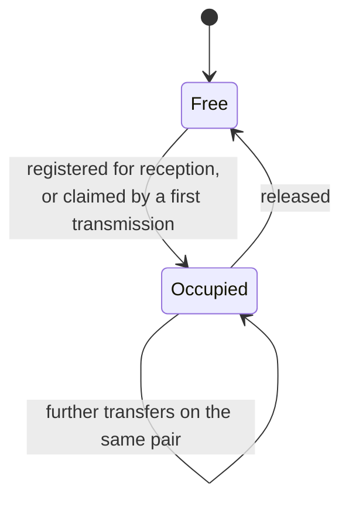
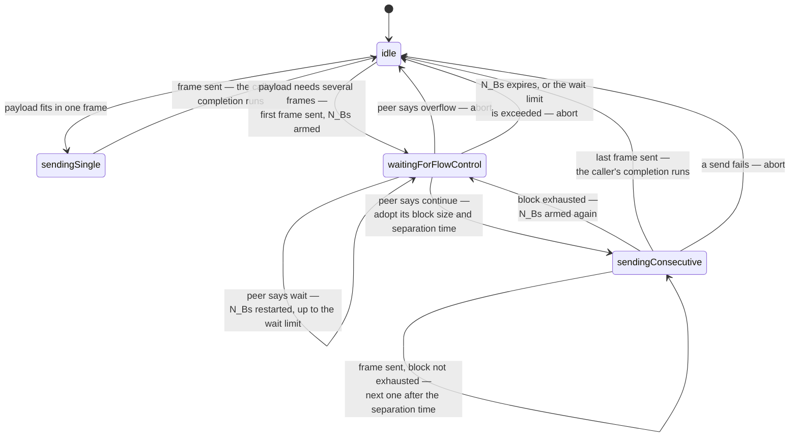
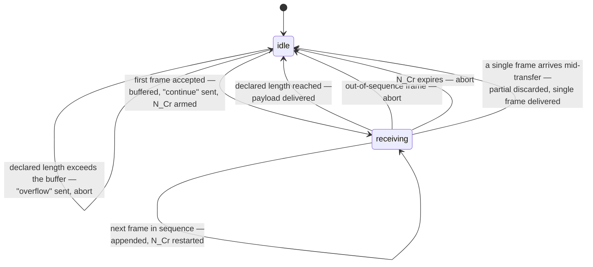
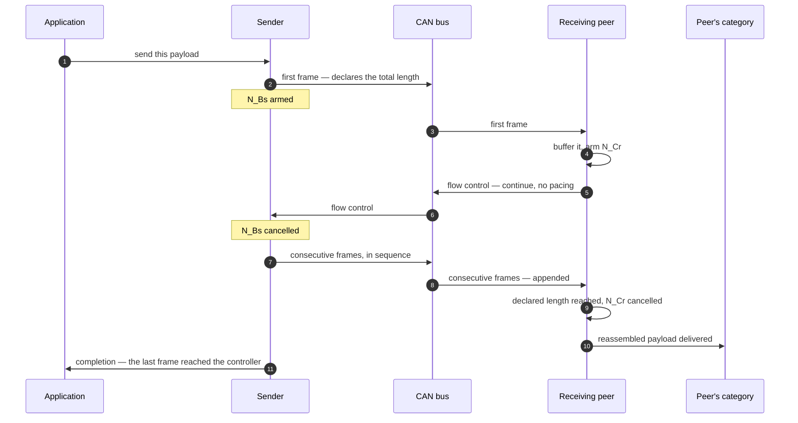

# Segmentation: The ISO-TP State Machines

A classic CAN frame carries eight bytes; a firmware block or a calibration table
does not fit. The transport layer solves that with ISO 15765-2 segmentation. The
frame formats, the flow-control fields and the timing parameters are specified
in the [Protocol Specification](../spec/can-protocol.md) §4.1, and the class
inventory and storage pattern are in
[Architecture and Design Decisions](../design/architecture.md) §10.1. This
chapter covers what neither has: **the two state machines, and the failure paths
through them**.

The layer is optional and orthogonal. A node that attaches it gains multi-frame
payloads for the message types that opt in; every other message type continues
to travel as a single frame, unaware the transport exists.

## 1. Channels

A channel is a pair of identifiers: one carrying data in one direction, one
carrying flow control back. Each channel owns one sender and one receiver, which
are independent — a channel can be transmitting one payload while reassembling
another, because the two use different identifiers.

Two properties of that lifecycle matter in integration:

- **Channels are claimed, not pooled per transfer.** A channel stays occupied
  after a transfer completes, ready for the next one on the same identifier
  pair, until it is explicitly released. This is why the protocol layer releases
  a channel when a transfer aborts (Chapter 6, §7) — otherwise a failed transfer
  would hold a slot forever.
- **Identifier pairs may not overlap.** Registration is refused if either
  identifier already belongs to another channel, because overlapping pairs would
  make routing ambiguous.

Routing a received frame is a decision the channel makes and reports upward: the
protocol layer offers every frame to the transport and continues its own
pipeline only if the transport declines. That single boolean is the whole
mechanism by which segmentation is transparent.

## 2. The sender

The sender refuses a transfer up front rather than failing part-way: an empty
payload, one beyond the protocol's length field, one beyond the configured
buffer, or a second transfer while the channel's sender is busy are all refused
at the point of asking. What is accepted is then **copied into the channel's own
buffer**, so the caller's buffer may be reused immediately — which matters when
the source is a stack temporary or a flash read buffer.

**Pacing is the peer's to choose.** can-lite's own receiver never asks a peer to
slow down or to pause between blocks, because reassembly is a copy into a
preallocated buffer and needs no pacing. Its sender nevertheless implements the
general case — honouring whatever block size and separation time a peer asks
for — so it interoperates with conventional stacks that do pace transfers. A
pacing request it cannot parse is treated as the slowest legal value, which is
the standard's conservative reading: an unparseable request must not be read as
"go as fast as you like".

### Aborts, and the completion that does not run

> **A transfer's completion runs on success only.** A transfer that aborts
> reports through the abort path instead. An application that handles only the
> completion will wait forever — which is why the protocol layer subscribes to
> the abort path and releases the channel there.

The abort reasons and what raises each are listed in the glossary. One deserves
a note: a failure to hand a frame to the bus reports the same reason as an
unparseable frame, because the sender genuinely cannot distinguish a full queue
from a bus problem. The reason code is diagnostic; the outcome — abort, release,
tell the application — is what matters.

## 3. The receiver

The validation it performs, in order, is where most of the interesting failure
behaviour lives, and Chapter 10, §8 tabulates every case. Two asymmetries are
worth understanding here rather than there:

- **An oversized first frame is answered; an oversized single frame is not.** A
  peer that sent a first frame is *waiting* for flow control and must be told to
  stop. A peer that sent a single frame has already finished and has nothing to
  stop.
- **An unsolicited continuation frame is ignored, not treated as an error.**
  Silence is the correct response to a frame that belongs to a transfer this
  receiver is not part of.

A single frame arriving mid-reassembly discards the partial transfer and is
delivered as a complete payload — the pragmatic reading, since the peer has
evidently moved on.

## 4. A multi-frame transfer, end to end

The two completions are independent, and neither is an end-to-end
acknowledgement: the sender's says the last frame reached its own controller,
the receiver's says the payload is complete. Confirming that the *peer* acted on
it is the job of the category's own protocol, one layer up.

## 5. Wiring segmentation into a category

Three steps, none of which touches the protocol core:

1. **Attach the transport** to the server or the client, choosing the payload
   size and channel count — this is the sizing decision of Chapter 11.
2. **Register the receive channel** for the identifier pair the category's
   message will use.
3. **Give that message type a segmented handler**, alongside its single-frame
   one.

Because a reassembled payload runs the same pipeline as a single frame, a
validated category still finds its sequence number in the first byte and still
skips it. The only difference a category sees is that the payload may be longer
than eight bytes.

## 6. Deliberate omissions

Beyond the parameters in the specification, four things are simply not
implemented, and each has a cost worth knowing before choosing this transport:

| Omission | Cost |
|----------|------|
| Frames are never padded to full length | A peer that requires 8-byte frames will not interoperate; short frames keep a loaded bus shorter |
| The receiver never requests pacing | A receiver that needed it would have to become a configurable policy; nothing in the library does |
| Only normal addressing | No address extension, no mixed addressing |
| Classic CAN only | The length field and frame sizes assume 8-byte frames |

The first two are the pair worth revisiting first if can-lite ever has to talk
to a third-party stack, because they are the ones a conventional diagnostic
tester is most likely to insist on.
