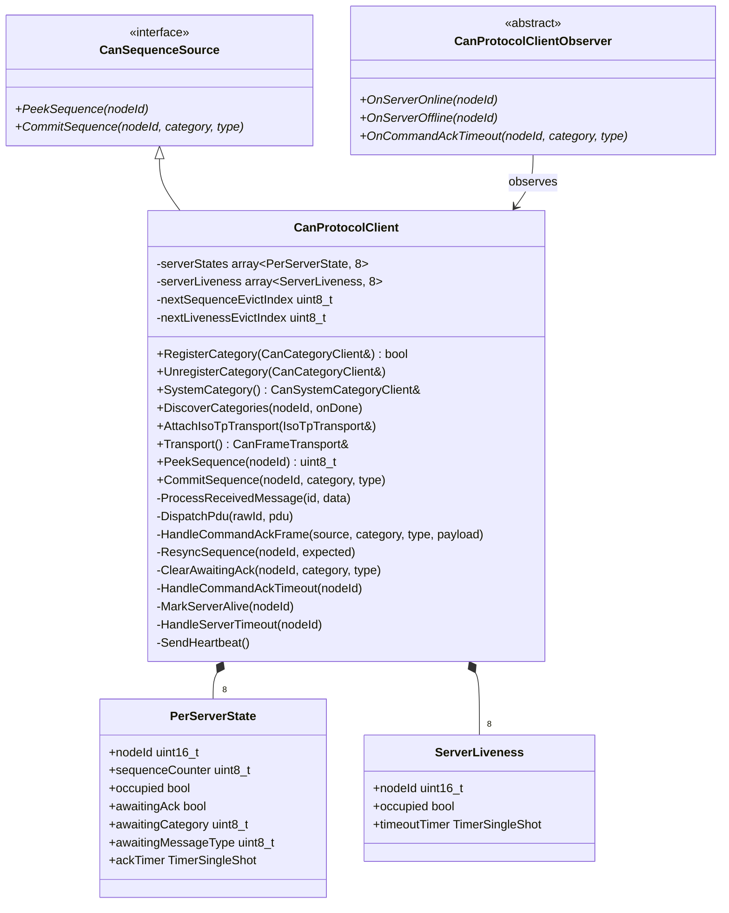
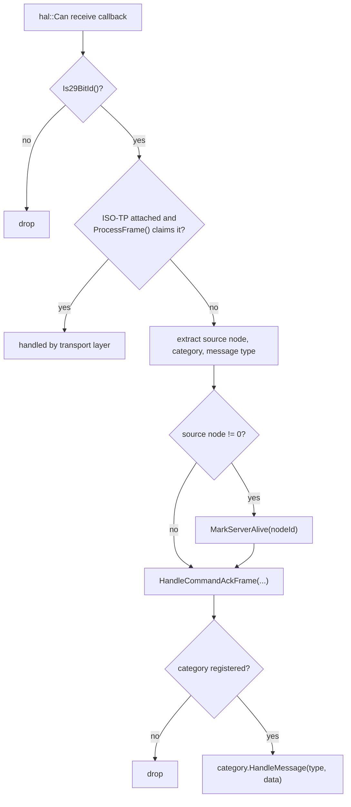
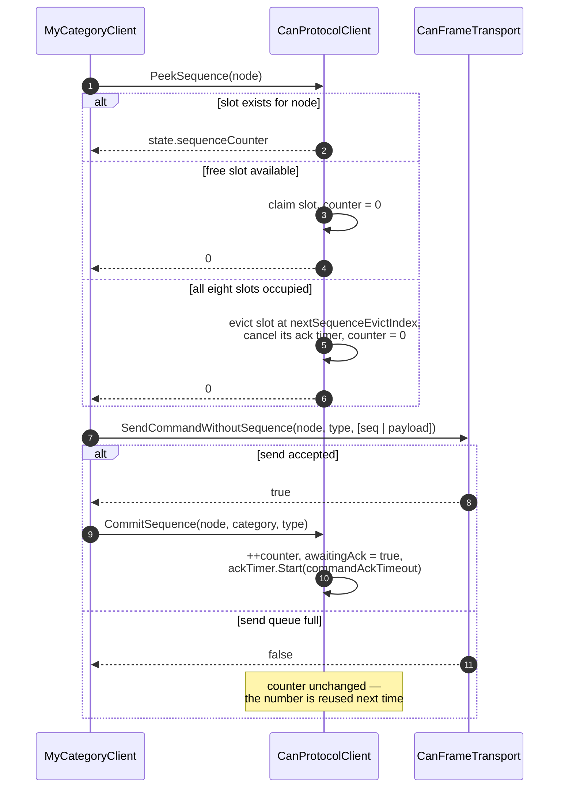
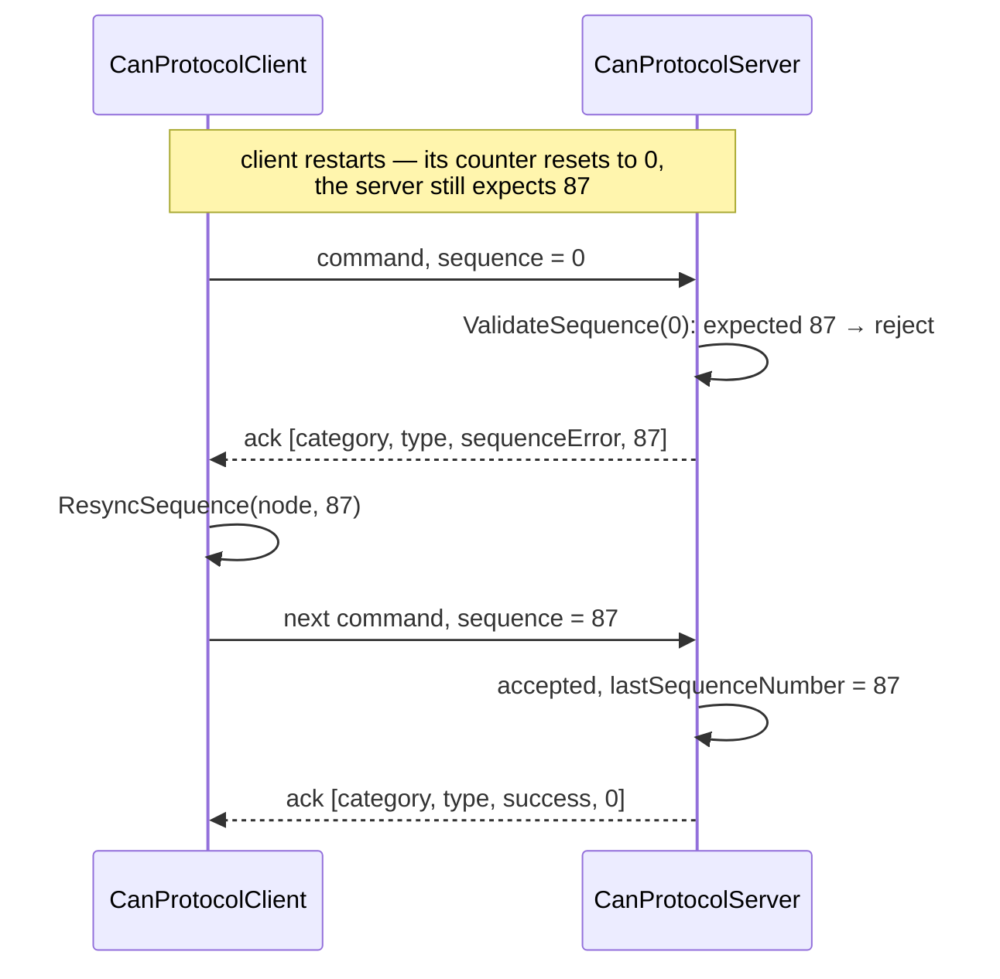
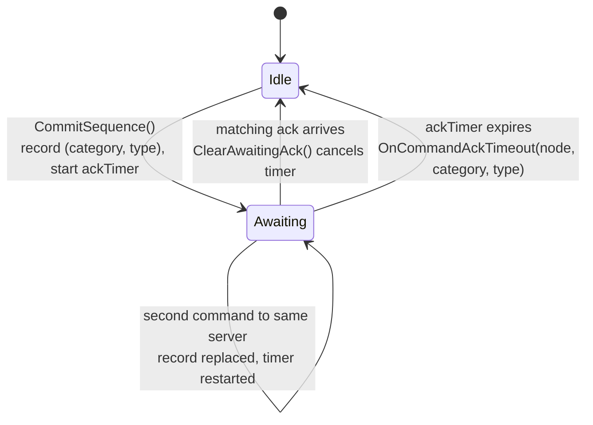
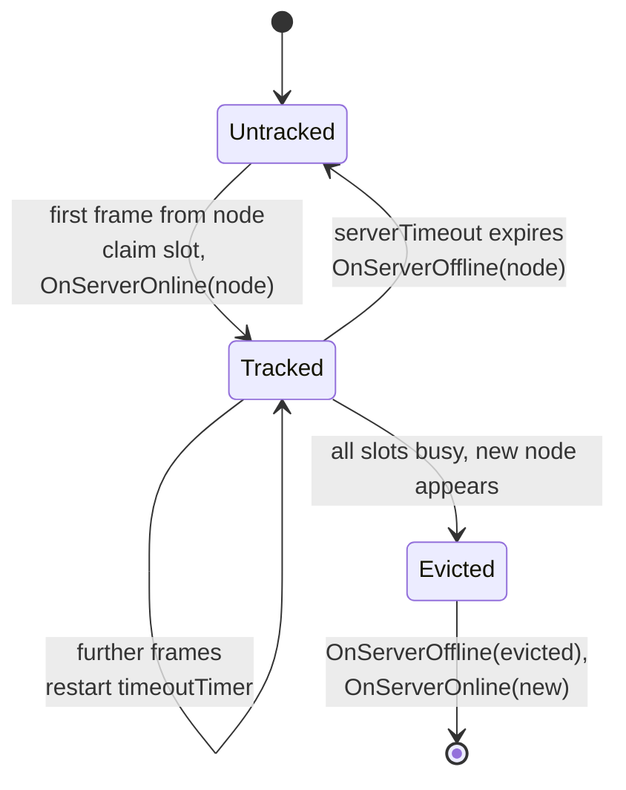
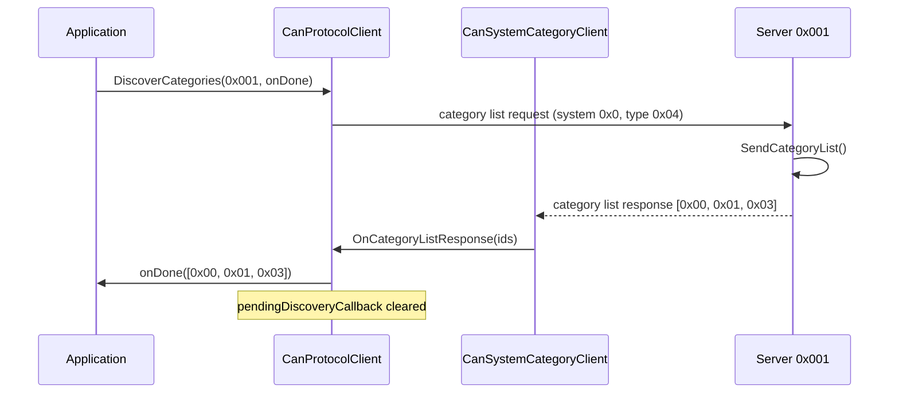

# The Protocol Layer: Client

`CanProtocolClient` is the node that asks. It has no address of its own, it
addresses servers by node ID, and it keeps a small amount of state **per
server**: a sequence counter, an outstanding-acknowledgement record and a
liveness timer. It is also the `CanSequenceSource` that every client category
draws its sequence numbers from.

## 1. Configuration and interface

```cpp
struct Config
{
    infra::Duration serverTimeout = std::chrono::seconds(3);
    infra::Duration heartbeatInterval = std::chrono::seconds(1);
    infra::Duration commandAckTimeout = std::chrono::seconds(1);
};

explicit CanProtocolClient(hal::Can& can);
CanProtocolClient(hal::Can& can, const Config& config);
```

| Field | Default | Effect |
|-------|---------|--------|
| `serverTimeout` | 3 s | Silence from a server after which `OnServerOffline` is notified |
| `heartbeatInterval` | 1 s | Quiet period after which the client broadcasts a heartbeat |
| `commandAckTimeout` | 1 s | Wait for the acknowledgement of a sequence-validated command |



Note that the two arrays are **separate and independently managed**. Sequence
state is created when a command is first sent to a node; liveness state is
created when a frame is first received from a node. A server that is commanded
but never answers occupies a sequence slot and no liveness slot; a server that
only emits telemetry occupies a liveness slot and no sequence slot.

## 2. The client has no node ID

```cpp
CanProtocolClient::CanProtocolClient(hal::Can& can, const Config& config)
    : config(config)
    , transport(can, 0)
    , systemCategory(transport, *this)
    , systemObserver(systemCategory, *this)
{
    categories.push_back(systemCategory);

    can.ReceiveData([this](hal::Can::Id id, const hal::Can::Message& data)
        { ProcessReceivedMessage(id, data); });

    transport.SetOnSendNotification([this]() { ResetHeartbeatTimer(); });

    ResetHeartbeatTimer();
}
```

The transport is constructed with node ID `0`, which is never used as a source
address: every client frame is built with the **target** overload of
`SendFrame`, so the node field carries the destination. The one exception is the
heartbeat, which is broadcast — and `0x000` *is* the broadcast address, so the
value is correct there by construction rather than by accident.

`systemCategory` takes `*this` as its `CanSequenceSource`, which is the
dependency that makes `CanProtocolClient` implement the interface at all.

## 3. The receive pipeline

The client's pipeline is markedly shorter than the server's, and the
differences are all deliberate.



| Difference from the server | Reason |
|----------------------------|--------|
| No node-ID filter | A client consumes frames from every server; the node field of an incoming response is the *source*, not a destination to match |
| No rate limiting | The client is the one issuing commands; limiting what it can receive would drop its own answers |
| No command/response split check | A client legitimately observes broadcast heartbeats (a command-range message type) as well as responses |
| Acknowledgements are intercepted before dispatch | The acknowledgement handler needs the **source node ID**, which category dispatch does not pass down |
| No acknowledgements sent | Clients never acknowledge |

The acknowledgement interception is the structurally interesting one.
`HandleCommandAckFrame` runs on every frame and filters for itself:

```cpp
void CanProtocolClient::HandleCommandAckFrame(uint16_t sourceNodeId, uint8_t categoryId,
    uint8_t messageType, infra::ConstByteRange payload)
{
    if (categoryId != canSystemCategoryId || messageType != canCommandAckMessageTypeId)
        return;

    if (payload.size() < canCommandAckSize || sourceNodeId == 0)
        return;

    auto ackedCategory = payload[0];
    auto ackedMessageType = payload[1];
    auto status = static_cast<CanAckStatus>(payload[2]);

    ClearAwaitingAck(sourceNodeId, ackedCategory, ackedMessageType);

    if (status == CanAckStatus::sequenceError)
        ResyncSequence(sourceNodeId, payload[3]);
}
```

A malformed acknowledgement — fewer than four bytes, or claiming to come from
node `0` — is ignored entirely: no timer cancelled, no counter changed. The
command's acknowledgement timeout then fires normally, which is the correct
outcome for a frame that cannot be trusted.

After interception the frame still continues to category dispatch, where
`CanSystemCategoryClient` receives it and does nothing with it. That is not
redundancy but layering: the system category *has* a handler for the
acknowledgement message type so that the message is recognised rather than
unhandled, and the protocol object does the part that needs the node ID.

## 4. Sequence supply: peek, then commit



Splitting the operation in two is what makes a failed send harmless. If
`PeekSequence` advanced the counter, a command rejected by a full send queue
would leave a permanent gap and every subsequent command would be answered with
`sequenceError` until a resynchronisation cleaned it up.

`CommitSequence` ends with an assertion that cannot fire in correct use:

```cpp
void CanProtocolClient::CommitSequence(uint16_t nodeId, uint8_t category, uint8_t messageType)
{
    for (auto& state : serverStates)
    {
        if (state.occupied && state.nodeId == nodeId)
        {
            ++state.sequenceCounter;
            state.awaitingAck = true;
            state.awaitingCategory = category;
            state.awaitingMessageType = messageType;
            state.ackTimer.Start(config.commandAckTimeout,
                [this, nodeId]() { HandleCommandAckTimeout(nodeId); });
            return;
        }
    }

    really_assert(false);
}
```

Reaching the assertion means committing for a node that was never peeked — that
is, a caller that did not go through `CanCategoryClient::SendCommand`.

### Slot exhaustion

Eight sequence slots are enough for eight servers. A ninth server evicts the
slot at a round-robin index, resetting its counter to zero and cancelling any
acknowledgement it was waiting for. The evicted server's next command therefore
starts from 0 while the server still expects its old value — one
`sequenceError`, one resynchronisation, and traffic continues. The design
accepts one wasted round trip per eviction rather than growing state without
bound. Chapter 13 works through the full sequence of events.

## 5. Sequence resynchronisation

The `expected` byte in a `sequenceError` acknowledgement turns what would be a
deadlock into a single lost command:



Three properties make this robust:

- **The server is not asked to reset.** It stays authoritative; the client
  adapts. That keeps the recovery one-sided and therefore race-free.
- **The rejected command is not retried automatically.** Retrying inside the
  protocol layer would replay a command whose side effects the application may
  not want repeated. The application learns about the failure through
  `OnCommandAckTimeout` — or, more usually, through the absence of the response
  it was waiting for — and decides.
- **Resynchronisation is silent otherwise.** No observer is notified, because
  from the application's point of view nothing has gone wrong that it can act
  on.

## 6. Acknowledgement tracking

Each `PerServerState` tracks **one** outstanding command:



The last transition is the one to know about. Sending a second
sequence-validated command to the same server before the first is acknowledged
**replaces** the tracked `(category, messageType)` pair. The first command's
acknowledgement, arriving afterwards, no longer matches and therefore does not
cancel the timer; the timer now belongs to the second command. In the common
request/response usage this never arises, and the alternative — a queue of
outstanding commands per server — costs memory that a one-at-a-time protocol
does not need.

`OnCommandAckTimeout(nodeId, category, messageType)` reports which command was
lost, so the application can retry it, escalate, or mark the server suspect.
Nothing is retried automatically.

## 7. Server liveness



Any frame from a non-zero source node counts as proof of life — responses,
telemetry and heartbeats alike — which matches the server's rule and for the
same reason: a busy peer defers its heartbeat.

The eviction path is explicit rather than "drop the newcomer", and it notifies
both transitions:

```cpp
auto& evicted = serverLiveness[nextLivenessEvictIndex];
nextLivenessEvictIndex = static_cast<uint8_t>((nextLivenessEvictIndex + 1) % serverLiveness.size());
evicted.timeoutTimer.Cancel();
auto evictedNodeId = evicted.nodeId;
NotifyObservers([evictedNodeId](auto& obs) { obs.OnServerOffline(evictedNodeId); });
evicted.nodeId = nodeId;
NotifyObservers([nodeId](auto& obs) { obs.OnServerOnline(nodeId); });
```

The application therefore sees a consistent picture: at most eight servers
online, and every transition reported. On a bus with nine or more active
servers the two eviction indices cycle and the observer sees churn — which is
the honest signal that the client is under-provisioned. `maxServers` is a
compile-time constant in `CanProtocolClient`, so raising it is a library change,
not a configuration option.

## 8. Category discovery

```cpp
void CanProtocolClient::DiscoverCategories(uint16_t nodeId,
    const infra::Function<void(const hal::Can::Message&)>& onDone)
{
    pendingDiscoveryCallback = onDone;

    hal::Can::Message emptyPayload;
    transport.SendFrame(nodeId, CanPriority::command, canSystemCategoryId,
        canCategoryListRequestMessageTypeId, emptyPayload, [](bool) {});
}
```

The response arrives as a `Category List Response` (system category, type
`0x05`), is dispatched to `CanSystemCategoryClient`, and reaches the client
through its `OnCategoryListResponse` observer, which invokes and clears the
pending callback:



Two limitations follow from the single callback slot, and both are deliberate
simplicity rather than oversight:

- **One discovery at a time.** A second `DiscoverCategories` before the first
  answer overwrites the pending callback; the first caller is never invoked.
- **The callback does not carry the responding node ID.** A response from a
  *different* server than the one asked will satisfy the pending callback. In
  the supported topology — one client driving discovery deliberately — this is
  not observable, but an application that discovers several servers should do so
  one at a time.

Discovery is also the only client operation with no timeout: if the server never
answers, the callback simply stays pending. An application that needs a
deadline arms its own timer.

## 9. Heartbeat

Identical in mechanism to the server's (Chapter 7, §7) — a single-shot timer
restarted after every outgoing frame — with one difference: it is a broadcast,
because the client has no address that a server could be expected to know.

```cpp
void CanProtocolClient::SendHeartbeat()
{
    hal::Can::Message msg;
    msg.push_back(canProtocolVersion);

    transport.SendFrame(canBroadcastNodeId, CanPriority::heartbeat, canSystemCategoryId,
        canHeartbeatMessageTypeId, msg, [](bool) {});
}
```

Every server on the bus receives it, since `0x000` passes each server's node
filter, and each treats it as its client's "I am here" signal.

## 10. Design notes

**Why is `CanSequenceSource` an interface at all, rather than a method on
`CanProtocolClient`?** Because client categories must link `can_lite.core`
only. Taking a `CanProtocolClient&` would drag the client library into every
category. The interface lives in `core`, the implementation lives in the client,
and the category sees only the interface.

**Why are the sequence and liveness arrays not merged?** They have different
lifecycles — one is created by sending, the other by receiving — and merging
them would mean allocating a slot for a server the client has only heard from,
or tracking liveness for a server that has never spoken. Keeping them separate
costs a few bytes and removes a class of bugs.

**Why does the client emit a heartbeat at all, when it is the initiator?**
Because the server's `Online()`/`Offline()` observer needs a positive signal on
an otherwise idle bus, and because a server that has lost its client should be
able to fall back to a safe state (Chapter 13).

**Why `std::array` here and `IntrusiveList` for categories?** The per-server
state is anonymous, fixed-count and internal; the categories are
application-owned objects whose lifetime the client does not control. Intrusive
lists suit the latter and would be pointless for the former.
