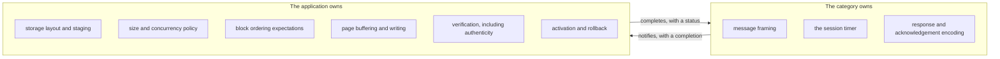
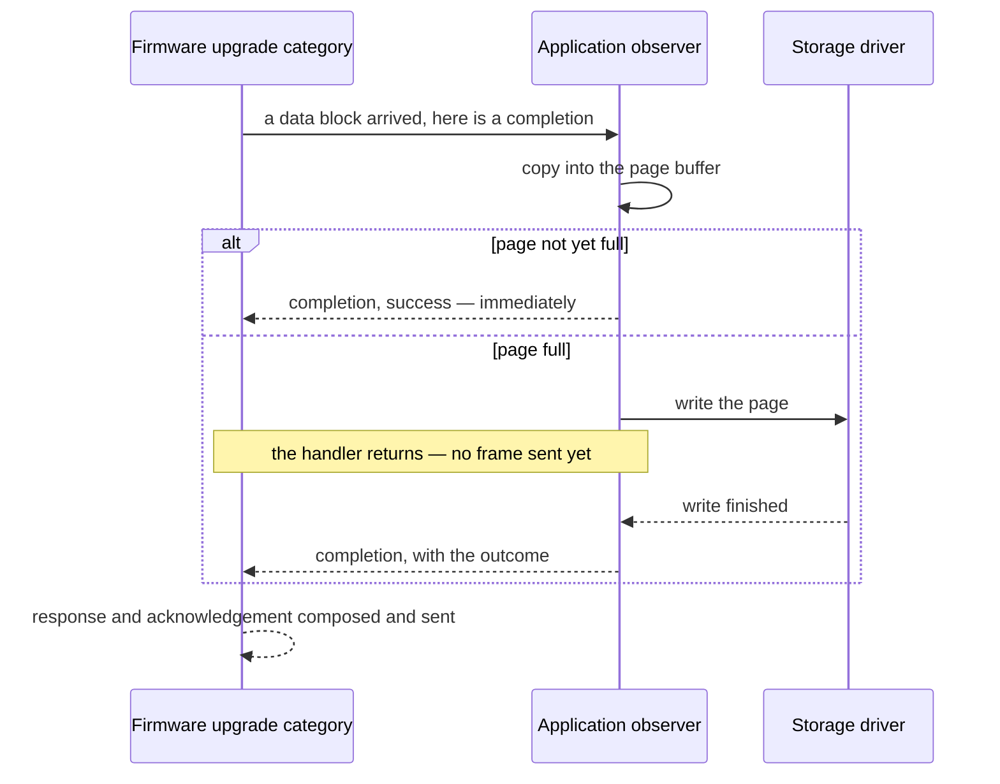

# The Built-in Categories: Design Rationale

can-lite ships two categories. Their messages, payload layouts, states and error
codes are specified in the
[Protocol Specification](../spec/can-protocol.md) §8 (system) and the
[Firmware Upgrade Specification](../spec/firmware-upgrade.md) (upgrade), and
the system category's role inside the protocol objects is described in
[Architecture and Design Decisions](../design/architecture.md) §6. This chapter
answers the questions those documents do not: **why each is built the way it
is, and what that costs.**

## 1. The system category is a category

Nothing forced the protocol-level conversations — presence, acknowledgement,
status, discovery — to travel the same road as application messages. They could
have been special-cased inside the protocol objects.

Making them an ordinary category buys three things:

- **One dispatch path.** A received frame reaches its handler by exactly one
  route, whatever it is for.
- **One set of rules.** The system category occupies a registration slot, uses
  the same payload handling and the same observer pattern as any other. That is
  a useful forcing function: a rule that is awkward for the system category is
  probably awkward for everyone.
- **Nothing special to learn.** A reader who understands one category
  understands this one.

What it costs is one of the eight registration slots, permanently.

### Why the halves are not mirror images

The two halves handle disjoint sets of messages, and the asymmetry is
informative rather than accidental:

| Conversation | Server half | Client half |
|--------------|-------------|-------------|
| Presence | handles the client's broadcast | — |
| Acknowledgement | sends them | recognises them, acts nowhere |
| Status request | handles it | — |
| Discovery | answers it | consumes the answer |

A server's heartbeat arriving at a client finds no handler, and nothing goes
wrong: the client already extracted that frame's value — proof of life — before
dispatch (Chapter 7), and clients never acknowledge, so an unhandled message
type on the client side is genuinely inert.

The acknowledgement handler on the client half is deliberately empty. The work
happens in the protocol object, which runs first because it needs the source
identity that dispatch does not carry. The handler exists so that the category's
registered message types remain an accurate description of what it understands —
a small piece of hygiene, not dead code.

### What the application does and does not see

The server exposes **nothing** of the system category: everything it does is
already reflected in the server's own interface — online and offline
notifications, automatic answers to status and discovery. Exposing it would let
an application answer a status request differently from the protocol's
definition.

The client exposes **only discovery**, because it is the one answer an
application must interpret.

Two consequences follow, and both are simplifications rather than oversights:

- **Acknowledgement statuses do not reach the application.** A client learns a
  command's fate from the category's own response, from the acknowledgement
  timeout, or — for a sequence error — not at all, because the counter
  resynchronises silently. An application that needs to distinguish, say,
  "invalid state" from "not implemented" must carry that in its own category's
  response, which is what the shipped categories do.
- **The heartbeat's protocol version is not checked.** It is on the wire for
  future negotiation; today two firmware generations with different versions
  will talk to each other regardless. Worth knowing before deploying a mixed
  bus (Chapter 10, §6.7).

## 2. The firmware upgrade category keeps no state

This is the library's fullest worked example of a category whose state lives in
the **application**. The category owns message framing, one timer and response
encoding; the flash layout, the buffering, the checksum and the bank switch
belong to the product.

The division is what makes the category reusable across products with completely
different storage. It is also what makes the application's obligations
non-negotiable, listed in §4 below.

### Why it does not validate sequence numbers

Two reasons, both practical:

1. **The block index already orders the transfer.** A duplicated or reordered
   block is detected by the application against its own expectation and answered
   with a category error that says which block was expected — which a
   protocol-level sequence error could not.
2. **A sequence number would cost a payload byte in the message that sends the
   most bytes.** One byte out of seven, on the longest transfer the protocol
   ever performs, is a sixth of the throughput.

The trade-off is real: this category has no protocol-level replay protection. It
is bounded instead by the checksum at the end — a replayed or lost block
produces a mismatch and the image is not activated — and by the authenticity
check the application is expected to add.

### Why polling does not extend the session

The session timer is extended by the commands that make progress and stopped by
the ones that end the transfer. Asking for progress does **neither**.

That is the design decision worth remembering: a client that has crashed
mid-transfer, but whose supervisor still polls for progress, must not be able to
hold the server's staging area open indefinitely.

When the timer does expire the category notifies the application and does
nothing else — no frame is sent, because there is nobody to tell, and no state
is changed, because the state that matters belongs to the application.

### The asynchronous completion pattern

Flash operations take milliseconds to seconds, and nothing in can-lite may block
for that long. Every notification therefore carries a completion for the
application to call when it is done, and the category retains nothing across the
gap — everything it needs to compose the answer is captured when it notifies.

Two obligations fall on the application, and neither can be checked:

- **Call the completion exactly once.** Never calling it leaves the client
  waiting for its timeout; calling it twice sends two answers to one command.
- **The category does not serialise.** A second command arriving before the
  first completion has run will be dispatched. An application that cannot cope
  must refuse the overlapping command itself.

### Why every command produces two frames back

A category response and a protocol acknowledgement answer different questions:
the acknowledgement says the command was well-formed and reached a handler; the
response says what happened. When a handler fails, the acknowledgement reports a
category-level failure and the detail travels in the response — which is exactly
the split described in Chapter 5, §2.

The cost is bus traffic: acknowledgements are nearly as expensive as the
commands they answer (Chapter 11, §6). A category that carries its own status,
as this one does, is the case where switching them off would save a third of the
traffic — a change the protocol does not currently allow, and a fair candidate
for a future extension.

## 3. Throughput is bounded by round trips, not by the bus

The transfer is stop-and-wait: each block waits for its acknowledgement before
the next is sent. The consequence is that **round-trip latency, not bitrate,
sets the throughput** — making the bus twice as fast barely helps.

That is why all three extensions recorded in the specification — windowed
acknowledgement, page addressing, and carrying blocks over segmentation
(Chapter 8) — attack the number of round trips rather than the frame time. The
arithmetic is in Chapter 11, §4.

## 4. What the application must provide

| Concern | What the category expects |
|---------|---------------------------|
| Storage layout | Somewhere to stage an image that is not the running one |
| Size policy | Refuse an image that does not fit |
| Concurrency policy | Refuse a second session while one is open |
| Block ordering | Compare each index with the expected one and report a gap |
| Buffering | Accumulate small blocks into whatever unit the storage writes |
| Verification | Check the image against the client's checksum |
| Activation | Switch to the new image, ideally with rollback if it fails to run |
| Timeout recovery | Discard staging state when the session expires |
| **Authenticity** | **Verify a signature, if the product needs one** |

The last row is the one to read twice. can-lite authenticates nothing: any node
that can put frames on the bus can start an upgrade. Where that matters, the
image must carry its own signature and the application must check it before
reporting success.
