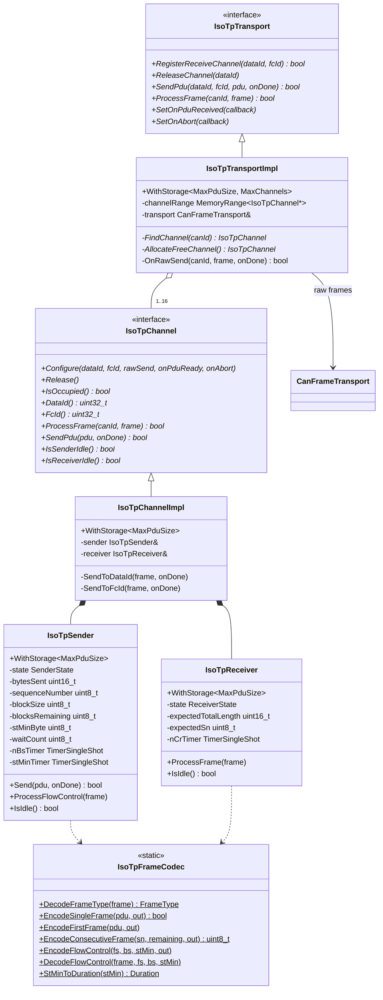
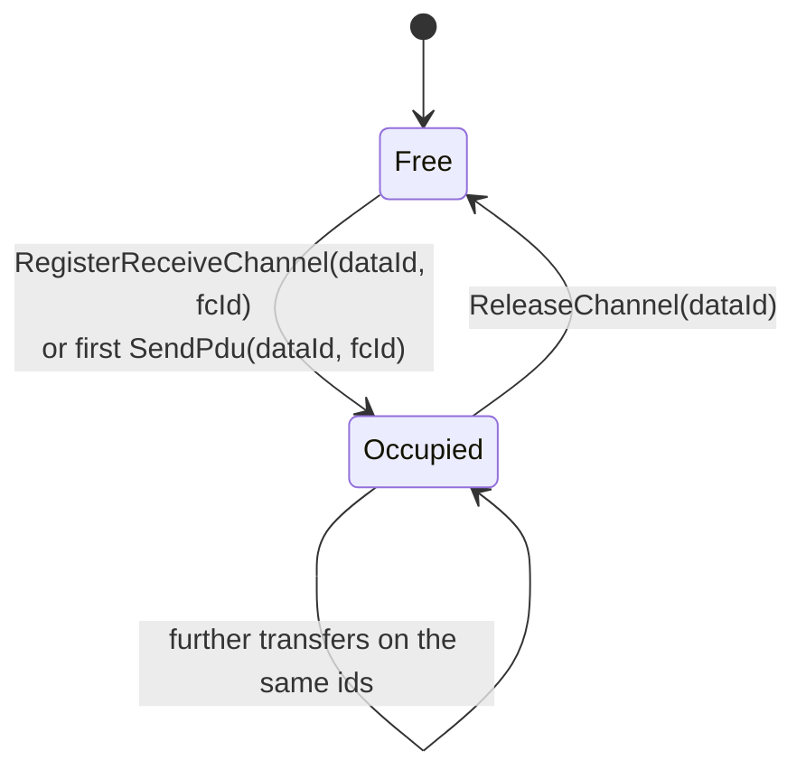
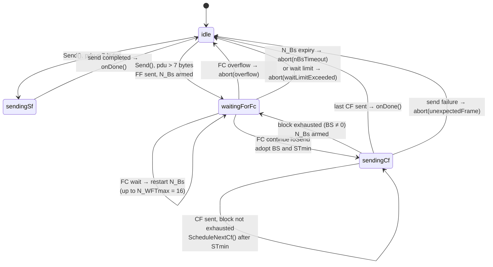
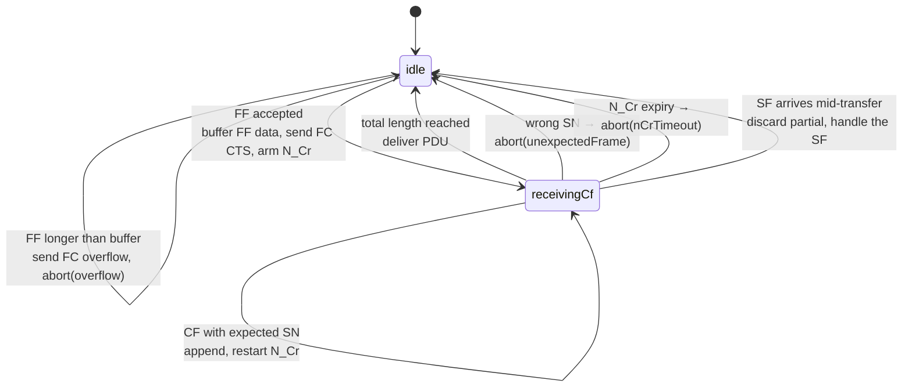
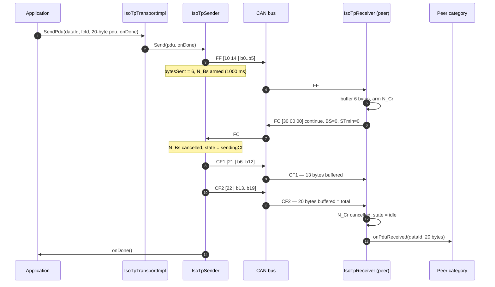

# The Transport Layer: ISO-TP

A classic CAN frame carries eight bytes. A firmware block, a calibration table
or a configuration record does not fit. The transport layer solves that with
ISO 15765-2 (ISO-TP): a segmentation protocol that splits a **PDU** of up to
4095 bytes across a first frame and a run of consecutive frames, paced by flow
control from the receiver.

The layer is **optional and orthogonal**. A node that attaches it gains
multi-frame payloads for the message types that opt in; every other message type
continues to travel as a single frame, unaware that the transport exists.

## 1. Frame formats

The first nibble of byte 0 — the PCI (Protocol Control Information) — says what
kind of frame this is.

| Type | PCI | Byte 0 | Byte 1 | Bytes 2–7 | Meaning |
|------|-----|--------|--------|-----------|---------|
| Single Frame (SF) | `0x0` | `0x0L` where L = 1–7 | payload | payload | Whole PDU in one frame |
| First Frame (FF) | `0x1` | `0x1H` where H = length bits 11:8 | length bits 7:0 | 6 payload bytes | Start of a multi-frame PDU |
| Consecutive Frame (CF) | `0x2` | `0x2S` where S = sequence 0–15 | payload | payload | Up to 7 more payload bytes |
| Flow Control (FC) | `0x3` | `0x3F` where F = flow status | block size | STmin | Receiver's pacing instruction |

```text
Single Frame            First Frame                Consecutive Frame       Flow Control
┌────┬────────────┐     ┌────┬────┬───────────┐    ┌────┬─────────────┐    ┌────┬────┬─────┐
│0 L │  1-7 bytes │     │1 H │ L  │  6 bytes  │    │2 S │  1-7 bytes  │    │3 F │ BS │STmin│
└────┴────────────┘     └────┴────┴───────────┘    └────┴─────────────┘    └────┴────┴─────┘
```

| Field | Values in can-lite |
|-------|--------------------|
| Flow status `F` | `0` continue to send, `1` wait, `2` overflow |
| Block size `BS` | `0` = send everything without further flow control. can-lite's receiver always sends `0`; its sender honours any value a peer sends |
| `STmin` | `0x00`–`0x7F` = 0–127 ms; `0xF1`–`0xF9` = 100–900 µs; anything else is treated as 127 ms |
| Sequence `S` | Starts at 1 for the first CF, wraps 15 → 0 |

Two limits are structural: the FF length field is 12 bits, so a PDU may not
exceed **4095 bytes** (`0x0FFF`); and can-lite implements **normal addressing**
only — no address extension byte, and no CAN FD escape sequence.

## 2. The classes



Every class here is non-template at its API surface; sizes enter through the
`WithStorage` chain of Chapter 3, §3. One declaration configures the whole
layer:

```cpp
services::IsoTpTransportImpl::WithStorage<1024, 4> isoTp{ server.Transport() };
```

That reserves four channels, each with a 1 KiB send buffer and a 1 KiB
reassembly buffer — 8 KiB of static RAM, and the arithmetic is deliberately that
obvious. The implementation caps the channel count at 16
(`really_assert(channels.max_size() <= maxSupportedChannels)`).

## 3. Channels

A **channel** is a pair of CAN identifiers:

| Identifier | Carries |
|------------|---------|
| `dataId` | SF, FF and CF frames — the data direction |
| `fcId` | FC frames — the reverse, flow-control direction |

`IsoTpChannelImpl::ProcessFrame` routes on those two identifiers, and its return
value is what tells the protocol layer whether the frame was consumed:

```cpp
bool IsoTpChannelImpl::ProcessFrame(uint32_t canId, const hal::Can::Message& frame)
{
    if (canId == fcId && IsoTpFrameCodec::DecodeFrameType(frame) == FrameType::flowControl)
    {
        sender.ProcessFlowControl(frame);
        return true;
    }
    if (canId == dataId)
    {
        auto type = IsoTpFrameCodec::DecodeFrameType(frame);
        if (type != FrameType::flowControl)
        {
            receiver.ProcessFrame(frame);
            return true;
        }
    }
    return false;
}
```

Each channel owns one sender and one receiver, which are independent state
machines: a channel can be transmitting a PDU and reassembling one at the same
time, because the two use different identifiers.

**Channels are claimed, not pooled per transfer.** `SendPdu` reuses an existing
channel for the same `dataId` or allocates a free one; the channel then stays
occupied until `ReleaseChannel(dataId)` is called. That is why the protocol
layer's abort handler releases it (Chapter 7, §10) — otherwise a failed transfer
would hold a slot forever.



`RegisterReceiveChannel` refuses to create a second channel that reuses either
identifier of an existing one — the lookup is by *either* ID, so overlapping
pairs would make routing ambiguous.

## 4. The sender



`Send()` rejects up front rather than failing later:

```cpp
if (pdu.empty())                    return false;   // nothing to send
if (pdu.size() > 0x0FFFu)           return false;   // beyond the 12-bit length field
if (state != SenderState::idle)     return false;   // one transfer at a time per channel
if (pdu.size() > pduBuffer.max_size()) return false; // beyond the configured buffer
```

The PDU is then **copied** into the channel's buffer, so the caller's buffer may
be reused immediately — an important property when the source is a stack
temporary or a flash read buffer.

### Block size and separation time

`blockSize` is what the *receiving peer* asked for: after that many consecutive
frames the sender must stop and wait for another FC. can-lite's own receiver
always requests `0`, meaning "no interruption", but the sender implements the
general case so it can talk to conventional ISO-TP stacks that pace transfers.

`STmin` becomes a delay between consecutive frames:

```cpp
infra::Duration IsoTpFrameCodec::StMinToDuration(uint8_t stMin)
{
    if (stMin <= 0x7Fu)
        return std::chrono::milliseconds(stMin);
    if (stMin >= 0xF1u && stMin <= 0xF9u)
        return std::chrono::microseconds((stMin - 0xF0u) * 100);

    return std::chrono::milliseconds(0x7Fu);
}
```

Reserved values map to the *slowest* legal value, 127 ms, which is the standard's
conservative reading: an unparseable pacing request should not be read as "as
fast as possible". A zero STmin skips the timer entirely and the next frame is
sent from the previous frame's completion — which is what keeps a fast transfer
free of timer overhead.

### Aborts and the completion callback

```cpp
void IsoTpSender::Abort(AbortReason reason)
{
    nBsTimer.Cancel();
    stMinTimer.Cancel();
    state = SenderState::idle;
    if (onAbortFunc)
        onAbortFunc(reason);
}
```

> **The `onDone` callback passed to `SendPdu` is invoked on success only.** An
> aborted transfer reports through the abort callback instead. An application
> that needs "the transfer ended, one way or another" must handle both, and the
> protocol layer's own abort handler releases the channel.

| `AbortReason` | Raised when |
|---------------|-------------|
| `nBsTimeout` | No FC within 1000 ms of an FF or a block-final CF |
| `nCrTimeout` | (Receiver) no CF within 1000 ms of the previous one |
| `overflow` | Peer answered FC overflow, or an incoming PDU exceeds the buffer |
| `unexpectedFrame` | A frame that cannot be parsed in the current state, or a failed raw send |
| `waitLimitExceeded` | More than `nWftMax` = 16 consecutive FC wait frames |

`unexpectedFrame` doubling as "the raw send failed" is worth noting: when the
underlying `CanFrameTransport` queue is full, `SendToDataId` calls the completion
with `false` and the sender aborts. The reason code is imprecise, but the
outcome — abort, release, tell the application — is the one that matters.

## 5. The receiver



The validation the receiver performs, in order:

| Frame | Check | Failure |
|-------|-------|---------|
| SF | length is 1–7 | `abort(unexpectedFrame)` |
| SF | length ≤ actual frame bytes | `abort(unexpectedFrame)` |
| SF | length ≤ buffer capacity | `abort(overflow)`, no FC sent |
| FF | frame is a full 8 bytes | `abort(unexpectedFrame)` |
| FF | declared length > 7 | `abort(unexpectedFrame)` — a short PDU must be an SF |
| FF | declared length ≤ buffer capacity | FC overflow **sent**, then `abort(overflow)` |
| CF | receiver is in `receivingCf` | ignored silently — an unsolicited CF is not an error |
| CF | sequence number matches | `abort(unexpectedFrame)` |

The asymmetry between SF overflow (silent abort) and FF overflow (FC overflow
frame, then abort) is deliberate: a peer that sent an FF is *waiting* for flow
control and must be told to stop, whereas a peer that sent an SF has already
finished and has nothing to stop.

An SF arriving mid-reassembly is treated as a new, complete PDU: the partial
transfer is discarded and the SF is delivered. That is the pragmatic reading —
the peer evidently moved on.

## 6. A multi-frame transfer, end to end



Note the two completions are independent: the sender's `onDone` says "the last
frame reached the controller", the receiver's `onPduReceived` says "the PDU is
complete". Neither is an end-to-end acknowledgement — that is the job of the
category's own protocol, one layer up.

## 7. Wiring ISO-TP into a category

Three steps, none of which touch the protocol core:

**1. Attach the transport** to the server or client:

```cpp
services::IsoTpTransportImpl::WithStorage<512, 2> isoTp{ server.Transport() };
server.AttachIsoTpTransport(isoTp);
```

**2. Register the receive channel** for the identifiers the category will use:

```cpp
auto dataId = services::MakeCanId(services::CanPriority::command,
    myCategoryId, myBulkWriteId, myNodeId);
auto fcId = services::MakeCanId(services::CanPriority::response,
    myCategoryId, myBulkWriteId, myNodeId);

isoTp.RegisterReceiveChannel(dataId, fcId);
```

**3. Give the message type a PDU handler** so `HandlePduMessage` has somewhere to
dispatch:

```cpp
CanMessageHandler<MyCategoryServer> bulkWrite{ myBulkWriteId, *this,
    &MyCategoryServer::HandleBulkWriteFrame,
    &MyCategoryServer::HandleBulkWritePdu };
```

The PDU handler returns `bool` — `false` produces an `unknownCommand`
acknowledgement, exactly as a missing handler would.

Because the reassembled PDU passes through the same pipeline as a single frame
(node filter, liveness, rate limit, sequence validation, category lookup), a
sequence-validated category still finds its sequence byte at `pdu[0]` and still
`Skip(1)`s before reading. The only difference the category sees is that the
byte range may be longer than eight.

## 8. Limits and deliberate omissions

| Property | can-lite | Notes |
|----------|----------|-------|
| Maximum PDU | 4095 bytes, and never more than `MaxPduSize` | Enforced on both send and receive |
| Addressing | Normal only | No extended or mixed addressing |
| Padding | None | Frames are as short as their content; a peer requiring 8-byte padding will not interoperate |
| Block size requested | Always 0 | The receiver never interrupts a transfer; the sender honours a peer's non-zero BS |
| STmin requested | Always 0 | The receiver never asks the peer to slow down; the sender honours a peer's STmin |
| FC wait | Sent: never. Honoured: up to 16 consecutive | `nWftMax` |
| N_Bs / N_Cr | 1000 ms, compile-time constants | `IsoTpTypes.hpp` |
| Concurrent transfers | One send and one receive per channel | More concurrency means more channels |
| CAN FD | Not supported | The length field and frame sizes assume classic CAN |

Two of those deserve a sentence of justification. **Always requesting BS = 0 and
STmin = 0** is right for a bus where the receiving MCU can absorb frames at line
rate, which is the case when reassembly is a memcpy into a preallocated buffer;
a receiver that needs pacing would have to become a configurable policy, and
nothing in the library needs it yet. **No padding** keeps short frames short,
which matters on a loaded bus, at the cost of interoperating with stacks that
insist on 8-byte DLC for every frame.

## 9. Design notes

**Why is the channel abstraction (`IsoTpChannel`) an interface?** So that
`IsoTpTransportImpl` can hold an array of pointers to non-template channel
objects whose storage size it does not know. The interface is what allows
`WithStorage<MaxPduSize, MaxChannels>` to compose without templating the
transport's own methods.

**Why does the transport pre-fill its channel vector in the constructor?**

```cpp
while (channels.size() < channels.max_size())
    channels.emplace_back();
```

Because allocation must happen at construction, not at first use. After the
constructor runs, every channel object exists and the transport's hot path only
ever flips an `occupied` flag.

**Why does `ProcessFrame` return `bool` all the way up?** It is the mechanism by
which ISO-TP is transparent: the protocol layer offers each frame to the
transport, and only continues its own pipeline if the transport declines. A
frame belonging to a registered channel never reaches category dispatch as a raw
frame.

**Why is the sender's abort reason for a failed raw send `unexpectedFrame`?**
Because the sender cannot distinguish a full queue from a bus problem — both
arrive as `success == false`. The abort is what matters; the reason is
diagnostic.
