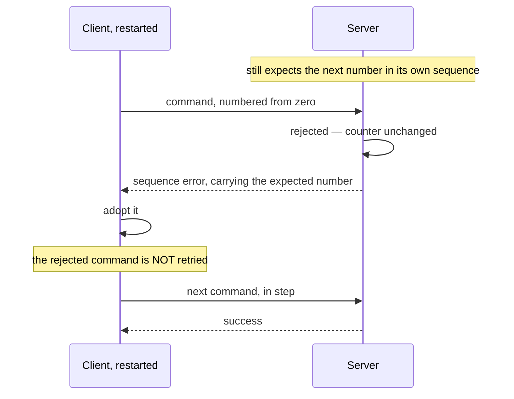
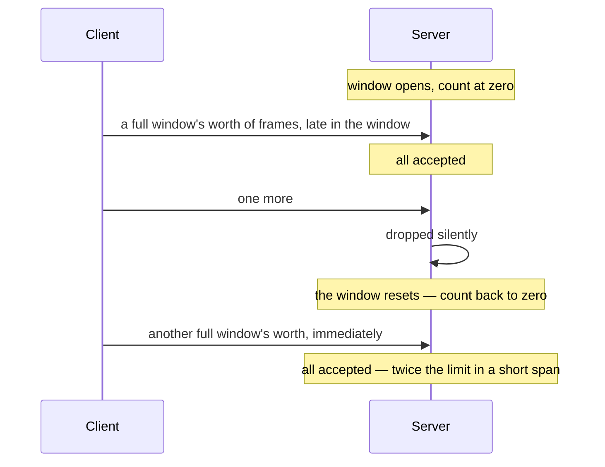
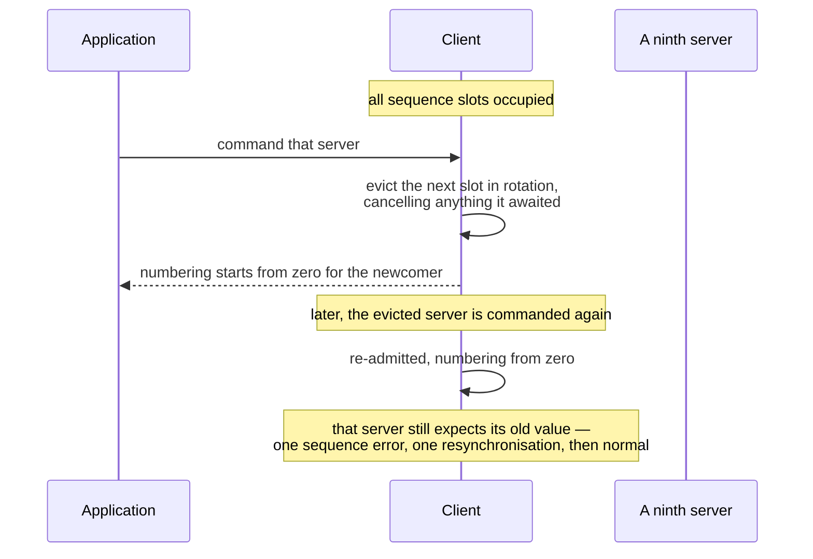
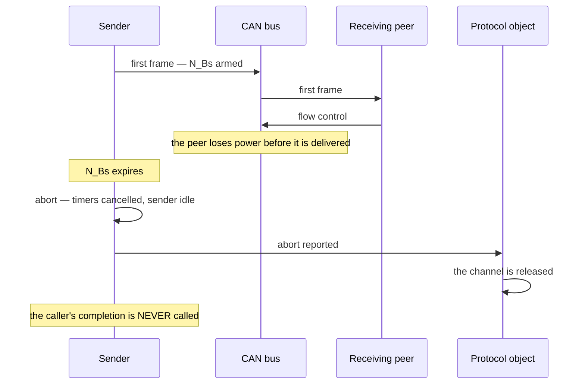

# Corner Cases and Failure Modes

This is the catalogue of what happens when things go wrong: bounds are reached,
peers disappear, frames arrive out of order, configurations disagree. Each entry
states the **condition**, the **mechanism** that handles it, and the
**observable outcome** — what an engineer with a bus analyser and a debugger
would actually see.

Entries marked **latent** are correct today but rest on an assumption worth
knowing. Entries marked **design limit** are deliberate simplifications with a
stated cost.

## 1. Frame level

| # | Condition | Mechanism | Observable outcome |
|---|-----------|-----------|--------------------|
| 1.1 | Standard-identifier frame received | Identifier-width gate, first in both pipelines | Ignored entirely: no answer, no counter, no notification. This is what lets can-lite share a bus with another protocol |
| 1.2 | Empty payload on a validated category | Emptiness checked before the sequence check | Answered "invalid payload"; the sequence counter is untouched |
| 1.3 | Empty payload on a non-validated category | Reaches the handler, which under-runs while reading | The handler's validity check produces "invalid payload"; a handler that omits the check acts on zeros |
| 1.4 | Full eight-byte payload on a validated category | The sequence number occupies the first byte | Only seven bytes reach the category — a payload designed for eight silently loses its last field |
| 1.5 | Payload longer than eight bytes | Impossible: the frame type is bounded | — |
| 1.6 | Driver delivers frames out of order | None — ordering is assumed | Validated commands draw spurious sequence errors; the client resynchronises each time and progress stalls. **Latent**: ordering is a driver requirement (Chapter 3, §4) |
| 1.7 | Driver completes a send from inside the send call | None | Queue drain recurses once per queued frame — at most eight deep. **Latent**: the shipped host adapters defer completions for exactly this reason |

## 2. The outbound queue

| # | Condition | Mechanism | Observable outcome |
|---|-----------|-----------|--------------------|
| 2.1 | A ninth simultaneous send | Queue-full refusal | The frame is dropped and never retried. What the caller sees depends on who it was: a category's send reports failure; a client command reports failure **without consuming a sequence number**; an acknowledgement is simply lost |
| 2.2 | An acknowledgement lost to a full queue | Its completion discards the outcome | The client's acknowledgement timeout fires instead. Deliberate: retrying would deepen a queue that is already saturated |
| 2.3 | A send completion that itself sends | The queue advances before the completion runs | Safe: the new frame goes out immediately if the queue emptied, otherwise it is appended behind the one just started |
| 2.4 | Two owners claim the send notification | Checked at run time, in release builds too | Immediate assertion. Only the protocol object may claim it |
| 2.5 | The node's address is changed with frames already queued | None | Queued frames keep the identifier they were built with; only later frames carry the new address |
| 2.6 | The driver reports a transmission failure | The outcome propagates to the caller | Categories ignore it; segmentation treats it as an abort. **Design limit**: there is no bus-off recovery machine in the library |

## 3. The server's receive pipeline

| # | Condition | Mechanism | Observable outcome |
|---|-----------|-----------|--------------------|
| 3.1 | Frame addressed to another node | Address filter | Silent — answering would produce noise proportional to the number of servers |
| 3.2 | Broadcast frame | The filter admits it | Accepted and dispatched; this is how the client's heartbeat reaches every server |
| 3.3 | Rate limit reached | Rate gate | Silent, including any acknowledgement that would have followed. The specification defines a "rate limited" status, but it is deliberately never sent |
| 3.4 | Burst straddling a window reset | The window is fixed and resets on a timer | Up to **twice** the configured number can be accepted in quick succession. **Design limit**: a sliding window would need a timestamp per frame (§7.2) |
| 3.5 | A response arrives at a server | Command/response gate | Silent; prevents a response being dispatched as a command |
| 3.6 | One server sees another's acknowledgement or discovery answer | Those message types are numerically in the command range, so the **address filter**, not the type gate, rejects them | Silent, because such frames carry the sending server's own address. **Latent**: the protection here is addressing, not typing |
| 3.7 | Frame for an unregistered category | Category lookup fails | Silent — the frame may be legitimate traffic for a different server |
| 3.8 | Known category, unknown message type | Dispatch reports "not handled" | Answered "unknown command" |
| 3.9 | One category too many registered | Slot limit | Registration refused; the system category holds one slot from construction |
| 3.10 | Two categories claiming the same identity | Identity scan | Registration refused — including re-registering the same object |
| 3.11 | Registration failure ignored by the application | None | The category is invisible: its commands are dropped silently (3.7) and its client waits for answers that never come |
| 3.12 | A category destroyed while still registered | None | The registration list holds a dangling entry, and the next frame for it dispatches into freed memory. **Latent**: lifetime is the application's responsibility |
| 3.13 | A category acknowledges before being registered | Checked at run time | Assertion. Only reachable when a test drives a category directly |

## 4. Sequence validation

| # | Condition | Mechanism | Observable outcome |
|---|-----------|-----------|--------------------|
| 4.1 | First validated command after the server starts | The baseline is adopted | Accepted whatever its value: a client that restarts from zero needs no help from the server |
| 4.2 | A gap in the sequence | Rejection | Answered "sequence error" carrying the **expected** number; the counter does not advance |
| 4.3 | Repeated gaps | Rejection is idempotent | Every rejection names the same expected number — no drift, no lockout |
| 4.4 | The counter wraps | Modular arithmetic | Transparent |
| 4.5 | The client process restarts mid-session | Resynchronisation from the expected number | One command lost, one round trip wasted, traffic continues (§7.1) |
| 4.6 | Two clients commanding one server | One shared counter | Each breaks the other's ordering; both see near-continuous sequence errors. **Design limit**: one client per server (REQ-CAN-006.1) |
| 4.7 | One client using two validated categories on one server | One counter per server on each side | Correct: one interleaved stream, one ordering |
| 4.8 | A client sending without a sequence number to a validating server | None | The payload's first byte is read as a sequence number: sporadic rejection plus a mis-parsed payload |
| 4.9 | A client sending with a sequence number to a non-validating server | None | The sequence byte is delivered as payload, and every field is shifted by one |
| 4.10 | A send refused by a full queue | The number is taken and committed separately | The number is not consumed; the next attempt reuses it and the server sees no gap |

Entries 4.8 and 4.9 are the two configuration errors with no diagnostic at all
(Chapter 5, §5).

## 5. Client state

| # | Condition | Mechanism | Observable outcome |
|---|-----------|-----------|--------------------|
| 5.1 | A ninth server commanded | Round-robin eviction of a sequence slot | The evicted server's counter restarts; its next command draws one sequence error and resynchronises (§7.3) |
| 5.2 | A ninth server heard from | Round-robin eviction of a liveness slot | The evicted server is reported offline and the new one online. On a bus with more active servers than slots the application sees continuous churn — the honest signal that the client is under-provisioned |
| 5.3 | A second command to a server before the first is answered | The tracked command is replaced | The first answer no longer matches and does not cancel the timer, which now belongs to the second command |
| 5.4 | Two consecutive commands with the **same** identity | Matching is by category and message type only | The first command's acknowledgement cancels the second command's timer, so a lost answer to the second goes unreported. **Design limit**: one outstanding command per server |
| 5.5 | A malformed acknowledgement, or one claiming an impossible source | Guarded before it is acted on | Ignored: no timer cancelled, no counter changed; the command's timeout fires normally |
| 5.6 | An acknowledgement from a server other than the one commanded | State is kept per server | Only that server's state is touched; the commanded server's timer keeps running |
| 5.7 | A stale sequence-error acknowledgement arrives late | Applied unconditionally | The counter jumps to a value the server may have moved past, costing one further round trip. Self-correcting |
| 5.8 | Committing a number for a server never asked about | Checked at run time | Assertion. Only reachable by bypassing the category's send path |
| 5.9 | A second discovery before the first answer | A single pending completion | The first completion is overwritten and never called |
| 5.10 | A discovery answer from a different server | The completion carries no identity | The pending completion is satisfied by the wrong server's answer |
| 5.11 | Discovery never answered | No timeout exists | The completion stays pending forever; an application needing a deadline arms its own timer |
| 5.12 | No observer attached | Notification checks first | Safe: events are discarded silently |

## 6. Liveness and heartbeat

| # | Condition | Mechanism | Observable outcome |
|---|-----------|-----------|--------------------|
| 6.1 | The node is busy sending | The heartbeat timer restarts on every outgoing frame | No heartbeat at all; liveness is carried by the traffic itself |
| 6.2 | A client commands continuously and never sends a heartbeat | The server restarts its timer on **any** correctly addressed frame | The client is not declared offline for being busy |
| 6.3 | The bus goes silent | Liveness timers expire | Both sides report their peer offline |
| 6.4 | A prolonged outage | The offline state is remembered | Reported once, not once per timer expiry |
| 6.5 | A server heartbeat reaches the client | Liveness is marked before dispatch | Reported online; the frame then finds no handler in the client's system category, which is harmless |
| 6.6 | A hardware acceptance filter that excludes the broadcast address | None | The server never sees its client's heartbeat and reports it offline once per timeout on an idle bus. **Latent** (Chapter 3, §4) |
| 6.7 | Peers with different protocol versions | The version is carried but not checked | They communicate regardless. **Design limit**: version negotiation exists on the wire only |

## 7. Four walkthroughs

### 7.1 A client restart mid-session

The lost command is the application's problem, deliberately: replaying a command
with side effects is not the protocol layer's decision to make. The application
learns of it from the missing response, or from the acknowledgement timeout.

### 7.2 The rate-limit window boundary

The limit is a **tumbling** window, not a sliding one. Sizing a server therefore
means budgeting for twice the number in the worst case, or configuring half of
what the hardware can absorb.

### 7.3 The ninth server

The cost of eviction is bounded and self-healing: one wasted round trip per
re-admission. Refusing to talk to a ninth server would fail harder for no
benefit.

### 7.4 A transfer abandoned mid-flight

The last line catches applications out. The completion means "the transfer
succeeded"; failure arrives on the abort path, and an application that handles
only the completion waits forever.

## 8. Segmentation

| # | Condition | Mechanism | Observable outcome |
|---|-----------|-----------|--------------------|
| 8.1 | Payload beyond the protocol's length field, or beyond the configured buffer | Refused when the transfer is requested | Nothing is transmitted |
| 8.2 | Empty payload | Refused | Segmentation has no zero-length encoding |
| 8.3 | A second transfer while the channel's sender is busy | Refused | One transfer at a time per channel; more concurrency means more channels |
| 8.4 | No free channel | Refused | Both registration and transmission report it |
| 8.5 | Registering an identifier already used by another channel | Lookup matches either identifier of a pair | Refused; overlapping pairs would make routing ambiguous |
| 8.6 | A channel never released after an abort | Application responsibility | The slot stays occupied. The protocol layer releases it automatically, so this bites only a direct user of the transport |
| 8.7 | No flow control within N_Bs | Sender timer | Abort |
| 8.8 | No continuation frame within N_Cr | Receiver timer | Abort; the partial payload is discarded |
| 8.9 | The peer asks to wait too many times in a row | Wait limit | Abort |
| 8.10 | The peer reports overflow | Flow-status check | Abort |
| 8.11 | A continuation frame out of sequence | Sequence check | Abort; the partial payload is discarded |
| 8.12 | The frame sequence number wraps | Modular on both sides | Transparent; long payloads are ordinary |
| 8.13 | A first frame declaring a length that would fit in one frame | Length check | Abort — such a payload must be sent as a single frame |
| 8.14 | A first frame shorter than a full frame | Size check | Abort |
| 8.15 | A first frame declaring more than the buffer holds | Capacity check | Overflow **is signalled** to the peer, then abort |
| 8.16 | A single frame longer than the buffer | Capacity check | Abort, **without** signalling — the peer has already finished |
| 8.17 | A single frame arriving mid-reassembly | The partial transfer is discarded | The single frame is delivered as a complete payload |
| 8.18 | An unsolicited continuation frame | State check | Ignored silently — not an error |
| 8.19 | An extra continuation frame after completion | The receiver is idle again | Ignored |
| 8.20 | A frame carrying more bytes than remain | Bounded by the declared length | Surplus dropped, so padding from a padding-using peer is harmless on the last frame |
| 8.21 | A send fails mid-transfer | The failure is reported as an abort | The reason is imprecise, the outcome correct |
| 8.22 | A pacing request the standard reserves | Mapped to the slowest legal value | Conservative by design |
| 8.23 | A peer that requires padded frames | can-lite never pads | No interoperation. **Design limit** (Chapter 8, §6) |

## 9. Category level

| # | Condition | Mechanism | Observable outcome |
|---|-----------|-----------|--------------------|
| 9.1 | A validated handler that does not skip the sequence number | None | Every field is shifted by one byte; values are plausible and wrong. Not detectable at compile time |
| 9.2 | A handler that does not check payload validity | Reads return zeros | The command executes with zeroed parameters |
| 9.3 | A completion never called | None | No response, no acknowledgement; the client's timeout fires |
| 9.4 | A completion called twice | None | Two answers to one command |
| 9.5 | Overlapping commands in a stateful category | The category does not serialise | A second command is dispatched while the first is pending; a category that cannot cope must refuse it itself |
| 9.6 | A client crashing mid-upgrade | The session timer | The application is told to release its staging state. No frame is sent — there is nobody to tell |
| 9.7 | A supervisor polling progress while the client is dead | Polling does not extend the session | The session still expires, as intended |
| 9.8 | A firmware block lost or replayed | The application compares block indices | Reported as a category error; the checksum at the end is the backstop |
| 9.9 | An observer that allocates or blocks | None | Heap use on a no-heap target, or a stalled receive path. The rule is stated, not enforced |

## 10. Configuration and topology

| # | Condition | Mechanism | Observable outcome |
|---|-----------|-----------|--------------------|
| 10.1 | A server configured with the broadcast address | Checked at construction | Assertion |
| 10.2 | Two servers sharing an address | None | Both accept the same commands and both answer; the client attributes every answer to one node and their counters diverge. Addresses must be unique by construction |
| 10.3 | Two protocol objects on one bus interface | The interface holds a single receive callback | The second construction replaces the first's callback, and the first stops receiving entirely |
| 10.4 | A liveness timeout no longer than the peer's heartbeat interval | None | On an idle bus the peer times out before the heartbeat arrives, producing an online/offline flap (Chapter 11, §2) |
| 10.5 | An acknowledgement timeout shorter than the server's worst-case handler latency | None | Spurious timeouts for commands that are merely slow |
| 10.6 | A rate limit below the client's steady-state command rate | Rate gate | Commands are dropped silently, and the client sees timeouts with no explanation on the bus |

## 11. What is deliberately not handled

| Not handled | Consequence | Mitigation |
|-------------|-------------|------------|
| Authentication and integrity | Any node on the bus can command any server, including a firmware upgrade | Application-level signature checks; physical bus security |
| Confidentiality | Payloads are visible to every node | Application-level encryption |
| Replay by an attacker | Sequence numbers deter accidents, not adversaries | Application-level nonces or signatures |
| Bus-off recovery | Send failures are reported, but there is no recovery machine | Driver-level recovery, plus the liveness notifications to detect the outage |
| Duplicate address detection | Silent misbehaviour (10.2) | Assign addresses by construction or provisioning |
| Priority inside the outbound queue | The queue is first-in-first-out, so an emergency frame queued behind telemetry waits for it | Keep the queue shallow; prioritisation happens on the bus, not in the queue |
| More than eight servers, categories or queued frames | Eviction, refusal or a dropped frame as catalogued above | Compile-time limits; raising them is a library change |
