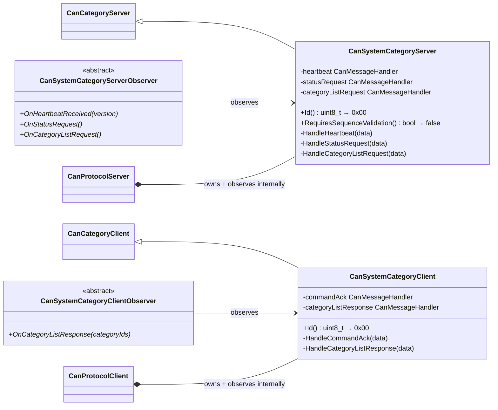
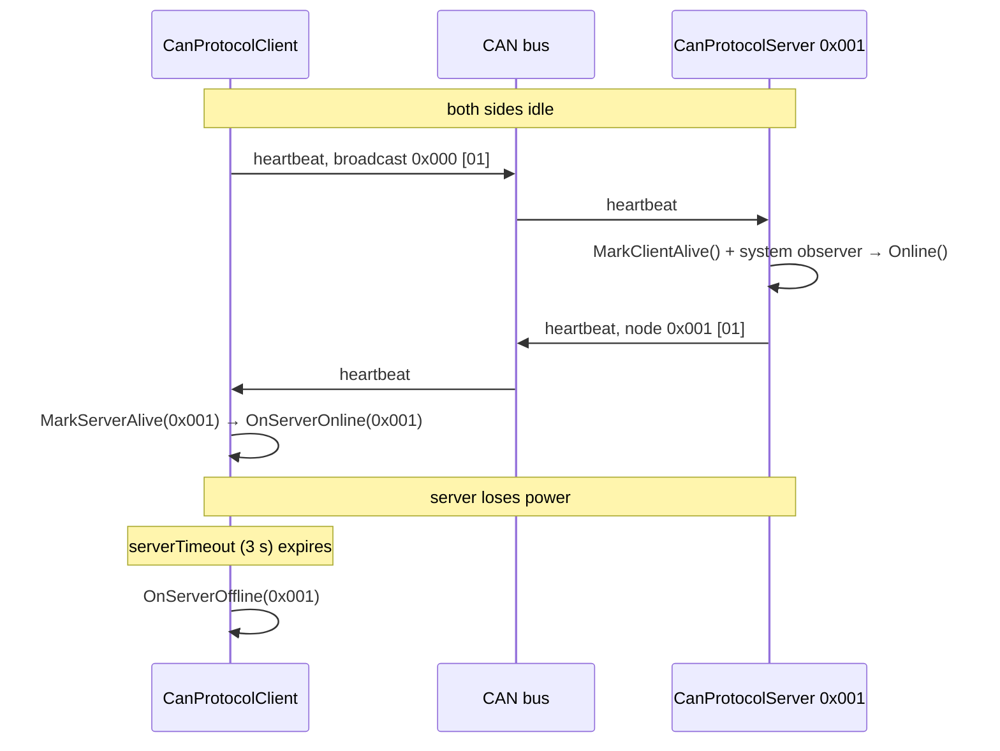
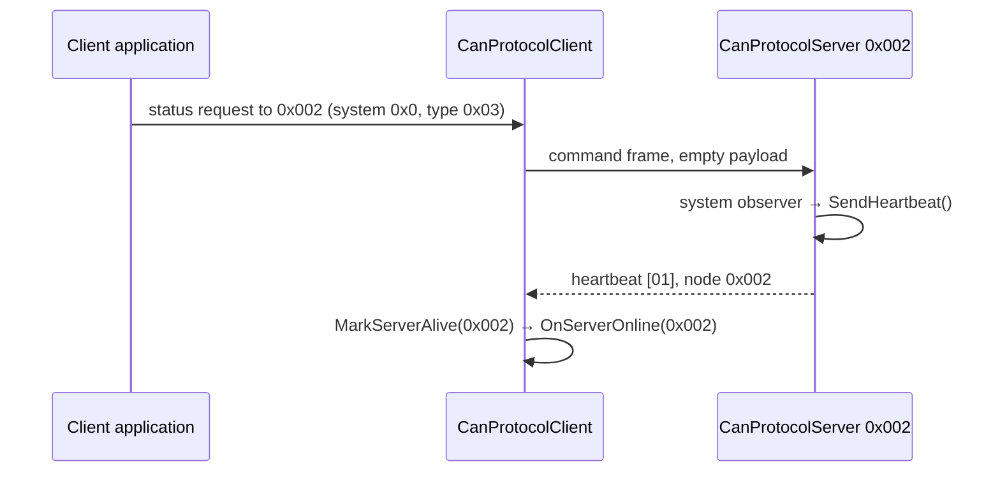
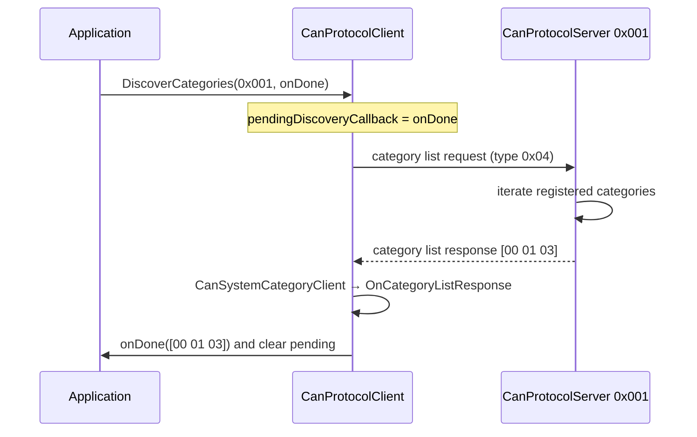

# The System Category

Category `0x0` is built into every node. It carries the four protocol-level
conversations that are not specific to any application: *are you there*,
*I received your command*, *tell me your state*, and *what can you do*. The
application never registers it and never sends through it — `CanProtocolServer`
and `CanProtocolClient` each construct their own instance and observe it
internally.

## 1. Message catalogue

| Type | Name | Direction | Payload |
|------|------|-----------|---------|
| `0x01` | Heartbeat | Server → client (addressed), client → all (broadcast) | 1 byte: protocol version |
| `0x02` | Command Acknowledgement | Server → client | 4 bytes: category, message type, status, expected sequence |
| `0x03` | Status Request | Client → server | empty |
| `0x04` | Category List Request | Client → server | empty |
| `0x05` | Category List Response | Server → client | 1–8 bytes: registered category IDs |

Note the message-type numbering: `0x01`, `0x03` and `0x04` are in the command
range (`0x00`–`0x7F`) and `0x02`, `0x05` are also in the command range
numerically — the system category predates and deliberately sidesteps the
command/response split, because heartbeats travel in both directions and an
acknowledgement is not a command. What keeps this unambiguous is the server's
receive filter: it only *acts* on message types it has handlers for, and its
system category registers handlers for `0x01`, `0x03` and `0x04` only.

## 2. The two halves



The two halves are **not** mirror images, and the asymmetry is informative:

| | Server side handles | Client side handles |
|-|---------------------|---------------------|
| `0x01` heartbeat | yes — the client's broadcast | no |
| `0x02` acknowledgement | no — it sends them | yes, as a recognised no-op |
| `0x03` status request | yes | no |
| `0x04` category list request | yes | no |
| `0x05` category list response | no — it sends them | yes |

A server's heartbeat arriving at the client is dispatched to
`CanSystemCategoryClient`, finds no handler for `0x01`, and `HandleMessage`
returns `false`. Nothing goes wrong: the client has already extracted the value
of that frame — proof of life — in `MarkServerAlive`, before dispatch
(Chapter 8, §3). Clients do not acknowledge, so an unhandled message type on the
client side is genuinely inert.

`RequiresSequenceValidation()` returns `false` on the server side. Heartbeats,
status requests and discovery are idempotent, and the client's heartbeat is a
broadcast that no per-server counter could meaningfully order.

## 3. The server's internal observer

`CanProtocolServer::SystemObserver` is a private nested class whose only job is
to turn system-category events into server behaviour:

```cpp
void CanProtocolServer::SystemObserver::OnHeartbeatReceived(uint8_t)
{
    server.NotifyObservers([](auto& observer) { observer.Online(); });
}

void CanProtocolServer::SystemObserver::OnStatusRequest()
{
    server.SendHeartbeat();
}

void CanProtocolServer::SystemObserver::OnCategoryListRequest()
{
    server.SendCategoryList();
}
```

| Event | Server behaviour | Application sees |
|-------|------------------|------------------|
| Heartbeat received | Notify `Online()` | `CanProtocolServerObserver::Online()` |
| Status request | Send a heartbeat immediately | nothing |
| Category list request | Send the registered IDs | nothing |

The protocol version byte carried in the heartbeat is deliberately **not**
passed on to the application observer: `Online()` takes no arguments. The
version exists on the wire for future negotiation, and today a mismatched
version is not rejected — a decision recorded here because it is the kind of
thing an integrator will want to know before deploying two firmware generations
on one bus.

## 4. Heartbeat and liveness, both directions



Both heartbeats are silence guards (Chapters 7 and 8): on a bus with ongoing
traffic neither side emits one, and both liveness timers are kept alive by that
traffic instead. The heartbeat exists for the idle case.

Two identifier details are worth fixing in mind:

- The **server's** heartbeat carries its own node ID, so the client learns which
  server is alive.
- The **client's** heartbeat is broadcast (`0x000`), because the client has no
  address. Every server accepts it, since the broadcast address passes each
  server's node filter.

## 5. Status request: heartbeat on demand

The status request exists so a client that has just started does not have to
wait a full heartbeat interval to discover who is on the bus:



Sending it is a raw transport call rather than a dedicated API — the system
category client exposes no `SendStatusRequest()` today, so an application that
wants one builds the frame through `client.Transport()`. Discovery
(`DiscoverCategories`) is the operation that *does* have a first-class API,
because parsing its answer needs a callback.

## 6. Category discovery



The response payload is the raw list of registered category IDs, in registration
order, with the system category (`0x00`) always first. An application typically
uses it to decide which of its own category clients to enable:

```cpp
client.DiscoverCategories(nodeId, [this](const hal::Can::Message& ids)
    {
        for (auto id : ids)
            if (id == myCategoryId)
                supported = true;
    });
```

Its limits are the ones listed in Chapter 8, §8: one outstanding discovery at a
time, no timeout, and the callback does not name the responding node.

## 7. Acknowledgement handling on the client

`CanSystemCategoryClient::HandleCommandAck` is, deliberately, empty:

```cpp
void CanSystemCategoryClient::HandleCommandAck(const hal::Can::Message&)
{
}
```

The work happens in `CanProtocolClient::HandleCommandAckFrame`, which runs
*before* category dispatch because it needs the source node ID that dispatch
does not carry. The handler exists so that the message type is recognised rather
than unhandled — a small piece of hygiene that keeps the category's registered
message types an accurate description of what the category understands.

The practical consequence for applications: **acknowledgement statuses are not
surfaced through an observer**. A client learns about a command's fate in one of
three ways:

1. The category's own response frame arrives (the usual case).
2. `OnCommandAckTimeout` fires (nothing arrived within `commandAckTimeout`).
3. A `sequenceError` acknowledgement silently resynchronises the counter, and
   the missing response tells the application the command did not run.

An application that needs the acknowledgement status itself — for example to
distinguish `invalidState` from `notImplemented` — must currently observe the
raw frame through its own means. This is a known simplification, not an
oversight: the categories that ship with the library carry their own status in
their own responses.

## 8. Design notes

**Why is the system category a category at all, rather than special-cased code
in the protocol object?** Because it makes the dispatcher uniform: there is
exactly one path from a received frame to a handler, and the protocol-level
messages travel it like everything else. It also means the system category is
subject to the same rules — one of the eight registration slots, the same
payload classes, the same observer pattern — which is a useful forcing function
on the design of those rules.

**Why does the server not expose the system category to the application?**
Because everything it does is already reflected in the server's own API:
`Online()`/`Offline()` for heartbeats, automatic answers for status and
discovery. Exposing it would let an application answer a status request
differently from the protocol's definition.

**Why does the client expose only discovery?** Because it is the only system
conversation whose result the application must interpret. The rest is
bookkeeping the client does on its behalf.
