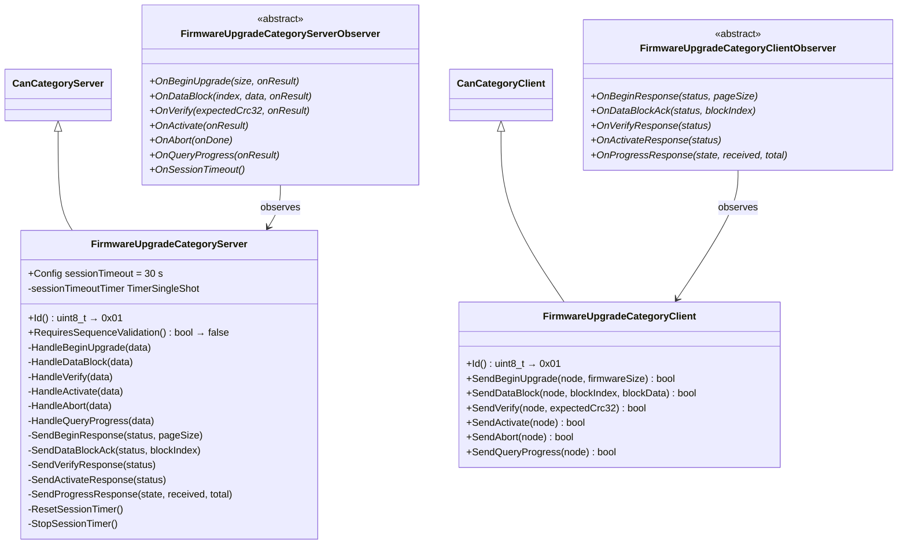
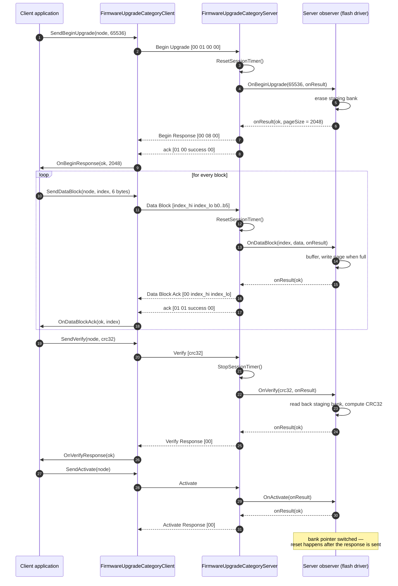
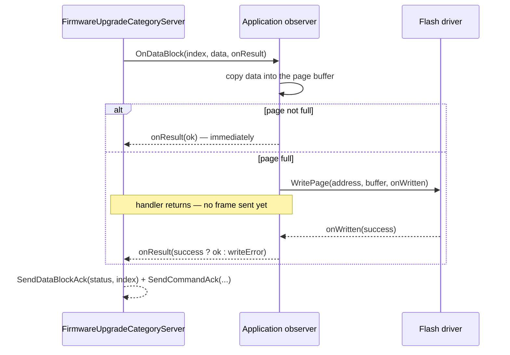
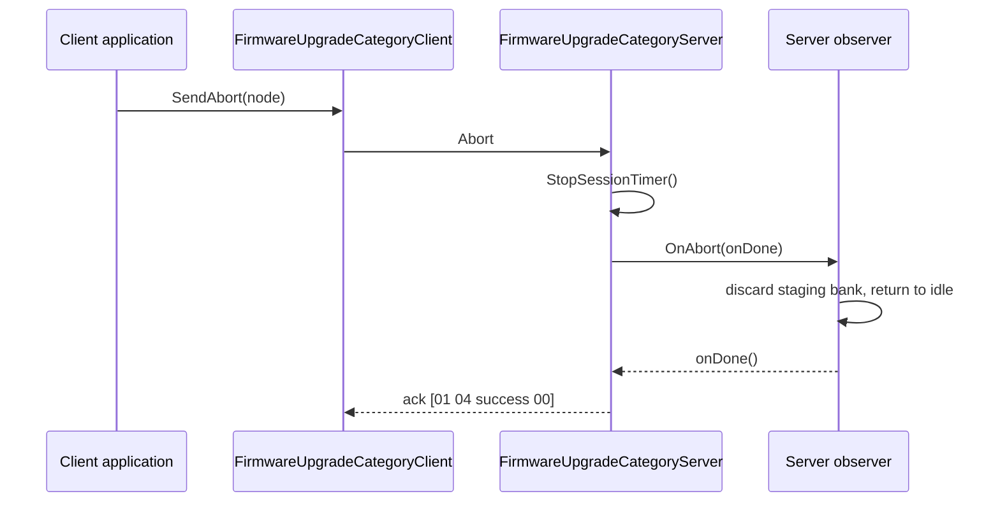
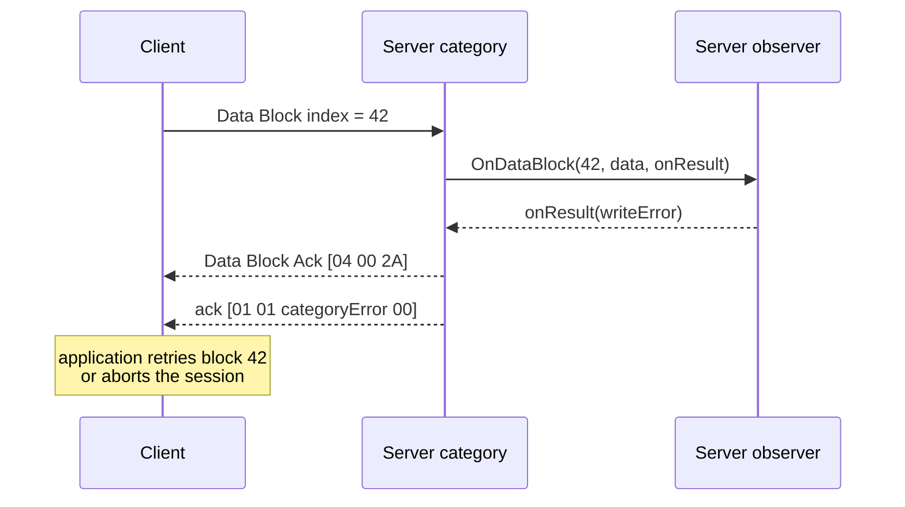
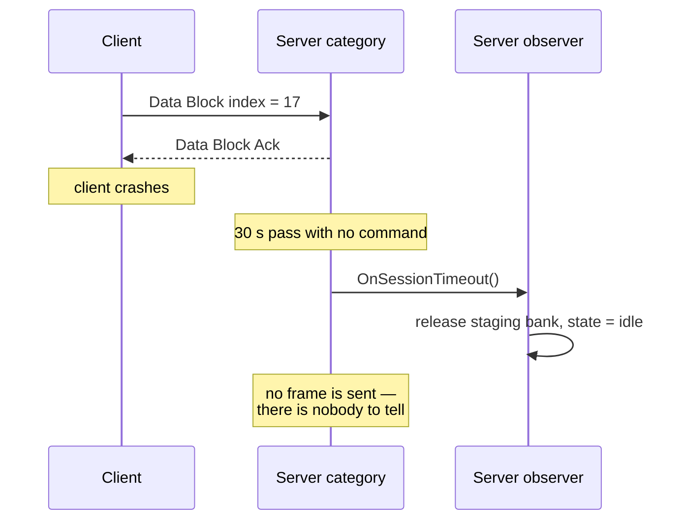

# The Firmware Upgrade Category

Category `0x1` transfers a firmware image from the client to a server, verifies
it and activates it. It is the most complete worked example in the library of a
category whose state lives in the **application**, not in the category: the
category owns message framing, session timing and response encoding, while the
flash layout, the CRC and the bank switch belong to the product.

## 1. Message catalogue

| Type | Name | Direction | Payload |
|------|------|-----------|---------|
| `0x00` | Begin Upgrade | client → server | `uint32` firmware size |
| `0x01` | Data Block | client → server | `uint16` block index, then up to 6 data bytes |
| `0x02` | Verify | client → server | `uint32` expected CRC32 |
| `0x03` | Activate | client → server | empty |
| `0x04` | Abort | client → server | empty |
| `0x05` | Query Progress | client → server | empty |
| `0x80` | Begin Response | server → client | `uint8` status, `uint16` page size |
| `0x81` | Data Block Ack | server → client | `uint8` status, `uint16` block index |
| `0x82` | Verify Response | server → client | `uint8` status |
| `0x83` | Activate Response | server → client | `uint8` status |
| `0x85` | Progress Response | server → client | `uint8` state, `uint16` blocks received, `uint16` total |

Response IDs follow the `0x80 + command` convention, which is why there is no
`0x84`: `Abort` (`0x04`) is answered with a plain acknowledgement rather than a
category response.

| `FwuState` | | `FwuError` | |
|---|---|---|---|
| `idle` | 0 | `ok` | 0 |
| `receiving` | 1 | `busy` | 1 |
| `verifying` | 2 | `invalidSize` | 2 |
| `complete` | 3 | `sequenceError` | 3 |
| `error` | 4 | `writeError` | 4 |
| | | `crcMismatch` | 5 |
| | | `notReady` | 6 |
| | | `invalidState` | 7 |
| | | `sessionTimeout` | 8 |

## 2. Classes



## 3. Why this category does not validate sequences

`RequiresSequenceValidation()` returns `false`, and the client sends every
command with `SendCommandWithoutSequence`. Two reasons, both practical:

1. **The block index already orders the transfer.** A duplicated or reordered
   block is detected by the application against its own expectation and answered
   with `FwuError::sequenceError` — a category-level error that says exactly
   which block was expected, which a protocol-level `sequenceError` could not.
2. **A sequence byte would cost one of the seven payload bytes.** With it, each
   data block would carry five bytes instead of six: a 17 % throughput loss on
   the longest transfer the protocol ever performs.

The trade-off is that the firmware category has no protocol-level replay
protection. On a bus where that matters, the transfer is still bounded by the
CRC check at the end: a replayed or lost block produces a CRC mismatch and the
image is not activated.

## 4. The session timer

The category owns exactly one piece of state: a single-shot timer that fires if
the client goes quiet mid-upgrade.

| Command | Effect on the timer |
|---------|---------------------|
| Begin Upgrade | `ResetSessionTimer()` — starts the session |
| Data Block | `ResetSessionTimer()` — each block extends it |
| Verify | `StopSessionTimer()` — the transfer is over |
| Activate | `StopSessionTimer()` |
| Abort | `StopSessionTimer()` |
| Query Progress | **no effect** — polling does not keep a stalled session alive |

On expiry the category notifies `OnSessionTimeout()` and does nothing else: it
sends no frame and changes no state, because the state it would change belongs
to the application. The application is expected to release its staging bank and
return to idle.

`Query Progress` deliberately not resetting the timer is the design decision
worth remembering here: a client that has crashed mid-transfer but whose
supervisor still polls progress must not be able to hold the server's flash
staging area open indefinitely.

## 5. A successful upgrade



Every command produces **two** frames back: the category's own response and a
protocol acknowledgement. That is not redundancy — they answer different
questions. The acknowledgement says "the command was well-formed and reached a
handler"; the response says "here is what happened". A handler that fails
answers `success` at the protocol level only when its own status is `ok`:

```cpp
observer.OnBeginUpgrade(firmwareSize, [this](FwuError status, uint16_t pageSize)
    {
        SendBeginResponse(status, pageSize);
        SendCommandAck(fwuBeginUpgradeId,
            status == FwuError::ok ? CanAckStatus::success : CanAckStatus::categoryError);
    });
```

`categoryError` in the acknowledgement is the signal that the detail is in the
category's own response frame.

## 6. The asynchronous handler pattern

Flash operations take milliseconds to seconds; nothing in can-lite may block for
that long. Every observer callback in this category therefore takes a completion
function as its last argument:

```cpp
virtual void OnDataBlock(uint16_t blockIndex, const hal::Can::Message& data,
    const infra::Function<void(FwuError)>& onResult) = 0;
```



The category holds no per-command state across that gap. Everything it needs to
build the response — the block index, the message type — is captured into the
completion lambda:

```cpp
NotifyObservers([this, blockIndex, payload](auto& observer)
    {
        observer.OnDataBlock(blockIndex, payload, [this, blockIndex](FwuError status)
            {
                SendDataBlockAck(status, blockIndex);
                SendCommandAck(fwuDataBlockId,
                    status == FwuError::ok ? CanAckStatus::success : CanAckStatus::categoryError);
            });
    });
```

Two consequences follow, and both are real constraints on the application:

- **The completion must be called exactly once.** Never calling it means the
  client waits until its acknowledgement timeout; calling it twice sends two
  responses for one command.
- **Commands may overlap if the application allows them to.** The category does
  not serialise: a second Data Block arriving before the first completion has
  run will be dispatched. An application that cannot handle that must reject the
  overlapping command with `busy`.

## 7. Failure paths

### Aborted transfer



Abort has no category response — only the acknowledgement — because there is no
status to report beyond "the session is over".

### Failed block write



Note that the session timer was reset when the block arrived, so a retry has the
full session timeout available.

### Session timeout



### Malformed payload

A `Begin Upgrade` with fewer than four payload bytes never reaches the observer:

```cpp
CanPayloadReader reader{ data };
auto firmwareSize = reader.ReadUInt32();

if (!reader.Valid())
{
    SendCommandAck(fwuBeginUpgradeId, CanAckStatus::invalidPayload);
    return;
}
```

The session timer is **not** started in that path, which is what stops a stream
of malformed commands from holding a session open.

## 8. Sizing and throughput

| Quantity | Value | Origin |
|----------|-------|--------|
| Data bytes per frame | 6 | 8 − 2 for the `uint16` block index |
| Maximum block index | 65535 | `uint16` |
| Maximum image, single frames | ≈ 384 KiB | 65536 × 6 bytes |
| Frames per command exchange | 3 | command, category response, acknowledgement |
| Practical throughput at 1 Mbit/s | ≈ 6 KiB/s | ~120 bits per frame including framing, three frames per block |

That throughput is the honest number for the stop-and-wait scheme the category
implements today: roughly a minute per 384 KiB. Three extensions are recorded in
the specification for when it is not enough — a windowed acknowledgement scheme,
a "set page" command to lift the 384 KiB ceiling, and ISO-TP for the data blocks
themselves (Chapter 9), which would carry a whole flash page in one PDU and
change the arithmetic entirely.

## 9. What the application must provide

The category deliberately delegates every product-specific decision. An
application implementing `FirmwareUpgradeCategoryServerObserver` owns:

| Concern | Typical implementation |
|---------|------------------------|
| Storage layout | Dual-bank A/B: run from the active bank, stage into the inactive one |
| Size validation | `OnBeginUpgrade` answers `invalidSize` if the image exceeds the staging bank |
| Concurrency | `OnBeginUpgrade` answers `busy` if a session is already open |
| Block ordering | Compare the index with the expected one; answer `sequenceError` on a gap |
| Page buffering | Accumulate 6-byte blocks until a flash page is full, then write |
| Verification | CRC32 over the staging bank, compared with the client's value |
| Activation | Switch the bank pointer and reset; ideally with a bootloader rollback if the new image fails to run |
| Timeout recovery | `OnSessionTimeout` discards the staging state |
| Authenticity | Signature verification, if required — the protocol provides none |

The last row is the one to read twice. can-lite authenticates nothing: any node
that can put frames on the bus can start an upgrade. Where that matters, the
image must carry its own signature and `OnVerify` must check it before the
category is allowed to report success.
