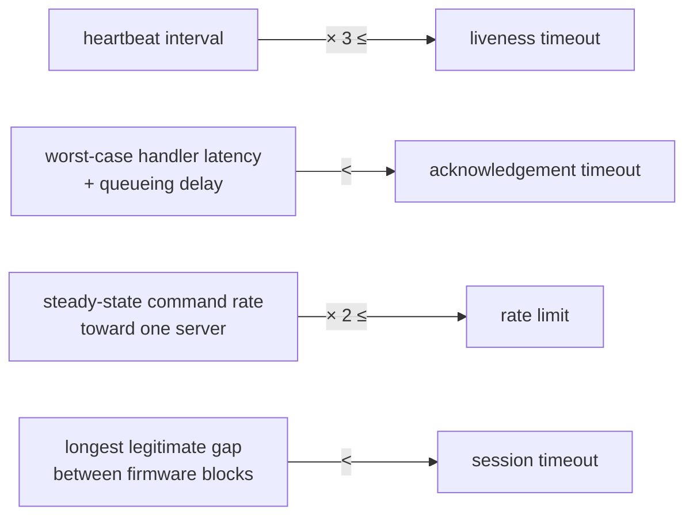

# Timing, Memory and Bus Budget

Everything can-lite consumes is fixed at build time or chosen at construction.
This chapter collects the arithmetic: which timers exist, how the tunable
parameters constrain each other, what the static memory is spent on, and how
much of the bus a traffic pattern uses.

The parameters themselves and what each one means are documented with the
components that own them — see
[Architecture and Design Decisions](../design/architecture.md) §9 and the
[Protocol Specification](../spec/can-protocol.md) §12.

## 1. Timer inventory

| Owner | Timer | Kind | Restarted by | On expiry |
|-------|-------|------|--------------|-----------|
| Server | heartbeat | single-shot | every outgoing frame from this node | send a heartbeat |
| Server | rate window | **repeating** | itself | reset the accepted-frame count |
| Server | client liveness | single-shot | every frame addressed to this node | report the client offline |
| Client | heartbeat | single-shot | every outgoing frame from this node | broadcast a heartbeat |
| Client | server liveness, one per slot | single-shot × 8 | every frame from that server | report that server offline |
| Client | acknowledgement, one per slot | single-shot × 8 | committing a command to that server | report the command unanswered |
| Firmware upgrade | session | single-shot | the commands that make progress | report the session expired |
| Segmentation sender | N_Bs | single-shot | sending a frame that awaits flow control | abort the transfer |
| Segmentation sender | separation | single-shot | each frame, when the peer asks for pacing | send the next frame |
| Segmentation receiver | N_Cr | single-shot | each accepted frame | abort the reassembly |

A fully loaded client — eight servers tracked, eight commands outstanding —
holds **seventeen** live timers. A server holds three, plus one per firmware
upgrade category and two per open segmentation channel. All of them are members;
none is allocated.

**Exactly one timer in the library is periodic.** An idle server has two timers
armed, an idle client one; everything else is dormant until something happens.

## 2. How the parameters constrain each other

The defaults work together; changing one in isolation is where trouble starts.



| Relationship | Why |
|--------------|-----|
| Liveness timeout at least three heartbeat intervals | A timeout must survive two lost heartbeats, or an idle bus flaps between online and offline (Chapter 10, §10.4) |
| Acknowledgement timeout above the worst-case handler latency | It must cover asynchronous work the observer defers — a flash write, a conversion — plus the queueing delay of a busy bus |
| Rate limit at twice the peak rate | The window is tumbling, so a burst straddling a reset delivers up to double (Chapter 10, §7.2) |
| Session timeout above the client's own block cadence | Usually dominated by the client's flash read or network fetch, not by the bus |

The limits that are **not** tunable, because they are compile-time properties:
registered categories per node, tracked servers per client, outbound queue
depth, segmentation channel ceiling, and the two segmentation timeouts and wait
limit. Raising any of them is a library change, and each has its own entry in
Chapter 10.

## 3. Static memory

can-lite allocates nothing, so its footprint is the sum of its members. The
counts are fixed by design; the per-element sizes depend on the toolchain, so
the honest way to get exact numbers is to ask the compiler for the size of the
composed objects on the target.

What the structure guarantees, independent of toolchain:

| Component | Fixed-count storage |
|-----------|---------------------|
| Frame transport | eight queued frames — identifier, payload and a completion each — plus two callback slots |
| Server | one transport, three timers, the system category, a handful of counters and flags |
| Client | one transport, one timer, the system category, eight sequence slots and eight liveness slots, each with a timer |
| Segmentation sender and receiver | one payload-sized buffer each, one or two timers, a few bytes of state |
| Segmentation channel | one sender, one receiver, three callback slots |
| Segmentation transport | its channels, a pointer array and two callback slots |
| Each category | its own members, plus one binding per message type |

The dominant term is almost always segmentation:

```text
segmentation bytes ≈ channels × (2 × maximum payload + per-channel overhead)
```

Four channels of one kibibyte is therefore about **8 KiB** of buffers, and two
channels of 128 bytes about **512 bytes** — and the arithmetic is deliberately
that obvious. This is the single most consequential memory decision an
integrator makes, and it is a hard ceiling rather than a performance knob: a
payload larger than the configured size is refused at both ends (Chapter 10,
§8.1).

Stack use is bounded by the deepest call chain — receive, segmentation,
category, observer, send. Nothing recurses except queue drain, and only if a
driver breaks the asynchronous-completion assumption (Chapter 10, §1.7).

## 4. Bus arithmetic

An extended CAN frame costs 67 bits of framing plus 8 bits per payload byte,
before bit stuffing; worst-case stuffing adds roughly a quarter of the stuffable
field.

| Frame | Payload bytes | Nominal bits | Worst case |
|-------|---------------|--------------|------------|
| Heartbeat | 1 | 75 | ≈ 91 |
| Acknowledgement | 4 | 99 | ≈ 121 |
| Typical validated command | 7 | 123 | ≈ 151 |
| Full frame | 8 | 131 | ≈ 160 |

Frame time for a full frame (nominal / worst case):

| Bitrate | Bit time | Full frame |
|---------|----------|------------|
| 125 kbit/s | 8 µs | 1.05 ms / 1.28 ms |
| 250 kbit/s | 4 µs | 524 µs / 640 µs |
| 500 kbit/s | 2 µs | 262 µs / 320 µs |
| 1 Mbit/s | 1 µs | 131 µs / 160 µs |

**What a rate limit means in bus load.** Five hundred full frames per second at
500 kbit/s is about 131 ms of bus time — roughly 13 %, leaving ample room for
other servers. The same limit at 125 kbit/s is over half the bus, and is
certainly too high: the limiter protects a *server's processing* budget, but at
low bitrates the bus is the scarcer resource.

**What a command exchange costs.** A validated command with a response is three
frames — command, response, acknowledgement — about 750 µs of bus time at
500 kbit/s.

**Firmware upgrade throughput.** Three frames carry six payload bytes, so the
line-rate bound is roughly 9 KiB/s at 500 kbit/s and 19 KiB/s at 1 Mbit/s. The
bound that actually applies is different:

| Bound | 500 kbit/s | 1 Mbit/s |
|-------|-----------|----------|
| Line rate only | ≈ 9.3 KiB/s | ≈ 18.7 KiB/s |
| With a 1 ms round trip, stop-and-wait | ≈ 5.4 KiB/s | ≈ 5.7 KiB/s |

The second row is the real one, and the reason is in Chapter 9, §3: the transfer
waits for each block to be acknowledged, so **round-trip latency sets the
throughput**. A 256 KiB image takes about 48 seconds — a service-window
operation, not a boot-time one.

**Segmented transfer.** A payload of *n* bytes costs one first frame plus
⌈(n − 6) / 7⌉ continuation frames and one flow-control frame. A kibibyte is
147 frames, about 39 ms at 500 kbit/s — some forty times more efficient per
payload byte than the same data sent as firmware blocks, because there is no
per-block turnaround.

## 5. Processing cost

| Operation | Cost |
|-----------|------|
| Identifier decode | a few shifts and masks, evaluable at compile time |
| Category lookup | linear over at most eight entries |
| Message-type lookup | linear over the category's bindings, typically two to six |
| Sequence validation | one increment, one comparison |
| Rate limiting | one comparison, one increment |
| Payload access | a bounds check and byte moves; no allocation |
| Segmentation channel lookup | linear over at most sixteen channels |

The fixed part of the receive path is well under a microsecond on a
hundred-megahertz core — one to two orders of magnitude below the frame time
even at 1 Mbit/s. **The bus, not the CPU, is the constraint.**

The caveat is that all of it runs inside the driver's receive callback, so a
handler doing real work there delays the next frame. That is the mechanical
reason behind the rule that observers neither allocate nor block, and that long
work is deferred behind a completion.

## 6. A worked budget

A four-axis machine: one controller and four drives at 500 kbit/s, each drive
receiving 200 set-points per second and returning telemetry at 100 Hz.

| Traffic | Frames/s | Bits/s | Bus load |
|---------|----------|--------|----------|
| Set-points, 7 bytes | 800 | 98 400 | 19.7 % |
| Acknowledgements, 4 bytes | 800 | 79 200 | 15.8 % |
| Telemetry, 8 bytes | 400 | 52 400 | 10.5 % |
| Heartbeats | ≈ 0 | ≈ 0 | ≈ 0 % |
| **Total** | **2000** | **230 000** | **46 %** |

Four observations worth carrying into a real design:

- **Acknowledgements are not free.** They cost nearly as much bus time as the
  commands they answer. A category that carries its own status — as the firmware
  upgrade category does — is where switching them off would save a third of the
  traffic.
- **Check the rate limit against the real rate.** Each drive here sits inside
  the default; a design with three times the set-point rate would be clipped
  silently (Chapter 10, §10.6).
- **Forty-six percent is a reasonable target.** Latency for low-priority frames
  grows quickly above roughly 60–70 % load, and telemetry is given a lower
  priority than commands and responses precisely so that it yields first.
- **Heartbeats vanish on a busy bus.** The silence-guard design contributes
  nothing to a loaded bus and appears only when the machine is idle — which is
  exactly when there is room for it.
