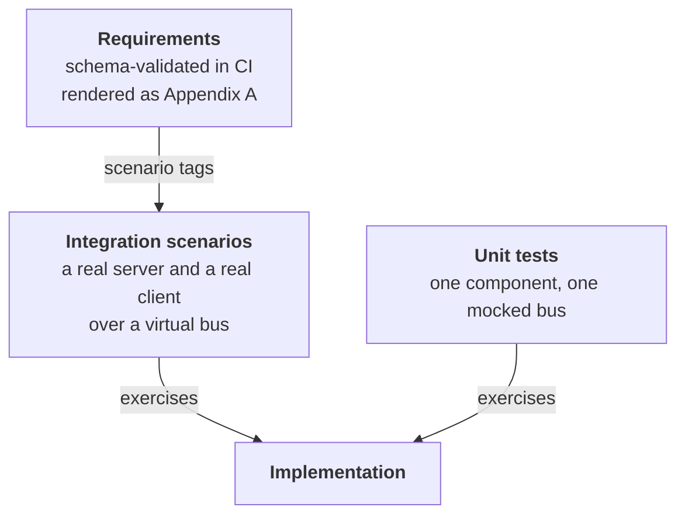

# Verification Strategy

The integration test architecture — the shared fixture, the virtual bus, the
strict-mock rule and the Gherkin layout — is described in
[Architecture and Design Decisions](../design/architecture.md) §12. This chapter
adds the two things that document does not state: **how the three levels of
verification relate to each other**, and **what is not covered**.

## 1. Three levels

| Level        | Question it answers                                                                                |
|--------------|----------------------------------------------------------------------------------------------------|
| Unit         | Does this component do what it promises, including at its bounds?                                  |
| Integration  | Do a real server and client, wired as an application would wire them, hold the right conversation? |
| Requirements | Is there a stated requirement behind this behaviour?                                               |

Coverage is organised so that each level answers what the others cannot: unit
tests own the bounds and the failure paths (every abort reason, every refusal,
every wrap-around); scenarios own the conversations (sequence validation,
discovery, rate limiting, error handling, firmware upgrade, and the reference
application category end to end); requirements own intent.

## 2. Three rules that shape every test

**Only strict mocks.** An unexpected call fails the test. That is what turns
"the server sends *nothing* when the frame is for another node" — half of
Chapter 10 — from an assumption into an assertion.

**Mock the bus, not the protocol.** Tests drive real protocol objects and
observe the frames handed to a mocked bus. Nothing above the hardware interface
is stubbed, so the tests exercise the dispatch, validation and timing code the
target runs.

**Time is controlled, never waited on.** The timer service is replaced by a
controllable clock, so a three-second liveness timeout and a thirty-second
firmware session cost the same as a heartbeat: microseconds. No test in can-lite
sleeps.

## 3. How the virtual bus earns its place

The virtual bus is a real implementation of the hardware interface rather than a
mock, which lets a scenario do two different things:

- **Couple two nodes** so the conversation is genuinely end to end.
- **Inject a frame** that no correct peer would send — a malformed
  acknowledgement, a wrong sequence number, an unknown category, a
  standard-identifier frame — and disconnect to model bus loss.

The second is what makes most of Chapter 10 testable at the integration level
rather than only in unit tests.

## 4. Traceability, honestly

Requirements are schema-validated on every push and pull request, and Appendix A
of this booklet is generated from the same files at build time, so the booklet
and the requirements cannot drift.

Two caveats are recorded in the requirements themselves and are worth repeating
where a reader will see them:

- **Traceability is not enforced.** Scenario tags naming requirements are a
  convention; no CI step fails when a requirement has no covering test.
- **Tagging is partial by construction.** Tags exist where the mapping is
  unambiguous; much of the suite verifies behaviour that several requirements
  imply jointly.

Closing the gap needs a schema change plus a CI step that fails on an uncovered
requirement — follow-up work, deliberately not approximated with an inaccurate
mapping.

## 5. Where verification stops

Stated plainly, because a verification chapter that lists only what is covered
is misleading:

| Not covered                                              | Why                                           | What stands in for it                                 |
|----------------------------------------------------------|-----------------------------------------------|-------------------------------------------------------|
| Arbitration and priority                                 | The virtual bus delivers in send order        | The bus-load arithmetic of Chapter 11                 |
| Bus errors, error frames, bus-off                        | Not modelled                                  | Failure paths driven through mocked send outcomes     |
| Timing on target hardware                                | Host tests use a virtual clock                | Budgets computed in Chapter 11, validated per product |
| More than two nodes end to end                           | The fixture couples one server and one client | Multi-server behaviour covered at the unit level      |
| Interoperability with third-party segmentation stacks    | No external stack in the loop                 | The deliberate omissions of Chapter 8, §6             |
| Long-run behaviour — counter wrap over days, timer drift | Not simulated                                 | Wrap-around tested directly at its boundary           |

Each row is a place where Chapter 10 relies on reasoning rather than on a test,
which is precisely why that chapter states the mechanism behind every outcome.
