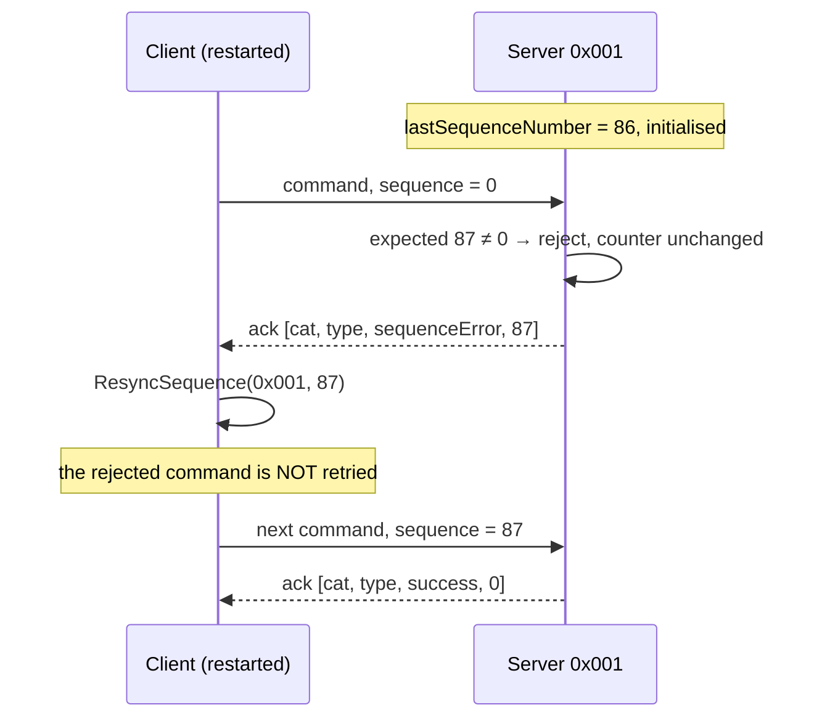
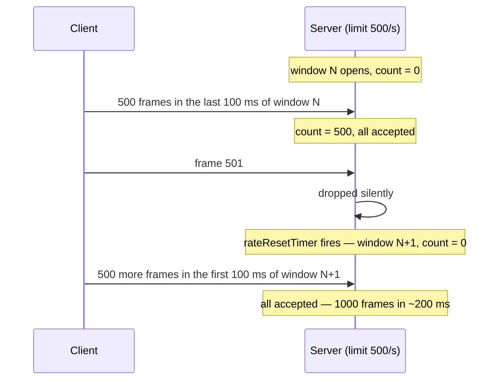
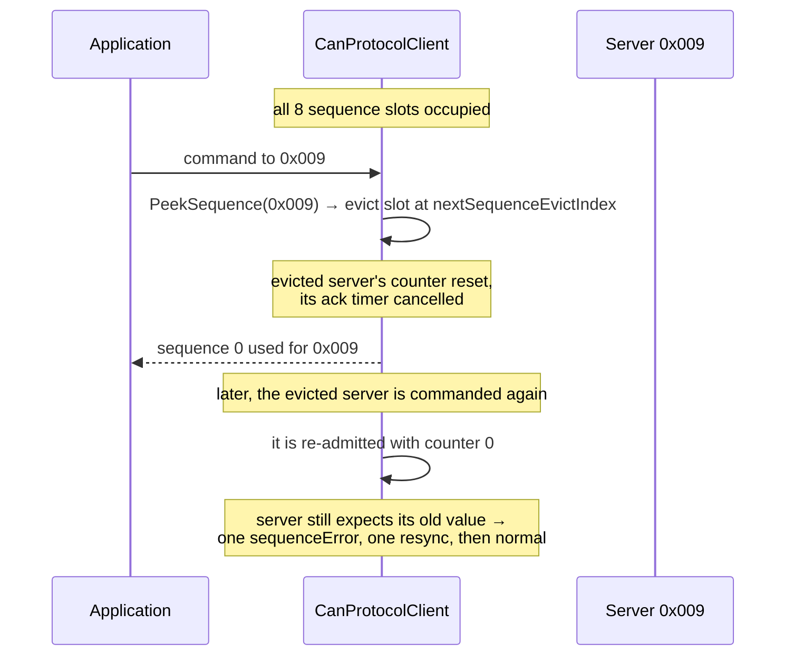
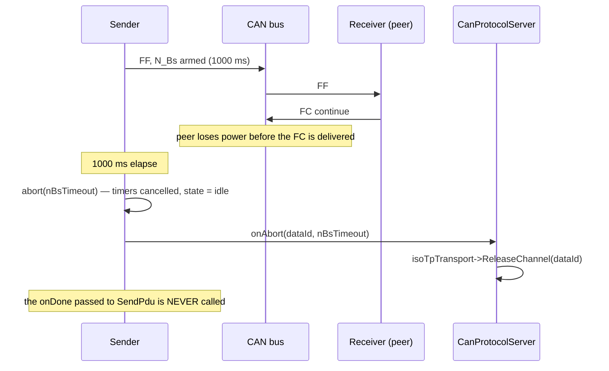

# Corner Cases and Failure Modes

This chapter is the catalogue of what happens when things go wrong: bounds are
hit, peers disappear, frames arrive out of order, and configurations disagree.
Each entry states the **condition**, the **mechanism** that handles it, and the
**observable outcome** — what an engineer with a bus analyser and a debugger
would actually see.

Entries marked **latent** describe behaviour that is correct today but rests on
an assumption worth knowing about; entries marked **design limit** are
deliberate simplifications with a stated cost.

## 1. Frame level

| # | Condition | Mechanism | Observable outcome |
|---|-----------|-----------|--------------------|
| 1.1 | 11-bit standard identifier received | `Is29BitId()` gate, first in both pipelines | Frame ignored entirely: no acknowledgement, no counter, no observer. can-lite coexists with other protocols in the standard-ID space |
| 1.2 | Zero-length payload on a sequence-validated category | `data.empty()` check before `ValidateSequence` | `invalidPayload` acknowledgement; the sequence counter is untouched |
| 1.3 | Zero-length payload on a non-validated category | Reaches the handler; `CanPayloadReader` under-runs | Handler's `Valid()` check produces `invalidPayload`; a handler that skips the check acts on zeros |
| 1.4 | 8-byte payload on a sequence-validated category | Sequence byte occupies `data[0]` | Only 7 bytes are available to the category — a payload designed for 8 silently loses its last field |
| 1.5 | Frame longer than 8 bytes | Impossible: `hal::Can::Message` caps at 8 | — |
| 1.6 | Driver delivers frames out of order | None — can-lite assumes ordering | Sequence-validated commands produce spurious `sequenceError`; the client resynchronises each time and progress stalls. **Latent**: ordering is a driver requirement (Chapter 4, §5) |
| 1.7 | Driver calls the send completion synchronously from inside `SendData` | None | `SendNextQueued()` recurses once per queued frame; with a full queue that is 8 frames deep. **Latent**: adapters defer completions through the event dispatcher for exactly this reason |

## 2. `CanFrameTransport`

| # | Condition | Mechanism | Observable outcome |
|---|-----------|-----------|--------------------|
| 2.1 | Ninth simultaneous send | `sendQueue.full()` → return `false` | The frame is dropped and never retried. What the caller sees depends on who it was: a category's `SendResponse` returns `false`; a client's `SendCommand` returns `false` **without** consuming a sequence number; an acknowledgement is simply lost |
| 2.2 | Acknowledgement lost to a full queue | Discarding completion ` {}` | The client's `commandAckTimeout` fires and `OnCommandAckTimeout` is notified. Deliberate: retrying an acknowledgement would deepen a queue that is already saturated |
| 2.3 | A send completion callback sends another frame | Queue advanced *before* the caller's callback runs | Safe. If the queue was empty the new frame goes out immediately; otherwise it is enqueued behind the one just started |
| 2.4 | Two owners call `SetOnSendNotification` | `really_assert(!onSendNotification)` | Immediate assertion, in release builds too. Only the protocol object may claim the slot |
| 2.5 | `SetNodeId()` called with frames already queued | None | Queued frames keep the identifier they were built with; only subsequent frames carry the new address |
| 2.6 | Bus off / transmission failure reported by the driver | `onDone(false)` propagates to the caller | Categories ignore it (their completions discard the flag); ISO-TP treats it as `abort(unexpectedFrame)`. **Design limit**: there is no bus-off recovery state machine in the library |

## 3. Server receive pipeline

| # | Condition | Mechanism | Observable outcome |
|---|-----------|-----------|--------------------|
| 3.1 | Frame addressed to another node | Node filter | Silent drop — answering would produce noise proportional to the number of servers |
| 3.2 | Broadcast frame (`0x000`) | Node filter admits it | Accepted and dispatched. This is how the client's heartbeat reaches every server |
| 3.3 | Rate limit reached inside the current window | `CheckAndIncrementRate()` | Silent drop, including any acknowledgement that would have been sent. `CanAckStatus::rateLimited` exists in the enum but is never emitted |
| 3.4 | Burst across a window boundary | Tumbling window reset by a 1 s `TimerRepeating` | Up to **2 × `maxMessagesPerSecond`** frames can be accepted in a short span straddling the reset. **Design limit**: a sliding window would cost per-frame timestamps |
| 3.5 | Response-range message type addressed to this node | `IsCommandMessageType()` gate | Silent drop; prevents a response from being dispatched as a command |
| 3.6 | System-category acknowledgement (`0x02`) or category list response (`0x05`) seen by another server | Numerically these are command-range types, so the type gate passes; the **node filter** rejects them | Silent drop, because those frames carry the sending server's own node ID. **Latent**: it is the node filter, not the type gate, that protects here |
| 3.7 | Frame for an unregistered category | `FindCategory()` returns `nullptr` | Silent drop — the frame may be legitimate traffic for a different server |
| 3.8 | Known category, unknown message type | `HandleMessage()` returns `false` | `unknownCommand` acknowledgement |
| 3.9 | Ninth category registered | `categories.size() >= canMaxRegisteredCategories` | `RegisterCategory` returns `false`. The system category occupies one slot, so seven are available to the application |
| 3.10 | Duplicate category ID registered | ID scan | `RegisterCategory` returns `false`, including for re-registering the same object |
| 3.11 | Registration failure ignored by the application | None | The category is invisible: its commands are dropped silently (3.7) and its client waits for responses that never arrive |
| 3.12 | Category destroyed without `UnregisterCategory` | None | The intrusive list holds a dangling entry; the next frame for that category dispatches into freed memory. **Latent**: lifetime is the application's responsibility |
| 3.13 | Category handles a command before registration | `really_assert(acknowledger != nullptr)` in `SendCommandAck` | Assertion. Only reachable when a test drives a category directly |

## 4. Sequence validation

| # | Condition | Mechanism | Observable outcome |
|---|-----------|-----------|--------------------|
| 4.1 | First validated command after server boot | `sequenceInitialized` is `false` → adopt | Accepted whatever its value. A client that restarts at 0 does not need the server to restart |
| 4.2 | Sequence gap | `ValidateSequence` rejects | `sequenceError` acknowledgement carrying the **expected** value; the counter does not advance |
| 4.3 | Repeated gaps | Rejection is idempotent | Every rejected command yields the same expected value; no drift, no lockout |
| 4.4 | Counter wraps 255 → 0 | `uint8_t` arithmetic | Transparent |
| 4.5 | Client process restarts mid-session | `sequenceError` + `ResyncSequence` | One command lost, one round trip wasted, traffic continues (§7.1) |
| 4.6 | Two clients command one server | One shared counter | Each client's commands break the other's ordering; both see near-continuous `sequenceError`. **Design limit**: one client per server (REQ-CAN-006.1) |
| 4.7 | Two sequence-validated categories used concurrently by one client | One shared counter on the server, one counter per server on the client | Correct: the client's single per-server counter feeds both categories, and the server validates one interleaved stream |
| 4.8 | Client uses `SendCommandWithoutSequence` against a validating server | None | The category payload's first byte is read as a sequence number: sporadic accept/reject plus a mis-parsed payload. The most confusing configuration error in the library |
| 4.9 | Client uses `SendCommand` against a non-validating server | None | The sequence byte is delivered to the handler as payload; the handler, which does not `Skip(1)`, mis-parses every field |
| 4.10 | Send rejected by a full queue | Peek/commit split | The sequence number is *not* consumed; the next attempt reuses it and the server sees no gap |

## 5. Client state

| # | Condition | Mechanism | Observable outcome |
|---|-----------|-----------|--------------------|
| 5.1 | Ninth server commanded | Round-robin eviction of a sequence slot | The evicted server's counter restarts at 0; its next command draws one `sequenceError` and resynchronises (§7.3) |
| 5.2 | Ninth server heard from | Round-robin eviction of a liveness slot | `OnServerOffline(evicted)` then `OnServerOnline(new)`. On a bus with nine or more active servers the observer sees continuous churn — the honest signal that the client is under-provisioned |
| 5.3 | Second command to a server before the first is acknowledged | The tracked `(category, messageType)` is replaced | The first acknowledgement no longer matches and does not cancel the timer; the timer now belongs to the second command |
| 5.4 | Two consecutive commands with the **same** `(category, messageType)` | `ClearAwaitingAck` matches on the pair only | The first command's acknowledgement cancels the second command's timer. A lost acknowledgement for the second is therefore not reported. **Design limit**: one outstanding command per server |
| 5.5 | Malformed acknowledgement (fewer than 4 bytes, or source node `0`) | Guard in `HandleCommandAckFrame` | Ignored: no timer cancelled, no counter changed; the acknowledgement timeout fires normally |
| 5.6 | Acknowledgement from a server other than the one commanded | Lookup is per node | Only that server's state is touched; the commanded server's timer keeps running |
| 5.7 | Stale `sequenceError` acknowledgement arrives late | `ResyncSequence` applies it unconditionally | The counter jumps to a value the server may have moved past, costing one further `sequenceError` round trip. Self-correcting |
| 5.8 | `CommitSequence` for a node that was never peeked | `really_assert(false)` | Assertion. Only reachable by bypassing `CanCategoryClient::SendCommand` |
| 5.9 | Second `DiscoverCategories` before the first answer | Single callback slot | The first callback is overwritten and never invoked |
| 5.10 | Category list response from a server other than the one asked | The callback does not carry a node ID | The pending callback is satisfied by the wrong server's list |
| 5.11 | Discovery never answered | No timeout exists | The callback stays pending forever. An application that needs a deadline arms its own timer |
| 5.12 | No observer attached | `NotifyObservers` null-checks | Safe: events are silently discarded |

## 6. Liveness and heartbeat

| # | Condition | Mechanism | Observable outcome |
|---|-----------|-----------|--------------------|
| 6.1 | Node is busy sending | Heartbeat timer restarted on every outgoing frame | No heartbeat is emitted at all; liveness is carried by the traffic itself |
| 6.2 | Client commands continuously and never emits a heartbeat | Server restarts `clientLivenessTimer` on **any** correctly addressed frame | The client is not declared offline for being busy |
| 6.3 | Bus goes silent | `serverTimeout` / `clientTimeout` expire | `OnServerOffline(nodeId)` on the client, `Offline()` on the server |
| 6.4 | Prolonged outage | `clientOnline` flag is checked before notifying | `Offline()` is emitted once, not once per timer expiry |
| 6.5 | Server heartbeat received by the client | `MarkServerAlive` runs before category dispatch | `OnServerOnline` fires; the frame then reaches `CanSystemCategoryClient`, which has no handler for it, and `HandleMessage` returns `false`. Harmless — clients do not acknowledge |
| 6.6 | Hardware acceptance filter excludes `0x000` | None | The server never sees the client's heartbeat and reports the client offline once per `clientTimeout` on an idle bus. **Latent**: the broadcast address must pass the filter (Chapter 4, §5) |
| 6.7 | Heartbeat protocol version differs between nodes | None — the version byte is not checked | Communication proceeds regardless. **Design limit**: version negotiation is on the wire but not implemented |

## 7. Four walkthroughs

### 7.1 Client restart mid-session

The lost command is the application's problem, deliberately: replaying a command
with side effects is a decision the protocol layer is not entitled to make. The
application learns of it through the missing response, or through
`OnCommandAckTimeout` if it was tracking one.

### 7.2 The rate-limit window boundary

The limit is a **tumbling** window, not a sliding one. Sizing a server's limit
therefore means budgeting for twice the number in the worst case, or configuring
half of what the hardware can absorb.

### 7.3 The ninth server

The cost of eviction is bounded and self-healing: one wasted round trip per
re-admission. The alternative — refusing to talk to a ninth server — would fail
harder for no benefit.

### 7.4 ISO-TP transfer abandoned mid-flight

The last line is the one that catches applications out. `onDone` means "the
transfer succeeded"; failure arrives on the abort callback, and an application
that only handles `onDone` will wait forever.

## 8. ISO-TP

| # | Condition | Mechanism | Observable outcome |
|---|-----------|-----------|--------------------|
| 8.1 | PDU longer than 4095 bytes, or than `MaxPduSize` | `Send()` guards | `SendPdu` returns `false`; nothing is transmitted |
| 8.2 | Empty PDU | `Send()` guard | `false` — ISO-TP has no zero-length encoding |
| 8.3 | Second `SendPdu` while the channel's sender is busy | `state != idle` guard | `false`. One transfer at a time per channel; more concurrency means more channels |
| 8.4 | No free channel | `AllocateFreeChannel()` returns `nullptr` | `SendPdu` / `RegisterReceiveChannel` return `false` |
| 8.5 | `RegisterReceiveChannel` with an identifier already used by another channel | Lookup matches on `dataId` **or** `fcId` | `false`; overlapping pairs would make routing ambiguous |
| 8.6 | Channel never released after an abort | Application responsibility | The slot stays occupied. The protocol layer's abort handler releases it automatically, so this only bites a direct user of `IsoTpTransportImpl` |
| 8.7 | No flow control within 1000 ms | N_Bs timer | `abort(nBsTimeout)` |
| 8.8 | No consecutive frame within 1000 ms | N_Cr timer | `abort(nCrTimeout)`; the partial PDU is discarded |
| 8.9 | 17 consecutive FC `wait` frames | `waitCount > nWftMax` | `abort(waitLimitExceeded)` |
| 8.10 | Peer answers FC `overflow` | Flow-status check | `abort(overflow)` |
| 8.11 | Consecutive frame with an unexpected sequence number | SN comparison | `abort(unexpectedFrame)`; the partial PDU is discarded |
| 8.12 | Sequence number wraps 15 → 0 | `(sn + 1) & 0x0F` on both sides | Transparent; PDUs longer than 15 frames are ordinary |
| 8.13 | FF declaring a length of 7 or less | Length check | `abort(unexpectedFrame)` — such a PDU must be a single frame |
| 8.14 | FF shorter than 8 bytes | Size check | `abort(unexpectedFrame)` |
| 8.15 | FF declaring more than the buffer holds | Capacity check | FC `overflow` **sent**, then `abort(overflow)` — the peer is waiting and must be told |
| 8.16 | SF longer than the buffer | Capacity check | `abort(overflow)`, **no** FC sent — the peer has already finished |
| 8.17 | SF arrives mid-reassembly | Partial state discarded | The SF is delivered as a complete PDU |
| 8.18 | Unsolicited CF (receiver idle) | State check | Ignored silently — not an error |
| 8.19 | Extra CF after the PDU is complete | Receiver is back in `idle` | Ignored |
| 8.20 | CF carrying more bytes than remain | `assemblyBuffer.size() >= expectedTotalLength` guard | Surplus bytes dropped; padding from a padding-using peer is therefore harmless on the last CF |
| 8.21 | Raw send fails mid-transfer | Completion reports `false` | `abort(unexpectedFrame)` — the reason is imprecise but the outcome is right |
| 8.22 | Reserved STmin value (`0x80`–`0xF0`, `0xFA`–`0xFF`) | `StMinToDuration` | Treated as 127 ms, the standard's conservative reading |
| 8.23 | Peer requires 8-byte padded frames | can-lite never pads | Interoperation failure. **Design limit** (Chapter 9, §8) |

## 9. Category level

| # | Condition | Mechanism | Observable outcome |
|---|-----------|-----------|--------------------|
| 9.1 | Handler forgets `Skip(1)` on a validated category | None | Every field is shifted by one byte; values are plausible but wrong. Not detectable at compile time |
| 9.2 | Handler forgets the `Valid()` check | Reader returns zeros | The command executes with zeroed parameters |
| 9.3 | Completion function never called | None | No response and no acknowledgement; the client's ack timeout fires |
| 9.4 | Completion function called twice | None | Two responses and two acknowledgements for one command |
| 9.5 | Overlapping commands in a stateful category | None — the category does not serialise | A second command is dispatched while the first is still pending. A category that cannot cope must answer `busy` / `invalidState` itself |
| 9.6 | Firmware upgrade: client crashes mid-transfer | Session timer (default 30 s) | `OnSessionTimeout()`; the application releases its staging state. No frame is sent — there is nobody to tell |
| 9.7 | Firmware upgrade: `Query Progress` polled by a supervisor while the client is dead | Query does **not** reset the session timer | The session still times out, as intended |
| 9.8 | Firmware upgrade: block lost or replayed | Application compares block indices | `FwuError::sequenceError` in the Data Block Ack; the CRC check at the end is the backstop |
| 9.9 | Observer callback allocates or blocks | None | Heap use on a no-heap target, or a stalled receive path. The rule is stated but not enforced |

## 10. Configuration and topology

| # | Condition | Mechanism | Observable outcome |
|---|-----------|-----------|--------------------|
| 10.1 | Server configured with node ID `0x000` | `really_assert(config.nodeId != canBroadcastNodeId)` | Assertion at construction |
| 10.2 | Two servers sharing a node ID | None | Both accept the same commands and both answer; the client attributes every response to one node and their sequence counters diverge. Node IDs must be unique by construction |
| 10.3 | Two `CanProtocolServer` objects on one `hal::Can` | `ReceiveData` installs a single callback | The second construction replaces the first's callback: the first server stops receiving entirely |
| 10.4 | `heartbeatInterval` ≥ peer's `serverTimeout` / `clientTimeout` | None | On an idle bus the peer times out before the heartbeat arrives, producing an online/offline flap. Keep the timeout at least 2–3 heartbeat intervals (Chapter 14) |
| 10.5 | `commandAckTimeout` shorter than the server's worst-case handler latency | None | Spurious `OnCommandAckTimeout` for commands that are simply slow |
| 10.6 | `maxMessagesPerSecond` below the client's steady-state command rate | Rate limiter | Commands are dropped silently, and the client sees acknowledgement timeouts with no explanation on the bus |

## 11. What is deliberately not handled

| Not handled | Consequence | Mitigation |
|-------------|-------------|------------|
| Authentication and integrity | Any node on the bus can command any server, including a firmware upgrade | Application-level signature checks; physical bus security |
| Encryption | Payloads are visible to every node | Application-level encryption if required |
| Replay by an attacker | Sequence numbers deter accidents, not adversaries | Application-level nonces or signatures |
| Bus-off recovery | The library reports send failures but has no recovery state machine | Driver-level recovery, plus the liveness observers to detect the outage |
| Duplicate node-ID detection | Silent misbehaviour (10.2) | Assign IDs by construction or by a provisioning step |
| Priority inversion inside the send queue | The eight-slot queue is FIFO, not priority-ordered: an emergency frame queued behind telemetry waits for it | Keep the queue shallow by not bursting; prioritisation happens on the bus, not in the queue |
| More than 8 servers, 8 categories, 8 queued frames | Eviction, refusal, or a dropped frame as catalogued above | Compile-time constants; raising them is a library change |
