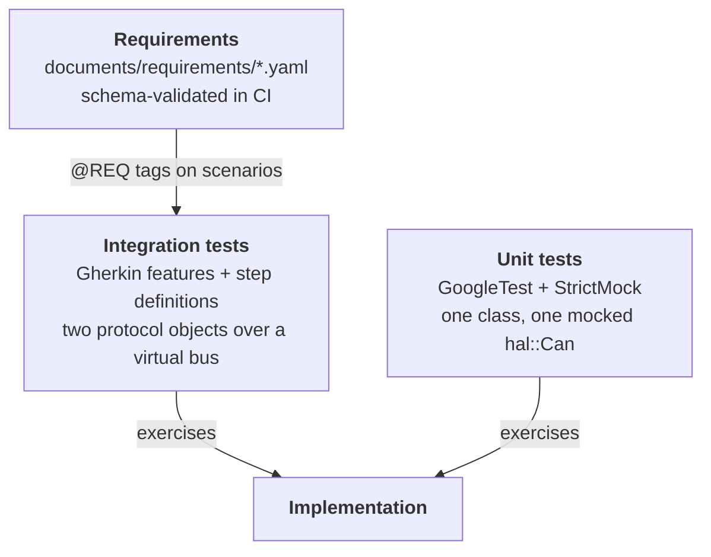
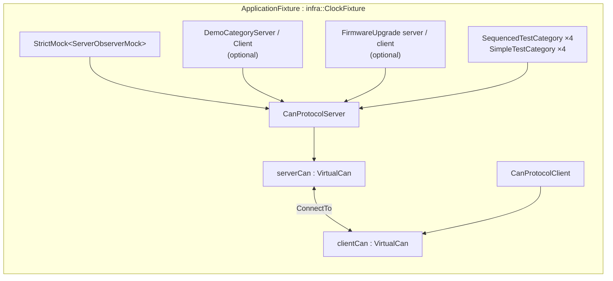

# Verification Strategy

can-lite is verified at three levels: unit tests around each class,
behaviour-driven integration tests over a virtual bus, and a requirements
catalogue the scenarios trace back to. All of it runs on the host, in
milliseconds, with no hardware and no wall-clock waiting.

## 1. The three levels



| Level | Question it answers | Location |
|-------|---------------------|----------|
| Unit | Does this class do what its header promises, including at its bounds? | `can-lite/<module>/test/Test*.cpp` |
| Integration | Do a real server and a real client, wired as an application would wire them, produce the right conversation? | `integration_tests/` |
| Requirements | Is there a stated requirement behind this behaviour? | `documents/requirements/*.yaml`, rendered in Appendix A |

## 2. Unit tests

```bash
cmake --preset host
cmake --build --preset host-Debug
ctest --preset host
```

| Test binary | Covers |
|-------------|--------|
| `TestCanProtocolCore` | Identifier construction and extraction, priority and category predicates |
| `TestCanFrameTransport` | Send queue, completion ordering, queue-full rejection, send notification |
| `TestCanPayload` | Reader/writer bounds, stickiness, big-endian layout, fixed-point round trips |
| `TestCanMessageHandler` | Binding a message type ID to a member function, PDU opt-in |
| `TestCanSystemCategory` | Heartbeat, status request and discovery handling on both sides |
| `TestCanProtocolServer` | Receive pipeline, rate limiting, sequence validation, registration limits, liveness |
| `TestCanProtocolClient` | Sequence peek/commit, resynchronisation, acknowledgement timeout, server tracking |
| `TestFirmwareUpgradeCategoryServer` / `...Client` | Message encoding, session timer, asynchronous completions |
| `TestIsoTpFrameCodec` | PCI encode/decode, STmin conversion including reserved values |
| `TestIsoTpSender` / `TestIsoTpReceiver` | Both state machines, including every abort path |
| `TestIsoTpChannel` / `TestIsoTpTransportImpl` | Channel routing, allocation, release, overlapping identifiers |

Three rules apply to every one of them, and they are not negotiable in this
codebase:

**Only `testing::StrictMock<>`.** `NiceMock`, `NaggyMock` and bare mock classes
are forbidden. An unexpected call is a test failure, which is what makes
"the server sends *nothing* when the frame is for another node" an assertion
rather than an assumption.

**Mock `hal::Can`, not the protocol.** Tests drive real `CanProtocolServer` and
`CanProtocolClient` objects and observe the frames they hand to the mocked bus.
Nothing above the HAL is stubbed out, so the tests exercise the same dispatch,
validation and timer code the target runs.

**Time is controlled, never waited on.** `infra::ClockFixture` supplies the
timer service, and `ForwardTime()` advances it:

```cpp
ForwardTime(std::chrono::seconds(3));
```

A liveness timeout test therefore costs microseconds, and a firmware session
timeout test costs the same as a heartbeat test.

## 3. Integration tests

The integration suite uses
[cucumber-cpp-runner](https://github.com/philips-software/amp-cucumber-cpp-runner)
with Gherkin feature files:

```text
integration_tests/
├── features/          can_bus_transport, category_discovery, custom_category,
│                      error_handling, firmware_upgrade, rate_limiting,
│                      sequence_validation, system_category
├── hooks/             scenario lifecycle
├── steps/             one step-definition file per feature
└── support/           ApplicationFixture, VirtualCan, TestCategories, Mocks
```

A scenario reads as protocol behaviour rather than as code:

```gherkin
Feature: Sequence Validation

  Background:
    Given a CAN bus with a server at node 1 and rate limit 500
    And a CAN bus client connected to the same bus
    And a sequenced test category with ID 3 is registered on the server

  @REQ-CAN-017
  Scenario: First command is accepted regardless of sequence value
    When the client sends a command to category 3 with sequence number 42
    Then the server category handler shall have received 1 command

  Scenario: Duplicate sequence number is rejected
    When the client sends a command to category 3 with sequence number 1
    And the client sends a command to category 3 with sequence number 1
    Then the server category handler shall have received 1 command
```

The `@REQ-CAN-017` tag is the traceability link back to Appendix A.

### `ApplicationFixture`

Every scenario shares one fixture type, so the tests exercise the same
composition an application performs:



| Fixture facility | Purpose |
|------------------|---------|
| `RegisterDemoCategory()` | Wires the reference application category (`0x3`) on both sides |
| `RegisterDemoCategoryServerOnly()` | Server without a matching client, for one-sided scenarios |
| `RegisterFirmwareUpgrade()` | Wires the firmware upgrade pair |
| `RegisterSequencedCategory(id)` / `RegisterSimpleCategory(id)` | Categories that differ only in sequence policy, for validation and discovery tests |
| Captured completion functions | `capturedPingDone`, `capturedQueryValueResult`, `capturedFailResult` let a step complete an asynchronous handler later, exactly as flash or an actuator would |

Optional components live in `std::optional<T>` members so a scenario pays only
for what it registers, and the fixture is retrieved in a step with
`context.Get<ApplicationFixture>()`.

> **The one trap:** never capture a `shared_ptr` to the fixture inside a lambda
> stored on the fixture. That is a reference cycle, and it leaks the fixture
> across scenarios — the mock expectations of one scenario then fire in the
> next.

### `VirtualCan`

`VirtualCan` is a real `hal::Can`, not a mock. `ConnectTo` couples two
instances so one's `SendData` lands in the other's receive callback;
`InjectFrame` pushes a frame straight into the receive callback, which is how a
test produces something no correct peer would send:

| Injected | Verifies |
|----------|----------|
| 11-bit identifier | Silently discarded (Chapter 13, §1.1) |
| Empty payload on a validated category | `invalidPayload` acknowledgement |
| Wrong sequence number | `sequenceError` with the expected value |
| Unknown category or message type | Silent drop / `unknownCommand` |
| Malformed acknowledgement | Ignored by the client |
| `Disconnect()` | Liveness timeouts on both sides |

## 4. What each feature file establishes

| Feature | Establishes |
|---------|-------------|
| `can_bus_transport` | 29-bit-only reception, identifier field encoding, node addressing and broadcast |
| `system_category` | Heartbeat exchange, status request, online/offline transitions |
| `category_discovery` | Category list request and response, registration order, unregistered categories |
| `custom_category` | The full application-category path end to end, using the demo category |
| `sequence_validation` | First-command adoption, ordering, duplicates, gaps, wrap-around, resynchronisation |
| `rate_limiting` | Acceptance up to the limit, silent drop beyond it, window reset |
| `error_handling` | `invalidPayload`, `unknownCommand`, category errors, malformed frames |
| `firmware_upgrade` | Begin/block/verify/activate, abort, failed writes, session timeout |

## 5. Traceability

Requirements live as YAML and are schema-validated on every push and pull
request:

```yaml
- id: REQ-CAN-017
  title: Sequence number validation
  shall: >
    The server shall validate that each received command carries a
    sequence number equal to (previous + 1) modulo 256 ...
```

The CI pipeline (`requirements-validation.yml`) validates them against
`documents/tools/requirement.schema.json` and renders the requirements PDF.
Appendix A of this booklet is generated from the same files at build time, so
the booklet and the requirements can never drift.

Two honest caveats, both recorded in the requirements file itself:

- **Traceability is not yet enforced.** The schema forbids a `tests:` field on a
  requirement, and no CI step cross-references test names against requirement
  IDs. The `@REQ-*` tags on scenarios are therefore a convention, not a gate.
- **Coverage is partial by construction.** `@REQ` tags exist on the scenarios
  where the mapping is unambiguous; the rest of the suite verifies behaviour
  that several requirements imply jointly.

Closing that gap needs a schema change plus a CI step that fails when a
requirement has no covering test — tracked as follow-up work rather than
approximated with an inaccurate mapping.

## 6. The rest of the pipeline

| Workflow | What it does |
|----------|--------------|
| `ci.yml` | Configure, build and run `ctest` across the presets |
| `linting-formatting.yml` | MegaLinter (C/C++, Markdown, YAML, GitHub Actions, spelling) with `clang-format` applied |
| `static-analysis.yml` | Static analysis and SonarQube reporting |
| `requirements-validation.yml` | Requirement schema validation and requirements PDF |
| `build-booklet.yml` | This booklet: PDF plus the static site, published to Pages on `main` and attached to every release |

Warnings are errors (`CMAKE_COMPILE_WARNING_AS_ERROR=On`), and a coverage
preset (`cmake --preset coverage`) produces coverage data for the same tests.

## 7. What is not covered by tests

Stated plainly, because a verification chapter that only lists what is tested is
misleading:

| Not covered | Why | How it is mitigated |
|-------------|-----|---------------------|
| Real bus arbitration and priority | `VirtualCan` delivers in send order | Priority effects are reasoned about (Chapter 14), not measured |
| Bus errors, error frames, bus-off | Not modelled by the virtual bus | Failure paths are exercised through mocked send completions |
| Timing on target hardware | Host tests use a virtual clock | Budgets are computed (Chapter 14) and validated on hardware per product |
| More than two nodes end to end | The fixture connects one server and one client | Multi-server behaviour is unit-tested against mocks |
| Interoperability with third-party ISO-TP stacks | No external stack in the loop | The deliberate omissions are documented (Chapter 9, §8) |
| Long-run behaviour (counter wrap over days, timer drift) | Not simulated | Wrap-around is unit-tested directly at its boundary |
