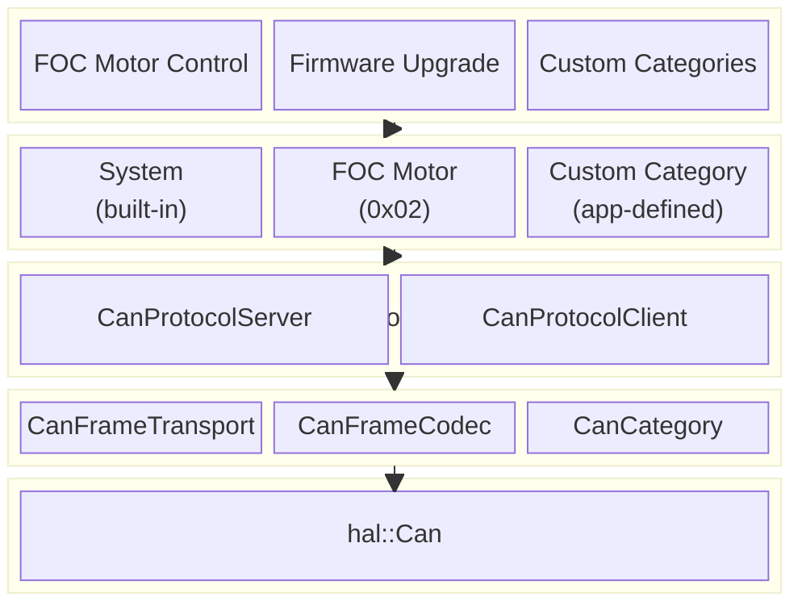
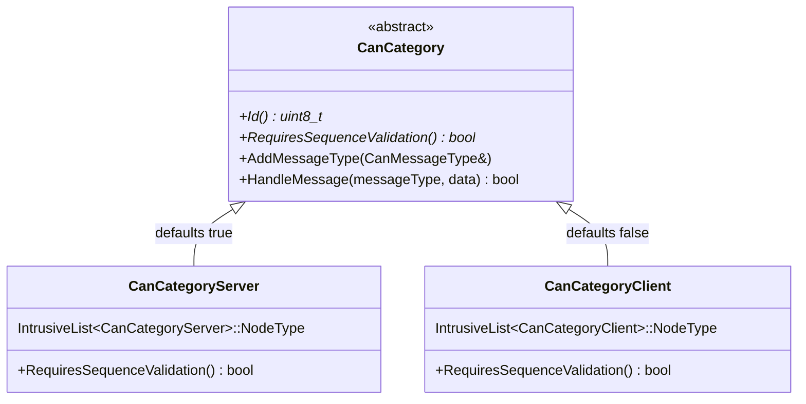
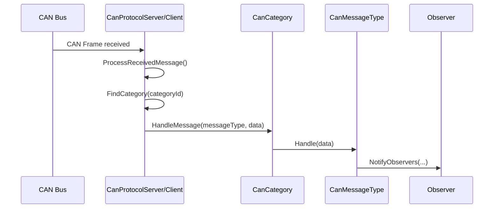
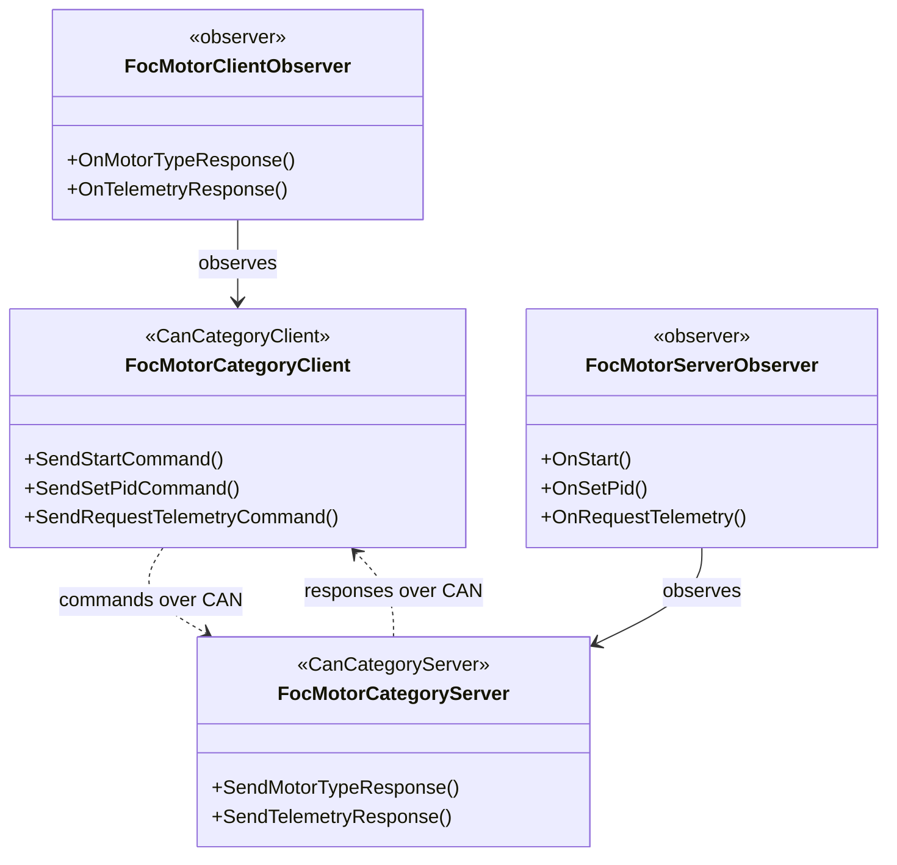

# can-lite: Architecture & Design Decisions

**Status:** Living document
**Last updated:** 2026-03-09

## 1. Overview

can-lite is a lightweight CAN bus protocol library implementing a client-server model over CAN 2.0B (29-bit extended identifiers). It is designed for bare-metal embedded systems with strict constraints: no heap allocation, bounded memory, and deterministic timing.



## 2. Design Principles

| Principle | Rationale |
|-----------|-----------|
| **No heap allocation** | Target MCUs have limited SRAM; all containers use `infra::BoundedVector`, `infra::BoundedDeque`, `infra::Function`, etc. from embedded-infra-lib. |
| **Type-safe server/client separation** | Prevents accidental registration of a client-side category handler on the server (and vice versa) at compile time. |
| **Observer pattern over callbacks** | Consistent notification mechanism using `infra::Subject` / `infra::SingleObserver`. Avoids storing `infra::Function` objects for event dispatch; observers auto-attach and auto-detach on construction/destruction. |
| **Fixed-point encoding** | Floating-point values are transmitted as scaled integers to avoid FPU dependencies and ensure deterministic wire representation. |
| **Extensible via categories** | New functionality is added by implementing a category handler — no protocol core changes required. |

## 3. Category Type Hierarchy

A key architectural decision is the **compile-time separation** of server-side and client-side categories. This prevents a `FocMotorCategoryClient` from being accidentally registered on a `CanProtocolServer`.



**`CanCategory`** holds the shared logic: a list of `CanMessageType` handlers, message dispatch via `HandleMessage()`, and the pure virtual `Id()` and `RequiresSequenceValidation()`.

**`CanCategoryServer`** and **`CanCategoryClient`** each carry their own `IntrusiveList` node type, making them incompatible with each other's lists. `CanProtocolServer` holds an `IntrusiveList<CanCategoryServer>` and `CanProtocolClient` holds an `IntrusiveList<CanCategoryClient>`, so type safety is enforced at the compiler level.

Default sequence validation:
- **Server categories** default to `true` — incoming commands carry a sequence byte for replay protection.
- **Client categories** default to `false` — responses do not require sequence validation.

## 4. Message Type Dispatch

Each category contains a set of `CanMessageType` subclasses, registered via `AddMessageType()` in the category constructor. When a frame arrives:

1. `CanProtocolServer`/`CanProtocolClient` extracts the category ID and message type from the 29-bit CAN identifier.
2. The corresponding category's `HandleMessage()` is called.
3. `HandleMessage()` iterates the registered message types and dispatches to the matching handler.
4. The handler parses the payload and notifies the observer.



## 5. Observer Pattern

All category handlers use `infra::Subject<Observer>` / `infra::SingleObserver<Observer, Subject>` for event notification. This replaces earlier `infra::Function` callbacks.

**Key properties:**
- **Single observer**: Each subject supports exactly one observer (`infra::SingleObserver`). This matches the 1:1 relationship between a category instance and its consumer.
- **Auto-attach/detach**: The observer attaches in its constructor and detaches in its destructor — no manual registration needed.
- **Zero-cost when unobserved**: `NotifyObservers()` checks for a null observer pointer before dispatching, making it safe to call with no observer attached.

**Example — FOC Motor Category (Server side):**

```cpp
// Observer interface (pure virtual callbacks for each command)
class FocMotorCategoryServerObserver
    : public infra::SingleObserver<FocMotorCategoryServerObserver, FocMotorCategoryServer>
{ ... };

// Subject (the category handler)
class FocMotorCategoryServer
    : public CanCategoryServer
    , public infra::Subject<FocMotorCategoryServerObserver>
{ ... };

// Application attaches by constructing an observer
class MyMotorHandler : public FocMotorCategoryServerObserver
{
public:
    MyMotorHandler(FocMotorCategoryServer& server)
        : FocMotorCategoryServerObserver(server) {}
    void OnStart() override { /* start motor */ }
    ...
};
```

## 6. System Category Design

The System category (ID `0x00`) is a **built-in** category that handles protocol-level concerns: heartbeat, status request, command acknowledgement, and category discovery. It is split into server and client variants.

### Server side: `CanSystemCategoryServer`

The system category on the server is **fully automatic** — no public API is exposed to the application developer. `CanProtocolServer` creates an internal observer that reacts to system messages:

| Message | Internal behavior |
|---------|-------------------|
| Heartbeat received | Notifies `CanProtocolServerObserver::Online()` |
| Status request | Sends heartbeat response |
| Category list request | Sends list of registered category IDs |

The application interacts with `CanProtocolServer` only through `RegisterCategory()` and the `CanProtocolServerObserver` (Online/Offline). All system plumbing is hidden.

### Client side: `CanSystemCategoryClient`

The system category on the client exposes **only category discovery** through its observer:

| Exposed via observer | Description |
|---------------------|-------------|
| `OnCategoryListResponse(categoryIds)` | Notifies when a category list is received from a server |

| Internal (not in observer) | Description |
|---------------------------|-------------|
| `onCommandAck` | Protocol-internal acknowledgement handling; kept as `infra::Function` for future use by `CanProtocolClient` |

Command acknowledgement is a protocol implementation detail — application code should not need to handle it directly. Category discovery is exposed because the application may want to enumerate a server's capabilities.

## 7. Bidirectional Category Pattern

Each application category is split into two classes that mirror the client-server protocol:



- **Server category**: Registers `CanMessageType` handlers for **commands** (IDs `0x00`–`0x7F`). Provides `Send*Response()` methods that build response frames and send them via `CanFrameTransport`.
- **Client category**: Registers `CanMessageType` handlers for **responses** (IDs `0x80`–`0xFF`). Provides `Send*Command()` methods with an auto-incrementing sequence counter.

Both sides take a `CanFrameTransport&` in their constructor to send frames.

## 8. CAN Identifier Layout

All 29 bits of the extended CAN ID encode routing information:

```
[28:24] Priority     (5 bits)  — message urgency
[23:20] Category     (4 bits)  — functional group (0x0 = System)
[19:12] Message Type (8 bits)  — specific command/response within category
[11:0]  Node ID      (12 bits) — target server address (0x000 = broadcast)
```

Priority values (lower = higher priority on the CAN bus):

| Priority | Value | Usage |
|----------|-------|-------|
| Emergency | 2 | Reserved for safety-critical messages |
| Command | 4 | Client-to-server commands |
| Response | 8 | Server-to-client responses |
| Telemetry | 12 | Periodic data streams |
| Heartbeat | 16 | Presence detection |

## 9. Sequence Validation

Server-side categories validate an 8-bit sequence number in `data[0]` of every command frame:

- The server tracks the last accepted sequence number.
- A command is accepted if its sequence differs from the last accepted value.
- On sequence error, the server sends a `CommandAck` with `sequenceError` status.
- The sequence counter wraps from 255 → 0.

Client-side categories skip sequence validation (responses are stateless).

## 10. Directory Structure

```
can-lite/
├── core/                          # Protocol primitives
│   ├── CanCategory.hpp/cpp        # Base class + Server/Client subclasses
│   ├── CanMessageType.hpp         # Message handler interface
│   ├── CanProtocolDefinitions.hpp # CAN ID layout, constants, enums
│   ├── CanFrameCodec.hpp/cpp      # Fixed-point encoding helpers
│   └── CanFrameTransport.hpp/cpp  # Async send queue over hal::Can
├── categories/
│   ├── system/                    # Built-in System category (0x00)
│   │   ├── CanSystemCategoryServer.hpp/cpp
│   │   └── CanSystemCategoryClient.hpp/cpp
│   └── foc_motor/                 # FOC Motor Control category (0x02)
│       ├── FocMotorDefinitions.hpp
│       ├── FocMotorCategoryServer.hpp/cpp
│       ├── FocMotorCategoryClient.hpp/cpp
│       └── test/
├── server/                        # CanProtocolServer
│   ├── CanProtocolServer.hpp/cpp
│   └── test/
├── client/                        # CanProtocolClient
│   ├── CanProtocolClient.hpp/cpp
│   └── test/
└── drivers/                       # Hardware driver adapters
```

## 11. Build System

- **CMake presets** are the primary interface (see `CMakePresets.json`).
- Libraries follow the `can_lite.<component>` naming convention.
- Category libraries link `can_lite.core`; protocol libraries link the relevant category libraries.
- Unit tests use GoogleTest/GMock and run on the host.
- Standalone builds fetch `embedded-infra-lib` via FetchContent.
