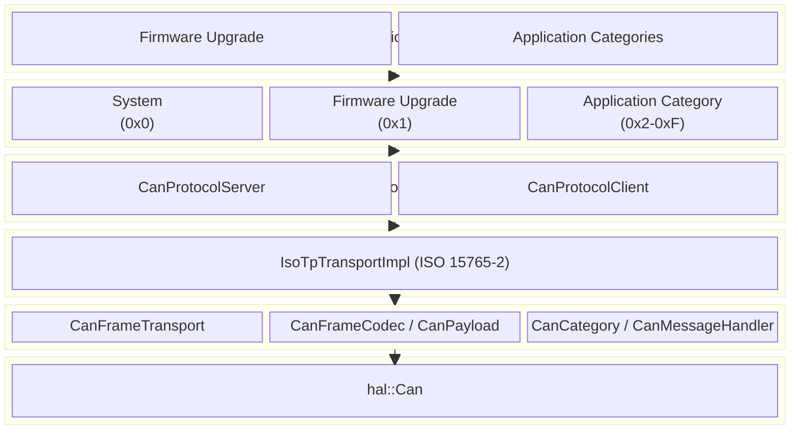
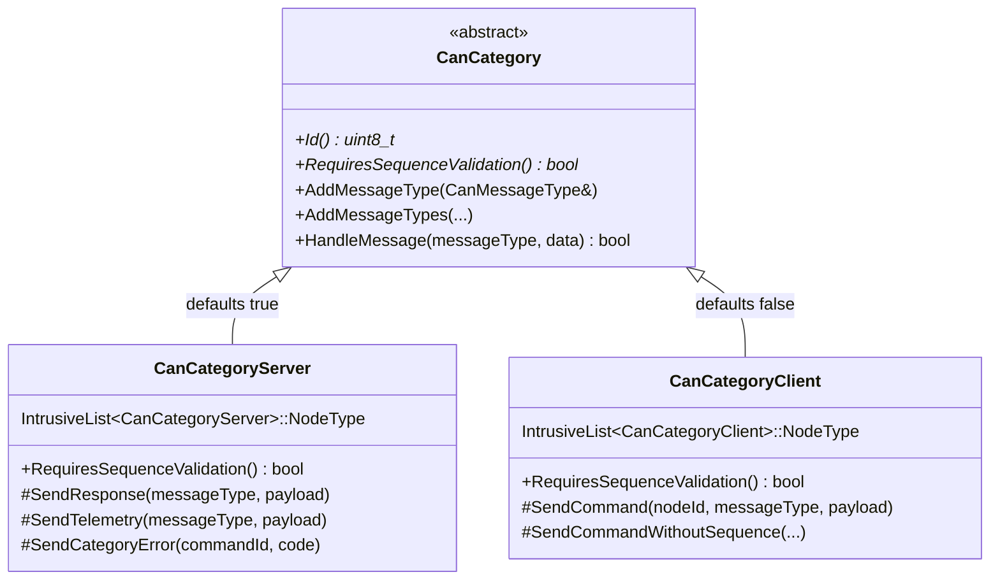
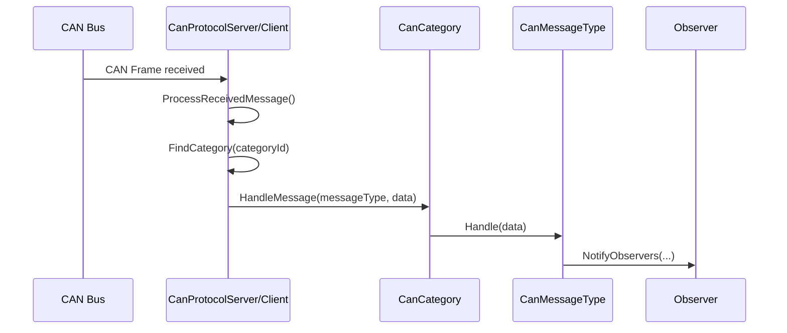
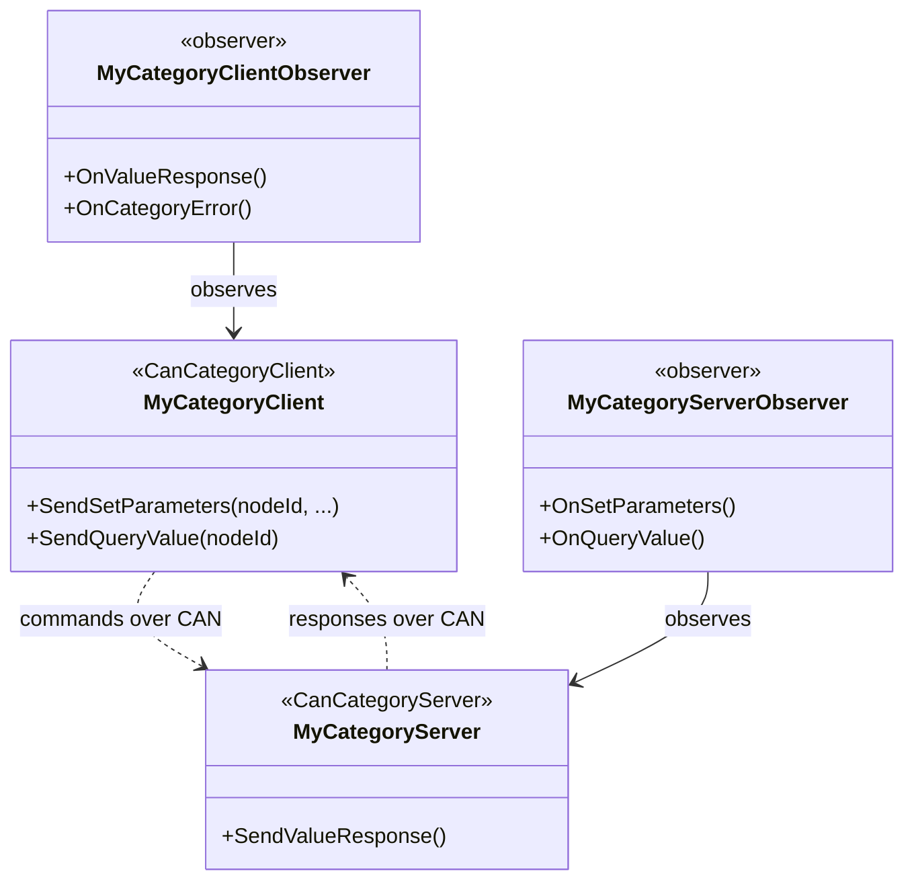

# can-lite: Architecture & Design Decisions

**Status:** Living document
**Last updated:** 2026-03-09

## 1. Overview

can-lite is a lightweight CAN bus protocol library implementing a client-server model over CAN 2.0B (29-bit extended identifiers). It is designed for bare-metal embedded systems with strict constraints: no heap allocation, bounded memory, and deterministic timing.


```mermaid
block-beta
    columns 1
    block:app["Application Layer"]
        columns 2
        A["Firmware Upgrade"] C["Application Categories"]
    end
    block:cat["Category Layer"]
        columns 3
        D["System\n(0x0)"]
        E["Firmware Upgrade\n(0x1)"]
        F["Application Category\n(0x2-0xF)"]
    end
    block:proto["Protocol Layer"]
        columns 2
        G["CanProtocolServer"] H["CanProtocolClient"]
    end
    block:transport["Transport Layer"]
        columns 1
        T["IsoTpTransportImpl (ISO 15765-2)"]
    end
    block:core["Core Layer"]
        columns 3
        I["CanFrameTransport"] J["CanFrameCodec / CanPayload"] K["CanCategory / CanMessageHandler"]
    end
    block:hal["HAL"]
        columns 1
        L["hal::Can"]
    end

    app --> cat
    cat --> proto
    proto --> transport
    transport --> core
    core --> hal
```

## 2. Design Principles

| Principle | Rationale |
|-----------|-----------|
| **No heap allocation** | Target MCUs have limited SRAM; all containers use `infra::BoundedVector`, `infra::BoundedDeque`, `infra::Function`, etc. from embedded-infra-lib. |
| **Type-safe server/client separation** | Prevents accidental registration of a client-side category handler on the server (and vice versa) at compile time. |
| **Observer pattern over callbacks** | Consistent notification mechanism using `infra::Subject` / `infra::SingleObserver`. Avoids storing `infra::Function` objects for event dispatch; observers auto-attach and auto-detach on construction/destruction. |
| **Fixed-point encoding** | Floating-point values are transmitted as scaled integers to avoid FPU dependencies and ensure deterministic wire representation. |
| **Domain-neutral library** | can-lite ships only protocol-level categories (System, Firmware Upgrade). Anything application-specific lives in the consuming project as an application category. |
| **Extensible via categories** | New functionality is added by implementing a category handler — no protocol core changes required. See [Extending can-lite with categories](extending-categories.md). |

## 3. Category Type Hierarchy

A key architectural decision is the **compile-time separation** of server-side and client-side categories. This prevents a `MyCategoryClient` from being accidentally registered on a `CanProtocolServer`.


```mermaid
classDiagram
    class CanCategory {
        <<abstract>>
        +Id() uint8_t*
        +RequiresSequenceValidation() bool*
        +AddMessageType(CanMessageType&)
        +AddMessageTypes(...)
        +HandleMessage(messageType, data) bool
    }

    class CanCategoryServer {
        +RequiresSequenceValidation() bool
        #SendResponse(messageType, payload)
        #SendTelemetry(messageType, payload)
        #SendCategoryError(commandId, code)
        IntrusiveList~CanCategoryServer~::NodeType
    }

    class CanCategoryClient {
        +RequiresSequenceValidation() bool
        #SendCommand(nodeId, messageType, payload)
        #SendCommandWithoutSequence(...)
        IntrusiveList~CanCategoryClient~::NodeType
    }

    CanCategory <|-- CanCategoryServer : defaults true
    CanCategory <|-- CanCategoryClient : defaults false
```

**`CanCategory`** holds the shared logic: a list of `CanMessageType` handlers, message dispatch via `HandleMessage()`, and the pure virtual `Id()` and `RequiresSequenceValidation()`.

**`CanCategoryServer`** and **`CanCategoryClient`** each carry their own `IntrusiveList` node type, making them incompatible with each other's lists. `CanProtocolServer` holds an `IntrusiveList<CanCategoryServer>` and `CanProtocolClient` holds an `IntrusiveList<CanCategoryClient>`, so type safety is enforced at the compiler level.

Both base classes own the `CanFrameTransport` reference and expose protected send helpers that fill in the category ID and priority, so a concrete category never touches the frame layer directly. Client categories additionally take a `CanSequenceSource`, which supplies the per-server sequence byte — this keeps categories independent of `CanProtocolClient`, so they link `can_lite.core` only.

Default sequence validation:
- **Server categories** default to `true` — incoming commands carry a sequence byte for replay protection.
- **Client categories** default to `false` — responses do not require sequence validation.

## 4. Message Type Dispatch

Each category contains a set of `CanMessageType` handlers, registered via `AddMessageType()` / `AddMessageTypes()` in the category constructor. In practice these are `CanMessageHandler<Owner>` instances, which bind a message type ID to a member function of the owning category — an ID, a reference and a member pointer, with no allocation and no nested class per message. When a frame arrives:

1. `CanProtocolServer`/`CanProtocolClient` extracts the category ID and message type from the 29-bit CAN identifier.
2. The corresponding category's `HandleMessage()` is called.
3. `HandleMessage()` iterates the registered message types and dispatches to the matching handler.
4. The handler parses the payload and notifies the observer.


```mermaid
sequenceDiagram
    participant Bus as CAN Bus
    participant Proto as CanProtocolServer/Client
    participant Cat as CanCategory
    participant Msg as CanMessageType
    participant Obs as Observer

    Bus->>Proto: CAN Frame received
    Proto->>Proto: ProcessReceivedMessage()
    Proto->>Proto: FindCategory(categoryId)
    Proto->>Cat: HandleMessage(messageType, data)
    Cat->>Msg: Handle(data)
    Msg->>Obs: NotifyObservers(...)
```

## 5. Observer Pattern

All category handlers use `infra::Subject<Observer>` / `infra::SingleObserver<Observer, Subject>` for event notification. This replaces earlier `infra::Function` callbacks.

**Key properties:**
- **Single observer**: Each subject supports exactly one observer (`infra::SingleObserver`). This matches the 1:1 relationship between a category instance and its consumer.
- **Auto-attach/detach**: The observer attaches in its constructor and detaches in its destructor — no manual registration needed.
- **Zero-cost when unobserved**: `NotifyObservers()` checks for a null observer pointer before dispatching, making it safe to call with no observer attached.

**Example — an application category (server side):**

```cpp
// Observer interface (pure virtual callbacks for each command)
class MyCategoryServerObserver
    : public infra::SingleObserver<MyCategoryServerObserver, MyCategoryServer>
{
public:
    virtual void OnSetParameters(int16_t first, const infra::Function<void()>& onDone) = 0;
};

// Subject (the category handler)
class MyCategoryServer
    : public CanCategoryServer
    , public infra::Subject<MyCategoryServerObserver>
{ ... };

// Application attaches by constructing an observer
class MyHandler : public MyCategoryServerObserver
{
public:
    explicit MyHandler(MyCategoryServer& server)
        : MyCategoryServerObserver(server) {}

    void OnSetParameters(int16_t first, const infra::Function<void()>& onDone) override { ... }
};
```

## 6. System Category Design

The System category (ID `0x00`) is a **built-in** category that handles protocol-level concerns: heartbeat, status request, command acknowledgement, and category discovery. It is split into server and client variants.

### Server side: `CanSystemCategoryServer`

The system category on the server is **fully automatic** — no public API is exposed to the application developer. `CanProtocolServer` creates an internal observer that reacts to system messages:

| Message | Internal behavior |
|---------|-------------------|
| Heartbeat received | Notifies `CanProtocolServerObserver::Online()` and (re)starts the client-liveness timer (§9.2.1) |
| Status request | Sends heartbeat response |
| Category list request | Sends list of registered category IDs |

`RegisterCategory()` returns `false`, without registering, if the category's ID is already registered on that server or if `canMaxRegisteredCategories` (8) categories are already registered. The application interacts with `CanProtocolServer` only through `RegisterCategory()` and the `CanProtocolServerObserver` (Online/Offline). All system plumbing is hidden.

### Client side: `CanSystemCategoryClient`

The system category on the client exposes **only category discovery** through its observer:

| Exposed via observer | Description |
|---------------------|-------------|
| `OnCategoryListResponse(categoryIds)` | Notifies when a category list is received from a server |

Command acknowledgement handling (§9.4) happens in `CanProtocolClient` itself, not in `CanSystemCategoryClient`, because it needs the source node ID, which the category dispatch layer does not pass down to individual message handlers. Category discovery is exposed because the application may want to enumerate a server's capabilities.

## 7. Bidirectional Category Pattern

Each application category is split into two classes that mirror the client-server protocol:


```mermaid
classDiagram
    class MyCategoryClient {
        <<CanCategoryClient>>
        +SendSetParameters(nodeId, ...)
        +SendQueryValue(nodeId)
    }

    class MyCategoryClientObserver {
        <<observer>>
        +OnValueResponse()
        +OnCategoryError()
    }

    class MyCategoryServer {
        <<CanCategoryServer>>
        +SendValueResponse()
    }

    class MyCategoryServerObserver {
        <<observer>>
        +OnSetParameters()
        +OnQueryValue()
    }

    MyCategoryClient ..> MyCategoryServer : commands over CAN
    MyCategoryServer ..> MyCategoryClient : responses over CAN
    MyCategoryClientObserver --> MyCategoryClient : observes
    MyCategoryServerObserver --> MyCategoryServer : observes
```

- **Server category**: Registers handlers for **commands** (IDs `0x00`–`0x7F`). Uses the inherited `SendResponse()` / `SendTelemetry()` / `SendCategoryError()` helpers, which fill in the category ID and priority.
- **Client category**: Registers handlers for **responses** (IDs `0x80`–`0xFF`). Uses the inherited `SendCommand(uint16_t targetNodeId, ...)` helper, which directs each frame to a specific server and prepends the per-server sequence byte.

Server categories take a `CanFrameTransport&` in their constructor. Client categories take a `CanFrameTransport&` and a `CanSequenceSource&`; `CanProtocolClient` implements the latter, so categories depend only on `can_lite.core`.

See [Extending can-lite with categories](extending-categories.md) for the full authoring guide.

## 8. CAN Identifier Layout

All 29 bits of the extended CAN ID encode routing information:

```
[28:24] Priority     (5 bits)  — message urgency
[23:20] Category     (4 bits)  — functional group (0x0 = System)
[19:12] Message Type (8 bits)  — specific command/response within category
[11:0]  Node ID      (12 bits) — target server address (0x000 = broadcast)
```

Priority values (lower = higher priority on the CAN bus):

| Priority | Value | Usage |
|----------|-------|-------|
| Emergency | 0 | Reserved for safety-critical messages |
| Command | 4 | Client-to-server commands |
| Response | 8 | Server-to-client responses |
| Telemetry | 12 | Periodic data streams |
| Heartbeat | 16 | Presence detection |

## 9. Sequence Validation

Server-side categories validate an 8-bit sequence number in `data[0]` of every command frame:

- The server tracks the last accepted sequence number.
- A command is accepted if its sequence number equals `(previous + 1) mod 256`.
- On sequence error, the server sends a `CommandAck` with `sequenceError` status.
- The sequence counter wraps from 255 → 0.

Client-side categories skip sequence validation (responses are stateless).

The server keeps **one** counter, shared by all sequence-validated categories. This
is deliberate: the supported topology is one client to many servers, and a server
serves exactly one client (REQ-CAN-006.1). Two clients commanding the same server
concurrently interleave their counters and are rejected with `sequenceError`.

## 9.1 Per-Server Sequence Tracking

`CanProtocolClient` maintains **independent sequence counters per server node** in a fixed-size array (`maxServers = 8`) and exposes them through the `CanSequenceSource` interface. `PeekSequence(nodeId)` returns the next sequence byte for the given node, and `CommitSequence(nodeId, category, messageType)` advances it once the frame has been accepted by the send queue — so a rejected frame does not burn a sequence number. This ensures that commands directed to different servers do not share or interfere with each other's replay protection state. `CommitSequence` also starts that server's command-ack timeout (§9.4), which is why it takes the category and message type of the command just sent.

### Sequence Resynchronization

A `sequenceError` acknowledgement carries the sequence number the server expected (§9.4). `CanProtocolClient` parses every acknowledgement frame as it arrives (before category dispatch, since it still has the source node ID at that point) and, on `sequenceError`, sets that server's counter to the reported value. This recovers a client whose sequence state has drifted from the server's — for example after the client process restarts and its in-memory counter resets to 0 while the server, unaware of the restart, still expects its old counter to continue — without requiring the server to also reset.

## 9.2 Server Liveness Detection

`CanProtocolClient` detects server online/offline transitions:

- Every received frame with a non-broadcast source node ID is passed to `MarkServerAlive(nodeId)`.
- On first reception from a node, `CanProtocolClientObserver::OnServerOnline(nodeId)` is called.
- A `TimerSingleShot` (configurable, default 3 s) is (re)started on each frame. If no frame is received before the timer fires, `CanProtocolClientObserver::OnServerOffline(nodeId)` is called.
- Up to 8 server liveness slots are tracked simultaneously.

Applications connect a `CanProtocolClientObserver` to receive these events and react accordingly (e.g., stop issuing commands, alert the UI).

## 9.2.1 Client Liveness Detection (Server-side)

`CanProtocolServer` detects the reverse direction: whether its client is still present. `CanProtocolClient` broadcasts its own heartbeat (node ID `0x000`) following the same quiet-period rule as the server's heartbeat (§9.3). Each heartbeat the server receives restarts a `clientLivenessTimer` (configurable, default 3 s via `Config::clientTimeout`) and notifies `CanProtocolServerObserver::Online()`; if the timer fires without a further client heartbeat, `CanProtocolServerObserver::Offline()` is notified. A server tracks liveness for one client only, consistent with the single sequence counter (§9).

## 9.3 Heartbeat Timer (Silence Guard)

Both `CanProtocolServer` and `CanProtocolClient` use a `TimerSingleShot` instead of a `TimerRepeating` for heartbeat emission. The timer is restarted (`ResetHeartbeatTimer()`) after every outgoing frame on that side. This means a heartbeat is only sent when that side has been **silent** for the full heartbeat interval, preventing unnecessary heartbeat traffic on active buses. The client's heartbeat is a broadcast, since a client has no node ID of its own on the bus.

## 9.4 Command Acknowledgement Timeout

When `CanCategoryClient::SendCommand` sends a sequence-validated command, `CanProtocolClient::CommitSequence` starts a per-server `ackTimer` (configurable, default 1 s via `Config::commandAckTimeout`) alongside the category and message type of the command sent. Any acknowledgement frame from that server matching that (category, messageType) cancels the timer, regardless of its status. If the timer fires first, `CanProtocolClientObserver::OnCommandAckTimeout(nodeId, category, messageType)` is notified; the command is not automatically retried. Because a server can have at most one outstanding command tracked this way, sending a second sequence-validated command to the same server before the first is acknowledged replaces the tracked (category, messageType) — an acknowledgement for the first command that arrives afterward will not match and will not cancel the timer for the second.

## 10. Directory Structure

```
can-lite/
├── core/                          # Protocol primitives
│   ├── CanCategory.hpp/cpp        # Base class + Server/Client subclasses
│   ├── CanMessageType.hpp         # Message handler interface
│   ├── CanMessageHandler.hpp      # Binds a message type ID to a member function
│   ├── CanPayload.hpp/cpp         # Bounds-checked big-endian payload reader/writer
│   ├── CanSequenceSource.hpp      # Per-server sequence supply for client categories
│   ├── CanProtocolDefinitions.hpp # CAN ID layout, constants, enums
│   ├── CanFrameCodec.hpp/cpp      # Fixed-point encoding helpers
│   ├── CanFrameTransport.hpp/cpp  # Async send queue over hal::Can
│   └── test/                      # Unit tests + can_lite.test_util doubles
├── categories/
│   ├── system/                    # Built-in System category (0x00)
│   │   ├── CanSystemCategoryServer.hpp/cpp
│   │   └── CanSystemCategoryClient.hpp/cpp
│   └── firmware_upgrade/          # Firmware Upgrade category (0x01)
│       ├── FirmwareUpgradeDefinitions.hpp
│       ├── FirmwareUpgradeCategoryServer.hpp/cpp
│       ├── FirmwareUpgradeCategoryClient.hpp/cpp
│       └── test/
├── transport/                     # ISO-TP segmentation layer
│   ├── IsoTpTransport.hpp         # Abstract interface
│   ├── IsoTpTransportImpl.hpp/cpp # Non-template concrete impl (WithStorage)
│   └── iso-tp/                    # ISO 15765-2 internals
│       ├── IsoTpChannel.hpp       # Non-template abstract channel interface
│       ├── IsoTpChannelImpl.hpp/cpp # Non-template concrete channel (WithStorage<MaxPduSize>)
│       ├── IsoTpSender.hpp/cpp    # Non-template transmit FSM (WithStorage<MaxPduSize>)
│       ├── IsoTpReceiver.hpp/cpp  # Non-template receive FSM (WithStorage<MaxPduSize>)
│       ├── IsoTpFrameCodec.hpp/cpp # PCI encoding/decoding
│       └── IsoTpTypes.hpp         # Enums, constants (FrameType, FlowStatus, AbortReason)
├── server/                        # CanProtocolServer
│   ├── CanProtocolServer.hpp/cpp
│   └── test/
├── client/                        # CanProtocolClient
│   ├── CanProtocolClient.hpp/cpp
│   └── test/
└── drivers/                       # Hardware driver adapters

examples/                          # Not built by default (CAN_LITE_BUILD_EXAMPLES)
└── foc_motor/                     # Reference application category
```

Application categories live in the consuming project, not in `can-lite/categories/`.

## 10.1 ISO-TP Transport Layer

The transport layer provides multi-frame PDU segmentation and reassembly following ISO 15765-2 without coupling it to any specific application category. It is an optional, orthogonal mechanism: categories that need large payloads attach `IsoTpTransportImpl` to the server/client; categories that fit in 8 bytes continue using raw `CanFrameTransport` directly.

**Key classes:**

| Class                | Role                                                                                                                 |
|----------------------|----------------------------------------------------------------------------------------------------------------------|
| `IsoTpTransport`     | Abstract interface — `RegisterReceiveChannel`, `SendPdu`, `ProcessFrame`, `SetOnPduReceived`                         |
| `IsoTpTransportImpl` | Non-template concrete implementation; channel pool via `WithStorage<MaxPduSize, MaxChannels>`                        |
| `IsoTpChannel`       | Non-template abstract channel interface used by `IsoTpTransportImpl`                                                 |
| `IsoTpChannelImpl`   | Non-template concrete channel; composes `IsoTpSender` + `IsoTpReceiver` via `WithStorage<MaxPduSize>`                |
| `IsoTpSender`        | Non-template transmit FSM (SF → FF → wait-for-FC → CFs; N_Bs timeout); `WithStorage<MaxPduSize>` provides buffer     |
| `IsoTpReceiver`      | Non-template receive FSM (SF dispatch or FF → wait-for-CFs; N_Cr timeout); `WithStorage<MaxPduSize>` provides buffer |
| `IsoTpFrameCodec`    | Stateless PCI encode/decode helpers                                                                                  |

**WithStorage pattern — zero-heap construction chain:**

All ISO-TP classes are non-template at their API surface. Sizes are injected via nested `WithStorage` type aliases that use EMIL's `infra::WithStorage` to compose storage ownership:

```cpp
// IsoTpSender takes BoundedVector<uint8_t>& — WithStorage provides the buffer
IsoTpSender::WithStorage<MaxPduSize>  // IS-A IsoTpSender

// IsoTpReceiver — same pattern
IsoTpReceiver::WithStorage<MaxPduSize>  // IS-A IsoTpReceiver

// IsoTpChannelImpl composes sender + receiver storage in a nested struct
IsoTpChannelImpl::WithStorage<MaxPduSize>  // IS-A IsoTpChannelImpl IS-A IsoTpChannel

// IsoTpTransportImpl composes a BoundedVector of channels
IsoTpTransportImpl::WithStorage<MaxPduSize, MaxChannels>  // IS-A IsoTpTransportImpl
```

**Attachment pattern:**

```cpp
IsoTpTransportImpl::WithStorage<64, 4> isoTp{ canFrameTransport };
protocolServer.AttachIsoTpTransport(isoTp);
```

`CanProtocolServer::ProcessReceivedMessage` offers each incoming frame to the ISO-TP layer first (`isoTpTransport->ProcessFrame(canId, frame)`). If the transport claims it (a registered channel matches), normal category dispatch is skipped. This keeps the transport layer transparent to existing category handlers.

## 11. Build System

- **CMake presets** are the primary interface (see `CMakePresets.json`).
- Libraries follow the `can_lite.<component>` naming convention.
- Category libraries link `can_lite.core`; protocol libraries link the relevant category libraries.
- Unit tests use GoogleTest/GMock and run on the host.
- Standalone builds fetch `embedded-infra-lib` via FetchContent.

## 12. Integration Testing

Integration tests validate end-to-end behavior across components using [cucumber-cpp-runner](https://github.com/philips-software/amp-cucumber-cpp-runner) v4.0.0 (BDD / Gherkin). Feature files are in `integration_tests/features/`; step definitions in `integration_tests/steps/`.

### Single Common Fixture

All scenarios share a single fixture type — `ApplicationFixture` — that simulates a real application with a server, client, and virtual CAN bus. This ensures tests exercise the same initialization and interaction paths as production code.

```
integration_tests/
├── features/                      # Gherkin .feature files
├── hooks/                         # Scenario lifecycle hooks
├── steps/                         # Step definitions (GIVEN/WHEN/THEN)
└── support/
    └── ApplicationFixture.hpp      # VirtualCan, ApplicationFixture, mocks
```

### VirtualCan

`VirtualCan` is a concrete `hal::Can` implementation that replaces hardware drivers in integration tests. Two `VirtualCan` instances are connected via `ConnectTo()`: frames sent by one are delivered to the other's receive callback, simulating a shared CAN bus without mocking `SendData`/`ReceiveData`. `InjectFrame()` allows direct frame injection for testing error paths.

### ApplicationFixture

`ApplicationFixture` inherits from `infra::ClockFixture` (providing `EventDispatcher`, `TimerService`, and `ForwardTime()`) and composes:

- A pair of connected `VirtualCan` instances (server-side and client-side).
- `CanProtocolServer` and `CanProtocolClient` wired to their respective CAN interfaces.
- `StrictMock` observers for the server and (optionally) the demo category.
- Optional demo category components (`CanFrameTransport`, `DemoCategoryServer`/`Client`, observers) activated via `RegisterDemoCategory()`. The demo category (`0x3`) is the reference application category used to validate the extension API end to end.
- Optional Firmware Upgrade components (`FirmwareUpgradeCategoryServer`/`Client`, observers) activated via `RegisterFirmwareUpgrade()`.
- Dynamic test categories (`SequencedTestCategory`, `SimpleTestCategory`) for sequence and discovery testing.

### StrictMock Everywhere

All mock observers use `testing::StrictMock`. Unexpected calls cause immediate test failure, ensuring every interaction is explicitly expected.

### Cucumber Context API

- `context.Emplace<T>(args...)` creates the fixture (returns `std::shared_ptr<T>`).
- `context.Get<T>()` retrieves it by reference (returns `T&`).
- Captured `shared_ptr` in lambdas on fixture members must be avoided to prevent circular references that leak the fixture across scenarios.
