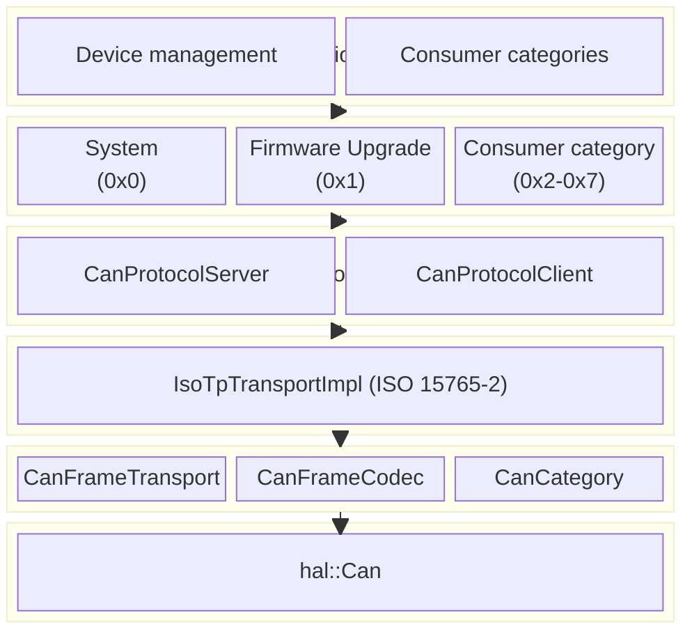
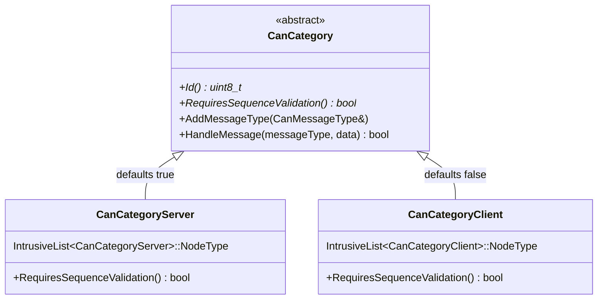
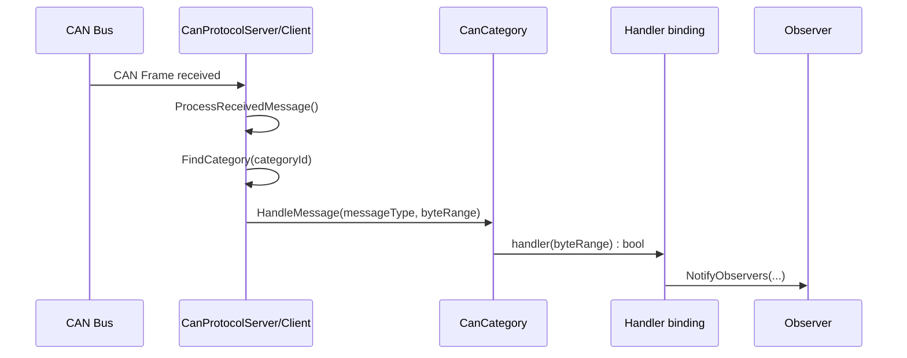
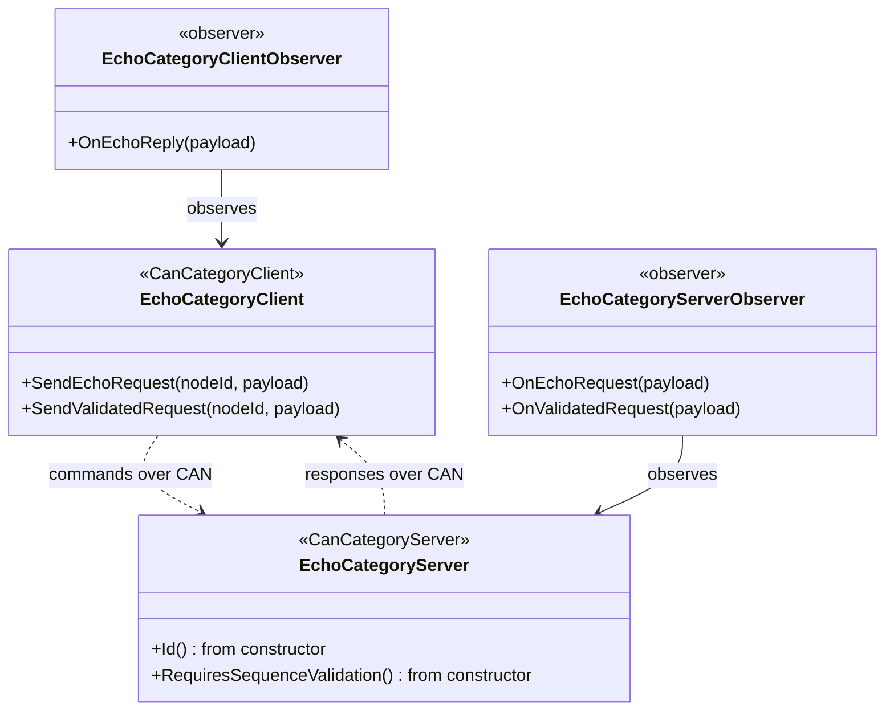

# can-lite: Architecture & Design Decisions

**Status:** Living document
**Last updated:** 2026-03-09

## 1. Overview

can-lite is a lightweight CAN bus protocol library implementing a client-server model over CAN 2.0B (29-bit extended identifiers). It is designed for bare-metal embedded systems with strict constraints: no heap allocation, bounded memory, and deterministic timing.


```mermaid
block-beta
    columns 1
    block:app["Application Layer"]
        columns 2
        B["Device management"] C["Consumer categories"]
    end
    block:cat["Category Layer"]
        columns 3
        D["System\n(0x0)"]
        E["Firmware Upgrade\n(0x1)"]
        F["Consumer category\n(0x2-0x7)"]
    end
    block:proto["Protocol Layer"]
        columns 2
        G["CanProtocolServer"] H["CanProtocolClient"]
    end
    block:transport["Transport Layer"]
        columns 1
        T["IsoTpTransportImpl (ISO 15765-2)"]
    end
    block:core["Core Layer"]
        columns 3
        I["CanFrameTransport"] J["CanFrameCodec"] K["CanCategory"]
    end
    block:hal["HAL"]
        columns 1
        L["hal::Can"]
    end

    app --> cat
    cat --> proto
    proto --> transport
    transport --> core
    core --> hal
```

## 2. Design Principles

| Principle | Rationale |
|-----------|-----------|
| **No heap allocation** | Target MCUs have limited SRAM; all containers use `infra::BoundedVector`, `infra::BoundedDeque`, `infra::Function`, etc. from embedded-infra-lib. |
| **Type-safe server/client separation** | Prevents accidental registration of a client-side category handler on the server (and vice versa) at compile time. |
| **Observer pattern over callbacks** | Consistent notification mechanism using `infra::Subject` / `infra::SingleObserver`. Avoids storing `infra::Function` objects for event dispatch; observers auto-attach and auto-detach on construction/destruction. |
| **Fixed-point encoding** | Floating-point values are transmitted as scaled integers to avoid FPU dependencies and ensure deterministic wire representation. |
| **Extensible via categories** | New functionality is added by implementing a category handler — no protocol core changes required. |
| **Explicit composition** | Categories are registered by explicit `RegisterCategory` calls from a composition root. There is no plugin registry and no self-registration: a zero-heap embedded library must be able to account for every object it owns. |

## 2.1 What Belongs In can-lite

A category belongs in can-lite **if and only if** it concerns the node as a
protocol participant or as a device, and is agnostic to what the device does.
A category that ascribes meaning to the payload in application terms belongs
to the consumer.

By that rule:

- **System (0x0)** stays — it is the protocol talking about itself.
- **Firmware Upgrade (0x1)** stays — every node is a device that can be
  reflashed, whatever it does.
- **Motor control, sensing, actuation and the like do not** — they describe an
  application, and their payloads only mean something to that application.

This is why can-lite ships no domain categories. The echo category in
`can_lite.testing` is a reference example, not a service: it deliberately
ascribes no meaning at all to its payload.

### Category ID Ranges

| Range     | Owner      | Meaning                                                  |
|-----------|------------|----------------------------------------------------------|
| 0x0-0x1   | can-lite   | Management categories                                    |
| 0x2-0x7   | Integrator | Application categories, assigned by the consuming project |
| 0x8-0xF   | —          | Reserved                                                 |

The category field on the wire is still 4 bits; the narrower policy range is a
**protocol invariant enforced at registration**, not an encoding change. It
bounds a node to 8 categories, which is exactly what a category discovery
response holds in one frame — so discovery can never truncate.

Consumer categories take their ID as a **constructor parameter**. Hard-coding
it in a `constexpr` would make the library, rather than the integrator, the
owner of the assignment.

## 3. Category Type Hierarchy

A key architectural decision is the **compile-time separation** of server-side and client-side categories. This prevents a client-side category from being accidentally registered on a `CanProtocolServer`.


```mermaid
classDiagram
    class CanCategory {
        <<abstract>>
        +Id() uint8_t*
        +RequiresSequenceValidation() bool*
        +AddMessageType(CanMessageType&)
        +HandleMessage(messageType, data) bool
    }

    class CanCategoryServer {
        +RequiresSequenceValidation() bool
        IntrusiveList~CanCategoryServer~::NodeType
    }

    class CanCategoryClient {
        +RequiresSequenceValidation() bool
        IntrusiveList~CanCategoryClient~::NodeType
    }

    CanCategory <|-- CanCategoryServer : defaults true
    CanCategory <|-- CanCategoryClient : defaults false
```

**`CanCategory`** holds the shared logic: a bounded array of message-type bindings, message dispatch via `HandleMessage()`, the outbound handle, and the pure virtual `Id()` and `RequiresSequenceValidation()`.

**`CanCategoryServer`** and **`CanCategoryClient`** each carry their own `IntrusiveList` node type, making them incompatible with each other's lists. `CanProtocolServer` holds an `IntrusiveList<CanCategoryServer>` and `CanProtocolClient` holds an `IntrusiveList<CanCategoryClient>`, so type safety is enforced at the compiler level.

Sequence validation is declared by the category itself: `RequiresSequenceValidation()` is pure virtual, so a category states its own policy rather than inheriting a hardcoded default from its base. In practice server categories answer `true` (incoming commands carry a sequence byte for replay protection) and client categories answer `false` (responses do not), but neither is forced.

## 4. Message Type Dispatch

Each category owns a bounded array of `(messageTypeId, infra::Function<bool(infra::ConstByteRange)>)` bindings, added via `AddMessageType()` in the category constructor. Storage comes from `CanCategoryHandlerStorage<Max>`, which the category derives from privately and first so the array exists before the base class takes a reference to it. There is no class per message type and no heap.

A handler takes a **byte range**, not a `hal::Can::Message`, so the same handler serves a raw 8-byte frame and a reassembled ISO-TP PDU. It returns `bool`: `true` when it accepted the payload, `false` when it rejected it.

When a frame arrives:

1. `CanProtocolServer`/`CanProtocolClient` extracts the category ID and message type from the 29-bit CAN identifier.
2. The corresponding category's `HandleMessage()` is called.
3. `HandleMessage()` finds the matching binding and returns a `CanDispatchResult`: `unknownMessageType`, `rejected`, or `handled`.
4. The host turns that into an acknowledgement: `unknownCommand` for an unrecognised message type, `invalidPayload` for a rejection, nothing for success. A category that recognises a message type but has not implemented it answers `notImplemented` itself.


```mermaid
sequenceDiagram
    participant Bus as CAN Bus
    participant Proto as CanProtocolServer/Client
    participant Cat as CanCategory
    participant Msg as Handler binding
    participant Obs as Observer

    Bus->>Proto: CAN Frame received
    Proto->>Proto: ProcessReceivedMessage()
    Proto->>Proto: FindCategory(categoryId)
    Proto->>Cat: HandleMessage(messageType, byteRange)
    Cat->>Msg: handler(byteRange) : bool
    Msg->>Obs: NotifyObservers(...)
```

## 5. Observer Pattern

All category handlers use `infra::Subject<Observer>` / `infra::SingleObserver<Observer, Subject>` for event notification. This replaces earlier `infra::Function` callbacks.

**Key properties:**
- **Single observer**: Each subject supports exactly one observer (`infra::SingleObserver`). This matches the 1:1 relationship between a category instance and its consumer.
- **Auto-attach/detach**: The observer attaches in its constructor and detaches in its destructor — no manual registration needed.
- **Zero-cost when unobserved**: `NotifyObservers()` checks for a null observer pointer before dispatching, making it safe to call with no observer attached.

**Example — Echo Category (Server side), the reference for a consumer category:**

```cpp
// Observer interface (pure virtual callbacks for each command)
class EchoCategoryServerObserver
    : public infra::SingleObserver<EchoCategoryServerObserver, EchoCategoryServer>
{ ... };

// Subject (the category handler)
class EchoCategoryServer
    : private CanCategoryHandlerStorage<2>
    , public CanCategoryServer
    , public infra::Subject<EchoCategoryServerObserver>
{ ... };

// Application attaches by constructing an observer
class MyEchoHandler : public EchoCategoryServerObserver
{
public:
    MyEchoHandler(EchoCategoryServer& server)
        : EchoCategoryServerObserver(server) {}
    void OnEchoRequest(infra::ConstByteRange payload) override { /* ... */ }
    ...
};
```

## 6. System Category Design

The System category (ID `0x00`) is a **built-in** category that handles protocol-level concerns: heartbeat, status request, command acknowledgement, and category discovery. It is split into server and client variants.

### Server side: `CanSystemCategoryServer`

The system category on the server is **fully automatic** — no public API is exposed to the application developer. `CanProtocolServer` creates an internal observer that reacts to system messages:

| Message | Internal behavior |
|---------|-------------------|
| Heartbeat received | Notifies `CanProtocolServerObserver::Online()` |
| Status request | Sends heartbeat response |
| Category list request | Sends list of registered category IDs |

The application interacts with `CanProtocolServer` only through `RegisterCategory()` and the `CanProtocolServerObserver` (Online/Offline). All system plumbing is hidden.

### Client side: `CanSystemCategoryClient`

The system category on the client exposes **only category discovery** through its observer:

| Exposed via observer | Description |
|---------------------|-------------|
| `OnCategoryListResponse(categoryIds)` | Notifies when a category list is received from a server |

| Also exposed via observer | Description |
|---------------------------|-------------|
| `OnCommandAck(CanCommandAck)` | The parsed 5-byte acknowledgement |

`CanProtocolClient` subscribes to `OnCommandAck` itself. On a `sequenceError` it resynchronises the offending category's counter for that peer onto the sequence the server reported, which is what stops a single lost frame from bricking the link. Category discovery is exposed because the application may want to enumerate a server's capabilities.

## 7. Bidirectional Category Pattern

Each application category is split into two classes that mirror the client-server protocol:


```mermaid
classDiagram
    class EchoCategoryClient {
        <<CanCategoryClient>>
        +SendEchoRequest(nodeId, payload)
        +SendValidatedRequest(nodeId, payload)
    }

    class EchoCategoryClientObserver {
        <<observer>>
        +OnEchoReply(payload)
    }

    class EchoCategoryServer {
        <<CanCategoryServer>>
        +Id() from constructor
        +RequiresSequenceValidation() from constructor
    }

    class EchoCategoryServerObserver {
        <<observer>>
        +OnEchoRequest(payload)
        +OnValidatedRequest(payload)
    }

    EchoCategoryClient ..> EchoCategoryServer : commands over CAN
    EchoCategoryServer ..> EchoCategoryClient : responses over CAN
    EchoCategoryClientObserver --> EchoCategoryClient : observes
    EchoCategoryServerObserver --> EchoCategoryServer : observes
```

- **Server category**: Binds handlers for **commands** (IDs `0x00`–`0x7F`). Provides `Send*Response()` methods that build response frames.
- **Client category**: Binds handlers for **responses** (IDs `0x80`–`0xFF`). Provides `Send*Command(uint16_t targetNodeId, ...)` methods; the `targetNodeId` parameter directs each frame to a specific server.

Neither side takes a transport or a protocol host in its constructor. Both send through the **outbound handle** described in §7.1, which is why a category library links `can_lite.core` and nothing else.

## 7.1 The Outbound Handle

`CanProtocolServer` and `CanProtocolClient` own a fixed array of `CanCategoryOutboundImpl`, one slot per registerable category. At registration the host binds a slot to the transport and to that category's ID and attaches it; at unregistration it detaches and unbinds. The category holds a `CanCategoryOutbound&`.

The handle owns everything a category must not do for itself:

| Concern | Why it lives in the handle |
|---------|----------------------------|
| CAN identifier composition | The category never sees its own ID on the wire, so it cannot compose an identifier for a category it is not. |
| Sequence allocation | Sequence numbers are a property of a (peer, category) pair, not of a message type. |
| Acknowledgement | The handle already knows the category ID, the peer and the correlation, so `SendCommandAck` needs no arguments beyond message type and status — and no null check. |

An unattached category holds `CanCategoryOutboundNull`, a null object whose sends are silent no-ops. That is what removed the `really_assert` that used to abort a node whose category had no acknowledger.

## 8. CAN Identifier Layout

All 29 bits of the extended CAN ID encode routing information:

```
[28:24] Priority     (5 bits)  — message urgency
[23:20] Category     (4 bits)  — functional group (0x0 = System)
[19:12] Message Type (8 bits)  — specific command/response within category
[11:0]  Node ID      (12 bits) — target server address (0x000 = broadcast)
```

Priority values (lower = higher priority on the CAN bus):

| Priority | Value | Usage |
|----------|-------|-------|
| Emergency | 0 | Reserved for safety-critical messages |
| Command | 4 | Client-to-server commands |
| Response | 8 | Server-to-client responses |
| Telemetry | 12 | Periodic data streams |
| Heartbeat | 16 | Presence detection |

## 9. Sequence Validation

Categories that answer `true` to `RequiresSequenceValidation()` validate an 8-bit sequence number in `data[0]` of every command frame:

- The first command from a peer is accepted at whatever value it carries and becomes the reference.
- Each subsequent command must equal `(previous + 1) mod 256`.
- On mismatch the server sends a `commandAck` with `sequenceError` status.
- The counter wraps from 255 → 0.

## 9.1 Per-(Peer, Category) Sequence State

Sequence state lives in a `CanSequenceTable` owned by each outbound handle, so it is scoped to **one category** and, within that, tracked **per peer** in a fixed array of 8 slots. Client and server use the same table type, so both ends agree on what "the next sequence number" means.

The peer key is the Node ID field of the frame, which the unchanged 29-bit layout defines as the *destination* of a command. A client therefore keys on the server it addresses, and a server keys on the address it was addressed by — its own address or the broadcast address — which separates the unicast stream from the broadcast one but cannot separate two clients from each other. Telling senders apart would need a source address on the wire, and the wire format is fixed.

Two bugs motivated this:

- The server used to keep a **single global counter** shared by every category, so traffic on one category invalidated the sequence of every other.
- On mismatch the server did **not** advance its counter while the sender already had, so the two ends could never agree again: a single lost frame bricked the link permanently.

The fix is the `expectedSequence` byte in the acknowledgement. `CanProtocolClient` subscribes to `CanSystemCategoryClientObserver::OnCommandAck`, and on `sequenceError` calls `ResyncSequence` on the offending category's handle for that peer. Recovery costs one round trip.

When the peer table fills, the oldest slot is reused in round-robin order and the evicted peer simply renegotiates on its next message. A busy bus must never abort the node, which is why the previous `really_assert(false)` is gone.

## 9.2 Server Liveness Detection

`CanProtocolClient` detects server online/offline transitions:

- Every received frame with a non-broadcast source node ID is passed to `MarkServerAlive(nodeId)`.
- On first reception from a node, `CanProtocolClientObserver::OnServerOnline(nodeId)` is called.
- A `TimerSingleShot` (configurable, default 3 s) is (re)started on each frame. If no frame is received before the timer fires, `CanProtocolClientObserver::OnServerOffline(nodeId)` is called.
- Up to 8 server liveness slots are tracked simultaneously.

Applications connect a `CanProtocolClientObserver` to receive these events and react accordingly (e.g., stop issuing commands, alert the UI).

## 9.3 Heartbeat Timer (Server-side Silence Guard)

`CanProtocolServer` uses a `TimerSingleShot` instead of a `TimerRepeating` for heartbeat emission. The timer is restarted (`ResetHeartbeatTimer()`) after every outgoing frame. This means a heartbeat is only sent when the server has been **silent** for the full heartbeat interval, preventing unnecessary heartbeat traffic on active buses.

## 10. Directory Structure

```
can-lite/
├── core/                          # Protocol primitives
│   ├── CanCategory.hpp/cpp        # Base class + Server/Client subclasses, handler binding
│   ├── CanCategoryOutbound.hpp/cpp # Per-category outbound handle (send, sequence, ack)
│   ├── CanSequenceTable.hpp/cpp   # Per-peer sequence state
│   ├── CanProtocolDefinitions.hpp # CAN ID layout, constants, enums
│   ├── CanFrameCodec.hpp/cpp      # Fixed-point encoding helpers
│   └── CanFrameTransport.hpp/cpp  # Async send queue over hal::Can
├── categories/
│   ├── system/                    # Built-in System category (0x00)
│   │   ├── CanSystemCategoryServer.hpp/cpp
│   │   └── CanSystemCategoryClient.hpp/cpp
│   ├── firmware_upgrade/          # Firmware Upgrade category (0x01)
│   │   ├── FirmwareUpgradeDefinitions.hpp
│   │   ├── FirmwareUpgradeCategoryServer.hpp/cpp
│   │   ├── FirmwareUpgradeCategoryClient.hpp/cpp
│   │   └── test/
├── transport/                     # ISO-TP segmentation layer
│   ├── IsoTpTransport.hpp         # Abstract interface
│   ├── IsoTpTransportImpl.hpp/cpp # Non-template concrete impl (WithStorage)
│   └── iso-tp/                    # ISO 15765-2 internals
│       ├── IsoTpChannel.hpp       # Non-template abstract channel interface
│       ├── IsoTpChannelImpl.hpp/cpp # Non-template concrete channel (WithStorage<MaxPduSize>)
│       ├── IsoTpSender.hpp/cpp    # Non-template transmit FSM (WithStorage<MaxPduSize>)
│       ├── IsoTpReceiver.hpp/cpp  # Non-template receive FSM (WithStorage<MaxPduSize>)
│       ├── IsoTpFrameCodec.hpp/cpp # PCI encoding/decoding
│       └── IsoTpTypes.hpp         # Enums, constants (FrameType, FlowStatus, AbortReason)
├── server/                        # CanProtocolServer
│   ├── CanProtocolServer.hpp/cpp
│   └── test/
├── client/                        # CanProtocolClient
│   ├── CanProtocolClient.hpp/cpp
│   └── test/
├── testing/                       # can_lite.testing — host-side test support
│   ├── EchoCategoryDefinitions.hpp
│   ├── EchoCategoryServer.hpp/cpp # Reference example for a consumer category
│   ├── EchoCategoryClient.hpp/cpp
│   ├── VirtualCan.hpp/cpp         # Two-node in-memory bus
│   └── test/
└── drivers/                       # Hardware driver adapters
```

## 10.1 ISO-TP Transport Layer

The transport layer provides multi-frame PDU segmentation and reassembly following ISO 15765-2 without coupling it to any specific application category. It is an optional, orthogonal mechanism: categories that need large payloads attach `IsoTpTransportImpl` to the server/client; categories that fit in 8 bytes continue using raw `CanFrameTransport` directly.

**Key classes:**

| Class                | Role                                                                                                                 |
|----------------------|----------------------------------------------------------------------------------------------------------------------|
| `IsoTpTransport`     | Abstract interface — `RegisterReceiveChannel`, `SendPdu`, `ProcessFrame`, `SetOnPduReceived`                         |
| `IsoTpTransportImpl` | Non-template concrete implementation; channel pool via `WithStorage<MaxPduSize, MaxChannels>`                        |
| `IsoTpChannel`       | Non-template abstract channel interface used by `IsoTpTransportImpl`                                                 |
| `IsoTpChannelImpl`   | Non-template concrete channel; composes `IsoTpSender` + `IsoTpReceiver` via `WithStorage<MaxPduSize>`                |
| `IsoTpSender`        | Non-template transmit FSM (SF → FF → wait-for-FC → CFs; N_Bs timeout); `WithStorage<MaxPduSize>` provides buffer     |
| `IsoTpReceiver`      | Non-template receive FSM (SF dispatch or FF → wait-for-CFs; N_Cr timeout); `WithStorage<MaxPduSize>` provides buffer |
| `IsoTpFrameCodec`    | Stateless PCI encode/decode helpers                                                                                  |

**WithStorage pattern — zero-heap construction chain:**

All ISO-TP classes are non-template at their API surface. Sizes are injected via nested `WithStorage` type aliases that use EMIL's `infra::WithStorage` to compose storage ownership:

```cpp
// IsoTpSender takes BoundedVector<uint8_t>& — WithStorage provides the buffer
IsoTpSender::WithStorage<MaxPduSize>  // IS-A IsoTpSender

// IsoTpReceiver — same pattern
IsoTpReceiver::WithStorage<MaxPduSize>  // IS-A IsoTpReceiver

// IsoTpChannelImpl composes sender + receiver storage in a nested struct
IsoTpChannelImpl::WithStorage<MaxPduSize>  // IS-A IsoTpChannelImpl IS-A IsoTpChannel

// IsoTpTransportImpl composes a BoundedVector of channels
IsoTpTransportImpl::WithStorage<MaxPduSize, MaxChannels>  // IS-A IsoTpTransportImpl
```

**Attachment pattern:**

```cpp
IsoTpTransportImpl::WithStorage<64, 4> isoTp{ canFrameTransport };
protocolServer.AttachIsoTpTransport(isoTp);
```

`CanProtocolServer::ProcessReceivedMessage` offers each incoming frame to the ISO-TP layer first (`isoTpTransport_->ProcessFrame(canId, frame)`). If the transport claims it (a registered channel matches), normal category dispatch is skipped. This keeps the transport layer transparent to existing category handlers.

## 11. Build System

- **CMake presets** are the primary interface (see `CMakePresets.json`).
- Libraries follow the `can_lite.<component>` naming convention.
- Category libraries link `can_lite.core`; protocol libraries link the relevant category libraries.
- Unit tests use GoogleTest/GMock and run on the host.
- Standalone builds fetch `embedded-infra-lib` via FetchContent.

## 12. Integration Testing

Integration tests validate end-to-end behavior across components using [cucumber-cpp-runner](https://github.com/philips-software/amp-cucumber-cpp-runner) v4.0.0 (BDD / Gherkin). Feature files are in `integration_tests/features/`; step definitions in `integration_tests/steps/`.

### Single Common Fixture

All scenarios share a single fixture type — `ApplicationFixture` — that simulates a real application with a server, client, and virtual CAN bus. This ensures tests exercise the same initialization and interaction paths as production code.

```
integration_tests/
├── features/                      # Gherkin .feature files
├── hooks/                         # Scenario lifecycle hooks
├── steps/                         # Step definitions (GIVEN/WHEN/THEN)
└── support/
    └── ApplicationFixture.hpp      # ApplicationFixture and protocol-level mocks
```

### VirtualCan

`VirtualCan` (published in `can_lite.testing`, so consumers can reuse it) is a concrete `hal::Can` implementation that replaces hardware drivers in tests. Two `VirtualCan` instances are connected via `ConnectTo()`: frames sent by one are delivered to the other's receive callback, simulating a shared CAN bus without mocking `SendData`/`ReceiveData`. `InjectFrame()` allows direct frame injection for testing error paths.

### ApplicationFixture

`ApplicationFixture` inherits from `infra::ClockFixture` (providing `EventDispatcher`, `TimerService`, and `ForwardTime()`) and composes:

- A pair of connected `VirtualCan` instances (server-side and client-side).
- `CanProtocolServer` and `CanProtocolClient` wired to their respective CAN interfaces.
- `StrictMock` observers for the server.
- Echo categories registered on demand via `RegisterEchoCategory(id, requiresSequenceValidation)`, used for sequence, discovery and payload-validation scenarios.

The fixture knows about **no domain category**. A scenario that needs one brings its own composition: the firmware upgrade scenarios emplace a `FirmwareUpgradeFixture` from the steps that use it, so `can_lite.integration_tests.support` links only the protocol and `can_lite.testing`.

### StrictMock Everywhere

All mock observers use `testing::StrictMock`. Unexpected calls cause immediate test failure, ensuring every interaction is explicitly expected.

### Cucumber Context API

- `context.Emplace<T>(args...)` creates the fixture (returns `std::shared_ptr<T>`).
- `context.Get<T>()` retrieves it by reference (returns `T&`).
- Captured `shared_ptr` in lambdas on fixture members must be avoided to prevent circular references that leak the fixture across scenarios.
