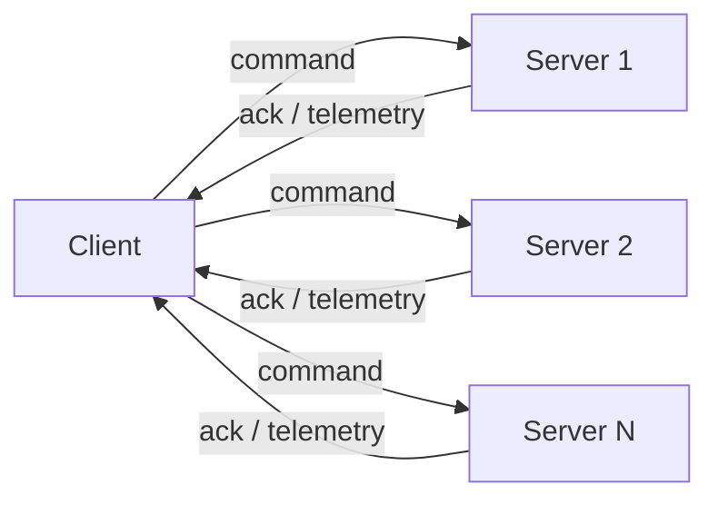
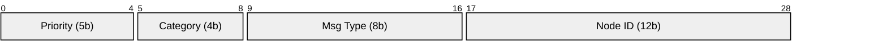
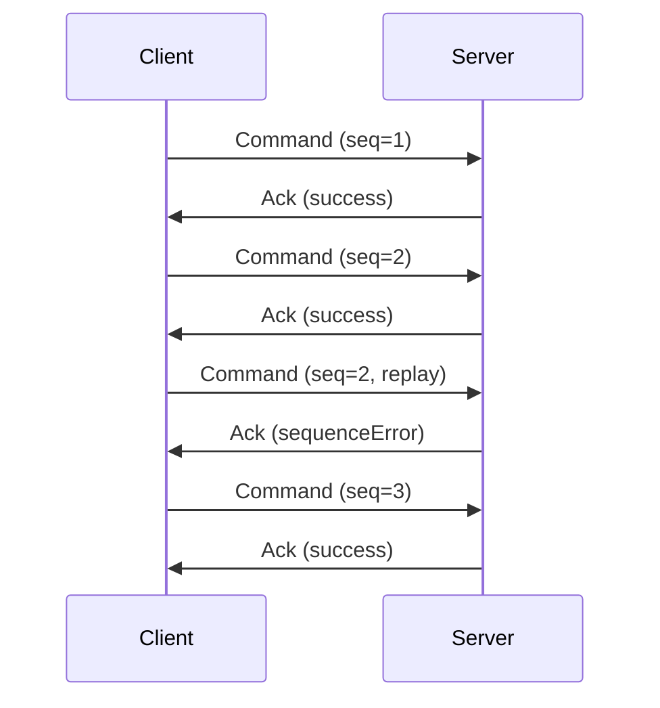
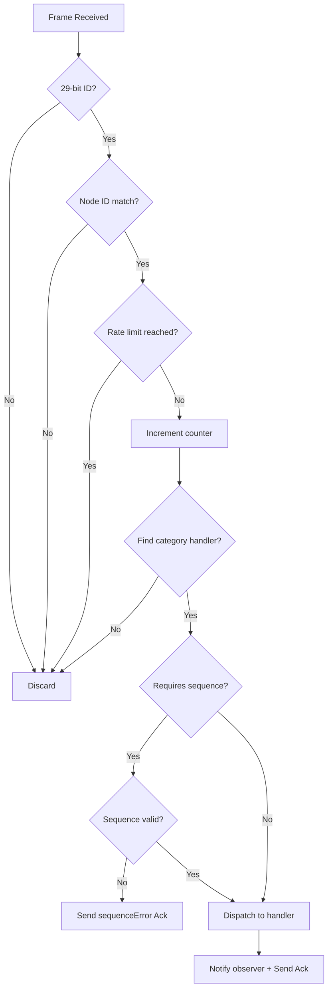
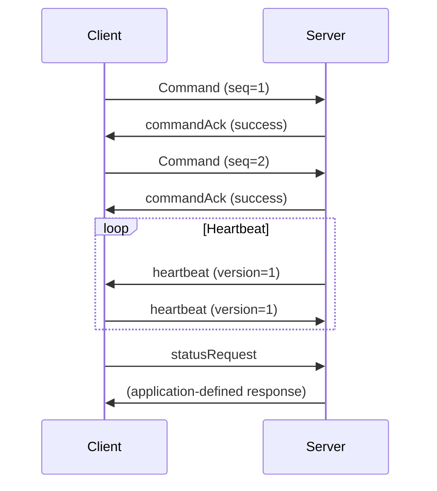

# can-lite: Protocol Specification

**Version:** 1.0  
**Protocol Version Byte:** 1  
**Status:** Draft  
**Date:** 2026

## 1. Abstract

This document specifies the can-lite CAN bus protocol, a lightweight
client-server communication protocol operating over CAN 2.0B (29-bit
extended identifiers) at up to 1 Mbit/s. The protocol provides a minimal
built-in System category with heartbeat, command acknowledgement, and
status request messages. Applications extend the protocol by registering
custom category handlers on the server.

## 2. Terminology

| Term            | Definition                                                          |
|-----------------|---------------------------------------------------------------------|
| Server          | A node on the CAN bus that listens for commands, processes them, and sends responses. Each server has a unique node ID. |
| Client          | The initiator of all commands and queries. A single client can communicate with multiple servers. |
| Broadcast       | A message addressed to all servers (node ID 0x000)                  |
| Category        | A 4-bit field in the CAN identifier that groups related message types. The built-in System category (0x0) is always available; applications register additional categories. |
| Category Handler| A component registered on the server that processes all messages for a specific category. |
| Sequence Number | An 8-bit counter in byte[0] of command frames for replay protection |
| Scale Factor    | Integer multiplier used to convert floats to fixed-point integers   |

## 3. Architecture

The protocol follows a **client-server** model:

- The **client** is the sole initiator of commands and queries. It can address
  multiple servers on the same CAN bus by targeting different node addresses.
  The client maintains independent sequence counters per server.
- The **server** passively listens for incoming frames addressed to its node ID
  (or the broadcast address). It processes commands, dispatches them to the
  appropriate category handler, and sends acknowledgement responses. The server
  never initiates unsolicited commands to the client.
- The server uses the **observer pattern** to notify the application layer of
  received commands, decoupling the protocol from application-specific logic.



## 4. Transport

- Physical layer: CAN 2.0B
- Bit rate: up to 1 Mbit/s (configurable)
- Identifier format: 29-bit extended only; 11-bit frames are silently discarded
- Maximum payload: 8 bytes per frame (CAN 2.0 standard)

## 5. CAN Identifier Layout

All 29 bits of the extended CAN ID are structured as follows:

```
Bit:  28  27  26  25  24  23  22  21  20  19  18  17  16  15  14  13  12  11  10  9   8   7   6   5   4   3   2   1   0
     |----  Priority  ----|-- Category --|------  Message Type  ------|----------------- Node ID -------------------|
     |     5 bits (0-31)  |  4 bits (0-F)|       8 bits (0-FF)       |             12 bits (0-FFF)                  |
```



**Field Encoding:**

```
raw_id = (priority << 24) | (category << 20) | (message_type << 12) | node_id
```

## 6. Priority Levels

| Value | Name      | Usage                            |
|-------|-----------|----------------------------------|
| 0     | Emergency | Safety-critical events           |
| 4     | Command   | Commands, parameter writes       |
| 8     | Response  | Command acknowledgements         |
| 12    | Telemetry | Periodic measurements            |
| 16    | Heartbeat | Node liveness                    |

Lower numerical values have higher CAN bus arbitration priority.

## 7. Message Categories

| Value | Name   | Description                                        |
|-------|--------|----------------------------------------------------|
| 0x0   | System | Heartbeat, command acknowledgement, status request |

The System category is always available. Applications register additional
categories (values 0x1–0xF) by providing custom `CanCategoryHandler`
implementations to the server at construction time.

## 8. Message Catalog

### 8.1 System (Category 0x0)

#### 8.1.1 Heartbeat (Type 0x01)

Sent at CanPriority::heartbeat. No sequence validation.

| Byte | Field   | Type  | Description                    |
|------|---------|-------|--------------------------------|
| 0    | Version | uint8 | Protocol version (currently 1) |

Both client and server may transmit heartbeats. When a heartbeat is received,
the protocol reports the received protocol version to the application layer.

#### 8.1.2 Command Acknowledgement (Type 0x02)

Sent by the server at CanPriority::response.

| Byte | Field    | Type  | Description                                |
|------|----------|-------|--------------------------------------------|
| 0    | Category | uint8 | CanCategory of the acknowledged command    |
| 1    | Command  | uint8 | CanMessageType of the acknowledged command |
| 2    | Status   | uint8 | See acknowledgement status table           |

The category byte ensures the client can uniquely identify which command
is being acknowledged, since message type values may be reused across
categories.

#### 8.1.3 Status Request (Type 0x03)

Sent by the client at CanPriority::command. No sequence validation. Empty payload.

When received, the server notifies the application observer via
`OnStatusRequested()`. The application is responsible for responding with
whatever status information is relevant (e.g., sending telemetry frames
defined by application-specific categories).

## 9. Data Encoding

All multi-byte integers are encoded **big-endian** (network byte order).

### 9.1 Encoding Algorithm

```
fixed_value = clamp(round(float_value × scale_factor), INT_MIN, INT_MAX)
float_value = fixed_value / scale_factor
```

Values are saturated (clamped) to the target integer range to prevent overflow.

## 10. Enumeration Tables

### 10.1 Acknowledgement Status

| Value | Status          | Description                                |
|-------|-----------------|--------------------------------------------|
| 0     | Success         | Command accepted and processed             |
| 1     | Unknown Command | Message type not recognized for category   |
| 2     | Invalid Payload | Payload too short or field out of range    |
| 3     | Invalid State   | Command not valid in current state         |
| 4     | Sequence Error  | Sequence number not (previous + 1) mod 256 |
| 5     | Rate Limited    | Message rate limit exceeded                |

## 11. Sequence Number Protocol



- For command frames that carry a payload, Byte[0] is an unsigned 8-bit
  sequence counter used for best-effort in-order processing.
- The server accepts the first sequenced command received regardless of
  sequence value and records it as the reference.
- Each subsequent command should have sequence = (previous + 1) mod 256.
- Out-of-order or duplicated commands are rejected with a `sequenceError`
  acknowledgement.
- Individual category handlers declare whether they require sequence
  validation via `RequiresSequenceValidation()`. Categories that opt out
  bypass validation entirely.
- When sequence validation is required and the payload is empty (no sequence
  byte present), the frame is rejected with `invalidPayload`.
- Heartbeat and status request frames do not use sequence numbers.
- Unrecognized message types within a registered category are rejected with
  an `unknownCommand` acknowledgement.
- Sequence numbers are not an authentication or security mechanism and MUST
  NOT be relied upon to prevent malicious replay on an untrusted CAN bus.

## 12. Rate Limiting

The server enforces a configurable maximum message rate (default: 500
messages per period). Messages received after the limit is reached are
silently discarded. The counter is reset by calling `ResetRateCounter()`,
typically driven by a periodic timer.



## 13. Node Addressing

- Each server has a unique 12-bit node ID (1–4095) set at configuration time.
- Node ID 0x000 is reserved as the broadcast address.
- Frames addressed to the broadcast ID are accepted by all servers.
- Frames addressed to a different node ID are silently discarded.

## 14. Typical Command Flow



## 15. Extensibility

Applications extend can-lite by defining additional categories:

1. **Define an enum value** for the new category (0x1–0xF).
2. **Implement a `CanCategoryHandler`** subclass that handles the message
   types within that category.
3. **Register the handler** with the server at construction time.

The server dispatches incoming frames to the matching category handler.
Frames with unregistered categories are silently discarded. Frames with
a registered category but an unknown message type receive an
`unknownCommand` acknowledgement.

## 16. Security Considerations

- **Replay protection:** Sequence number validation prevents replayed commands.
- **Bus flooding protection:** Configurable rate limiting discards excess messages.
- **Input validation:** All payloads are length-checked before parsing; out-of-range
  enum values are rejected with invalidPayload.
- **No heap allocation:** Fixed-size buffers prevent memory exhaustion.
- **Node isolation:** Strict node ID filtering prevents cross-node interference.

## 17. Implementation Notes

- The protocol library lives in `can-lite/`.
- `can-lite/core/` — Protocol definitions, frame codec, transport, and the
  base `CanCategoryHandler` interface.
- `can-lite/server/` — Server implementation with category-based dispatch,
  rate limiting, and sequence validation.
- `can-lite/client/` — Client implementation for sending commands and
  receiving responses from multiple servers.
- Observer pattern uses `infra::SingleObserver` / `infra::Subject` from
  embedded-infra-lib.
- All encoding uses `CanFrameCodec` with saturation clamping.
- Unit tests use GoogleTest and are located in each component's `test/`
  subdirectory.
