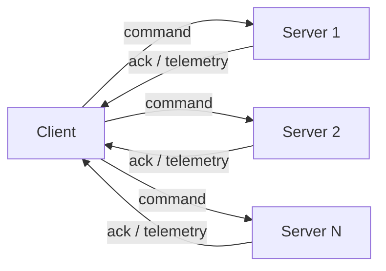
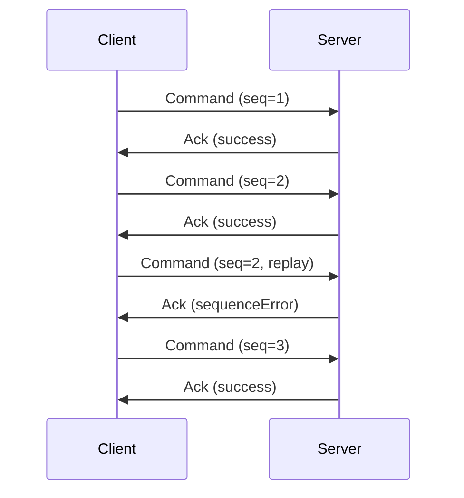
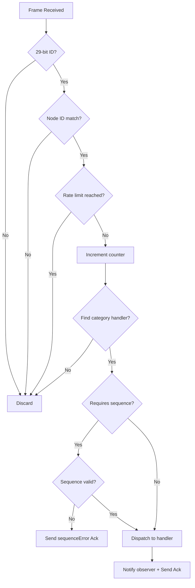
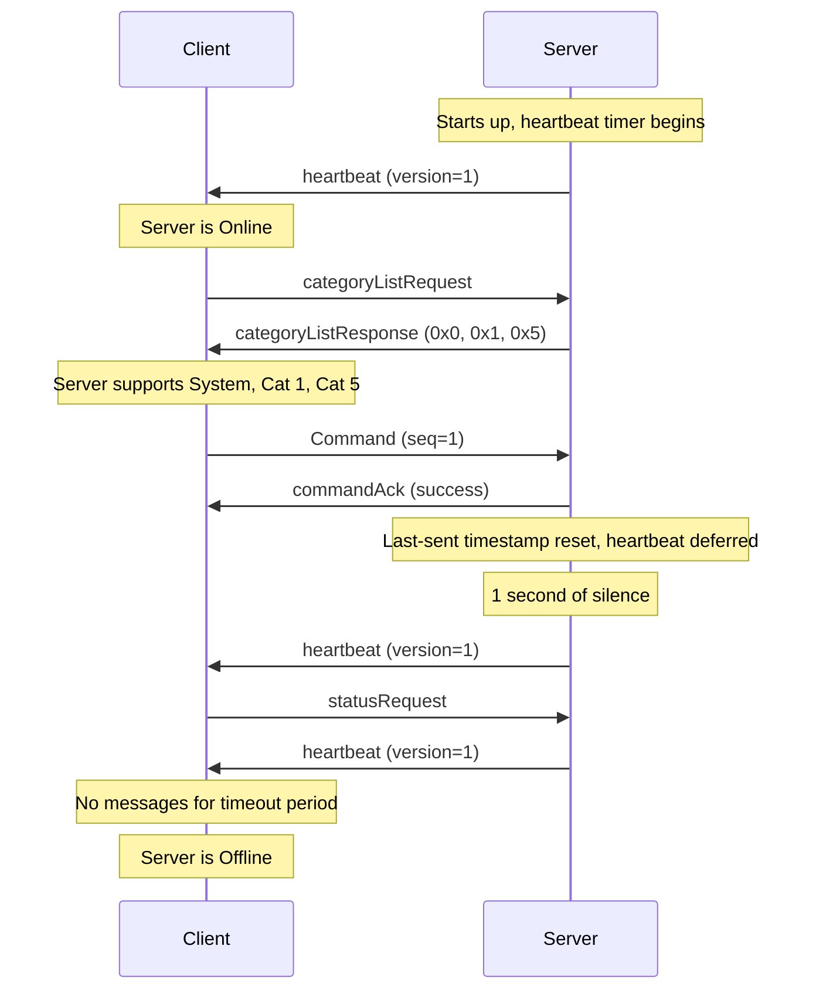

# can-lite: Protocol Specification

**Version:** 1.0  
**Protocol Version Byte:** 1  
**Status:** Draft  
**Date:** 2026

## 1. Abstract

This document specifies the can-lite CAN bus protocol, a lightweight
client-server communication protocol operating over CAN 2.0B (29-bit
extended identifiers) at up to 1 Mbit/s. The protocol provides a minimal
built-in System category with heartbeat, command acknowledgement,
status request, and category discovery messages. Applications extend the
protocol by registering custom category handlers on the server.

## 2. Terminology

| Term            | Definition                                                          |
|-----------------|---------------------------------------------------------------------|
| Server          | A node on the CAN bus that listens for commands, processes them, and sends responses. Each server has a unique node ID and serves exactly one client. |
| Client          | The initiator of all commands and queries. A single client can communicate with multiple servers. |
| Broadcast       | A message addressed to all servers (node ID 0x000)                  |
| Category        | A 4-bit field in the CAN identifier that groups related message types. The built-in System category (0x0) is always available; applications register additional categories. |
| Category Handler| A `CanCategoryServer` or `CanCategoryClient` implementation registered via `RegisterCategory()` that processes all messages for a specific category. |
| Sequence Number | An 8-bit counter in byte[0] of command frames for replay protection |
| Scale Factor    | Integer multiplier used to convert floats to fixed-point integers   |

## 3. Architecture

The protocol follows a **client-server** model:

- The **client** is the sole initiator of commands and queries. It can address
  multiple servers on the same CAN bus by targeting different node addresses.
  The client maintains independent sequence counters per server.
- The **server** passively listens for incoming frames addressed to its node ID
  (or the broadcast address). It processes commands, dispatches them to the
  appropriate category handler, and sends acknowledgement responses.
- The topology is **one client to many servers**. A server serves exactly one
  client and keeps a single sequence counter; addressing one server from two
  clients concurrently is not supported and is rejected with a sequence error.
- Both the server and the client automatically transmit heartbeat messages
  starting from construction. Each side uses the presence or absence of the
  other's heartbeats to determine whether its peer is **online** or
  **offline**: the client notifies the application via
  `CanProtocolClientObserver` (`OnServerOnline(nodeId)` /
  `OnServerOffline(nodeId)`), and the server via `CanProtocolServerObserver`
  (`Online()` / `Offline()`).


```mermaid
flowchart LR
    C[Client] -- command --> S1[Server 1]
    C -- command --> S2[Server 2]
    C -- command --> S3[Server N]
    S1 -- ack / telemetry --> C
    S2 -- ack / telemetry --> C
    S3 -- ack / telemetry --> C
```

## 4. Transport

- Physical layer: CAN 2.0B
- Bit rate: up to 1 Mbit/s (configurable)
- Identifier format: 29-bit extended only; 11-bit frames are silently discarded
- Maximum payload: 8 bytes per frame (CAN 2.0 standard)

## 4.1 ISO-TP Segmentation (ISO 15765-2)

For payloads exceeding the 8-byte CAN frame limit, can-lite provides an optional ISO-TP transport layer (`IsoTpTransportImpl`) that implements ISO 15765-2 segmentation and reassembly.

### Frame Types

| PCI Nibble | Frame Type        | Description                                         |
|------------|-------------------|-----------------------------------------------------|
| `0x0N`     | Single Frame (SF) | N = data length (1–7); entire PDU fits in one frame |
| `0x1NNN`   | First Frame (FF)  | NNN = total PDU length (8–4095); first 6 bytes      |
| `0x2N`     | Consecutive Frame | N = sequence number 0–F (wraps); up to 7 bytes      |
| `0x3S`     | Flow Control (FC) | S = status: 0=CTS, 1=Wait, 2=Overflow               |

### Flow Control Fields

| Byte | Field | Description                                                                                                                                    |
|------|-------|------------------------------------------------------------------------------------------------------------------------------------------------|
| 0    | PCI   | `0x3S` — Flow Status (0=CTS, 1=Wait, 2=Overflow)                                                                                               |
| 1    | BS    | Block Size — number of CFs before next FC (0 = unlimited)                                                                                      |
| 2    | STmin | Minimum separation time: 0x00–0x7F = 0–127 ms; 0xF1–0xF9 = 100–900 µs (ISO-TP sub-ms range); 0x80–0xF0 and 0xFA–0xFF = reserved (treated as 0x7F / 127 ms per ISO 15765-2) |

### Timing Parameters

| Parameter | Value   | Description                                                                                                      |
|-----------|---------|------------------------------------------------------------------------------------------------------------------|
| N_Bs      | 1000 ms | Sender timeout waiting for a Flow Control frame                                                                  |
| N_Cr      | 1000 ms | Receiver timeout waiting for a Consecutive Frame                                                                 |
| N_WFTmax  | 16      | Maximum consecutive Flow Control `Wait` frames before the sender aborts (implementation-defined per ISO 15765-2) |

On `FS = Wait`, the sender restarts N_Bs and continues waiting rather than
aborting immediately; only `N_WFTmax` consecutive `Wait` frames (or an N_Bs
timeout) abort the transfer.

### Integration

`IsoTpTransportImpl` is attached to `CanProtocolServer` or `CanProtocolClient` via `AttachIsoTpTransport(IsoTpTransport&)`. When attached, incoming frames are first offered to the ISO-TP layer; if no registered channel claims the frame, it falls through to normal category dispatch. PDUs reassembled by the transport layer are delivered via the `SetOnPduReceived` callback. Channels are reclaimed via `ReleaseChannel(dataId)`, called automatically on abort and available for the application to call once it is done with a given `dataId`.

The implementation uses `WithStorage` for zero-heap construction. All internal components (`IsoTpSender`, `IsoTpReceiver`, `IsoTpChannelImpl`) are non-template classes that receive their PDU buffer storage via `infra::WithStorage` aliases, following the EMIL convention:

```cpp
IsoTpTransportImpl::WithStorage<64, 4> isoTp{ canFrameTransport };
protocolServer.AttachIsoTpTransport(isoTp);

isoTp.RegisterReceiveChannel(dataId, fcId);
```

**Addressing constraint.** `IsoTpTransportImpl` routes frames to channels purely
by the literal CAN ID carried in `dataId`/`fcId` — the sender's identity is not
otherwise encoded. `AttachIsoTpTransport()` alone does not register any
channel; the application (or a category built on top of it) must explicitly
call `RegisterReceiveChannel()` for each `dataId`/`fcId` pair it expects
multi-frame traffic on, using IDs that unambiguously identify a single
correspondent (e.g. a dedicated node-to-node exchange such as a firmware
upload session). A `dataId` shared by more than one concurrent sender at a
time will have their frames interleaved into the same channel; the transport
layer does not detect or reject this. Because of this, can-lite does not
provide automatic multi-frame support for arbitrary category command/response
traffic across many nodes — only the point-to-point case with an
explicitly-managed channel is supported.

## 5. CAN Identifier Layout

All 29 bits of the extended CAN ID are structured as follows:

```
Bit:  28  27  26  25  24  23  22  21  20  19  18  17  16  15  14  13  12  11  10  9   8   7   6   5   4   3   2   1   0
     |----  Priority  ----|-- Category --|------  Message Type  ------|----------------- Node ID -------------------|
     |     5 bits (0-31)  |  4 bits (0-F)|       8 bits (0-FF)       |             12 bits (0-FFF)                  |
```


```mermaid
packet-beta
  0-11: "Node ID (12b)"
  12-19: "Msg Type (8b)"
  20-23: "Category (4b)"
  24-28: "Priority (5b)"
```

**Field Encoding:**

```
raw_id = (priority << 24) | (category << 20) | (message_type << 12) | node_id
```

## 6. Priority Levels

| Value | Name      | Usage                            |
|-------|-----------|----------------------------------|
| 0     | Emergency | Safety-critical events           |
| 4     | Command   | Commands, parameter writes       |
| 8     | Response  | Command acknowledgements         |
| 12    | Telemetry | Periodic measurements            |
| 16    | Heartbeat | Node liveness                    |

Lower numerical values have higher CAN bus arbitration priority.

## 7. Message Categories

| Value     | Name             | Description                                                            |
|-----------|------------------|------------------------------------------------------------------------|
| 0x0       | System           | Heartbeat, command acknowledgement, status request, category discovery |
| 0x1       | Firmware Upgrade | Block-based firmware transfer, verification, and activation            |
| 0x2 - 0xF | Application      | Reserved for application-defined categories                            |

The System category is always available. Category 0x1 is defined in a
separate extension specification:

- [Firmware Upgrade](firmware-upgrade.md)

Applications register additional categories (values 0x2-0xF) by providing
`CanCategoryServer` and `CanCategoryClient` implementations to
`CanProtocolServer::RegisterCategory()` and
`CanProtocolClient::RegisterCategory()`. Both return `false`, without
registering, if the category's ID is already registered or if 8 categories
are already registered (the System category always occupies one of those 8
slots). See
[Extending can-lite with categories](../design/extending-categories.md).

### 7.1 Reserved Message Type

Message type `0xFE` is reserved across all categories for a
**category error response**, carrying a category-specific failure detail
that the universal acknowledgement status cannot express.

| Byte | Field               | Type  | Description                             |
|------|---------------------|-------|-----------------------------------------|
| 0    | Originating Command | uint8 | Message type of the command that failed |
| 1    | Error Code          | uint8 | Category-defined error code             |

A category error response is normally followed by a command acknowledgement
with status `categoryError`.

## 8. Message Catalog

### 8.1 System (Category 0x0)

#### 8.1.1 Heartbeat (Type 0x01)

Sent at CanPriority::heartbeat. No sequence validation.

| Byte | Field   | Type  | Description                    |
|------|---------|-------|--------------------------------|
| 0    | Version | uint8 | Protocol version (currently 1) |

Both the server and the client automatically transmit heartbeat messages
starting from the moment they are constructed. A heartbeat is sent **at
least 1 second after the last transmitted message** of any kind, by
whichever side is sending it. This ensures liveness detection without
adding traffic when that side is already actively communicating. The
heartbeat acts as a keep-alive: it fires only during periods of silence.
The client's heartbeat is broadcast (node ID 0x000), since the client has
no node ID of its own on the bus.

The client uses received heartbeats to track server liveness. When a
heartbeat (or any message) is received from a server, the client
considers that server **online** and resets that server's timeout timer.
If no messages are received from a server within a configurable timeout
(default 3 s), the client considers it **offline** and notifies the
application via `CanProtocolClientObserver::OnServerOffline(nodeId)`.
Multiple servers (up to 8) can be tracked simultaneously with
independent liveness timers.

Symmetrically, the server uses received traffic to track whether its
client is still present. Any frame correctly addressed to the server
(re)starts the server's client timeout timer (default 3 s,
`Config::clientTimeout`), the same "any message counts" rule the client
uses for server liveness; a heartbeat specifically also notifies the
application via `CanProtocolServerObserver::Online()`. If the timeout
timer expires without further traffic from the client, the server
notifies `CanProtocolServerObserver::Offline()`. A server tracks only
one client, per REQ-CAN-006.1.

#### 8.1.2 Command Acknowledgement (Type 0x02)

Sent by the server at CanPriority::response.

| Byte | Field             | Type  | Description                                                    |
|------|-------------------|-------|----------------------------------------------------------------|
| 0    | Category          | uint8 | CanCategory of the acknowledged command                        |
| 1    | Command           | uint8 | CanMessageType of the acknowledged command                     |
| 2    | Status            | uint8 | See acknowledgement status table                               |
| 3    | Expected Sequence | uint8 | Meaningful only when Status is Sequence Error (4); 0 otherwise |

The category byte ensures the client can uniquely identify which command
is being acknowledged, since message type values may be reused across
categories.

On receiving a `sequenceError` acknowledgement, the client adopts byte 3 as
its next sequence number for that server, so that a single lost frame, or
the client's own sequence state having reset (for example after a restart),
does not leave the two sides permanently out of sync — see §11.

If no acknowledgement of any status arrives for a sequence-validated command
within a configurable timeout (default 1 s, `Config::commandAckTimeout`),
the client notifies the application via
`CanProtocolClientObserver::OnCommandAckTimeout(nodeId, category,
messageType)`. The command itself is not retried; the application decides
whether and how to retry.

#### 8.1.3 Status Request (Type 0x03)

Sent by the client at CanPriority::command. No sequence validation. Empty payload.

When received, the server responds by transmitting a heartbeat message.
This allows the client to quickly confirm the server is online without
waiting for the next scheduled heartbeat.

#### 8.1.4 Category List Request (Type 0x04)

Sent by the client at CanPriority::command. No sequence validation. Empty payload.

When received, the server responds with a Category List Response message
containing the IDs of all registered category handlers.

#### 8.1.5 Category List Response (Type 0x05)

Sent by the server at CanPriority::response.

| Byte | Field       | Type  | Description                            |
|------|-------------|-------|----------------------------------------|
| 0    | Category 0  | uint8 | First registered category ID           |
| 1    | Category 1  | uint8 | Second registered category ID          |
| ...  | ...         | uint8 | Additional category IDs (up to 8 max)  |

Each byte contains the ID of one registered category handler. The
System category (0x0) is always included. Categories are listed in
registration order. The response is limited to 8 category IDs by the
CAN frame payload size. `RegisterCategory()` enforces this bound at
registration time: the 9th and any subsequent registration attempt returns
`false` and the category is not registered, so the response can never
truncate.

## 9. Data Encoding

All multi-byte integers are encoded **big-endian** (network byte order).

### 9.1 Encoding Algorithm

```
fixed_value = clamp(round(float_value × scale_factor), INT_MIN, INT_MAX)
float_value = fixed_value / scale_factor
```

Values are saturated (clamped) to the target integer range to prevent overflow.

## 10. Enumeration Tables

### 10.1 Acknowledgement Status

| Value | Status          | Description                                                 |
|-------|-----------------|-------------------------------------------------------------|
| 0     | Success         | Command accepted and processed                              |
| 1     | Unknown Command | Message type not recognized for category                    |
| 2     | Invalid Payload | Payload too short or field out of range                     |
| 3     | Invalid State   | Command not valid in current state                          |
| 4     | Sequence Error  | Sequence number not (previous + 1) mod 256                  |
| 5     | Rate Limited    | Message rate limit exceeded                                 |
| 6     | Not Implemented | Command recognized but handler not implemented              |
| 7     | Category Error  | Category-specific rejection; details in category 0xFE frame |

## 11. Sequence Number Protocol


```mermaid
sequenceDiagram
    participant Client
    participant Server
    Client->>Server: Command (seq=1)
    Server->>Client: Ack (success)
    Client->>Server: Command (seq=2)
    Server->>Client: Ack (success)
    Client->>Server: Command (seq=2, replay)
    Server->>Client: Ack (sequenceError)
    Client->>Server: Command (seq=3)
    Server->>Client: Ack (success)
```

- For command frames that carry a payload, Byte[0] is an unsigned 8-bit
  sequence counter used for best-effort in-order processing.
- The server accepts the first sequenced command received regardless of
  sequence value and records it as the reference.
- Each subsequent command should have sequence = (previous + 1) mod 256.
- Out-of-order or duplicated commands are rejected with a `sequenceError`
  acknowledgement.
- Individual category handlers declare whether they require sequence
  validation via `RequiresSequenceValidation()`. Categories that opt out
  bypass validation entirely.
- When sequence validation is required and the payload is empty (no sequence
  byte present), the frame is rejected with `invalidPayload`.
- Heartbeat and status request frames do not use sequence numbers.
- Unrecognized message types within a registered category are rejected with
  an `unknownCommand` acknowledgement.
- A `sequenceError` acknowledgement carries the sequence number the server
  expected (§8.1.2); the client adopts it as its next sequence number for
  that server. This recovers a client whose own sequence state has drifted
  from the server's (for example, after the client process restarts and its
  in-memory counter resets to 0 while the server, unaware of the restart,
  still expects its old counter to continue) without requiring the server to
  also restart.
- Sequence numbers are not an authentication or security mechanism and MUST
  NOT be relied upon to prevent malicious replay on an untrusted CAN bus.

## 12. Rate Limiting

The server enforces a configurable maximum message rate (default: 500
messages per period). Messages received after the limit is reached are
silently discarded. The rate counter resets automatically every second
via an internal timer.


```mermaid
flowchart TD
    A[Frame Received] --> B{29-bit ID?}
    B -- No --> Z[Discard]
    B -- Yes --> C{Node ID match?}
    C -- No --> Z
    C -- Yes --> D{Rate limit reached?}
    D -- Yes --> Z
    D -- No --> E[Increment counter]
    E --> F{Find category handler?}
    F -- No --> Z
    F -- Yes --> G{Requires sequence?}
    G -- Yes --> H{Sequence valid?}
    H -- No --> I[Send sequenceError Ack]
    H -- Yes --> J[Dispatch to handler]
    G -- No --> J
    J --> K[Notify observer + Send Ack]
```

## 13. Node Addressing

- Each server has a unique 12-bit node ID (1–4095) set at configuration time.
- Node ID 0x000 is reserved as the broadcast address.
- Frames addressed to the broadcast ID are accepted by all servers.
- Frames addressed to a different node ID are silently discarded.

## 14. Typical Command Flow


```mermaid
sequenceDiagram
    participant Client
    participant Server

    Note over Server: Starts up, heartbeat timer begins
    Server->>Client: heartbeat (version=1)
    Note over Client: Server is Online

    Client->>Server: categoryListRequest
    Server->>Client: categoryListResponse (0x0, 0x1, 0x5)
    Note over Client: Server supports System, Cat 1, Cat 5

    Client->>Server: Command (seq=1)
    Server->>Client: commandAck (success)
    Note over Server: Last-sent timestamp reset, heartbeat deferred

    Note over Server: 1 second of silence
    Server->>Client: heartbeat (version=1)

    Client->>Server: statusRequest
    Server->>Client: heartbeat (version=1)

    Note over Client: No messages for timeout period
    Note over Client: Server is Offline
```

## 15. Extensibility

Applications extend can-lite by defining additional categories:

1. **Define an enum value** for the new category (0x2–0xF; 0x1 is reserved for Firmware Upgrade).
2. **Implement `CanCategoryServer` and `CanCategoryClient`** subclasses that
   handle the message types within that category.
3. **Register the handler** with the server at construction time.

The server dispatches incoming frames to the matching category handler.
Frames with unregistered categories are silently discarded. Frames with
a registered category but an unknown message type receive an
`unknownCommand` acknowledgement.

## 16. Security Considerations

- **In-order delivery / duplicate detection:** Sequence number validation rejects
  out-of-order or duplicated commands. This is a best-effort ordering check,
  not a security mechanism — see §11's caveat: sequence numbers are
  transmitted in the clear and MUST NOT be relied upon to prevent malicious
  replay on an untrusted CAN bus.
- **Bus flooding protection:** Configurable rate limiting discards excess messages.
- **Input validation:** All payloads are length-checked before parsing.
  Enum-valued fields are decoded via unchecked `static_cast` from the wire
  byte; an out-of-range value produces a scoped-enum value with no matching
  enumerator (well-defined per the C++ standard, since these enums have a
  fixed underlying type) rather than a rejected frame — it is not currently
  validated against the enum's defined range.
- **No heap allocation:** Fixed-size buffers prevent memory exhaustion.
- **Node isolation:** Strict node ID filtering prevents cross-node interference.
