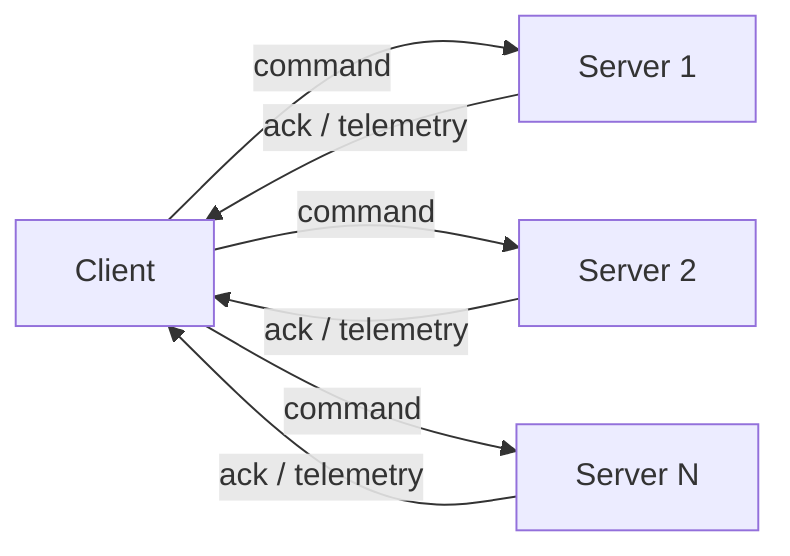
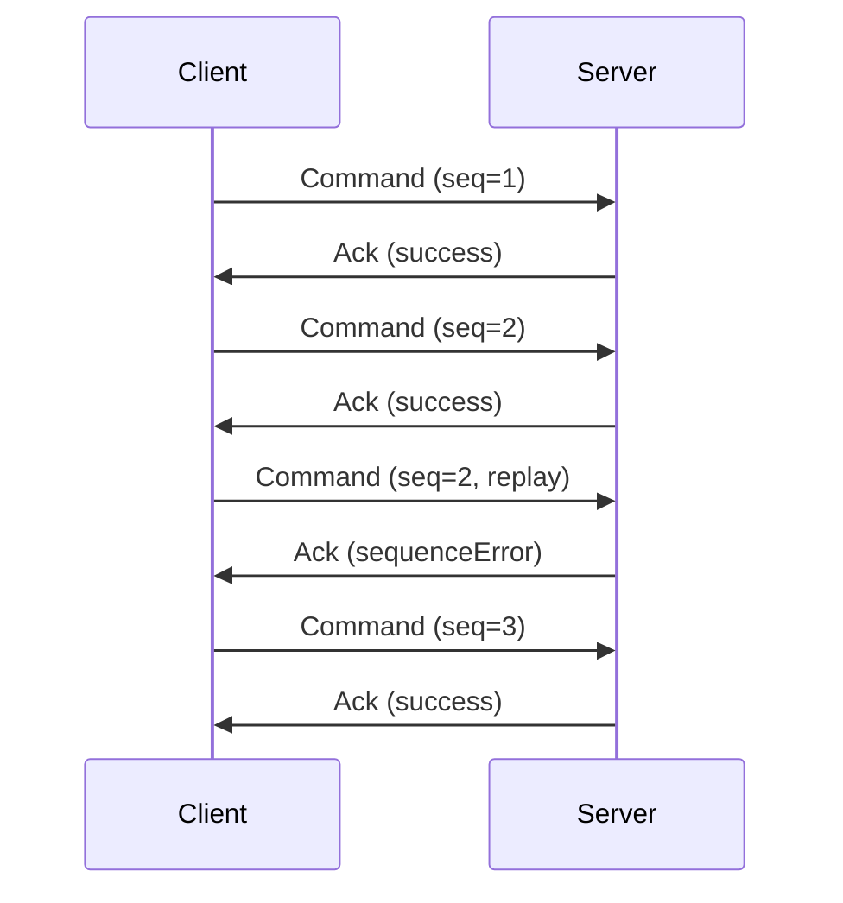
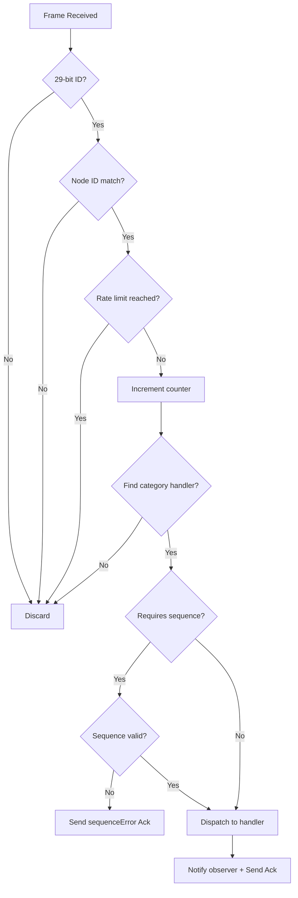
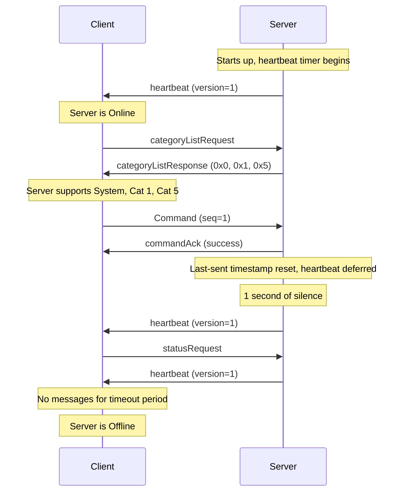

# can-lite: Protocol Specification

**Version:** 1.0  
**Protocol Version Byte:** 1  
**Status:** Draft  
**Date:** 2026

## 1. Abstract

This document specifies the can-lite CAN bus protocol, a lightweight
client-server communication protocol operating over CAN 2.0B (29-bit
extended identifiers) at up to 1 Mbit/s. The protocol provides a minimal
built-in System category with heartbeat, command acknowledgement,
status request, and category discovery messages. Applications extend the
protocol by registering custom category handlers on the server.

## 2. Terminology

| Term            | Definition                                                          |
|-----------------|---------------------------------------------------------------------|
| Server          | A node on the CAN bus that listens for commands, processes them, and sends responses. Each server has a unique node ID. |
| Client          | The initiator of all commands and queries. A single client can communicate with multiple servers. |
| Broadcast       | A message addressed to all servers (node ID 0x000)                  |
| Category        | A 4-bit field in the CAN identifier that groups related message types. Values 0x0-0x1 are management categories owned by can-lite, 0x2-0x7 are assigned by the integrator, and 0x8-0xF are reserved. |
| Category Handler| A component registered on the server that processes all messages for a specific category. |
| Sequence Number | An 8-bit counter in byte[0] of command frames for replay protection |
| Scale Factor    | Integer multiplier used to convert floats to fixed-point integers   |

## 3. Architecture

The protocol follows a **client-server** model:

- The **client** is the sole initiator of commands and queries. It can address
  multiple servers on the same CAN bus by targeting different node addresses.
  The client maintains independent sequence counters per server.
- The **server** passively listens for incoming frames addressed to its node ID
  (or the broadcast address). It processes commands, dispatches them to the
  appropriate category handler, and sends acknowledgement responses.
- The server automatically begins transmitting heartbeat messages on startup.
  The client uses the presence or absence of heartbeats to determine whether
  a server is **online** or **offline**, and notifies the application layer
  accordingly via `CanProtocolClientObserver` callbacks (`OnServerOnline(nodeId)` /
  `OnServerOffline(nodeId)`).


```mermaid
flowchart LR
    C[Client] -- command --> S1[Server 1]
    C -- command --> S2[Server 2]
    C -- command --> S3[Server N]
    S1 -- ack / telemetry --> C
    S2 -- ack / telemetry --> C
    S3 -- ack / telemetry --> C
```

## 4. Transport

- Physical layer: CAN 2.0B
- Bit rate: up to 1 Mbit/s (configurable)
- Identifier format: 29-bit extended only; 11-bit frames are silently discarded
- Maximum payload: 8 bytes per frame (CAN 2.0 standard)

## 4.1 ISO-TP Segmentation (ISO 15765-2)

For payloads exceeding the 8-byte CAN frame limit, can-lite provides an optional ISO-TP transport layer (`IsoTpTransportImpl`) that implements ISO 15765-2 segmentation and reassembly.

### Frame Types

| PCI Nibble | Frame Type        | Description                                         |
|------------|-------------------|-----------------------------------------------------|
| `0x0N`     | Single Frame (SF) | N = data length (1–7); entire PDU fits in one frame |
| `0x1NNN`   | First Frame (FF)  | NNN = total PDU length (8–4095); first 6 bytes      |
| `0x2N`     | Consecutive Frame | N = sequence number 0–F (wraps); up to 7 bytes      |
| `0x3S`     | Flow Control (FC) | S = status: 0=CTS, 1=Wait, 2=Overflow               |

### Flow Control Fields

| Byte | Field | Description                                                                                                                                    |
|------|-------|------------------------------------------------------------------------------------------------------------------------------------------------|
| 0    | PCI   | `0x3S` — Flow Status (0=CTS, 1=Wait, 2=Overflow)                                                                                               |
| 1    | BS    | Block Size — number of CFs before next FC (0 = unlimited)                                                                                      |
| 2    | STmin | Minimum separation time: 0x00–0x7F = 0–127 ms; 0xF1–0xF9 = 100–900 µs (ISO-TP sub-ms range); 0x80–0xF0 and 0xFA–0xFF = reserved (treated as 0) |

### Timing Parameters

| Parameter | Value   | Description                                      |
|-----------|---------|--------------------------------------------------|
| N_Bs      | 1000 ms | Sender timeout waiting for a Flow Control frame  |
| N_Cr      | 1000 ms | Receiver timeout waiting for a Consecutive Frame |

### Integration

`IsoTpTransportImpl` is attached to `CanProtocolServer` or `CanProtocolClient` via `AttachIsoTpTransport(IsoTpTransport&)`. When attached, incoming frames are first offered to the ISO-TP layer; if no registered channel claims the frame, it falls through to normal category dispatch. PDUs reassembled by the transport layer are delivered via the `SetOnPduReceived` callback.

The implementation uses `WithStorage` for zero-heap construction. All internal components (`IsoTpSender`, `IsoTpReceiver`, `IsoTpChannelImpl`) are non-template classes that receive their PDU buffer storage via `infra::WithStorage` aliases, following the EMIL convention:

```cpp
IsoTpTransportImpl::WithStorage<64, 4> isoTp{ canFrameTransport };
protocolServer.AttachIsoTpTransport(isoTp);
```

## 5. CAN Identifier Layout

All 29 bits of the extended CAN ID are structured as follows:

```
Bit:  28  27  26  25  24  23  22  21  20  19  18  17  16  15  14  13  12  11  10  9   8   7   6   5   4   3   2   1   0
     |----  Priority  ----|-- Category --|------  Message Type  ------|----------------- Node ID -------------------|
     |     5 bits (0-31)  |  4 bits (0-F)|       8 bits (0-FF)       |             12 bits (0-FFF)                  |
```


```mermaid
packet-beta
  0-4: "Priority (5b)"
  5-8: "Category (4b)"
  9-16: "Msg Type (8b)"
  17-28: "Node ID (12b)"
```

**Field Encoding:**

```
raw_id = (priority << 24) | (category << 20) | (message_type << 12) | node_id
```

## 6. Priority Levels

| Value | Name      | Usage                            |
|-------|-----------|----------------------------------|
| 0     | Emergency | Safety-critical events           |
| 4     | Command   | Commands, parameter writes       |
| 8     | Response  | Command acknowledgements         |
| 12    | Telemetry | Periodic measurements            |
| 16    | Heartbeat | Node liveness                    |

Lower numerical values have higher CAN bus arbitration priority.

## 7. Message Categories

### 7.1 Category ID Ranges

| Range     | Owner      | Meaning                                                       |
|-----------|------------|---------------------------------------------------------------|
| 0x0-0x1   | can-lite   | Management categories defined by this specification           |
| 0x2-0x7   | Integrator | Application categories assigned by the consuming project      |
| 0x8-0xF   | —          | Reserved; registering one is a programming error              |

A category belongs in can-lite if and only if it concerns the node as a
protocol participant or as a device, and is agnostic to what the device
does. A category that ascribes meaning to the payload in application terms
belongs to the consumer and takes an ID from the integrator range.

The category field on the wire remains 4 bits wide. The narrower policy
range is a protocol invariant enforced at registration, not an encoding
change, so at most **8 categories** can be registered on one node.

### 7.2 Management Categories

| Value | Name              | Description                                                            |
|-------|-------------------|------------------------------------------------------------------------|
| 0x0   | System            | Heartbeat, command acknowledgement, status request, category discovery |
| 0x1   | Firmware Upgrade  | Block-based firmware transfer, verification, and activation            |

The System category is always available. Category 0x1 is defined in a
separate extension specification:

- [Firmware Upgrade](firmware-upgrade.md)

### 7.3 Application Categories

Applications register their own categories with IDs in the 0x2-0x7 range by
implementing a `CanCategoryServer` and a `CanCategoryClient` pair. A category
takes its ID as a constructor parameter rather than hard-coding it, so the
integrator owns the assignment. The echo category shipped in `can_lite.testing`
is the reference example.

## 8. Message Catalog

### 8.1 System (Category 0x0)

#### 8.1.1 Heartbeat (Type 0x01)

Sent at CanPriority::heartbeat. No sequence validation.

| Byte | Field   | Type  | Description                    |
|------|---------|-------|--------------------------------|
| 0    | Version | uint8 | Protocol version (currently 1) |

The server automatically transmits heartbeat messages starting from the
moment it is constructed. A heartbeat is sent **at least 1 second after
the last transmitted message** of any kind. This ensures liveness
detection without adding traffic when the server is already actively
communicating. The heartbeat acts as a keep-alive: it fires only during
periods of silence.

The client uses received heartbeats to track server liveness. When a
heartbeat (or any message) is received from a server, the client
considers that server **online** and resets that server's timeout timer.
If no messages are received from a server within a configurable timeout
(default 3 s), the client considers it **offline** and notifies the
application via `CanProtocolClientObserver::OnServerOffline(nodeId)`.
Multiple servers (up to 8) can be tracked simultaneously with
independent liveness timers.

#### 8.1.2 Command Acknowledgement (Type 0x02)

Sent by the server at CanPriority::response.

| Byte | Field             | Type  | Description                                  |
|------|-------------------|-------|----------------------------------------------|
| 0    | Category          | uint8 | Category ID of the acknowledged command      |
| 1    | Command           | uint8 | Message type of the acknowledged command     |
| 2    | Status            | uint8 | See acknowledgement status table             |
| 3    | Correlation       | uint8 | Sequence number of the acknowledged command  |
| 4    | Expected Sequence | uint8 | Sequence the server expects next             |

The payload is always exactly 5 bytes and the field meanings never vary
with the status, so a client can parse an acknowledgement without knowing
which category produced it.

The category byte ensures the client can uniquely identify which command
is being acknowledged, since message type values may be reused across
categories. The correlation byte echoes the sequence number of the request;
it is 0 for commands on categories that do not use sequence validation.
The expected-sequence byte is only meaningful when the status is
`sequenceError`, and is 0 otherwise.

Correlation is a protocol concern. Categories MUST NOT invent their own
correlation scheme on top of the message type.

#### 8.1.3 Status Request (Type 0x03)

Sent by the client at CanPriority::command. No sequence validation. Empty payload.

When received, the server responds by transmitting a heartbeat message.
This allows the client to quickly confirm the server is online without
waiting for the next scheduled heartbeat.

#### 8.1.4 Category List Request (Type 0x04)

Sent by the client at CanPriority::command. No sequence validation. Empty payload.

When received, the server responds with a Category List Response message
containing the IDs of all registered category handlers.

#### 8.1.5 Category List Response (Type 0x05)

Sent by the server at CanPriority::response.

| Byte | Field       | Type  | Description                            |
|------|-------------|-------|----------------------------------------|
| 0    | Category 0  | uint8 | First registered category ID           |
| 1    | Category 1  | uint8 | Second registered category ID          |
| ...  | ...         | uint8 | Additional category IDs (up to 8 max)  |

Each byte contains the ID of one registered category handler. The
System category (0x0) is always included. Categories are listed in
registration order.

The response is bounded by the protocol invariant that at most 8
categories can be registered on one node (§7.1), which is why it always
fits in one frame. The server therefore never truncates the list; a
registration that would overflow it is rejected as a programming error
instead.

## 9. Data Encoding

All multi-byte integers are encoded **big-endian** (network byte order).

### 9.1 Encoding Algorithm

```
fixed_value = clamp(round(float_value × scale_factor), INT_MIN, INT_MAX)
float_value = fixed_value / scale_factor
```

Values are saturated (clamped) to the target integer range to prevent overflow.

## 10. Enumeration Tables

### 10.1 Acknowledgement Status

| Value | Status          | Description                                                 |
|-------|-----------------|-------------------------------------------------------------|
| 0     | Success         | Command accepted and processed                              |
| 1     | Unknown Command | Message type not recognized for category                    |
| 2     | Invalid Payload | Payload too short or field out of range                     |
| 3     | Invalid State   | Command not valid in current state                          |
| 4     | Sequence Error  | Sequence number not (previous + 1) mod 256                  |
| 5     | Rate Limited    | Message rate limit exceeded                                 |
| 6     | Not Implemented | Command recognized but handler not implemented              |

Value 7 was `Category Error` and has been withdrawn; it is left unassigned
rather than reused. Per-category error taxonomies belong to the category's
own response messages, not to the shared acknowledgement.

## 11. Sequence Number Protocol


```mermaid
sequenceDiagram
    participant Client
    participant Server
    Client->>Server: Command (seq=1)
    Server->>Client: Ack (success)
    Client->>Server: Command (seq=2)
    Server->>Client: Ack (success)
    Client->>Server: Command (seq=2, replay)
    Server->>Client: Ack (sequenceError)
    Client->>Server: Command (seq=3)
    Server->>Client: Ack (success)
```

- For command frames that carry a payload, Byte[0] is an unsigned 8-bit
  sequence counter used for best-effort in-order processing.
- The server accepts the first sequenced command received regardless of
  sequence value and records it as the reference.
- Each subsequent command should have sequence = (previous + 1) mod 256.
- Out-of-order or duplicated commands are rejected with a `sequenceError`
  acknowledgement that carries the sequence number the server expects next,
  so a peer that lost a frame resynchronises instead of being locked out.
- Sequence state is kept per (peer, category) on both ends, so one category
  losing synchronisation does not disturb the others. The peer key is the
  Node ID field of the frame, which for a command is the destination: a client
  keys on the server it addresses, and a server keys on the address it was
  addressed by — its own address or the broadcast address. A command frame
  carries no source address, so sequenced commands sent to one server by
  several clients share a single stream and resynchronise against each other.
- Individual category handlers declare whether they require sequence
  validation via `RequiresSequenceValidation()`. Categories that opt out
  bypass validation entirely.
- When sequence validation is required and the payload is empty (no sequence
  byte present), the frame is rejected with `invalidPayload`.
- Heartbeat and status request frames do not use sequence numbers.
- Unrecognized message types within a registered category are rejected with
  an `unknownCommand` acknowledgement.
- Sequence numbers are not an authentication or security mechanism and MUST
  NOT be relied upon to prevent malicious replay on an untrusted CAN bus.

## 12. Rate Limiting

The server enforces a configurable maximum message rate (default: 500
messages per period). Messages received after the limit is reached are
silently discarded. The rate counter resets automatically every second
via an internal timer.


```mermaid
flowchart TD
    A[Frame Received] --> B{29-bit ID?}
    B -- No --> Z[Discard]
    B -- Yes --> C{Node ID match?}
    C -- No --> Z
    C -- Yes --> D{Rate limit reached?}
    D -- Yes --> Z
    D -- No --> E[Increment counter]
    E --> F{Find category handler?}
    F -- No --> Z
    F -- Yes --> G{Requires sequence?}
    G -- Yes --> H{Sequence valid?}
    H -- No --> I[Send sequenceError Ack]
    H -- Yes --> J[Dispatch to handler]
    G -- No --> J
    J --> K[Notify observer + Send Ack]
```

## 13. Node Addressing

- Each server has a unique 12-bit node ID (1–4095) set at configuration time.
- Node ID 0x000 is reserved as the broadcast address.
- Frames addressed to the broadcast ID are accepted by all servers.
- Frames addressed to a different node ID are silently discarded.

## 14. Typical Command Flow


```mermaid
sequenceDiagram
    participant Client
    participant Server

    Note over Server: Starts up, heartbeat timer begins
    Server->>Client: heartbeat (version=1)
    Note over Client: Server is Online

    Client->>Server: categoryListRequest
    Server->>Client: categoryListResponse (0x0, 0x1, 0x5)
    Note over Client: Server supports System, Cat 1, Cat 5

    Client->>Server: Command (seq=1)
    Server->>Client: commandAck (success)
    Note over Server: Last-sent timestamp reset, heartbeat deferred

    Note over Server: 1 second of silence
    Server->>Client: heartbeat (version=1)

    Client->>Server: statusRequest
    Server->>Client: heartbeat (version=1)

    Note over Client: No messages for timeout period
    Note over Client: Server is Offline
```

## 15. Extensibility

Applications extend can-lite by defining additional categories:

1. **Choose a category ID** from the integrator range (0x2-0x7) and pass it
   to the category's constructor.
2. **Implement a `CanCategoryServer` and a `CanCategoryClient`** that bind
   handlers for the message types within that category.
3. **Register both** with `CanProtocolServer::RegisterCategory` and
   `CanProtocolClient::RegisterCategory` from the composition root.

The server dispatches incoming frames to the matching category handler.
Frames with unregistered categories are silently discarded. Frames with
a registered category but an unknown message type receive an
`unknownCommand` acknowledgement; a handler that recognises the message
type but rejects its payload produces `invalidPayload`, and one that is
deliberately unfinished answers `notImplemented`.

Registering a category with an ID outside 0x0-0x7, a duplicate ID, or a
ninth category is a programming error and aborts in debug builds.

## 16. Security Considerations

- **Replay protection:** Sequence number validation prevents replayed commands.
- **Bus flooding protection:** Configurable rate limiting discards excess messages.
- **Input validation:** All payloads are length-checked before parsing; out-of-range
  enum values are rejected with invalidPayload.
- **No heap allocation:** Fixed-size buffers prevent memory exhaustion.
- **Node isolation:** Strict node ID filtering prevents cross-node interference.
