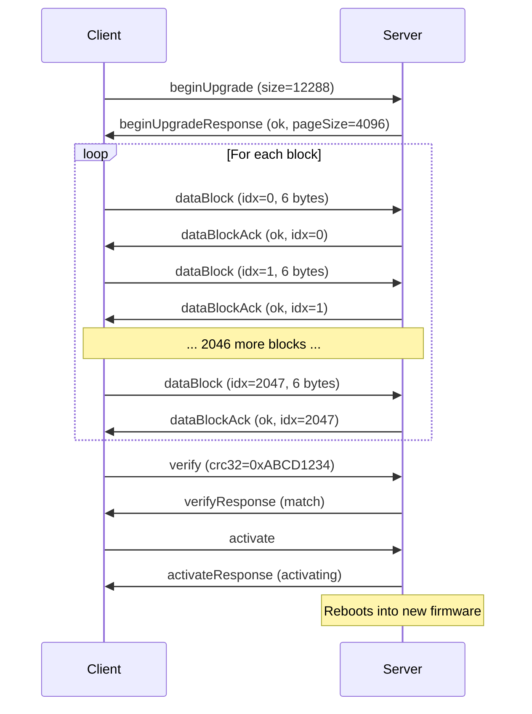
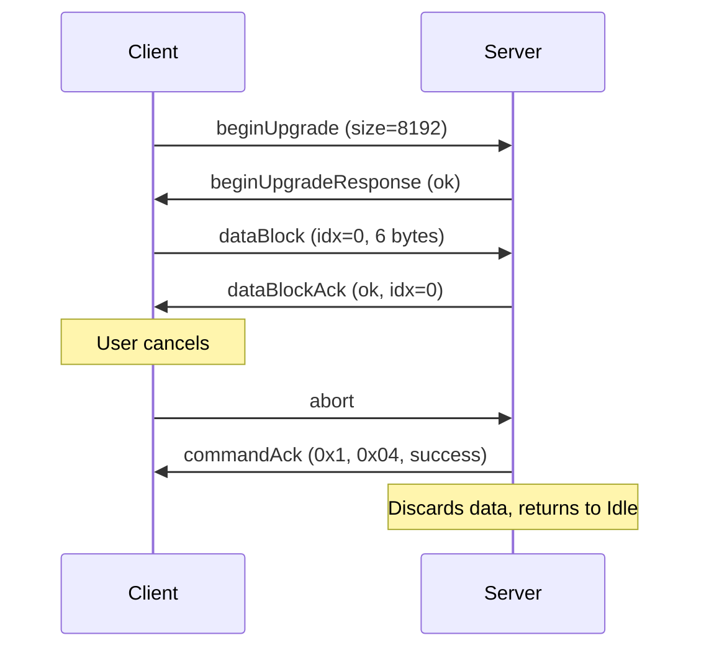
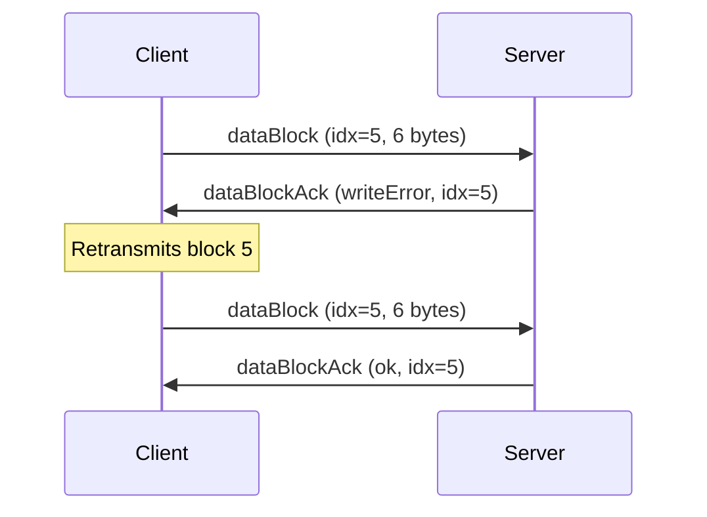
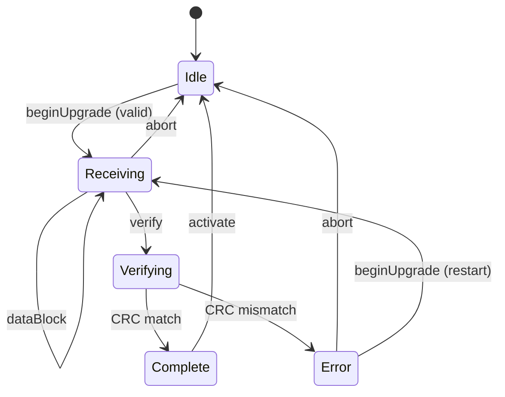

# Firmware Upgrade — Category Extension Specification

**Category ID:** 0x1  
**Extends:** [can-protocol.md](can-protocol.md)  
**Version:** 1.0  
**Status:** Draft  
**Date:** 2026

## 1. Overview

This document specifies the Firmware Upgrade category extension for the
can-lite protocol. It defines a block-transfer protocol for sending
firmware images from a client to a server over CAN, with integrity
verification and activation control.

The category does **not** require protocol-level sequence validation
(`RequiresSequenceValidation() = false`). Ordering is enforced by
explicit block indices within the data transfer messages, and the
protocol-level 8-bit sequence counter would wrap too quickly for large
transfers (thousands of blocks).

### 1.1 Design Goals

- **Reliability:** Per-block acknowledgement and CRC32 verification
  before activation.
- **Resumability:** Block-indexed transfer allows the client to detect
  and retransmit missing blocks.
- **Safety:** New firmware is verified in-place before activation;
  the running firmware is never overwritten in-flight.
- **Simplicity:** No multi-frame segmentation; each CAN frame is
  self-contained.

### 1.2 Assumptions

- The server has a dual-bank (A/B) flash layout or a dedicated staging
  area where incoming firmware is written without overwriting the active
  image.
- The server's bootloader or application can swap to the newly written
  image upon activation.
- Maximum firmware size per transfer: **393 210 bytes** (65 536 blocks
  × 6 data bytes). For larger images, a page-based extension can be
  added in a future revision.

## 2. Upgrade States

| Value | State      | Description                                     |
|-------|------------|-------------------------------------------------|
| 0     | Idle       | No upgrade in progress                          |
| 1     | Receiving  | Accepting data blocks                           |
| 2     | Verifying  | CRC32 check in progress                         |
| 3     | Complete   | Verification passed, ready to activate          |
| 4     | Error      | Transfer or verification failed                 |

## 3. Error Codes

| Value | Error           | Description                              |
|-------|-----------------|------------------------------------------|
| 0     | Ok              | No error                                 |
| 1     | Busy            | Upgrade already in progress              |
| 2     | InvalidSize     | Firmware size exceeds available storage   |
| 3     | SequenceError   | Block index out of order or duplicate     |
| 4     | WriteError      | Flash write/erase failure                |
| 5     | CrcMismatch     | CRC32 verification failed                |
| 6     | NotReady        | Activate requested before verify passed  |
| 7     | InvalidState    | Command not valid in current upgrade state|

## 4. Message Types — Commands (Client → Server)

All commands are sent at `CanPriority::command`.

### 4.1 Begin Upgrade (0x00)

Initiate a firmware upgrade session. If an upgrade is already in
progress, the server responds with error code `Busy`.

| Byte | Field        | Type   | Description                         |
|------|--------------|--------|-------------------------------------|
| 0–3  | FirmwareSize | uint32 | Total firmware image size in bytes  |

Total: 4 bytes.

The server erases the staging area (if applicable), transitions to
Receiving state, and responds with a Begin Upgrade Response (0x80).

### 4.2 Data Block (0x01)

Transfer a block of firmware data.

| Byte | Field      | Type      | Description                        |
|------|------------|-----------|------------------------------------|
| 0–1  | BlockIndex | uint16    | Zero-based block sequence number   |
| 2–7  | Data       | uint8\[6\]| Firmware data (up to 6 bytes)      |

Total: 2–8 bytes. The last block may contain fewer than 6 data bytes.

Blocks must be sent in ascending order starting from 0. The server
responds with a Data Block Ack (0x81) for each received block.

### 4.3 Verify (0x02)

Request CRC32 verification of the received firmware image against the
expected checksum.

| Byte | Field | Type   | Description                             |
|------|-------|--------|-----------------------------------------|
| 0–3  | CRC32 | uint32 | Expected CRC32 of the complete firmware |

Total: 4 bytes.

The server transitions to Verifying state, computes the CRC32 over the
received data, and responds with a Verify Response (0x82).

### 4.4 Activate (0x03)

Instruct the server to switch to the newly uploaded firmware. This
command is only valid after a successful Verify (state = Complete).

Empty payload.

The server responds with an Activate Response (0x83), then performs the
bank swap or reboot. The server may go offline briefly during this
process.

### 4.5 Abort (0x04)

Cancel the current upgrade session and discard received data. Valid in
any state except Idle.

Empty payload.

The server transitions to Idle state and responds with a command
acknowledgement (System category, success).

### 4.6 Query Progress (0x05)

Request the current state of the upgrade process.

Empty payload.

The server responds with a Progress Response (0x85).

## 5. Message Types — Responses (Server → Client)

Response message type IDs follow the `0x80 + command_id` convention.
All responses are sent at `CanPriority::response`.

### 5.1 Begin Upgrade Response (0x80)

| Byte | Field    | Type   | Description                          |
|------|----------|--------|--------------------------------------|
| 0    | Status   | uint8  | Error code (see Section 3)           |
| 1–2  | PageSize | uint16 | Flash erase page size in bytes       |

Total: 3 bytes.

`PageSize` informs the client of the server's flash granularity. This
can be used for transfer optimization but is not required.

### 5.2 Data Block Ack (0x81)

| Byte | Field      | Type   | Description                        |
|------|------------|--------|------------------------------------|
| 0    | Status     | uint8  | Error code (see Section 3)         |
| 1–2  | BlockIndex | uint16 | Index of the acknowledged block    |

Total: 3 bytes.

### 5.3 Verify Response (0x82)

| Byte | Field  | Type  | Description                         |
|------|--------|-------|-------------------------------------|
| 0    | Status | uint8 | 0 = CRC match, 5 = CRC mismatch    |

Total: 1 byte.

On success, the server transitions to Complete state.

### 5.4 Activate Response (0x83)

| Byte | Field  | Type  | Description                           |
|------|--------|-------|---------------------------------------|
| 0    | Status | uint8 | 0 = activating, 6 = not ready         |

Total: 1 byte.

### 5.5 Progress Response (0x85)

| Byte | Field          | Type   | Description                      |
|------|----------------|--------|----------------------------------|
| 0    | State          | uint8  | Upgrade state (see Section 2)    |
| 1–2  | BlocksReceived | uint16 | Number of blocks received so far |
| 3–4  | TotalBlocks    | uint16 | Total blocks expected            |

Total: 5 bytes.

## 6. Typical Flow

### 6.1 Successful Upgrade



### 6.2 Aborted Upgrade



### 6.3 Failed Block Write



## 7. Implementation Considerations

### 7.1 Flash Layout

A dual-bank (A/B) layout is recommended:

```
+-------------------+-------------------+
|  Bank A (Active)  |  Bank B (Staging) |
|  Running firmware |  Incoming image   |
+-------------------+-------------------+
```

The incoming firmware is written to the inactive bank. On activation,
the bootloader swaps the active bank pointer and reboots. If the new
firmware fails to start (watchdog timeout), the bootloader reverts to
the previous bank.

### 7.2 Transfer Rate

At 1 Mbit/s with 6 data bytes per CAN frame (~120 bits per frame
including framing overhead), the theoretical maximum throughput is
approximately **6 KB/s** (accounting for ack frames). Faster rates can
be achieved by batching multiple data blocks before requiring acks
(window-based acknowledgement), which is a possible future extension.

### 7.3 Security

For production deployments, consider:

- **Signature verification:** Validate a cryptographic signature
  (e.g., ECDSA-P256) appended to the firmware image before activation.
  The signature can be sent in a separate message type or included in
  the last data blocks.
- **Encryption:** If firmware confidentiality is required, encrypt the
  image before transfer and decrypt on the server after verification.
- **Rollback prevention:** Maintain a monotonic version counter in
  non-volatile storage; reject firmware with a lower version number.

These security extensions are out of scope for this initial
specification but should be implemented for any deployment where the
CAN bus is accessible to untrusted parties.

### 7.4 Large Firmware Images

The uint16 block index limits transfers to ~384 KB. For larger images,
two extension strategies are available:

1. **Set Page (new message type):** A "set page" command selects the
   upper bits of the address, and block indices are offsets within the
   current page. This allows addressing up to 4 GB with negligible
   overhead.
2. **Extended Data Block:** A new message type using uint32 block
   indices, reducing data payload to 4 bytes per frame (256 MB max).

### 7.5 Error Recovery

- If a block ack indicates `SequenceError`, the client should
  retransmit the expected block.
- If a block ack indicates `WriteError`, the client may retry the same
  block a limited number of times before aborting.
- If the server stops responding, the client should send a Query
  Progress to determine the current state and resume from the last
  acknowledged block.

### 7.6 State Machine


