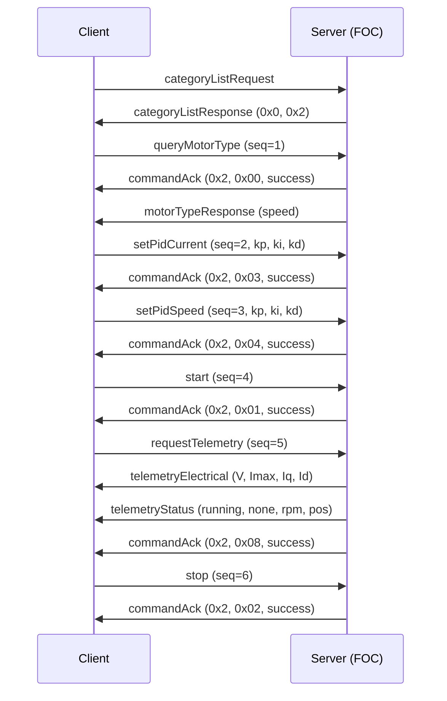
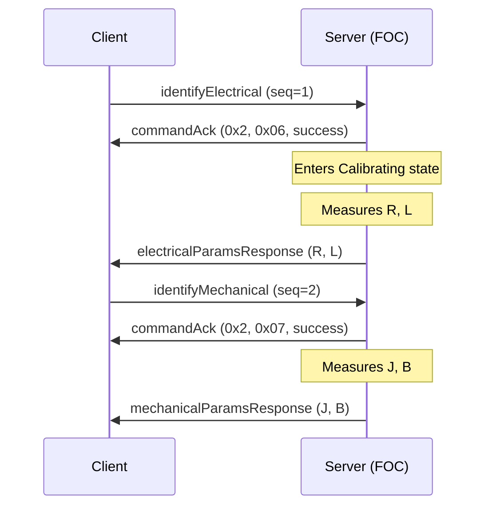

# FOC Motor Control — Category Extension Specification

**Category ID:** 0x2  
**Extends:** [can-protocol.md](can-protocol.md)  
**Version:** 1.0  
**Status:** Draft  
**Date:** 2026

## 1. Overview

This document specifies the FOC (Field-Oriented Control) Motor Control
category extension for the can-lite protocol. It defines message types
for commanding a brushless motor drive that supports torque, speed, and
position control modes.

The category requires **sequence validation** on all command frames
(byte\[0\] = sequence number). Query-type commands also carry a sequence
byte for consistency and replay protection.

## 2. Motor Control Modes

| Value | Mode     | Description                             |
|-------|----------|-----------------------------------------|
| 0     | Torque   | Direct current (torque) regulation      |
| 1     | Speed    | Velocity closed-loop control            |
| 2     | Position | Position closed-loop control            |

## 3. Motor States

| Value | State       | Description                                  |
|-------|-------------|----------------------------------------------|
| 0     | Idle        | Motor not energized, awaiting commands       |
| 1     | Running     | Motor actively controlled                    |
| 2     | Fault       | Error condition, motor de-energized          |
| 3     | Calibrating | Parameter identification in progress         |

## 4. Fault Codes

| Value | Fault            | Description                          |
|-------|------------------|--------------------------------------|
| 0     | None             | No fault                             |
| 1     | OverCurrent      | Phase current exceeded safe limit    |
| 2     | OverVoltage      | DC bus voltage above maximum         |
| 3     | UnderVoltage     | DC bus voltage below minimum         |
| 4     | OverTemperature  | Drive or motor temperature exceeded  |
| 5     | SensorFault      | Encoder or current sensor failure    |

## 5. Scale Factors

All multi-byte values are **big-endian signed 16-bit integers** encoded
with the scale factors below, using the conversion from the main
protocol spec (Section 9.1):

```
fixed = clamp(round(float_value × scale_factor), -32768, 32767)
float = fixed / scale_factor
```

| Quantity     | Scale Factor | Unit    | Resolution | Range              |
|--------------|-------------|---------|------------|--------------------|
| PID Kp       | 1000        | —       | 0.001      | ±32.767            |
| PID Ki       | 1000        | —       | 0.001      | ±32.767            |
| PID Kd       | 1000        | —       | 0.001      | ±32.767            |
| Resistance   | 10000       | Ω       | 0.1 mΩ     | ±3.2767 Ω          |
| Inductance   | 1000000     | H       | 1 µH       | ±32.767 mH         |
| Inertia      | 1000000     | kg·m²   | 1×10⁻⁶     | ±0.032767 kg·m²    |
| Friction     | 100000      | N·m·s/rad | 1×10⁻⁵  | ±0.32767 N·m·s/rad |
| Voltage      | 100         | V       | 10 mV      | ±327.67 V          |
| Current      | 100         | A       | 10 mA      | ±327.67 A          |
| Speed        | 10          | RPM     | 0.1 RPM    | ±3276.7 RPM        |
| Position     | 1000        | rad     | 0.001 rad  | ±32.767 rad        |
| Encoder Res  | 1 (uint16)  | counts  | 1          | 0–65535            |

## 6. Message Types — Commands (Client → Server)

All commands are sent at `CanPriority::command`. Byte\[0\] is the
sequence number (see main spec Section 11).

### 6.1 Query Motor Type (0x00)

Request the server's configured motor control mode.

| Byte | Field    | Type  | Description       |
|------|----------|-------|-------------------|
| 0    | Sequence | uint8 | Sequence counter  |

Server responds with a Motor Type Response (0x80) and a command
acknowledgement (System category).

### 6.2 Start (0x01)

Energize the motor and begin closed-loop control.

| Byte | Field    | Type  | Description       |
|------|----------|-------|-------------------|
| 0    | Sequence | uint8 | Sequence counter  |

Server responds with a command acknowledgement. Transitions motor state
from Idle → Running.

### 6.3 Stop (0x02)

De-energize the motor and return to idle.

| Byte | Field    | Type  | Description       |
|------|----------|-------|-------------------|
| 0    | Sequence | uint8 | Sequence counter  |

Server responds with a command acknowledgement. Transitions motor state
from Running → Idle.

### 6.4 Set PID Current (0x03)

Set proportional, integral, and derivative gains for the current
(torque) control loop.

| Byte | Field    | Type  | Scale | Description              |
|------|----------|-------|-------|--------------------------|
| 0    | Sequence | uint8 | —     | Sequence counter         |
| 1–2  | Kp       | int16 | 1000  | Proportional gain        |
| 3–4  | Ki       | int16 | 1000  | Integral gain            |
| 5–6  | Kd       | int16 | 1000  | Derivative gain          |

Total: 7 bytes.

### 6.5 Set PID Speed (0x04)

Set PID gains for the speed control loop.

| Byte | Field    | Type  | Scale | Description              |
|------|----------|-------|-------|--------------------------|
| 0    | Sequence | uint8 | —     | Sequence counter         |
| 1–2  | Kp       | int16 | 1000  | Proportional gain        |
| 3–4  | Ki       | int16 | 1000  | Integral gain            |
| 5–6  | Kd       | int16 | 1000  | Derivative gain          |

Total: 7 bytes.

### 6.6 Set PID Position (0x05)

Set PID gains for the position control loop.

| Byte | Field    | Type  | Scale | Description              |
|------|----------|-------|-------|--------------------------|
| 0    | Sequence | uint8 | —     | Sequence counter         |
| 1–2  | Kp       | int16 | 1000  | Proportional gain        |
| 3–4  | Ki       | int16 | 1000  | Integral gain            |
| 5–6  | Kd       | int16 | 1000  | Derivative gain          |

Total: 7 bytes.

### 6.7 Identify Electrical Parameters (0x06)

Request the server to measure or report the motor's electrical
parameters (phase resistance and inductance). The identification
procedure is implementation-defined and may spin the motor briefly.

| Byte | Field    | Type  | Description       |
|------|----------|-------|-------------------|
| 0    | Sequence | uint8 | Sequence counter  |

Server transitions to Calibrating state, performs measurements, then
responds with an Electrical Parameters Response (0x86) and a command
acknowledgement.

### 6.8 Identify Mechanical Parameters (0x07)

Request the server to measure or report the motor's mechanical
parameters (inertia and friction). The identification procedure is
implementation-defined and may spin the motor.

| Byte | Field    | Type  | Description       |
|------|----------|-------|-------------------|
| 0    | Sequence | uint8 | Sequence counter  |

Server transitions to Calibrating state, performs measurements, then
responds with a Mechanical Parameters Response (0x87) and a command
acknowledgement.

### 6.9 Request Telemetry (0x08)

Request the current real-time status of the motor drive. The server
responds with two frames: a Telemetry Electrical Response (0x88) and a
Telemetry Status Response (0x89).

| Byte | Field    | Type  | Description       |
|------|----------|-------|-------------------|
| 0    | Sequence | uint8 | Sequence counter  |

### 6.10 Set Encoder Resolution (0x09)

Configure the encoder resolution (counts per mechanical revolution).

| Byte | Field      | Type   | Description                       |
|------|------------|--------|-----------------------------------|
| 0    | Sequence   | uint8  | Sequence counter                  |
| 1–2  | Resolution | uint16 | Encoder counts per revolution     |

Total: 3 bytes.

## 7. Message Types — Responses (Server → Client)

Response message type IDs use the convention `0x80 + command_id`,
providing a clear mapping between request and response. All responses
are sent at `CanPriority::response`.

### 7.1 Motor Type Response (0x80)

| Byte | Field      | Type  | Description                        |
|------|------------|-------|------------------------------------|
| 0    | MotorType  | uint8 | Motor control mode (see Section 2) |

### 7.2 Electrical Parameters Response (0x86)

| Byte | Field      | Type  | Scale   | Description          |
|------|------------|-------|---------|----------------------|
| 0–1  | Resistance | int16 | 10000   | Phase resistance (Ω) |
| 2–3  | Inductance | int16 | 1000000 | Phase inductance (H) |

Total: 4 bytes.

### 7.3 Mechanical Parameters Response (0x87)

| Byte | Field    | Type  | Scale   | Description                   |
|------|----------|-------|---------|-------------------------------|
| 0–1  | Inertia  | int16 | 1000000 | Rotor inertia (kg·m²)         |
| 2–3  | Friction | int16 | 100000  | Viscous friction (N·m·s/rad)  |

Total: 4 bytes.

### 7.4 Telemetry Electrical Response (0x88)

| Byte | Field      | Type  | Scale | Description              |
|------|------------|-------|-------|--------------------------|
| 0–1  | Voltage    | int16 | 100   | DC bus voltage (V)       |
| 2–3  | MaxCurrent | int16 | 100   | Maximum phase current (A)|
| 4–5  | Iq         | int16 | 100   | Quadrature current (A)   |
| 6–7  | Id         | int16 | 100   | Direct-axis current (A)  |

Total: 8 bytes.

### 7.5 Telemetry Status Response (0x89)

| Byte | Field    | Type  | Scale | Description                     |
|------|----------|-------|-------|---------------------------------|
| 0    | State    | uint8 | —     | Motor state (see Section 3)     |
| 1    | Fault    | uint8 | —     | Fault code (see Section 4)      |
| 2–3  | Speed    | int16 | 10    | Rotor speed (RPM)               |
| 4–5  | Position | int16 | 1000  | Rotor position (rad)            |

Total: 6 bytes.

## 8. Typical Flow

### 8.1 Startup and Run



### 8.2 Parameter Identification



## 9. Implementation Notes

- The FOC category handler should return `RequiresSequenceValidation() = true`.
- Telemetry is split into two response frames (electrical + status) because
  the full dataset exceeds the 8-byte CAN payload limit. Both frames are
  sent in response to a single Request Telemetry command.
- PID gains use a scale factor of 1 (integer resolution) to cover the full
  −10 000 to 10 000 range.  Applications needing sub-integer gain precision
  should apply an internal multiplier in the control loop.
- The Identify commands may take significant time (hundreds of milliseconds to
  seconds). The server sends the command ack immediately to confirm receipt,
  then sends the parameter response when identification completes.
- `CanFrameCodec::FloatToFixed16` and `CanFrameCodec::Fixed16ToFloat` should
  be used with the scale factors defined in Section 5 for encoding and
  decoding all fixed-point values.
- Response message type IDs use the `0x80 + command_id` convention. This
  reserves the lower half (0x00–0x7F) for commands and the upper half
  (0x80–0xFF) for responses within the 8-bit message type field.
